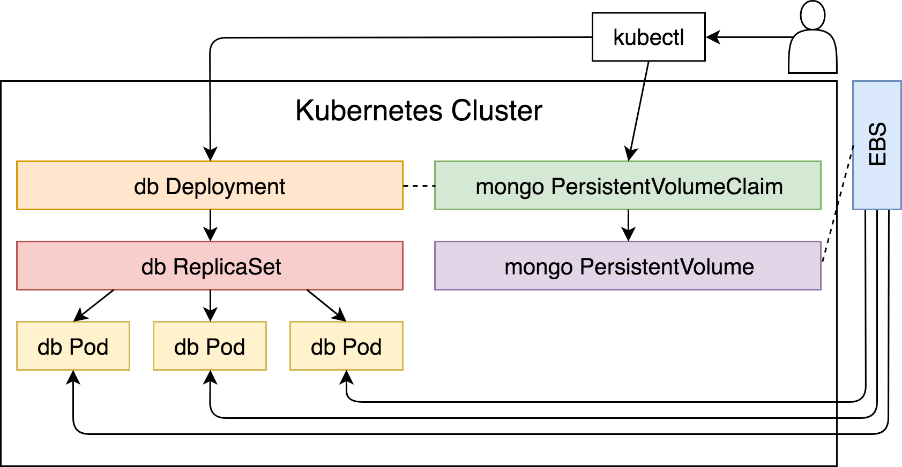
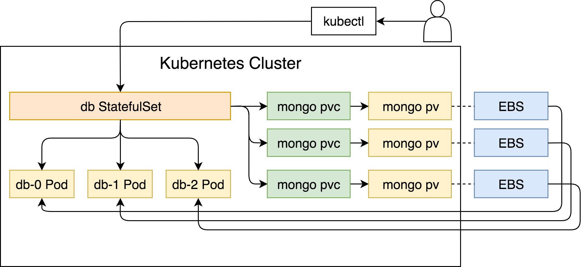

# Deploying Stateful Applications At Scale

T> Stateless and stateful application are quite different in their architecture. Those differences need to be reflected in Kubernetes as well. The fact that we can use Deployments with PersistentVolumes not necessarily mean that is the best way to run stateful applications.

Most of the applications are deployed to Kubernetes using Deployments. It is, without a doubt, the most commonly used controller. Deployments provide (almost) everything we might need. We can specify the number of replicas when our applications need to be scaled. We can mount volumes through PersistentVolumeClaims. We can communicate with the Pods controlled by Deployments through Services. We can execute rolling updates that will deploy new releases without downtime. There are quite a few other features enabled by Deployments. Does that mean that Deployments are the preferable way to run all types of applications? Is there a feature we might need that is not already available through Deployments and other resources we can associate with them? food for a thought.

When running stateful applications in Kubernetes, we soon realize that Deployments do not offer everything we need. It's not that we require additional features, but that some of those available in Deployments do not behave just as we might want them to. In many cases, Deployments are an excellent fit for stateless applications. However, we might need to look for a different controller that will allow us to run stateful applications safely and efficiently. That controller is the **StatefulSet**.

Let's experience some of the problems behind stateful applications, and the benefits **StatefulSets** bring to the table. To do that, we need a cluster.

Let's experience some of the problems behind stateful applications, and the benefits **StatefulSets** bring to the table. To do that, we need a cluster.

W> I will assume that you are already proficient with Deployments, ReplicaSets, Pods, Ingress, Services, PersistentVolumes, PersistentVolumeClaims, Namespaces and a few other things. This chapter focuses only on StatefulSets, and it assumes the knowledge of the rest of the resource types we'll use. If that's not the case, this chapter might be too confusing and advanced. Please read *The DevOps 2.3 Toolkit: Kubernetes* first or consult the Kubernetes documentation.

We'll skip the theory (for now), and dive straight into examples. To do that, we need a cluster.

## Creating A Cluster

We'll start the hands-on walk-through by cloning the `vfarcic/k8s-specs` repository that contains all the example definitions we'll use throughout the book.

W> ## A note to Windows users
W>
W> Please run all the examples from *GitBash* (installed through *Git*). That way the commands you'll see throughout the book will be same as those that should be executed on *MacOS* or any *Linux* distribution. If you're using Hyper-V instead of VirtualBox, you may need to run the *GitBash* window as an Administrator.

I> All the commands from this chapter are available in the [01-sts.sh](https://gist.github.com/505aedf2cb268837983132d4e4385fab) Gist.

```bash
git clone \
    https://github.com/vfarcic/k8s-specs.git

cd k8s-specs

mkdir -p cluster

cd cluster
```

I> If you already have the repository, please execute `git pull` to make sure that your local copy contains the latest commits.

If you read the *Creating A Production-Ready Kubernetes Cluster* chapter of *The DevOps 2.3 Toolkit: Kubernetes*, you are already familiar with kops. You learned about the *Kubernetes Operations (kops)* project and the prerequisites you need to create a Kubernetes cluster in AWS. Further on, you become proficient how to create a cluster, and you know the components that constitute it. You learned how to update, upgrade, and access Kubernetes clusters created with kops in AWS. You deployed a few applications and observed fault-tolerance and high-availability.

If you haven't read *The DevOps 2.3 Toolkit: Kubernetes*, and you're not planning to, the essential instructions are available in *[Appendix A: Using Kubernetes Operations (kops)](#appendix-a)*. Please read it and execute the commands from it before proceeding further. It'll give you just enough information you need to prepare, create, and destroy a cluster.

W> No matter from where you obtained the information about kops, I will assume that you are proficient with it and skip providing detailed information. We'll only list the commands we need to create a cluster that will serve as a playground for this chapter.

The `cluster` directory should already have the `kops` file. If it doesn't, please refer to the [Appendix A: Using Kubernetes Operations (kops)](#appendix-a). In it, we're creating the file just before we destroy the cluster.

```bash
cat kops
```

The output, stripped from the keys, is as follows.

```
export AWS_ACCESS_KEY_ID=...
export AWS_SECRET_ACCESS_KEY=...
export AWS_DEFAULT_REGION=us-east-2
export ZONES=us-east-2a,us-east-2b,us-east-2c
export NAME=devops23.k8s.local
```

We'll `source` the environment variables from the `kops` file.

```bash
source kops
```

Next, we'll create an S3 bucket that will be used as kops' state store.

```bash
export BUCKET_NAME=devops23-$(date +%s)

export KOPS_STATE_STORE=s3://$BUCKET_NAME

aws s3api create-bucket \
    --bucket $BUCKET_NAME \
    --create-bucket-configuration \
    LocationConstraint=$AWS_DEFAULT_REGION
```

The command that creates the `kops` alias is as follows. Execute it only if you are a **Windows user**.

```bash
alias kops="docker run -it --rm \
    -v $PWD/devops23.pub:/devops23.pub \
    -v $PWD/config:/config \
    -e KUBECONFIG=/config/kubecfg.yaml \
    -e NAME=$NAME -e ZONES=$ZONES \
    -e AWS_ACCESS_KEY_ID=$AWS_ACCESS_KEY_ID \
    -e AWS_SECRET_ACCESS_KEY=$AWS_SECRET_ACCESS_KEY \
    -e KOPS_STATE_STORE=$KOPS_STATE_STORE \
    vfarcic/kops"
```

Now we're ready to create a cluster.

```bash
kops create cluster \
    --name $NAME \
    --master-count 3 \
    --master-size t2.small \
    --node-count 2 \
    --node-size t2.medium \
    --zones $ZONES \
    --master-zones $ZONES \
    --ssh-public-key devops23.pub \
    --networking kubenet \
    --authorization RBAC \
    --yes

kops validate cluster
```

If you received an error from `kops validate cluster`, wait a few minutes and repeat the validation. We'll proceed once the cluster is fully operational.

W> ## A note to Windows users
W> 
W> Kops was executed inside a container. It changed the context inside the container that is now gone. As a result, your local `kubectl` context was left intact. We'll fix that by executing `kops export kubecfg --name ${NAME}` and `export KUBECONFIG=$PWD/config/kubecfg.yaml`. The first command exported the config to `/config/kubecfg.yaml`. That path was specified through the environment variable `KUBECONFIG` and is mounted as `config/kubecfg.yaml` on local hard disk. The latter command exports `KUBECONFIG` locally. Through that variable, `kubectl` is now instructed to use the configuration in `config/kubecfg.yaml` instead of the default one. Before you run those commands, please give AWS a few minutes to create all the EC2 instances and for them to join the cluster. After waiting and executing those commands, you'll be all set.

Finally, the last step is to deploy Ingress controller.

```bash
kubectl create \
    -f https://raw.githubusercontent.com/kubernetes/kops/master/addons/ingress-nginx/v1.6.0.yaml
```

We're finished with the cluster, and we can return to the repository's root directory.

```bash
cd ..
```

## Using StatefulSets To Run Stateful Applications

Let's see a StatefulSet in action and see whether it beings any benefits. We'll use Jenkins as the first application we'll deploy. It is a simple application to start with since it does not require a complicated setup and it cannot be scaled. On the other hand, Jenkins is a stateful application. It stores all its state into a single directory. There are no "special" requirements besides the need for a PersistentVolume.

A sample Jenkins definition that uses StatefulSets can be found in `sts/jenkins.yml`.

```bash
cat sts/jenkins.yml
```

The definition is relatively straightforward. It defines a Namespace for easier organization, a Service for routing traffic, and an Ingress that makes it accessible from outside the cluster. The interesting part is the `StatefulSet` definition.

The only significant difference, when compared to Deployments, is that the `StatefulSet` can use `volumeClaimTemplates`. While Deployments require that we specify PersistentVolumeClaim separately, now we can define a claim template as part of `StatefulSet` definition. Even though that might be a more convenient way to define claims, surely there are other reasons for this difference. Or maybe there isn't. Let's check it out by creating the resources defined in `sts/jenkins.yml`.

```bash
kubectl create \
    -f sts/jenkins.yml \
    --record --save-config
```

We can see from the output that a Namespace, an Ingress, a Service, and a StatefulSet were created.

Let's confirm that the StatefulSet was rolled out correctly.

```bash
kubectl -n jenkins \
    rollout status sts jenkins
```

Now that `jenkins` StatefulSet is up and running, we should check whether it created a PersistentVolumeClaim.

```bash
kubectl -n jenkins get pvc
```

The output is as follows.

```
NAME                   STATUS VOLUME  CAPACITY ACCESS MODES STORAGECLASS AGE
jenkins-home-jenkins-0 Bound  pvc-... 2Gi      RWO          gp2          2m
```

It comes as no surprise that a claim was created. After all, we did specify `volumeClaimTemplates` as part of the StatefulSet definition. However, if we compare it with claims we make as separate resources, the format of the claim we just created is a bit different. It is a combination of the claim name (`jenkins-home`), the Namespace (`jenkins`), and the indexed suffix (`0`). The index is an indication that StatefulSets might create more than one claim. Still, we can see only one so we'll need to stash that thought for a while.

Similarly, we might want to confirm that the claim created a PersistentVolume.

```bash
kubectl -n jenkins get pv
```

Finally, as the last verification, we'll open Jenkins in a browser and confirm that it looks like it's working correctly.

```bash
CLUSTER_DNS=$(kubectl -n jenkins \
    get ing jenkins \
    -o jsonpath="{.status.loadBalancer.ingress[0].hostname}")

open "http://$CLUSTER_DNS/jenkins"
```

T> ## A note to Windows users
T> 
T> Git Bash might not be able to use the `open` command. If that's the case, replace the `open` command with `echo`. As a result, you'll get the full address that should be opened directly in your browser of choice.

We retrieved the hostname from the Ingress resource and used it to `open` Jenkins.

You'll probably see browser's message that the connection is not private. That's normal since we did not specify an SSL certificate. If that's the case, please choose to proceed. In Chrome, you should click the *ADVANCED* link, followed by *Proceed to...* For the rest of the browsers... Well, I'm sure that you already know how to ignore SSL warnings in your favorite browser.

You should see a wizard. We won't use it to finalize Jenkins setup. All we wanted, for now, is to explore StatefulSets using Jenkins as an example. There are a few things we're missing for Jenkins to be fully operational and we'll explore them in later chapters. For now, we'll remove the whole `jenkins` Namespace.

```bash
kubectl delete ns jenkins
```

From what we experienced so far, StatefulSets are a lot like Deployments. The only difference was in the `volumeClaimTemplates` section that allowed us to specify PersistentVolumeClaim as part of the StatefulSet definition, instead of a separate resource. Such a minor change does not seem to be a reason to move away from Deployments. If we limit our conclusions to what we observed so far, there are no good arguments to use StatefulSets instead of Deployments. The syntax is almost the same, and the result as well. Why would we learn to use a new controller if it provides no benefits?

Maybe we could not notice a difference between a StatefulSet and a Deployment because our example was too simple. Let's try a slightly more complicated scenario.

## Using Deployments To Run Stateful Applications At Scale

We'll use `go-demo-3` application throughout this book. It consists of a backend API written in Go that uses MongoDB to store its state. With time, we'll improve the definition of the application. Once we're happy with the way the application is running inside the cluster, we'll work on continuous deployment processes that will fully automate everything from a commit to the `vfarcic/go-demo-3` GitHub repository, all the way until it's running in production.

We need to start somewhere, and our first iteration of the `go-demo-3` application is in `sts/go-demo-3-deploy.yml`.

```bash
cat sts/go-demo-3-deploy.yml
```

Assuming that you are already familiar with Namespaces, Ingress, PersistentVolumeClaims, Deployments, and Services, the definition is fairly straightforward. We defined a Namespace `go-demo-3` in which all the other resources will reside. Ingress will forward external requests with the base path `/demo` to the Service `api`. The PersistentVolumeClaim does not have a `storageClassName`, so it will claim the default PersistentVolume.

There are two Deployments, one for the API and the other for the database. Both have a Service associated, and both will create three replicas (Pods).

Now that we have a very high-level overview of the `go-demo-3` definition, we can proceed and create the resources.

```bash
kubectl create \
    -f sts/go-demo-3-deploy.yml \
    --record --save-config

kubectl -n go-demo-3 \
    rollout status \
    deployment api
```

We created the resources defined in `sts/go-demo-3-deploy.yml` and retrieved the `rollout status` of the `api` Deployment. The API is designed to fail if it cannot access its databases, so the fact that it rolled out correctly seems to give us a reasonable guarantee that everything is working as expected. Still, since I am skeptical by nature, we'll double-check that all the Pods are running. We should see six of them (three for each Deployment) in the `go-demo-3` Namespace.

```bash
kubectl -n go-demo-3 get pods
```

The output is as follows.

```
NAME    READY STATUS           RESTARTS AGE
api-... 1/1   Running          2        55s
api-... 1/1   Running          2        55s
api-... 1/1   Running          2        55s
db-...  1/1   Running          0        55s
db-...  0/1   CrashLoopBackOff 2        55s
db-...  0/1   CrashLoopBackOff 1        55s
```

A disaster befell us. Only one of the three `db` Pods is running. We did expect a few restarts of the `api` Pods. They tried to connect to MongoDB and were failing until at least one `db` Pod started running. The failure of the two `db` Pods is a bit harder to explain. They do not depend on other Pods and Services so they should run without restarts.

Let's take a look at the `db` logs. They might give us a clue what went wrong.

We need to know the names of the Pods we want to peek into, so we'll use a bit of "creative" formatting of the `kubectl get pods` output.

```bash
DB_1=$(kubectl -n go-demo-3 get pods \
    -l app=db \
    -o jsonpath="{.items[0].metadata.name}")

DB_2=$(kubectl -n go-demo-3 get pods \
    -l app=db \
    -o jsonpath="{.items[1].metadata.name}")
```

The only difference between the two commands is in `jsonpath`. The first result (index `0`) is stored in `DB_1`, and the second (index `1`) in `DB_2`. Since we know that only one of the three Pods is running, peeking into the logs of two will guarantee that we'll look into at least one of those with errors.

```bash
kubectl -n go-demo-3 logs $DB_1
```

The last lines of the output of the first `db` Pod are as follows.

```
...
2018-03-29T20:51:53.390+0000 I NETWORK  [thread1] waiting for connections on port 27017
2018-03-29T20:51:53.681+0000 I NETWORK  [thread1] connection accepted from 100.96.2.7:46888 #1 (1 connection now open)
2018-03-29T20:51:55.984+0000 I NETWORK  [thread1] connection accepted from 100.96.2.8:49418 #2 (2 connections now open)
2018-03-29T20:51:59.182+0000 I NETWORK  [thread1] connection accepted from 100.96.3.6:43940 #3 (3 connections now open)
```

Everything seems OK. We can see that the database initialized and started `waiting for connections`. Soon after, the three replicas of the `api` Deployment connected to MongoDB running inside this Pod.

Now that we know that the first Pod is the one that is running, we should look at the logs of the second. That must be one of those with errors.

```bash
kubectl -n go-demo-3 logs $DB_2
```

The output, limited to the last few lines, is as follows.

```
...
2018-03-29T20:54:57.362+0000 I STORAGE  [initandlisten] exception in initAndListen: 98 Unable to lock file: /data/db/mongod.lock Resource temporarily unavailable. Is a mongod instance already running?, terminating
2018-03-29T20:54:57.362+0000 I NETWORK  [initandlisten] shutdown: going to close listening sockets...
2018-03-29T20:54:57.362+0000 I NETWORK  [initandlisten] shutdown: going to flush diaglog...
2018-03-29T20:54:57.362+0000 I CONTROL  [initandlisten] now exiting
2018-03-29T20:54:57.362+0000 I CONTROL  [initandlisten] shutting down with code:100
```

There's the symptom of the problem. MongoDB could not lock the `/data/db/mongod.lock` file, and it shut itself down.

Let's take a look at the PersistentVolumes.

```bash
kubectl get pv
```

The output is as follows.

```
NAME    CAPACITY ACCESS MODES RECLAIM POLICY STATUS CLAIM           STORAGECLASS REASON AGE
pvc-... 2Gi      RWO          Delete         Bound  go-demo-3/mongo gp2                 3m
```

There is only one PersistentVolume. That is to be expected. Even if we'd want to, we could not tell a Deployment to create a volume for each replica. The Deployment mounted a volume associated with the claim which, in turn, created a PersistentVolume. All the replicas tried to mount the same volume.

MongoDB is designed in a way that each instance requires exclusive access to a directory where it stores its state. We tried to mount the same volume to all the replicas, and only one of them got the lock. All the others failed.

Moreover, the default `StorageClass` is using the `kubernetes.io/aws-ebs` provisioner. Since EBS can be mounted only by a single entity, our claim has the access mode set to `ReadWriteOnce`. To make thing more complicated, EBS cannot span multiple availability-zones, and we are hoping to spread our MongoDB replicas so that they can survive even failure of a whole zone.

Having a `ReadWriteOnce` PersistentVolumeClaims and EBS not being able to span multiple availability zones is not a problem for our use-case. The real issue is that each MongoDB instance needs a separate volume or at least a different directory. Neither of the solutions can be (easily) solved with Deployments.



Now we have a good use-case that might show some of the benefits of StatefulSet controllers.

Before we move on, we'll delete the `go-demo-3` Namespace and all the resources running inside it.

```bash
kubectl delete ns go-demo-3
```

## Using StatefulSets To Run Stateful Applications At Scale

Let's see whether we can solve the problem with PersistentVolumes through a StatefulSet. As a reminder, we'll need each instance of a MongoDB to get a separate volume.

The updated definition is in the `sts/go-demo-3-sts.yml` file.

```bash
cat sts/go-demo-3-sts.yml
```

Most of the new definition is the same as the one we used before, so we'll comment only on the differences. The first in line is StatefulSet that replaces the `db` Deployment. It is as follows.

```yaml
apiVersion: apps/v1beta2
kind: StatefulSet
metadata:
  name: db
  namespace: go-demo-3
spec:
  serviceName: db
  replicas: 3
  selector:
    matchLabels:
      app: db
  template:
    metadata:
      labels:
        app: db
    spec:
      terminationGracePeriodSeconds: 10
      containers:
      - name: db
        image: mongo:3.3
        command:
          - mongod
          - "--replSet"
          - rs0
          - "--smallfiles"
          - "--noprealloc"
        ports:
          - containerPort: 27017
        resources:
          limits:
            memory: "100Mi"
            cpu: 0.1
          requests:
            memory: "50Mi"
            cpu: 0.01
        volumeMounts:
        - name: mongo-data
          mountPath: /data/db
  volumeClaimTemplates:
  - metadata:
      name: mongo-data
    spec:
      accessModes:
      - ReadWriteOnce
      resources:
        requests:
          storage: 2Gi
```

As you already saw with Jenkins, StatefulSet definitions are almost the same as Deployments. The only important difference is that we are not defining PersistentVolumeClaim as a separate resource but letting the StatefulSet take care of it through the specification set inside the `volumeClaimTemplates` entry. We'll see it in action soon.

We also used this opportunity to tweak `mongod` process by specifying a `db` container `command` that creates a ReplicaSet `rs0`. Please note that this replica set is specific to MongoDB and is in no way related to Kubernetes ReplicaSet controller. Creation of a MongoDB replica set is the base for some of the things we'll do later on.

Another difference is in the `db` Service. It is as follows.

```yaml
apiVersion: v1
kind: Service
metadata:
  name: db
  namespace: go-demo-3
spec:
  ports:
  - port: 27017
  clusterIP: None
  selector:
    app: db
```

This time we set `clusterIP` to `None`. That will create a Headless Service.

Everything else in this YAML file is the same as in the one that used Deployment controller to run MongoDB.

To summarize, we changed `db` Deployment into a StatefulSet, we added a command that creates MongoDB replica set named `rs0`, and we set the `db` Service to be Headless. We'll explore the reasons and the effects of those changes soon. For now, we'll create the resources defined in the `sts/go-demo-3-sts.yml` file.

```bash
kubectl create \
    -f sts/go-demo-3-sts.yml \
    --record --save-config

kubectl -n go-demo-3 get pods
```

We created the resources and retrieved the Pods. The output of the latter command is as follows.

```
NAME    READY STATUS            RESTARTS AGE
api-... 0/1   Running           0        4s
api-... 0/1   Running           0        4s
api-... 0/1   Running           0        4s
db-0    0/1   ContainerCreating 0        5s
```

We can see that all three replicas of the `api` Pods are running or, at least, that's how it seems so far. The situation with `db` Pods is different. Kubernetes is creating only one replica, even though we specified three. Let's wait for a bit and retrieve the Pods again.

```bash
kubectl -n go-demo-3 get pods
```

Forty seconds later, the output is as follows.

```
NAME    READY STATUS            RESTARTS AGE
api-... 0/1   CrashLoopBackOff  1        44s
api-... 0/1   CrashLoopBackOff  1        44s
api-... 0/1   Running           2        44s
db-0    1/1   Running           0        45s
db-1    0/1   ContainerCreating 0        9s
```

We can see that the first `db` Pod is running and that creation of the second started. At the same time, our `api` Pods are crashing. We'll ignore them for now, and concentrate on `db` Pods.

Let's wait a bit more and observe what happens next.

```bash
kubectl -n go-demo-3 get pods
```

A minute later, the output is as follows.

```
NAME    READY STATUS            RESTARTS AGE
api-... 0/1   CrashLoopBackOff  4        1m
api-... 0/1   Running           4        1m
api-... 0/1   CrashLoopBackOff  4        1m
db-0    1/1   Running           0        2m
db-1    1/1   Running           0        1m
db-2    0/1   ContainerCreating 0        34s
```

The second `db` Pod started running, and the system is creating the third one. It seems that our progress with the database is going in the right direction. Let's wait a while longer before we retrieve the Pods one more time.

```bash
kubectl -n go-demo-3 get pods
```

```
NAME    READY STATUS           RESTARTS AGE
api-... 0/1   CrashLoopBackOff 4        3m
api-... 0/1   CrashLoopBackOff 4        3m
api-... 0/1   CrashLoopBackOff 4        3m
db-0    1/1   Running          0        3m
db-1    1/1   Running          0        2m
db-2    1/1   Running          0        1m
```

Another minute later, the third `db` Pod is also running. Our `api` Pods are still failing. We'll deal with that problem soon.

What we just observed is an essential difference between Deployments and StatefulSets. Replicas of the latter are created sequentially. Only after the first replica was running, the StatefulSet started creating the second. Similarly, the creation of the third started solely after the second was running.

Moreover, we can see that the names of the Pods created through the StatefulSet are predictable. Unlike Deployments that create random suffixes for each Pod, StatefulSets create them with indexed suffixes based on integer ordinals. The name of the first Pod will always end with `-0`, the second will be suffixed with `-1`, and so on. That naming will be maintained forever. If we'd initiate rolling updates, Kubernetes would replace the Pods of the `db` StatefulSet, but the names would remain the same.

The nature of the sequential creation of Pods and formatting of their names provides predictability that is often paramount with stateful applications. We can think of StatefulSet replicas as being separate Pods with guaranteed ordering, uniqueness, and predictability.

How about PersistentVolumes? The fact that the `db` Pods did not fail means that MongoDB instances managed to get the locks. That means that they are not sharing the same PersistentVolume, or that they are using different directories with a volume.

Let's take a look at the PersistentVolumes created in the cluster.

```bash
kubectl get pv
```

The output is as follows.

```
NAME    CAPACITY ACCESS MODES RECLAIM POLICY STATUS CLAIM                     STORAGECLASS REASON AGE
pvc-... 2Gi      RWO          Delete         Bound  go-demo-3/mongo-data-db-0 gp2                 9m
pvc-... 2Gi      RWO          Delete         Bound  go-demo-3/mongo-data-db-1 gp2                 8m
pvc-... 2Gi      RWO          Delete         Bound  go-demo-3/mongo-data-db-2 gp2                 7m
```

Now we can observe the reasoning behind using `volumeClaimTemplates` spec inside the definition of the StatefulSet, instead of a separate PersistentVolumeClaim we used with Deployments.

The StatefulSet used the template to create a claim for each replica. We specified that there should be three replicas, so it created three Pods, as well as three volume claims. The result is three PersistentVolumes.

Moreover, we can see that the claims also follow a specific naming convention. The format is a combination of the name of the claim (`mongo-data`), the name of the StatefulSet `db`, and index (`0`, `1`, and `2`).

Judging by the age of the claims, we can see that they followed the same pattern as the Pods. They are approximately a minute apart. The StatefulSet created the first Pod and used the claim template to create a PersistentVolume and attach it. Later on, it continued to the second Pod and the claim, and after that with the third. Pods are created sequentially, and each generated a new PersistentVolumeClaim.

If a Pod is (re)scheduled due to a failure or a rolling update, it'll continue using the same PersistentVolumeClaim and, as a result, keep using the same PersistentVolume. Pods and volumes became inseparable.



Given that each Pod in a StatefulSet has a unique and a predictable name, we can assume that the same applies to hostnames inside those Pods. Let's check it out.

```bash
kubectl -n go-demo-3 \
    exec -it db-0 -- hostname
```

We executed `hostname` command inside one of the replicas of the StatefulSet. The output is as follows.

```
db-0
```

Just as names of the Pods created by the StatefulSet, hostnames are predictable as well. They are following the same pattern as Pod names. Each Pod in a StatefulSet derives its hostname from the name of the StatefulSet and the ordinal of the Pod. The pattern for the constructed hostname is `[STATEFULSET_NAME]-[INDEX]`.

Let's move into the Service related to the StatefulSet. If we take another look at the `db` Service defined in `sts/go-demo-3-sts.yml`, we'll notice that it has `clusterIP` set to `None`. As a result, the Service is headless.

In most cases we want Services to handle load-balancing and forward requests to one of the replicas. Load balancing is often round-robin even though it can be changed to other algorithms. However, sometimes we don't need or want the Service to do load-balancing, nor we want it to provide a single IP for the Service. That is certainly true for MongoDB. If we are to convert its instances into a replica set, we need to have separate and stable IPs for each. So, we disabled Service's load-balancing by setting `spec.clusterIP` to `None`. That converted it into a Headless Service and let StatefulSet take over its algorithm.

We'll explore the effect of combining StatefulSets with Headless Services by creating a new Pod from which we can execute `nslookup` commands.

```bash
kubectl -n go-demo-3 \
    run -it \
    --image busybox dns-test \
    --restart=Never \
    --rm /bin/sh
```

We created a new Pod based on `busybox` inside the `go-demo-3` Namespace. We specified `/bin/sh` as the command together with the `-ti` argument that allocated a TTY and standard input (`stdin`). As a result, we are inside the container created through the `dns-test` Pod, and we can execute our first `nslookup` query.

```bash
nslookup db
```

The output is as follows.

```
Server:    100.64.0.10
Address 1: 100.64.0.10 kube-dns.kube-system.svc.cluster.local

Name:      db
Address 1: 100.96.2.14 db-0.db.go-demo-3.svc.cluster.local
Address 2: 100.96.2.15 db-2.db.go-demo-3.svc.cluster.local
Address 3: 100.96.3.8 db-1.db.go-demo-3.svc.cluster.local
```

We can see that the request was picked by the `kube-dns` server and that it returned three addresses, one for each Pod in the StatefulSet.

The StatefulSet is using the Headless Service to control the domain of its Pods. The domain managed by this Service takes the form of `[SERVICE_NAME].[NAMESPACE].svc.cluster.local`, where `cluster.local` is the cluster domain. However, we used a short syntax in our `nslookup` query that requires only the name of the service (`db`). Since the service is in the same Namespace, we did not need to specify `go-demo-3`. The Namespace is required only if we'd like to establish communication from one Namespace to another.

When we executed `nslookup`, a request was sent to the CNAME of the Headless Service (`db`). It, in turn, returned SRV records associated with it. Those records point to A record entries that contain Pods IP addresses, one for each of the Pods managed by the StatefulSet.

Let's do `nslookup` of one of the Pods managed by the StatefulSet.

The Pods can be accessed with a combination of the Pod name (e.g., `db-0`) and the name of the StatefulSet. If the Pods are in a different Namespace, we need to add it as a suffix. Finally, if we want to use the full CNAME, we can add `svc.cluster.local` as well. We can see the full address from the previous output (e.g., `db-0.db.go-demo-3.svc.cluster.local`). All in all, we can access the Pod with the index `0` as `db-0.db`, `db-0.db.go-demo-3`, or `db-0.db.go-demo-3.svc.cluster.local`. Any of the three combinations should work since we are inside the Pod running in the same Namespace. So, we'll use the shortest version.

```bash
nslookup db-0.db
```

The output is as follows.

```
Server:    100.64.0.10
Address 1: 100.64.0.10 kube-dns.kube-system.svc.cluster.local

Name:      db-0.db
Address 1: 100.96.2.14 db-0.db.go-demo-3.svc.cluster.local
```

We can see that the output matches part of the output of the previous `nslookup` query. The only difference is that this time it is limited to the particular Pod.

What we got with the combination of a StatefulSet and a Headless Service is a stable network identity. Unless we change the number of replicas of this StatefulSet, CNAME records are permanent. Unlike Deployments, StatefulSets maintain sticky identities for each of their Pods. These pods are created from the same spec, but they are not interchangeable. Each has a persistent identifier that is maintained across any rescheduling.

Pods ordinals, hostnames, SRV records, and A record are never changed. However, the same cannot be said for IP addresses associated with them. They might change. That is why it is crucial not to configure other applications to connect to Pods in a StatefulSet by IP address.

Now that we know that the Pods managed with a StatefulSet have a stable network identity, we can proceed and configure MongoDB replica set.

```bash
exit

kubectl -n go-demo-3 \
    exec -it db-0 -- sh
```

We exited the `dns-test` Pod and entered into one of the MongoDB containers created by the StatefulSet.

```js
mongo

rs.initiate( {
   _id : "rs0",
   members: [
      {_id: 0, host: "db-0.db:27017"},
      {_id: 1, host: "db-1.db:27017"},
      {_id: 2, host: "db-2.db:27017"}
   ]
})
```

We entered into `mongo` Shell and initiated a ReplicaSet (`rs.initiate`). The members of the ReplicaSet are the addresses of the three Pods combined with the default MongoDB port `27017`.

The output is `{ "ok" : 1 }`, thus confirming that we configured the ReplicaSet correctly.

Remember that our goal is not to go deep into MongoDB configuration, but only to explore some of the benefits behind StatefulSets.

If we used Deployments, we would not get stable network identity. Any update would create new Pods with new identities. With StatefulSet, on the other hand, we know that there will always be `db-[INDEX].db`, no matter how often we update it. Such a feature is mandatory when applications need to form an internal cluster (or a replica set) and were not designed to discover each other dynamically. That is indeed the case with MongoDB.

We'll confirm that the MongoDB replica set was created correctly by outputting its status.

```js
rs.status()
```

The output, limited to the relevant parts, is as follows.

```json
...
  "members" : [
    {
      "_id" : 0,
      ...
      "stateStr" : "PRIMARY",
      ...
    },
    {
      "_id" : 1,
      ...
      "stateStr" : "SECONDARY",
      ...
      "syncingTo" : "db-0.db:27017",
      ...
    },
    {
      "_id" : 2,
      ...
      "stateStr" : "SECONDARY",
      ...
      "syncingTo" : "db-0.db:27017",
      ...
    }
  ],
  "ok" : 1
}
```

We can see that all three MongoDB Pods are members of the replica set. One of them is primary. If it fails, Kubernetes will reschedule it and, since it's managed by the StatefulSet, it'll maintain the same stable network identity. The secondary members are all syncing with the primary one that is reachable through the `db-0.db:27017` address.

Now that the database is finally operational, we should confirm that the `api` Pods are running.

```bash
exit

exit

kubectl -n go-demo-3 get pods
```

We exited MongoDB Shell and the container that hosts `db-0`, and we listed the Pods in the `go-demo-3` Namespace.

The output of the latter command is as follows.

```
NAME    READY STATUS  RESTARTS AGE
api-... 1/1   Running 8        17m
api-... 1/1   Running 8        17m
api-... 1/1   Running 8        17m
db-0    1/1   Running 0        17m
db-1    1/1   Running 0        17m
db-2    1/1   Running 0        16m
```

If, in your case, `api` Pods are still not `running`, please wait for a few moments until Kubernetes restarts them.

Now that the MongoDB replica set is operational, `api` Pods could connect to it, and Kubernetes changed their statuses to `Running`. The whole application is operational.

There is one more StatefulSets-specific feature we should discuss.

Let's see what happens if, for example, we update the image of the `db` container.

The updated definition is in `sts/go-demo-3-sts-upd.yml`.

```bash
diff sts/go-demo-3-sts.yml \
    sts/go-demo-3-sts-upd.yml
```

As you can see from the `diff`, the only change is in the `image`. We'll update `mongo` version from `3.3` to `3.4`.

```bash
kubectl apply \
    -f sts/go-demo-3-sts-upd.yml \
    --record

kubectl -n go-demo-3 get pods
```

We applied the new definition and retrieved the list of Pods inside the Namespace.

The output is as follows.

```
NAME                 READY STATUS            RESTARTS AGE
api-649cfb4987-4rsx6 1/1   Running           6        14m
api-649cfb4987-m7vnd 1/1   Running           6        14m
api-649cfb4987-z2xgp 1/1   Running           6        14m
db-0                 1/1   Running           0        6m
db-1                 1/1   Running           0        6m
db-2                 0/1   ContainerCreating 0        14s
```

We can see that the StatefulSet chose to update only one of its Pods. Moreover, it picked the one with the highest index.

Let's see the output of the same command half a minute later.

```
NAME                 READY STATUS            RESTARTS AGE
api-649cfb4987-4rsx6 1/1   Running           6        15m
api-649cfb4987-m7vnd 1/1   Running           6        15m
api-649cfb4987-z2xgp 1/1   Running           6        15m
db-0                 1/1   Running           0        7m
db-1                 0/1   ContainerCreating 0        5s
db-2                 1/1   Running           0        32s
```

StatefulSet finished updating the `db-2` Pod and moved to the one before it.

And so on, and so forth, all the way until all the Pods that form the StatefulSet were updated.

The Pods in the StatefulSet were updated in reverse ordinal order. The StatefulSet terminated one of the Pods, and it waited for its status to become `Running` before it moved to the next one.

All in all, when StatefulSet is created, it, in turn, creates Pods sequentially starting with the index `0`, and moving upwards. Updates to StatefulSets are following the same logic, except that StatefulSet begins with the Pod with the highest index, and it moves downwards.

We did manage to make MongoDB replica set running, but the cost was too high. Creating Mongo replica set manually is not a good option. It should be no option at all. 

We'll remove the `go-demo-3` Namespace (and everything inside it) and try to improve our process for deploying MongoDB.

```bash
kubectl delete ns go-demo-3
```

## Using Sidecar Containers To Initialize Applications

Even though we managed to deploy MongoDB replica set with three instances, the process was far from optimum. We had to execute manual steps. Since I don't believe that manual hocus-pocus type of intervention is the way to go, we'll try to improve the process by removing human interaction. We'll do that through sidecar containers that will do the work of creating MongoDB replica set (not to be confused it with Kubernetes ReplicaSet).

Let's take a look at yet another iteration of the `go-demo-3` application definition.

```bash
cat sts/go-demo-3.yml
```

The output, limited to relevant parts, is as follows.

```yaml
...
apiVersion: apps/v1beta2
kind: StatefulSet
metadata:
  name: db
  namespace: go-demo-3
spec:
  ...
  template:
    ...
    spec:
      terminationGracePeriodSeconds: 10
      containers:
      ...
      - name: db-sidecar
        image: cvallance/mongo-k8s-sidecar
        env:
        - name: MONGO_SIDECAR_POD_LABELS
          value: "app=db"
        - name: KUBE_NAMESPACE
          value: go-demo-3
        - name: KUBERNETES_MONGO_SERVICE_NAME
          value: db
...
```

When compared with `sts/go-demo-3-sts.yml`, the only difference is the addition of the second container in the StatefulSet `db`. It is based on [cvallance/mongo-k8s-sidecar](https://hub.docker.com/r/cvallance/mongo-k8s-sidecar) Docker image. I won't bore you with the details but only give you the gist of the project. It sets up and maintains MongoDB replica sets.

The sidecar will monitor the Pods created through our StatefulSet, and it will reconfigure `db` containers so that MongoDB replica set is (almost) always up to date with the MongoDB instances.

Let's create the resources defined in `sts/go-demo-3.yml` and check whether everything works as expected.

```bash
kubectl create \
    -f sts/go-demo-3.yml \
    --record --save-config

kubectl -n go-demo-3 \
    logs db-0 \
    -c db-sidecar
```

We created the resources and outputted the logs of the `db-sidecar` container inside the `db-0` Pod.

The output, limited to the last entry, is as follows.

```
...
Error in workloop { [Error: [object Object]]
  message:
   { kind: 'Status',
     apiVersion: 'v1',
     metadata: {},
     status: 'Failure',
     message: 'pods is forbidden: User "system:serviceaccount:go-demo-3:default" cannot list pods in the namespace "go-demo-3"',
     reason: 'Forbidden',
     details: { kind: 'pods' },
     code: 403 },
  statusCode: 403 }
```

We can see that the `db-sidecar` container is not allowed to list the Pods in the `go-demo-3` Namespace. If, in your case, that's not the output you're seeing, you might need to wait for a few moments and re-execute the `logs` command.

It is not surprising that the sidecar could not list the Pods. If it could, RBAC would be, more or less, useless. It would not matter that we restrict which resources users can create if any Pod could circumvent that. Just as we learned in *The DevOps 2.3 Toolkit: Kubernetes* how to set up users using RBAC, we need to do something similar with service accounts. We need to extend RBAC rules from human users to Pods. That will be the subject of the next chapter.

## To StatefulSet Or Not To StatefulSet

StatefulSets provide a few essential features often required when running stateful applications in a Kubernetes cluster. Still, the division between Deployments and StatefulSets is not always clear. After all, both controllers can attach a PersistentVolume, both can forward requests through Services, and both support rolling updates. When should you choose one over the other? Saying that one is for stateful applications and the other isn't would be an oversimplification that would not fit all the scenarios. As an example, we saw that we got no tangible benefit when we moved Jenkins from a Deployment into a StatefulSet. MongoDB, on the other hand, showcases essential benefits provided by StatefulSets.

We can simplify decision making with a few questions.

* Does your application need stable and unique network identifiers?
* Does your application need stable persistent storage?
* Does your application need ordered deployments, scaling, deletion, or rolling updates?

If the answer to any of those questions is *yes*, your application should probably be managed by a StatefulSet. Otherwise, you should probably use a Deployment. All that does not mean that there are no other controller types you can use. There are a few. However, if the choice is limited to Deployment and StatefulSet controllers, those three questions should be on your mind when choosing which one to use.

## What Now?

We're finished with the exploration of StatefulSets. They will be essential since they will enable us to do a few things that will be critical for our Continuous Deployment processes. For now, we'll destroy the cluster and take a break before we jump into Service Accounts in an attempt to fix the problem with the MongoDB sidecar. Who knows. We might find the usage of Service Account beyond the sidecar.

```bash
kops delete cluster \
    --name $NAME \
    --yes

aws s3api delete-bucket \
    --bucket $BUCKET_NAME
```

We deleted the cluster as well as the S3 bucket that stored the state used by kops. We're fulfilling my mission not to pay Amazon more than we use and, at the same time, we'll be able to start the next chapter with a clean slate.

Before you leave, please consult the following API references for more information about StatefulSets.

* [StatefulSet v1beta2 apps](https://v1-8.docs.kubernetes.io/docs/api-reference/v1.8/#statefulset-v1beta2-apps)
