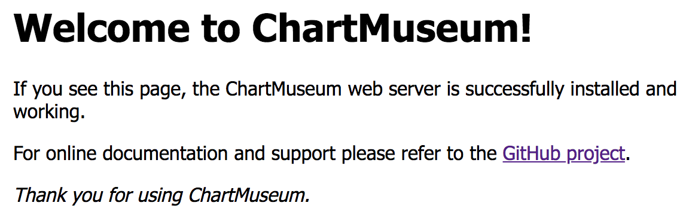
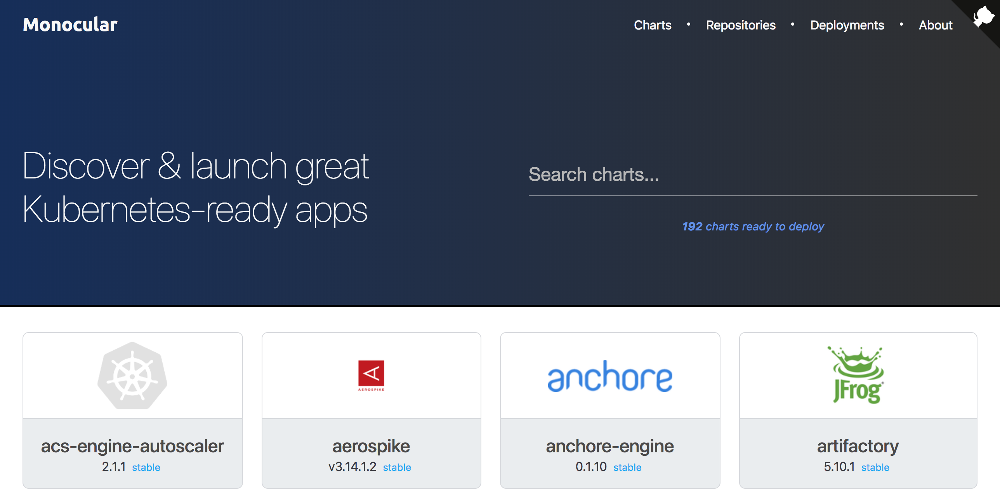

# Distributing Kubernetes Applications

I> Being able to package applications is of no use unless we can distribute them. A Kubernetes application is a combination of one or more container images and YAML files that describe them. If we are to distribute our applications, we need to store both container images and YAML definitions in repositories.

We are already storing our images in [Docker Hub](https://hub.docker.com/). We could have chosen a different container registry but, since Docker Hub is so convenient, we'll continue using it throughout the book. Even though that might not be the best choice, if we move the discussion about repositories for container images out of the way, we can focus on YAML files or, to be more concrete, Helm Charts.

At this point, you might be thinking that being able to run Charts located on your laptop is an excellent way to go. All you have to do is check out the code of an application hoping that the Chart is there and execute a command like `helm upgrade -i go-demo-3 helm/go-demo-3`. You'd be correct that's the easiest way to install or upgrade an application that you are developing. However, your application is not the only one you'll be installing.

If you are a developer, you will almost certainly want to run many applications on your laptop. If you need to check whether your app integrates with those developed by your colleagues, you'll want to run theirs as well. You can continue down the same path of checking out their code and installing local Charts. But that already starts being tedious. You'll need to know which repositories they're using, and check out more code than you truly need. Wouldn't it be better to install your colleagues' applications in the same way as installing publicly available third-party applications? Wouldn't it be great if you could execute something like `helm search my-company-repo/`, get the list of all the apps created in your organization, and install those you need? We are already using the same approach with container images (e.g., `docker image pull`), with Linux packages (`apt install vim`), and many other packages and distributions. Why not do the same with Helm Charts? Why would we restrict the ability to pull a definition of an application only to those created by third-parties? We should be able to distribute our apps in the same way.

Helm Charts are still very young. The project just started, and there aren't many repositories to choose. Today (June 2018), [ChartMuseum](https://github.com/kubernetes-helm/chartmuseum) is one of the few, if not the only one available. So, picking the right solution is very straightforward. When there aren't many choices, the selection process is easy.

In this chapter, we'll explore Helm repositories and how we can leverage them to distribute our Charts across an organization, or even publish them to a broader audience if we are in the business of providing software to the more general public.

As always, we need to start from somewhere, and that is a Kubernetes cluster.

## Creating A Cluster And Retrieving Its IP

You know the drill. Create a new cluster or reuse the one you dedicated to the exercises.

First, we'll go to the local copy of the *vfarcic/k8s-specs* repository and make sure that we have the latest revision. Who knows? I might have changed something since you read the last chapter.

I> All the commands from this chapter are available in the [05-chart-museum.sh](https://gist.github.com/e0657623045b43259fe258a146f05e1a) Gist.

```bash
cd k8s-specs

git pull
```

The requirements for the cluster are now slightly different. We'll need **Helm server** (**tiller**). On top of that, if you are a **minishift** user, you'll need a cluster with 4GB RAM.

For your convenience, the new Gists and the specs are available.

* [docker4mac-helm.sh](https://gist.github.com/7e6b068c6d3d56fc53416ac2cd4086e3): **Docker for Mac** with 3 CPUs, 3 GB RAM, with **nginx Ingress**, and with **tiller**.
* [minikube-helm.sh](https://gist.github.com/728246d8be349ffb52770f72c39e9564): **minikube** with 3 CPUs, 3 GB RAM, with `ingress`, `storage-provisioner`, and `default-storageclass` addons enabled, and with **tiller**.
* [kops-helm.sh](https://gist.github.com/6c1ebd59305fba9eb0102a5a8cea863b): **kops in AWS** with 3 t2.small masters and 2 t2.medium nodes spread in three availability zones, with **nginx Ingress**, and with **tiller**. The Gist assumes that the prerequisites are set through [Appendix B](#appendix-b).
* [minishift-helm.sh](https://gist.github.com/945ab1e68afa9e49f85cec3bc6df4959): **minishift** with 3 CPUs, 3 GB RAM, with version 1.16+, and with **tiller**.
* [gke-helm.sh](https://gist.github.com/1593ed36c4b768a462b1a32d5400649b): **Google Kubernetes Engine (GKE)** with 3 n1-highcpu-2 (2 CPUs, 1.8 GB RAM) nodes (one in each zone), and with **nginx Ingress** controller running on top of the "standard" one that comes with GKE, and with **tiller**. We'll use nginx Ingress for compatibility with other platforms. Feel free to modify the YAML files and Helm Charts if you prefer NOT to install nginx Ingress.

Besides creating a cluster, we'll need an IP through which we can access it. The instructions that follow differ from one Kubernetes flavor to another. Please make sure you execute those matching your cluster.

If your cluster is running in **AWS** and if it was created with **kops**, we'll retrieve the IP by digging the hostname of the Elastic Load Balancer (ELB). Please execute the commands that follow.

```bash
LB_HOST=$(kubectl -n kube-ingress \
    get svc ingress-nginx \
    -o jsonpath="{.status.loadBalancer.ingress[0].hostname}")

LB_IP="$(dig +short $LB_HOST \
    | tail -n 1)"
```

If you're using **Docker For Mac or Windows**, the cluster is accessible through localhost. Since we need an IP, we'll use `127.0.0.1` instead. Please execute the command that follows.

```bash
LB_IP="127.0.0.1"
```

**Minikube** users can retrieve the IP through `minikube ip`. If you are one of them, please execute the command that follows.

```bash
LB_IP=$(minikube ip)
```

Retrieving IP from **minishift** is similar to minikube. If that's your Kubernetes flavor, please execute the command that follows.

```bash
LB_IP=$(minishift ip)
```

Finally, if you are using **GKE**, the IP we're looking for is available through the `ingress-nginx` service. Please execute the command that follows.

```bash
LB_IP=$(kubectl -n ingress-nginx \
    get svc ingress-nginx \
    -o jsonpath="{.status.loadBalancer.ingress[0].ip}")
```

No matter how you retrieved the IP of your cluster, we'll validate it by echoing the `LB_IP` variable.

```bash
echo $LB_IP
```

The output will differ from one case to another. In my case, it is `52.15.140.221`.

There's only one more thing left before we jump into Chart repositories. We'll merge your fork of the *go-demo-3* code repository with the origin and thus ensure that you are up-to-date with changes I might have made in the meantime.

First, we'll move into the fork's directory.

```bash
cd ../go-demo-3
```

To be on the safe side, we'll push the changes you might have made in the previous chapter, and then we'll sync your fork with the upstream repository. That way, we'll guarantee that you have all the changes I might have made.

You probably already know how to push your changes and how to sync with the upstream repository. In case you don't, the commands are as follows.

```bash
git add .

git commit -m \
    "Packaging Kubernetes Applications chapter"

git push

git remote add upstream \
    https://github.com/vfarcic/go-demo-3.git

git fetch upstream

git checkout master

git merge upstream/master
```

We pushed the changes we made in the previous chapter, we fetched the upstream repository *vfarcic/go-demo-3*, and we merged the latest code from it. The only thing left is to go back to the `k8s-specs` directory.

```bash
cd ../k8s-specs
```

Now we are ready to explore Helm repositories with *ChartMuseum*.

## Using ChartMuseum

Just as [Docker Registry](https://docs.docker.com/registry/) is a place where we can publish our container images and make them accessible to others, we can use Chart repository to accomplish similar goals with our Charts.

A Chart repository is a location where packaged Charts can be stored and retrieved. We'll use [ChartMuseum](https://github.com/kubernetes-helm/chartmuseum) for that. There aren't many other solutions to choose. We can say that we picked it because there were no alternatives. That will change soon. I'm sure that Helm Charts will become integrated into general purpose repositories. At the time of this writing (June 2018), Charts are already supported by JFrog's [Artifactory](https://www.jfrog.com/confluence/display/RTF/Helm+Chart+Repositories). You could easily build one yourself if you're adventurous. All you'd need is a way to store `index.yaml` file that contains all the Charts and an API that could be used to push and retrieve packages. Anything else would be a bonus, not a requirement.

That's it. That's all the explanation you need, except a note that we'll go with the easiest solution. We won't build a Charts repository ourselves, nor we are going to pay for Artifactory. We'll use ChartMuseum.

ChartMuseum is already available in the official Helm repository. We'll add it to your Helm installation just in case you removed it accidentally.

```bash
helm repo add stable \
    https://kubernetes-charts.storage.googleapis.com
```

You should see the output claiming that `"stable" has been added to your repositories`.

Next, we'll take a quick look at the values available in `chartmuseum`.

```bash
helm inspect values stable/chartmuseum
```

The output, limited to the relevant parts, is as follows.

```yaml
...
image:
  repository: chartmuseum/chartmuseum
  tag: v0.7.0
  pullPolicy: IfNotPresent
env:
  open:
    ...
    DISABLE_API: true
    ...
  secret:
    # username for basic http authentication
    BASIC_AUTH_USER:
    # password for basic http authentication
    BASIC_AUTH_PASS:
    ...
resources: {}
#  limits:
#    cpu: 100m
#    memory: 128Mi
#  requests:
#    cpu: 80m
#    memory: 64Mi
...
persistence:
  enabled: false
  ...
## Ingress for load balancer
ingress:
  enabled: false
...
#   annotations:
#     kubernetes.io/ingress.class: nginx
#     kubernetes.io/tls-acme: "true"

## Chartmuseum Ingress hostnames
## Must be provided if Ingress is enabled
##
#   hosts:
#     chartmuseum.domain.com:
#         - /charts
#         - /index.yaml
...
```

We can, and we will change the image tag. We'll try to make that our practice with all installations. We'll always use a specific tag, and leave latest for developers and others who might not be concerned with stability of the system.

By default, access to the API is disabled through the `DISABLE_API: true` entry. We'll have to enable it if we are to interact with the API. We can see that there are, among others, `BASIC_AUTH_USER` and `BASIC_AUTH_PASS` secrets which we can use if we'd like to provide a basic HTTP authentication.

Further down are the commented resources. We'll have to define them ourselves.

We'll need to persist the state of the application and make it accessible through Ingress. Both can be accomplished by changing related `enabled` entries to `true` and, in case of Ingress, by adding a few annotations and a host.

Now that we went through the values we're interested in, we can proceed with the practical parts. We'll need to define the address (domain) we'll use for ChartMuseum.

We already have the IP of the cluster (hopefully the IP of the external LB), and we can use it to create a `nip.io` domain, just as we did in the previous chapter.

```bash
CM_ADDR="cm.$LB_IP.nip.io"
```

To be on the safe side, we'll `echo` the value stored in `CM_ADDR`, and check whether it looks OK.

```bash
echo $CM_ADDR
```

In my case, the output is `cm.18.221.122.90.nip.io`.

If you go back to the values output, you'll notice that the Chart requires host to be defined as a key, with paths as values. The problem with that lies in the fact that "special" characters cannot be used as keys. In the case of our address, we need to escape all the dots. We'll use a bit of `sed` magic for that.

```bash
CM_ADDR_ESC=$(echo $CM_ADDR \
    | sed -e "s@\.@\\\.@g")

echo $CM_ADDR_ESC
```

We echoed the address, and we sent the output to the `sed` command that replaced every `.` character with `\.`. The output of the latter command should be similar to the one that follows.

```
cm\.18\.221\.122\.90\.nip\.io
```

I already prepared a file with all the values we'll want to customize. Let's take a quick look at it.

```bash
cat helm/chartmuseum-values.yml
```

The output is as follows.

```yaml
image:
  tag: v0.7.0
env:
  open:
    DISABLE_API: false
resources:
  limits:
    cpu: 100m
    memory: 128Mi
  requests:
    cpu: 80m
    memory: 64Mi
persistence:
  enabled: true
ingress:
  enabled: true
  annotations:
    kubernetes.io/ingress.class: "nginx"
    ingress.kubernetes.io/ssl-redirect: "false"
    nginx.ingress.kubernetes.io/ssl-redirect: "false"
  hosts:
    cm.127.0.0.1.nip.io:
    - /
```

This is becoming monotonous, and that's OK. It should be that way. Installations should be boring and follow the same pattern. We found that pattern in Helm.

The *chartmuseum-values.yml* file defines the values we discussed. It sets the `tag` we'll use, and it enables the API. It defines the `resources`, and you already know that the values we're using should be taken with a lot of skepticism. In the "real" production, the amount of memory and CPU your applications require will differ significantly from what we can observe in our examples.

We enabled `persistence`, and we'll use the default StorageClass, since we did not specify any explicitly.

Ingress section defines the same annotations as those we used with the other Helm installations. It also defines a single host that will handle requests from all paths (`/`). Think of it as a reminder only. We cannot rely on the host in the *chartmuseum-values.yml* file since it likely differs from the `nip.io` address you defined. I could not predict which one will be in your case. So, we'll overwrite that value with a `--set` argument.

Let's install the Chart.

```bash
helm install stable/chartmuseum \
    --namespace charts \
    --name cm \
    --values helm/chartmuseum-values.yml \
    --set ingress.hosts."$CM_ADDR_ESC"={"/"} \
    --set env.secret.BASIC_AUTH_USER=admin \
    --set env.secret.BASIC_AUTH_PASS=admin
```

The Chart is installed. Instead of waiting in silence for all the Pods to start running, we'll briefly discuss security.

We defined the username and the password through `--set` arguments. They shouldn't be stored in `helm/chartmuseum-values.yml` since that would defy the purpose of secrecy.

Personally, I believe that there's no reason to hide the Charts. They do not (should not) contain anything confidential. The applications are stored in a container registry. Even if someone decides to use out Charts, that person would not be able to deploy our images, if our registry is configured to require authentication.

If that is not enough, and we do want to protect our Charts besides protecting images, we should ask yourself who should not be allowed to access them. If we want to prevent only outsiders from accessing our Charts, the fix is easy. Put can put our cluster inside a VPN and make the domain accessible only to internal users. On the other hand, if we want to prevent even internal users from accessing our Charts, we can add basic HTTP authentication. We already saw the `secret` section when we inspected the values. You could set `env.secret.BASIC_AUTH_USER` and `env.secret.BASIC_AUTH_PASS` to enable basic authentication. That's what we did in our example.

If none of those methods is secure enough, we can implement the best security measure of all. We can disable access to all humans by removing Ingress and changing the Service type to `ClusterIP`. That would result in only processes running in Pods being able to access the Charts. A good example would be to allow Jenkins to push and pull the Charts, and no one else. Even though that approach is more secure, it does not provide access to the Charts to people who might need it. Humans are true users of ChartMuseum. For scripts, it is easy to know which repository contains the definitions they need and to clone the code, even if that is only for the purpose of retrieving Charts. Humans need a way to search for Charts, to inspect them, and to run them on their laptops or servers.

We opted to a middle solution. We set up basic authentication which is better than no authentication, but still less secure than allowing only those within a VPN to access Charts or disabling human access altogether.

W> ## A note to minishift users
W>
W> OpenShift ignores Ingress resources so we'll have to create a Route to accomplish the same effect. Please execute the command that follows.
W> 
W> `oc -n charts create route edge --service cm-chartmuseum --hostname $CM_ADDR --insecure-policy Allow`

By now, the resources we installed should be up-and-running. We'll confirm that just to be on the safe side.

```bash
kubectl -n charts \
    rollout status deploy \
    cm-chartmuseum
```

The output should show that the `deployment "cm-chartmuseum"` was `successfully rolled out`.

Next, we'll check whether the application is healthy.

```bash
curl "http://$CM_ADDR/health"
```

The output is as follows.

```json
{"healthy":true}
```

Now we can open ChartMuseum in browser.

```bash
open "http://$CM_ADDR"
```

You will be asked for a username and a password. Please use *admin* for both and click the *Sign in* button.



As you can see, there's not much of the UI to look. We are supposed to interact with ChartMuseum through its API. If we need to visualize our Charts, we'll need to look for a different solution.

Let's see the index.

```bash
curl "http://$CM_ADDR/index.yaml"
```

Since we did not specify the username and the password, we got `{"error":"unauthorized"}` as the output. We'll need to authenticate every time we want to interact with ChartMuseum API.

Let's try again but, this time, with the authentication info.

```bash
curl -u admin:admin \
    "http://$CM_ADDR/index.yaml"
```

The output is as follows.

```yaml
apiVersion: v1
entries: {}
generated: "2018-06-02T21:38:30Z"
```

It should come as no surprise that we have no entries to the museum. We did not yet push a Chart. Before we do any pushing, we should add a new repository to our Helm client.

```bash
helm repo add chartmuseum \
    http://$CM_ADDR \
    --username admin \
    --password admin
```

The output states that `"chartmuseum" has been added to your repositories`. From now on, all the Charts we store in our ChartMuseum installation will be available through our Helm client.

The only thing left is to start pushing Charts to ChartMuseum. We could do that by sending `curl` requests. However, there is a better way, so we'll skip HTTP requests and install a Helm plugin instead.

```bash
helm plugin install \
    https://github.com/chartmuseum/helm-push
```

This plugin added a new command `helm push`. Let's give it a spin.

```bash
helm push \
    ../go-demo-3/helm/go-demo-3/ \
    chartmuseum \
    --username admin \
    --password admin
```

The output is as follows.

```
Pushing go-demo-3-0.0.1.tgz to chartmuseum...
Done.
```

We pushed a Chart located in the `../go-demo-3/helm/go-demo-3/` directory into a repository `chartmuseum`. We can confirm that the push was indeed successful by retrieving `index.yaml` file from the repository.

```bash
curl "http://$CM_ADDR/index.yaml" \
    -u admin:admin
```

The output is as follows.

```yaml
apiVersion: v1
entries:
  go-demo-3:
  - apiVersion: v1
    created: "2018-06-02T21:39:21Z"
    description: A silly demo based on API written in Go and MongoDB
    digest: d8443c78485e80644ff9bfddcf32cc9f270864fb50b75377dbe813b280708519
    home: http://www.devopstoolkitseries.com/
    keywords:
    - api
    - backend
    - go
    - database
    - mongodb
    maintainers:
    - email: viktor@farcic.com
      name: Viktor Farcic
    name: go-demo-3
    sources:
    - https://github.com/vfarcic/go-demo-3
    urls:
    - charts/go-demo-3-0.0.1.tgz
    version: 0.0.1
generated: "2018-06-02T21:39:28Z"
```

We can see that the `go-demo-3` Chart is now in the repository. Most of the information comes from the `Chart.yaml` file we explored in the previous chapter.

Finally, we should validate that our local Helm client indeed sees the new Chart.

```bash
helm search chartmuseum/
```

The output is probably disappointing. It states that `no results` were `found`. The problem is that even though the Chart is stored in the ChartMuseum repository, we did not update the repository information stored locally in the Helm client. So, let's update it first.

```bash
helm repo update
```

The output is as follows.

```
Hang tight while we grab the latest from your chart repositories...
...Skip local chart repository
...Successfully got an update from the "chartmuseum" chart repository
...Successfully got an update from the "stable" chart repository
Update Complete. ⎈ Happy Helming!⎈
```

If you added more repositories to your Helm client, you might see a bigger output. Those additional repositories do not matter in this context. What does matter is that the `chartmuseum` was updated and that we can try to search it again.

```bash
helm search chartmuseum/
```

This time, the output is not empty.

```
NAME                 	CHART VERSION	APP VERSION	DESCRIPTION                                       
chartmuseum/go-demo-3	0.0.1        	           	A silly demo based on API written in Go and Mon...
```

Our Chart is now available in ChartMuseum, and we can access it with our Helm client. Let's inspect the Chart.

```bash
helm inspect chartmuseum/go-demo-3
```

We won't go through the output since it is the same as the one we explored in the previous chapter. The only difference is that this time it is not retrieved from the Chart stored locally, but from ChartMuseum running inside our cluster. From now on, anyone with the access to that repository can deploy the *go-demo-3* application.

To be on the safe side, and fully confident in the solution, we'll deploy the Chart before announcing to everyone that they can use the new repository to install applications.

Just as with the other applications, we'll start by defining a domain we'll use for *go-demo-3*.

```bash
GD3_ADDR="go-demo-3.$LB_IP.nip.io"
```

Next, we'll output the address as a way to confirm that it looks OK.

```bash
echo $GD3_ADDR
```

The output should be similar to `go-demo-3.18.221.122.90.nip.io`.

Now we can finally install *go-demo-3* Chart stored in ChartMuseum running inside our cluster. We'll continue using `upgrade` with `-i` since that is more friendly to our yet-to-be-defined continuous deployment process.

```bash
helm upgrade -i go-demo-3 \
    chartmuseum/go-demo-3 \
    --namespace go-demo-3 \
    --set image.tag=1.0 \
    --set ingress.host=$GD3_ADDR \
    --reuse-values
```

We can see from the first line of the output that the `release "go-demo-3" does not exist`, so Helm decided to install it, instead of doing the upgrade. The rest of the output is the same as the one you saw in the previous chapter. It contains the list of the resources created from the Chart as well as the post-installation instructions.

W> ## A note to minishift users
W>
W> OpenShift ignores Ingress resources so we'll have to create a Route to accomplish the same effect. Please execute the command that follows.
W> 
W> `oc -n go-demo-3 create route edge --service go-demo-3 --hostname $GD3_ADDR --insecure-policy Allow`

Next, we'll wait until the application is rolled out and confirm that we can access it.

```bash
kubectl -n go-demo-3 \
    rollout status deploy go-demo-3

curl "http://$GD3_ADDR/demo/hello"
```

The latter command output the familiar `hello, world!` message thus confirming that the application is up-and-running.

The only thing left to learn is how to remove Charts from ChartMuseum. But, before we do that, we'll delete *go-demo-3* from the cluster. We don't need it anymore.

```bash
helm delete go-demo-3 --purge
```

Unfortunately, there is no Helm plugin that will allow us to delete a Chart from a repository, so we'll accomplish our mission using `curl`.

```bash
curl -XDELETE \
    "http://$CM_ADDR/api/charts/go-demo-3/0.0.1" \
    -u admin:admin
```

The output is as follows.

```json
{"deleted":true}
```

The chart is deleted from the repository.

Now you know everything there is to know about ChartMuseum. OK, maybe you don't know everything you should know, but you do know the basics that will allow you to explore it further.

Now that you know how to push and pull Charts to and from ChartMuseum, you might still be wondering if there is an UI that will allow us to visualize Charts. Read on.

## Using Monocular

I don't think that UIs are useful. We tend to focus on the features they provide, and that distracts us from command line and code. We often get so immersed into filling fields and clicking buttons, that we often forget that the key to automation is to master CLIs and to write code that lives in a code repository. I think that UIs do more damage than good to software engineers.

That being said, I am fully aware that not everyone shares my views. Some like UIs and prefer pretty colors over black and white terminal screens. For those, I will guide you how to get a UI that will utilize Helm repositories and allow you to do some of the things we did through CLI by clicking buttons. We'll explore [Monocular](https://github.com/kubernetes-helm/monocular).

Monocular is web-based UI for managing Kubernetes applications packaged as Helm Charts. It allows us to search and discover available charts from multiple repositories, and install them in our clusters with one click.

Monocular can be installed with Helm. It is available through a Chart residing in its own [repository](https://kubernetes-helm.github.io/monocular). So, our first step is to add the repository to our Helm client.

```bash
helm repo add monocular \
    https://kubernetes-helm.github.io/monocular
```

Let's take a look at the available values.

```bash
helm inspect values monocular/monocular
```

The output, limited to the values we're interested in, is as follows.

```yaml
api:
  ...
  image:
    repository: bitnami/monocular-api
    tag: v0.7.2
    ...
  resources:
    limits:
      cpu: 100m
      memory: 128Mi
    requests:
      cpu: 100m
      memory: 128Mi
  ...
ui:
  ...
  image:
    repository: bitnami/monocular-ui
    tag: v0.7.2
    ...
ingress:
  enabled: true
  hosts:
  # Wildcard
  -
  # - monocular.local

  ## Ingress annotations
  ##
  annotations:
    ## Nginx ingress controller (default)
    nginx.ingress.kubernetes.io/rewrite-target: /
    kubernetes.io/ingress.class: nginx
    ...
```

Just as with the other Charts, we'll use a fixed version of the images by customizing `image.tag` values in both the `api` and the `ui` sections.

We'll need to increase the resources since those specified by default are too low.

Ingress is already enabled, but we'll have to specify the host. Also, we'll add the "old" style annotations so that older versions of nginx Ingress are supported as well.

Those changes are already available in the `monocular-values.yml` file, so let's take a quick look at it.

```bash
cat helm/monocular-values.yml
```

The output is as follows.

```yaml
api:
  image:
    tag: v0.7.0
  resources:
    limits:
      cpu: 500m
      memory: 1Gi
    requests:
      cpu: 200m
      memory: 512Mi
ui:
  image:
    tag: v0.7.0
ingress:
  annotations:
    kubernetes.io/ingress.class: "nginx"
    ingress.kubernetes.io/rewrite-target: /
    nginx.ingress.kubernetes.io/rewrite-target: /
    ingress.kubernetes.io/ssl-redirect: "false"
    nginx.ingress.kubernetes.io/ssl-redirect: "false"
```

Before we proceed, we'll have to generate a valid hostname that we'll use with Monocular Ingress resource.

```bash
MONOCULAR_ADDR="monocular.$LB_IP.nip.io"

echo $MONOCULAR_ADDR
```

The output of the latter command should be similar to the one that follows.

```
monocular.18.221.122.90.nip.io
```

W> ## A note to minishift users
W>
W> Installing Monocular in OpenShift creates a few issues and requires quite a few changes to the commands that follow. Please use the instructions from [Deploy Monocular on OpenShift](https://blog.openshift.com/deploy-monocular-openshift/) article instead of the command that follows.

Now we are ready to install Monocular Chart.

```bash
helm install monocular/monocular \
    --namespace charts \
    --name monocular \
    --values helm/monocular-values.yml \
    --set ingress.hosts={$MONOCULAR_ADDR}
```

The output follows the same pattern as the other charts. It shows the status at the top, followed with the resources it created. At the bottom are short instructions for the post-installation steps.

We should wait until the application rolls out before giving a spin to its UI.

```bash
kubectl -n charts \
    rollout status \
    deploy monocular-monocular-api
```

It will take a while until the API rolls out and the `monocular-api` Pods might fail a few times. Be patient.

Now we can open Monocular in a browser.

```bash
open "http://$MONOCULAR_ADDR"
```



If we click on the *Charts* link in top-right corner of the screen, we'll see all the charts available in the two default repositories (*stable* and *incubator*). We can use the link on the left-hand menu to filter them by a repository and to change the ordering. We can also use the *Search charts...* field to filter Charts.

The *Repositories* screen can be used to list those that are currently configured, as well as to add new ones.

The *Deployments* screen list all the Helm installations. At the moment, we have *cm* (ChartMuseum) and *monocular* running through Helm Charts. Additionally, there is the *New deployment* button that we can use to install a new Chart. Please click it and observe that you are taken back to the *Charts* screen. We are about to install Jenkins.

Type *jenkins* in the *Search charts...* field. The list of the Charts will be filtered, and we'll see only Jenkins. Click on the only Chart.

On the left-hand side of the screen is the same information we can see by executing `helm inspect stable/jenkins` command. On the right-hand side, there is the *Install* section which we can use for *one click installation* or to copy *Helm CLI* commands.

Please remain in the *One Click Installation* tab and click the *Install jenkins v...* button. You will be presented with a popup with a field to specify a Namespace where the Chart will be installed. Please type *jenkins* and click the *Deploy* button.

We were redirected to the screen with the same information we'd get if we executed `helm install stable/jenkins --namespace jenkins`.

Even though using Monocular might seem tempting at the begging, it has a few serious drawbacks. We'll discuss them soon. For now, please click the red *Delete deployment* button to remove Jenkins.

The major problem with Monocular is that it does not allow us to specify values during Charts installation. There will hardly ever be the case when we'll install Charts without any custom values. That inability alone should be enough to discard Monocular for any serious usage. On top of that, it does not provide the option to upgrade Charts.

Today (June 2018) Monocular project is still too young to be taken seriously. That will probably change as the project matures. For now, my recommendation is not to use it. That might provoke an adverse reaction. You might feel that I wasted your time by showing you a tool that is not useful. However, I thought that you should know that the UI exists and that it is the only free option we have today. I'll leave that decision to you. You know what it does and how to install it.

## What Now?

We will continue using ChartMuseum throughout the rest of the book, and I will leave it to you to decide whether Monocular is useful or a waste of computing resources.

We could have set up a container registry, but we didn't. There are too many tools in the market ranging from free solutions like [Docker Registry](https://docs.docker.com/registry/) all the way until enterprise products like [Docker Trusted Registry](https://docs.docker.com/ee/dtr/) and JFrog' [Artifactory](https://www.jfrog.com/confluence/display/RTF/Docker+Registry). The problem is that Docker Registry (free version) is very insecure. It provides only a very basic authentication. Still, the price is right (it's free). On the other hand, you might opt for one of the commercial solutions and leverage the additional features they provide. Never the less, I felt that for our use-case it is the best if we stick with [Docker Hub](https://hub.docker.com/). Almost everyone has an account there, and it is an excellent choice for the examples we're having. Once you translate the knowledge from here to your "real" processes, you should have no problem switching to any other container registry if you choose to do so. By now, you should have all the skills required to run a registry in your cluster.

All in all, we'll continue using Docker Hub for storing container images, and we'll run Monocular in our cluster and use it to distribute Helm Charts.

All that's left is for us to remove the Charts we installed. We'll delete them all at once. Alternatively, you can delete the whole cluster if you do plan to make a break. In any case, the next chapter will start from scratch.

```bash
helm delete $(helm ls -q) --purge

kubectl delete ns \
    charts go-demo-3 jenkins
```
