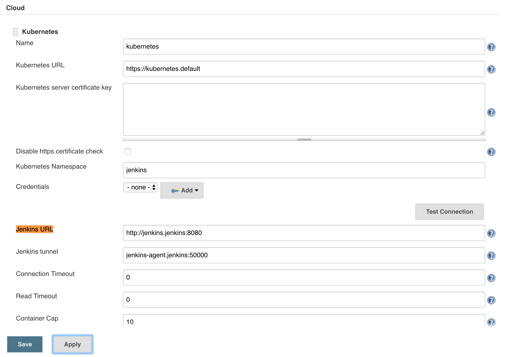
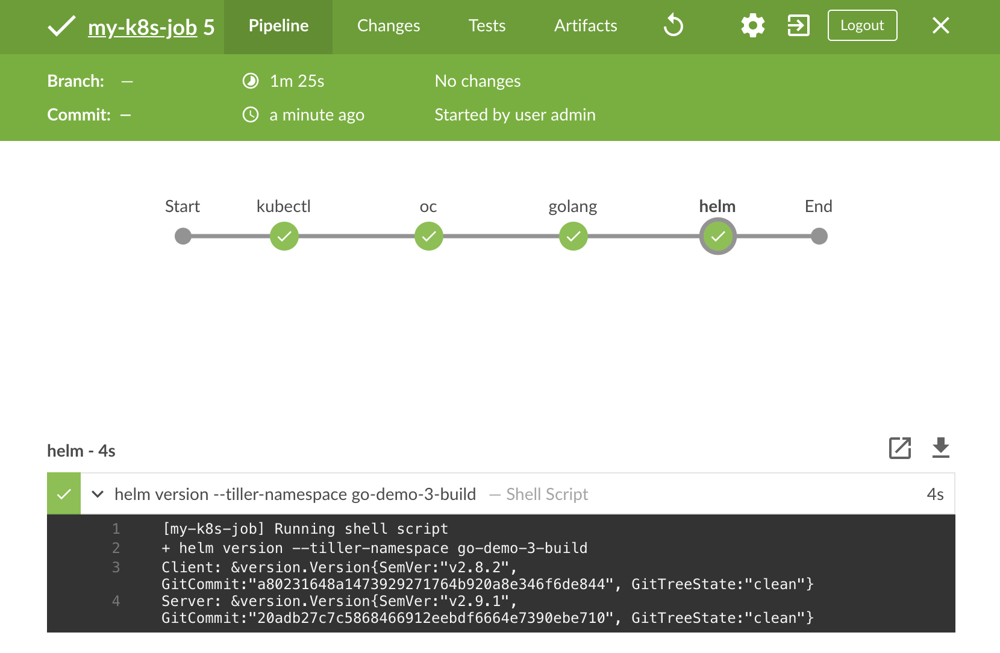
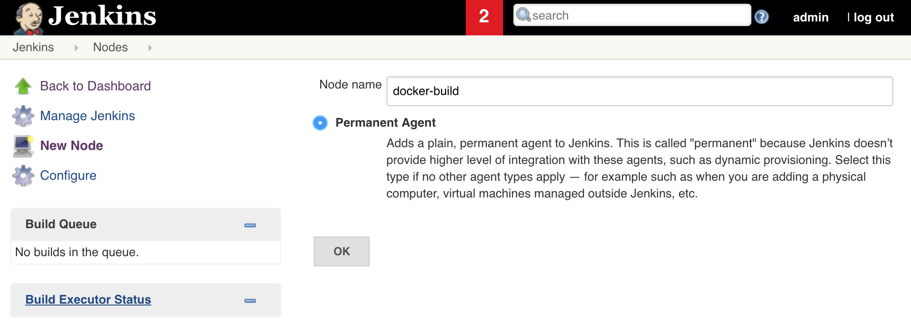
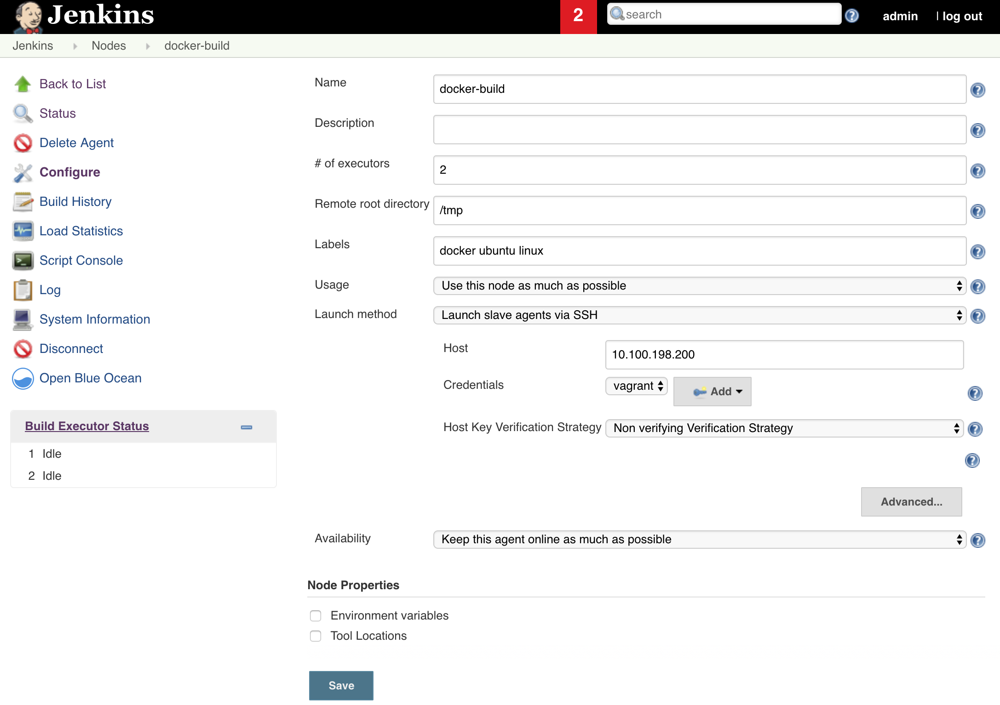
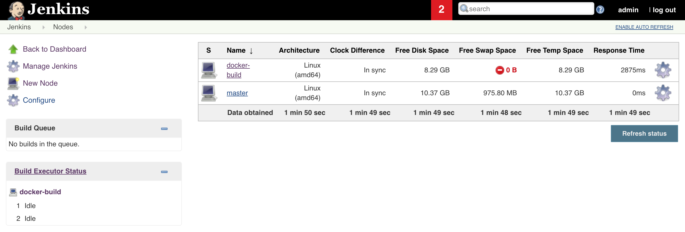
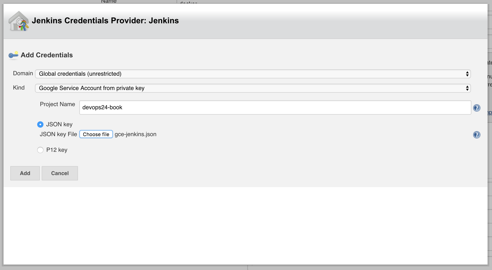
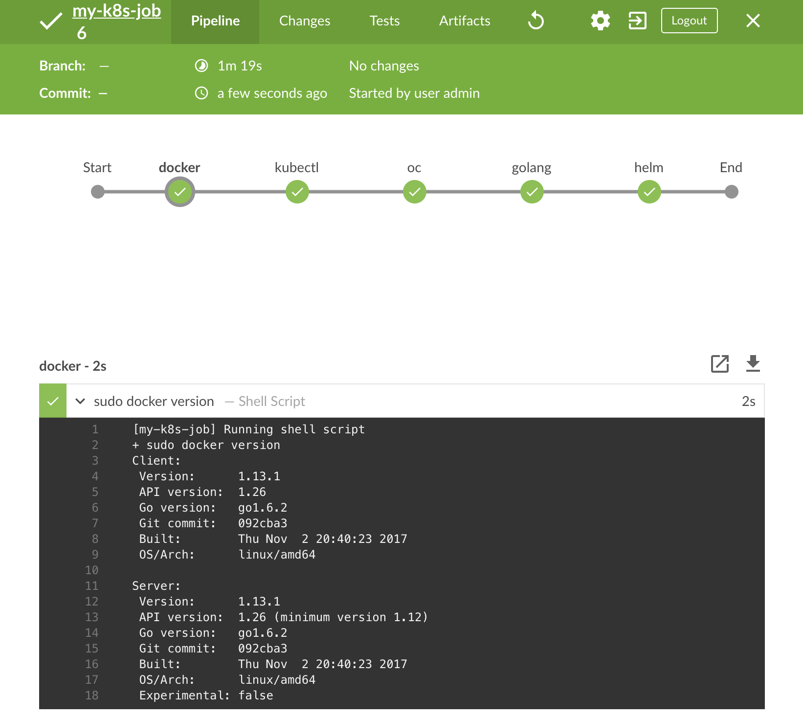

# Installing and Setting Up Jenkins

T> When used by engineers, UIs are evil. They sidetrack us from repeatability and automation.

UIs do have their purpose. They are supposed to provide enough colors and random graphs for CIO, CTO, and other C-level executives and mid-level managers. Management works in multi-color, while engineers should be limited to dual-color terminals, mixed with a slightly increased color pallet of IDEs and editors we use to code. We produce commits, while managers fake interest by looking at UIs.

The above phrase is a bit exaggerated. It's not true that UIs are useful only to managers nor that they fake interest. At least, that's not true for all of them. UIs do provide a lot of value but, unfortunately, they are often abused to the level of even postponing or even preventing automation. We'll try to make an additional effort to remove Jenkins UI for any setup related tasks. We'll try to automate everything.

We already improved a lot our ability to install Jenkins. A mere switch from custom-made YAML files to Helm Charts is a considerable step forward from the operational perspective. The addition of ServiceAccounts bound to Roles improved security. But, there's still one big thing left only partly explored. We did not yet reach the point where we can install and fully setup Jenkins from a command line. So far, there were always a few things we had to do manually from its UI. We'll try to get rid of those steps in the hope that the only command we'll need to execute is `helm install`.

As it often goes, we cannot hope to fully automate the setup without going through manual steps first. So, we'll start by exploring different use-cases. If we hit a road-block, we'll try to figure out how to overcome it. The chances are that another one will be waiting for us after the first, and another one after that. We're yet to see which obstacles we'll encounter and which steps are missing until we make Jenkins fully operational and, at the same time, reasonably secure. We'll try to automate the process only once we're confident in the way we set up Jenkins manually.

## Creating A Cluster And Retrieving Its IP

You already know what the first steps are. Create a new cluster or reuse the one you dedicated to the exercises.

We'll start by going to the local copy of the *vfarcic/k8s-specs* repository and making sure that we have the latest revision.

I> All the commands from this chapter are available in the [06-jenkins-setup.sh](https://gist.github.com/4ea447d106c96cb088bc8d616719f6e8) Gist.

```bash
cd k8s-specs

git pull
```

We'll need a few files from the *go-demo-3* repository you cloned in one of the previous chapters. To be on the safe side, please merge it the upstream. If you forgot the commands, they are available in the [go-demo-3-merge.sh gist](https://gist.github.com/171172b69bb75903016f0676a8fe9388).

The requirements are the same as those from the previous chapters. The only difference is that I will assume that you'll store the IP of the cluster or the external load balancer as the environment variable `LB_IP`.

For your convenience, the Gists and the specs are available below. Please note that they are the same as those we used in the previous chapter with the addition of the `export LB_IP` command.

* [docker4mac-ip.sh](https://gist.github.com/66842a54ef167219dc18b03991c26edb): **Docker for Mac** with 3 CPUs, 3 GB RAM, with **nginx Ingress**, with **tiller**, and with `LB_IP` variable set to `127.0.0.1`.
* [minikube-ip.sh](https://gist.github.com/df5518b24bc39a8b8cca95cc37617221): **minikube** with 3 CPUs, 3 GB RAM, with `ingress`, `storage-provisioner`, and `default-storageclass` addons enabled, with **tiller**, and with `LB_IP` variable set to the VM created by minikube.
* [kops-ip.sh](https://gist.github.com/7ee11f4dd8a130b51407582505c817cb): **kops in AWS** with 3 t2.small masters and 2 t2.medium nodes spread in three availability zones, with **nginx Ingress**, with **tiller**, and with `LB_IP` variable set to the IP retrieved by pinging ELB's hostname. The Gist assumes that the prerequisites are set through [Appendix B](#appendix-b).
* [minishift-ip.sh](https://gist.github.com/fa902cc2e2f43dcbe88a60138dd20932): **minishift** with 3 CPUs, 3 GB RAM, with version 1.16+, with **tiller**, and with `LB_IP` variable set to the VM created by minishift.
* [gke-ip.sh](https://gist.github.com/3e53def041591f3c0f61569d49ffd879): **Google Kubernetes Engine (GKE)** with 3 n1-highcpu-2 (2 CPUs, 1.8 GB RAM) nodes (one in each zone), and with **nginx Ingress** controller running on top of the "standard" one that comes with GKE, with **tiller**, and with `LB_IP` variable set to the IP of the external load balancer created when installing nginx Ingress. We'll use nginx Ingress for compatibility with other platforms. Feel free to modify the YAML files and Helm Charts if you prefer NOT to install nginx Ingress.
* [eks-ip.sh](https://gist.github.com/f7f3956cd39c3bc55638529cfeb2ff12): **Elastic Kubernetes Service (EKS)** with 2 t2.medium nodes, with **nginx Ingress** controller, with a **default StorageClass**, with **tiller**, and with `LB_IP` variable set tot he IP retrieved by pinging ELB's hostname.

Now we're ready to install Jenkins.

## Running Jenkins

We'll need a domain which we'll use to set Ingress' hostname and through which we'll be able to open Jenkins UI. We'll continue using *nip.io* service to generate domains. Just as before, remember that this is only a temporary solution and that you should use "real" domains with the IP of your external load balancer instead.

```bash
JENKINS_ADDR="jenkins.$LB_IP.nip.io"

echo $JENKINS_ADDR
```

The output of the latter command should provide a visual confirmation that the address we'll use for Jenkins looks OK. In my case, it is `jenkins.52.15.140.221.nip.io`.

W> ## A note to minishift users
W>
W> Helm will try to install Jenkins Chart with the process in a container running as user 0. By default, that is not allowed in OpenShift. We'll skip discussing the best approach to correct the issue, and I'll assume you already know how to set the permissions on the per-Pod basis. Instead, we'll do the most straightforward fix. Please execute the command that follows to allow the creation of restricted Pods to run as any user.
W>
W> `oc patch scc restricted -p '{"runAsUser":{"type": "RunAsAny"}}'`

We'll start exploring the steps we'll need to run Jenkins in a Kubernetes cluster by executing the same `helm install` command we used in the previous chapters. It won't provide everything we need, but it will be a good start. We'll improve the process throughout the rest of the chapter with the objective of having a fully automated Jenkins installation process. We might not be able to accomplish our goal 100%. Or, we might conclude that full automation is not worth the trouble. Nevertheless, we'll use the installation from the [Packaging Kubernetes Applications](#chartmuseum) as the base and see how far we can go in our quest for full automation.

```bash
helm install stable/jenkins \
    --name jenkins \
    --namespace jenkins \
    --values helm/jenkins-values.yml \
    --set Master.HostName=$JENKINS_ADDR
```

Jenkins Helm Chart comes with one big drawback. It uses ClusterRoleBinding for binding with the ServiceAccount `jenkins`. As a result, we cannot fine-tune permissions. We cannot define that, for example, Jenkins can operate only in the `jenkins` Namespace. Instead, the permissions we bind will apply to all Namespaces. That, as you can imagine, is a huge security risk. Jenkins could, for example, remove all the Pods from `kube-system`. Even if we have full trust in all the people working in our company and if we're sure that no one will try to define any malicious Pipeline, having cluster-wide permissions introduces a possible risk of doing something wrong by accident. We wouldn't like that to happen.

I> I made a [pull request](https://github.com/kubernetes/charts/pull/6190) that should allow us to switch from ClusterRoleBinding to RoleBinding. I'll update the book once the PR is merged. Until then, we'll remedy the issue with a workaround.

First, we'll remove the ClusterRoleBinding created through the Chart.

```bash
kubectl delete clusterrolebinding \
    jenkins-role-binding
```

Next, we'll create a RoleBinding. It'll be the same as the ClusterRoleBinding we just removed with only the `kind` being different.

```bash
cat helm/jenkins-patch.yml

kubectl apply -n jenkins \
    -f helm/jenkins-patch.yml
```

I am intentionally not providing more details since this is only a workaround until the PR is merged. Also, I'll assume that you already know how Roles, RoleBindings, and ServiceAccounts work and that you'll be able to deduce the logic just by exploring the definitions.

Finally, we'll confirm that Jenkins is rolled out.

```bash
kubectl -n jenkins \
    rollout status deployment jenkins
```

The latter command will wait until `jenkins` Deployment rolls out. Its output is as follows.

```
Waiting for rollout to finish: 0 of 1 updated replicas are available...
deployment "jenkins" successfully rolled out
```

W> ## A note to minishift users
W>
W> OpenShift requires Routes to make services accessible outside the cluster. To make things more complicated, they are not part of "standard Kubernetes" so we'll need to create one using `oc`. Please execute the command that follows.
W>
W> `oc -n jenkins create route edge --service jenkins --insecure-policy Allow --hostname $JENKINS_ADDR`
W>
W> That command created an `edge` Router tied to the `jenkins` Service. Since we do not have SSL certificates for HTTPS communication, we also specified that it is OK to use insecure policy which will allow us to access Jenkins through plain HTTP. Finally, the last argument defined the address through which we'd like to access Jenkins UI.


Now that Jenkins is up-and-running, we can open it in your favorite browser.

```bash
open "http://$JENKINS_ADDR"
```

T> ## A note to Windows users
T>
T> Git Bash might not be able to use the `open` command. If that's the case, please replace the `open` command with `echo`. As a result, you'll get the full address that should be opened directly in your browser of choice.

Since this is the first time we're accessing this Jenkins instance, we'll need to login first. Just as before, the password is stored in the Secret `jenkins`, under `jenkins-admin-password`. So, we'll query the secret to find out the password.

```bash
JENKINS_PASS=$(kubectl -n jenkins \
    get secret jenkins \
    -o jsonpath="{.data.jenkins-admin-password}" \
    | base64 --decode; echo)

echo $JENKINS_PASS
```

The output of the latter command should be a random string. As an example, I got `Ucg2tab4FK`. Please copy it, return to the Jenkins login screen opened in your browser, and use it to authenticate. We did not retrieve the username since it is hard-coded to *admin*.

We'll leave this admin user as-is since we won't explore authentication methods. When running Jenkins "for real", you should install a plugin that provides the desired authentication mechanism and configure Jenkins to use it instead. That could be LDAP, Google or GitHub authentication, and many other providers. For now, we'll continue using *admin* as the only god-like user.

Now that we got Jenkins up-and-running, we'll create a Pipeline which can be used to test our setup.

## Using Pods to Run Tools

We won't explore how to write a continuous deployment pipeline in this chapter. That is reserved for the next one. Right now, we are only concerned whether our Jenkins setup is working as expected. We need to know if Jenkins can interact with Kubernetes, whether we can run the tools we need as Pods, and whether they can be spun across different Namespaces. On top of those, we still need to solve the issue of building container images. Since we already established that it is not a good idea to mount a Docker socket, nor to run containers in privileged mode, we need to find a valid alternative. In parallel to solving those and a few other challenges we'll encounter, we cannot lose focus from automation. Everything we do has to be converted into automatic setup unless we make a conscious decision that it is not worth the trouble.

I'm jumping ahead of myself by bombing you with too many things. We'll backtrack a bit and start with a simple requirement. Later on, we'll build on top of it. So, our first requirement is to run different tools packaged as containers inside a Pod.

Please go back to Jenkins UI and click the *New Item* link in the left-hand menu. Type *my-k8s-job* in the *item name* field, select *Pipeline* as the job type and click the *OK* button.

We created a new job which does not yet do anything. Our next step is to write a very simple Pipeline that will validate that we can indeed use Jenkins to spin up a Pod with the containers we need.

Please click the *Pipeline* tab and you'll be presented with the *Pipeline Script* field. Write the script that follows.

```groovy
podTemplate(
    label: "kubernetes",
    containers: [
        containerTemplate(name: "maven", image: "maven:alpine", ttyEnabled: true, command: "cat"),
        containerTemplate(name: "golang", image: "golang:alpine", ttyEnabled: true, command: "cat")
    ]
) {
    node("kubernetes") {
        container("maven") {
            stage("build") {
                sh "mvn --version"
            }
            stage("unit-test") {
                sh "java -version"
            }
        }
        container("golang") {
            stage("deploy") {
                sh "go version"
            }
        }
    }
}
```

I> If you prefer to copy and paste, the job is available in the [my-k8s-job.groovy Gist](https://gist.github.com/2cf872c3a9acac51409fbd5a2789cb02).

The script defines a Pod template with two containers. One is based on the `maven` image and the other on the `golang` image. Further down, we defined that Jenkins should use that template as the `node`. Inside it, we are using the `maven` container to execute two stages. One will return Maven version, and the other will output Java version. Further down, we switch to the `golang` container only to output Go version.

This job is straightforward, and it does not do anything related to our continuous deployment processes. Nevertheless, it should be enough to provide a necessary validation that we can use Jenkins to create a Pod, that we can switch from one container to another, and that we can execute commands inside them.

Don't forget to click the *Save* button before proceeding.

If the job we created looks familiar, that's because it is the same as the one we used in the [Enabling Process Communication With Kube API Through Service Accounts](#sa) chapter. Since our goal is to confirm that our current Jenkins setup can create the Pods, that job is as good as any other to validate that claim.

Please click the *Open Blue Ocean* link from the left-hand menu. You'll see the *Run* button in the middle of the screen. Click it. As a result, a row will appear with a new build. Click it to see the details.

The build is running, and we should go back to the terminal window to confirm that the Pod is indeed created.

```bash
kubectl -n jenkins get pods
```

The output is as follows.

```
NAME              READY STATUS            RESTARTS AGE
jenkins-...       1/1   Running           0        5m
jenkins-slave-... 0/3   ContainerCreating 0        16s
```

We can see that there are two Pods in the `jenkins` Namespace. One is hosting Jenkins itself, while the other was created when we run the Jenkins build. You'll notice that even though we defined two containers, we can see three. The additional container was added automatically to the Pod, and it's used to establish communication with Jenkins.

In your case, the status of the `jenkins-slave` Pod might be different. Besides `ContainerCreating`, it could be `Running`, `Terminating`, or you might not even see it. It all depends on how much time passed between initiating the build and retrieving the Pods in the `jenkins` Namespace.

What matters is the process. When we initiated a new build, Jenkins created the Pod in the same Namespace. Once all the containers are up-and-running, Jenkins will execute the steps we defined through the Pipeline script. When finished, the Pod will be removed, freeing resources for other processes.

Please go back to Jenkins UI and wait until the build is finished.


We proved that we could run a very simple job. We're yet to discover whether we can do more complicated operations.

On the first look, the script we wrote looks OK. However, I'm not happy with the way we defined `podTemplate`. Wouldn't it be better if we could use the same YAML format for defining the template as if we'd define a Pod in Kubernetes? Fortunately, [jenkins-kubernetes-plugin](https://github.com/jenkinsci/kubernetes-plugin) recently added that feature. So, we'll try to rewrite the script to better match Pod definitions.

We'll use the rewriting opportunity to replace `maven` with the tools we are more likely to use with a CD pipeline for the *go-demo-3* application. We still need `golang`. On top of it, we should be able to run `kubectl`, `helm`, and, `openshift-client`. The latter is required only if you're using OpenShift, and you are free to remove it if that's not your case.

Let's open `my-k8s-job` configuration screen and modify the job.

```bash
open "http://$JENKINS_ADDR/job/my-k8s-job/configure"
```

Please click the *Pipeline* tab and replace the script with the one that follows.

```groovy
podTemplate(label: "kubernetes", yaml: """
apiVersion: v1
kind: Pod
spec:
  containers:
  - name: kubectl
    image: vfarcic/kubectl
    command: ["sleep"]
    args: ["100000"]
  - name: oc
    image: vfarcic/openshift-client
    command: ["sleep"]
    args: ["100000"]
  - name: golang
    image: golang:1.9
    command: ["sleep"]
    args: ["100000"]
  - name: helm
    image: vfarcic/helm:2.8.2
    command: ["sleep"]
    args: ["100000"]
"""
) {
    node("kubernetes") {
        container("kubectl") {
            stage("kubectl") {
                sh "kubectl version"
            }
        }
        container("oc") {
            stage("oc") {
                sh "oc version"
            }
        }
        container("golang") {
            stage("golang") {
                sh "go version"
            }
        }
        container("helm") {
            stage("helm") {
                sh "helm version"
            }
        }
    }
}
```

I> If you prefer to copy and paste, the job is available in the [my-k8s-job-yaml.groovy Gist](https://gist.github.com/a1b3b36c68323aea161d7364b1231de2).

This time, the format of the script is different. Instead of the `containers` argument inside `podTemplate`, now we have `yaml`. Inside it is Kubernetes Pod definition just as if we'd define a standard Kubernetes resource.

The rest of the script follows the same logic as before. The only difference is that this time we are using the tools were are more likely to need in our yet-to-be-defined *go-demo-3* Pipeline. All we're doing is churning output of `kubectl`, `oc`, `go`, and `helm` versions.

Don't forget to click the *Save* button.

Next, we'll run a build of the job with the new script.

```bash
open "http://$JENKINS_ADDR/blue/organizations/jenkins/my-k8s-job/activity"
```

Please click the *Run* button, followed with a click on the row with the new build.

I have an assignment for you while the build is running. Try to find out what is wrong with our current setup without looking at the results of the build. You have approximately six minutes to complete the task. Proceed only if you know the answer or if you gave up.

Jenkins will create a Pod in the same Namespace. That Pod will have five containers, four of which will host the tools we specified in the `podTemplate`, and Jenkins will inject the fifth as a way to establish the communication between Jenkins and the Pod. We can confirm that by listing the Pods in the `jenkins` Namespace.

```bash
kubectl -n jenkins get pods
```

The output is as follows.

```
NAME              READY STATUS            RESTARTS AGE
jenkins-...       1/1   Running           0        16m
jenkins-slave-... 0/5   ContainerCreating 0        19s
```

So far, everything looks OK. Containers are being created. The `jenkins-slave-...` Pod will soon change its status to `Running`, and Jenkins will try to execute all the steps defined in the script.

Let's take a look at the build from Jenkins' UI.

After a while, the build will reach the `helm` stage. Click it, and you'll see the output similar to the one that follows.

```
[my-k8s-job] Running shell script

+ helm version

Client: &version.Version{SemVer:"v2.8.2", GitCommit:"...", GitTreeState:"clean"}
```

You'll notice that the build will hang at this point. After a few minutes, you might think that it will hang forever. It won't. Approximately five minutes later, the output of the step in the `helm` stage will change to the one that follows.

```
[my-k8s-job] Running shell script

+ helm version

Client: &version.Version{SemVer:"v2.8.2", GitCommit:"...", GitTreeState:"clean"}

EXITCODE   0Error: cannot connect to Tiller

script returned exit code 1
```

W> ## A note to Docker For Mac/Windows users
W>
W> Even though Docker for Mac/Windows supports RBAC, it allows any internal process inside containers to communicate with Kube API. Unlike with other Kubernetes flavors, you will not see the same error. The build will complete successfully.

Our build could not connect to `Tiller`. Helm kept trying for five minutes. It reached its pre-defined timeout, and it gave up.


If what we learned in the [Enabling Process Communication With Kube API Through Service Accounts](#sa) chapter is still fresh in your mind, that outcome should not be a surprise. We did not set ServiceAccount that would allow Helm running inside a container to communicate with Tiller. It is questionable whether we should even allow Helm running in a container to interact with Tiller running in `kube-system`. That would be a huge security risk that would allow anyone with access to Jenkins to gain access to any part of the cluster. It would defy one of the big reasons why we're using Namespaces. We'll explore this, and a few other problems next. For now, we'll confirm that Jenkins removed the Pod created by the failed build.

```bash
kubectl -n jenkins get pods
```

The output is as follows.

```
NAME        READY STATUS  RESTARTS AGE
jenkins-... 1/1   Running 0        42m
```

The `jenkins-slave-...` Pod is gone, and our system is restored to the state before the build started.

## Running Builds In Different Namespaces

One of the significant disadvantages of the script we used inside `my-k8s-job` is that it runs in the same Namespace as Jenkins. We should separate builds from Jenkins and thus ensure that they do not affect its stability.

We can create a system where each application has two namespaces; one for testing and the other for production. We can define quotas, limitations, and other things we are used to defining on the Namespace level. As a result, we can guarantee that testing an application will not affect the production release. With Namespaces we can separate one set of applications from another. At the same time, we'll reduce the chance that one team will accidentally mess up with the applications of the other. Our end-goal is to be secure without limiting our teams. By giving them freedom in their own Namespace, we can be secure without impacting team's performance and its ability to move forward without depending on other teams.

Let's go back to the job configuration screen.

```bash
open "http://$JENKINS_ADDR/job/my-k8s-job/configure"
```

Please click the *Pipeline* tab and replace the script with the one that follows.

```groovy
podTemplate(
    label: "kubernetes",
    namespace: "go-demo-3-build",
    serviceAccount: "build",
    yaml: """
apiVersion: v1
kind: Pod
spec:
  containers:
  - name: kubectl
    image: vfarcic/kubectl
    command: ["sleep"]
    args: ["100000"]
  - name: oc
    image: vfarcic/openshift-client
    command: ["sleep"]
    args: ["100000"]
  - name: golang
    image: golang:1.9
    command: ["sleep"]
    args: ["100000"]
  - name: helm
    image: vfarcic/helm:2.8.2
    command: ["sleep"]
    args: ["100000"]
"""
) {
    node("kubernetes") {
        container("kubectl") {
            stage("kubectl") {
                sh "kubectl version"
            }
        }
        container("oc") {
            stage("oc") {
                sh "oc version"
            }
        }
        container("golang") {
            stage("golang") {
                sh "go version"
            }
        }
        container("helm") {
            stage("helm") {
                sh "helm version --tiller-namespace go-demo-3-build"
            }
        }
    }
}
```

I> Getting spoiled with Gist and still do not want to type? The job is available in the [my-k8s-job-ns.groovy Gist](https://gist.github.com/ced1806af8e092d202942a79e81d5ba9).

The only difference between that job and the one we used before is in `podTemplate` arguments `namespace` and `serviceAccount`. This time we specified that the Pod should be created in the `go-demo-3-build` Namespace and that it should use the ServiceAccount `build`. If everything works as expected, the instruction to run Pods in a different Namespace should provide the separation we crave, and the ServiceAccount will give the permissions the Pod might need when interacting with Kube API or other Pods.

Please click the *Save* button to persist the change of the Job definition.

Next, we'll open Jenkins' BlueOcean screen and check whether we can run builds based on the modified Job.

```bash
open "http://$JENKINS_ADDR/blue/organizations/jenkins/my-k8s-job/activity"
```

Please click the *Run* button, and select the row with the new build. You'll see the same `Waiting for next available executor` message we've already seen in the past. Jenkins needs to wait until a Pod is created and is fully operational. However, this time the wait will be longer since Jenkins will not be able to create the Pod.

The fact that we defined that the Job should operate in a different Namespace will do us no good if such a Namespace does not exist. Even if we create the Namespace, we specified that it should use the ServiceAccount `build`. So, we need to create both. However, that's not where our troubles stop. There are a few other problems we'll need to solve but, for now, we'll concentrate on the missing Namespace.

Please click the *Stop* button in the top-right corner or the build. That will abort the futile attempt to create a Pod, and we can proceed and make the necessary changes that will allow us to run a build of that Job in the `go-demo-3-build` Namespace.

As a minimum, we'll have to make sure that the `go-demo-3-build` Namespace exists and that it has the ServiceAccount `build` which is bound to a Role with sufficient permissions. While we're defining the Namespace, we should probably define a LimitRange and a ResourceQuota. Fortunately, we already did all that in the previous chapters, and we already have a YAML file that does just that.

Let's take a quick look at the `build-ns.yml` file available in the *go-demo-3* repository.

```bash
cat ../go-demo-3/k8s/build-ns.yml
```

We won't go through the details behind that definition since we already explored it in the previous chapters. Instead, we'll imagine that we are cluster administrators and that the team in charge of *go-demo-3* asked us to `apply` that definition.

```bash
kubectl apply \
    -f ../go-demo-3/k8s/build-ns.yml \
    --record
```

The output shows that the resources defined in that YAML were created.

Even though we won't build a continuous deployment pipeline just yet, we should be prepared for running our application in production. Since it should be separated from the testing Pods and releases under test, we'll create another Namespace that will be used exclusively for *go-demo-3* production releases. Just as before, we'll `apply` the definition stored in the *go-demo-3* repository.

```bash
cat ../go-demo-3/k8s/prod-ns.yml

kubectl apply \
    -f ../go-demo-3/k8s/prod-ns.yml \
    --record
```

We're missing one more thing before the part of the setup related to Kubernetes resources is finished.

So far, we have a RoleBinding inside the `jenkins` Namespace that provides Jenkins with enough permissions to create Pods in the same Namespace. However, our latest Pipeline wants to create Pods in the `go-demo-3-build` Namespace. Given that we are not using ClusterRoleBinding that would provide cluster-wide permissions, we'll need to create a RoleBinding in `go-demo-3-build` as well. Since that is specific to the application, the definition is in its repository, and it should be executed by the administrator of the cluster, just as the previous two.

Let's take a quick look at the definition.

```bash
cat ../go-demo-3/k8s/jenkins.yml
```

The output is as follows.

```yaml
apiVersion: rbac.authorization.k8s.io/v1
kind: RoleBinding
metadata:
  name: jenkins-role-binding
  namespace: go-demo-3-build
  labels:
    app: jenkins
roleRef:
  apiGroup: rbac.authorization.k8s.io
  kind: ClusterRole
  name: cluster-admin
subjects:
- kind: ServiceAccount
  name: jenkins
  namespace: jenkins
```

The binding is relatively straightforward. It will bind the ServiceAccount in the `jenkins` Namespace with the ClusterRole `cluster-admin`. We will reduce those permissions in the next chapter. For now, remember that we're creating a RoleBinding in the `go-demo-3-build` Namespace and that it'll give ServiceAccount `jenkins` in the `jenkins` Namespace full permissions to do whatever it wants in the `go-demo-3-build` Namespace.

Let's `apply` this last Kubernetes definition before we proceed with changes in Jenkins itself.

```bash
kubectl apply \
    -f ../go-demo-3/k8s/jenkins.yml \
    --record
```

The next issue we'll have to solve is communication between Jenkins and the Pods spun during builds. Let's take a quick look at the configuration screen.

```bash
open "http://$JENKINS_ADDR/configure"
```

If you scroll down to the *Jenkins URL* field of the *Kubernetes* section, you'll notice that it is set to *http://jenkins:8080*. Similarly, *Jenkins tunnel* is *jenkins-agent:50000*. The two values correspond to the names of the Services through which agent Pods will establish communication with the master and vice versa. As you hopefully already know, using only the name of a Service allows communication between Pods in the same Namespace. If we'd like to extend that communication across different Namespaces, we need to use the *[SERVICE_NAME].[NAMESPACE]* format. That way, agent Pods will know where to find the Jenkins Pod, no matter where they're running. Communication will be established even if Jenkins is in the `jenkins` Namespace and the agent Pods are in `go-demo-3-build`, or anywhere else.

Let's change the config.

Please scroll to the *Kubernetes* section, and change the value of the *Jenkins URL* field to *http://jenkins.jenkins:8080*. Similarly, change the *Jenkins tunnel* field to *jenkins-agent.jenkins:50000*. Don't forget to click the *Save* button.



Our troubles are not yet over. We need to rethink our Helm strategy.

We have Tiller running in the `kube-system` Namespace. However, our agent Pods running in `go-demo-3-build` do not have permissions to access it. We could extend the permissions, but that would allow the Pods in that Namespace to gain almost complete control over the whole cluster. Unless your organization is very small, that is often not acceptable. Instead, we'll deploy another Tiller instance in the `go-demo-3-build` Namespace and tie it to the ServiceAccount `build`. That will give the new tiller the same permissions in the `go-demo-3` and `go-demo-3-build` Namespaces. It'll be able to do anything in those, but nothing anywhere else.

That strategy has a downside. It is more expensive to run multiple Tillers than to run one. However, if we organize them per teams in our organization by giving each a separate Tiller instance, we can allow them full freedom within their Namespaces without affecting others. On top of that, remember that Tiller will be removed in Helm v3, so this is only a temporary fix.

```bash
helm init --service-account build \
    --tiller-namespace go-demo-3-build
```

The output ends with the `Happy Helming!` message, letting us know that Tiller resources are installed. To be on the safe side, we'll wait until it rolls out.

```bash
kubectl -n go-demo-3-build \
    rollout status \
    deployment tiller-deploy
```


Now we are ready to re-run the job.

```bash
open "http://$JENKINS_ADDR/blue/organizations/jenkins/my-k8s-job/activity"
```

Please click the *Run* button followed with a click to the row of the new build.

While waiting for the build to start, we'll go back to the terminal and confirm that a new `jenkins-slave-...` Pod is created.

```bash
kubectl -n go-demo-3-build \
    get pods
```

The output is as follows.

```
NAME              READY STATUS  RESTARTS AGE
jenkins-slave-... 5/5   Running 0        36s
tiller-deploy-... 1/1   Running 0        3m
```

If you do not see the `jenkins-slave` Pod, you might need to wait for a few moments, and retrieve the Pods again.

Once the state of the `jenkins-slave` Pod is `Running`, we can go back to Jenkins UI and observe that it progresses until the end and that it turns to green.



We managed to run the tools in the separate Namespace. However, we still need to solve the issue of building container images.

## Creating Nodes For Building Container Images

We already discussed that mounting a Docker socket is a bad idea due to security risks. Running Docker in Docker would require privileged access, and that is almost as unsafe and Docker socket. On top of that, both options have other downsides. Using Docker socket would introduce processes unknown to Kubernetes and could interfere with it's scheduling capabilities. Running Docker in Docker could mess up with networking. There are other reasons why both options are not good, so we need to look for an alternative.

Recently, new projects spun up attempting to help with building container images. Good examples are [img](https://github.com/genuinetools/img), [orca-build](https://github.com/cyphar/orca-build), [umoci](https://github.com/openSUSE/umoci), [buildah](https://github.com/projectatomic/buildah), [FTL](https://github.com/GoogleCloudPlatform/runtimes-common/tree/master/ftl), and [Bazel rules_docker](https://github.com/bazelbuild/rules_docker). They all have serious downsides. While they might help, none of them is a good solution which I'd recommend as a replacement for building container images with Docker.

[kaniko](https://github.com/GoogleContainerTools/kaniko) is a shiny star that has a potential to become a preferable way for building container images. It does not require Docker nor any other node dependency. It can run as a container, and it is likely to become a valid alternative one day. However, that day is not today (June 2018). It is still green, unstable, and unproven.

All in all, Docker is still our best option for building container images, but not inside a Kubernetes cluster. That means that we need to build our images in a VM outside Kubernetes.

How are we going to create a VM for building container images? Are we going to have a static VM that will be wasting our resources when at rest?

The answer to those questions depends on the hosting provider you're using. If it allows dynamic creation of VMs, we can create them when we need them, and destroy them when we don't. If that's not an option, we need to fall back to a dedicated machine for building images.

I could not describe all the methods for creating VMs, so I limited the scope to three combinations. We'll explore how to create a static VM in cases when dynamic provisioning is not an option. If you're using Docker For Mac or Windows, minikube, or minishift, that is your best bet. We'll use Vagrant, but the same principles can be applied to any other, often on-premise, virtualization technology.

On the other hand, if you're using a hosting provider that does support dynamic provisioning of VMs, you should leverage that to your benefit to create them when needed, and destroy them when not. I'll show you the examples of Amazon's Elastic Compute Cloud (EC2) and Google Cloud Engine (GCE). If you use something else (e.g., Azure, DigitalOcean), the principle will be the same, even though the implementation might vary significantly.

The primary question is whether Jenkins supports your provider. If it does, you can use a plugin that will take care of creating and destroying nodes. Otherwise, you might need to extend your Pipeline scripts to use provider's API to spin up new nodes. In that case, you might want to evaluate whether such an option is worth the trouble. Remember, if everything else fails, having a static VM dedicated to building container images will always work.

Even if you chose to build your container images differently, it is still a good idea to know how to connect external VMs to Jenkins. There's often a use-case that cannot (or shouldn't) be accomplished inside a Kubernetes cluster. You might need to execute some of the steps in Windows nodes. There might be processes that shouldn't run inside containers. Or, maybe you need to connect Android devices to your Pipelines. No matter the use-case, knowing how to connect external agents to Jenkins is essential. So, building container images is not necessarily the only reason for having external agents (nodes), and I strongly suggest exploring the sections that follow, even if you don't think it's useful at this moment.

Before we jump into different ways to create VMs for building and pushing container images, we need to create one thing common to all. We'll need to create a set of credentials that will allow us to login to Docker Hub.

```bash
open "http://$JENKINS_ADDR/credentials/store/system/domain/_/newCredentials"
```

Please type your Docker Hub *Username* and *Password*. Both the *ID* and the *Description* should be set to *docker* since that is the reference we'll use later. Don't forget to click the *OK* button.

Now we are ready to create some VMs. Please choose the section that best fits your use case. Or, even better, try all three of them.

### Creating a VM with Vagrant and VirtualBox

I> This section is appropriate for those using **Docker for Mac or Windows**, **minikube**, **minishift**, or anyone else planning to use static nodes as agents.

We'll use [Vagrant](https://www.vagrantup.com/) to create a local VM. Please install it if you do not have it already.

The *Vagrantfile* we'll use is already available inside the [vfarcic/k8s-specs](https://github.com/vfarcic/k8s-specs). It's in the *cd/docker-build* directory, so let's go there and take a quick look at the definition.

```bash
cd cd/docker-build

cat Vagrantfile
```

The output of the latter command is as follows.

```ruby
# vi: set ft=ruby :

Vagrant.configure("2") do |config|
    config.vm.box = "ubuntu/xenial64"

    config.vm.define "docker-build" do |node|
      node.vm.hostname = "docker-build"
      node.vm.network :private_network, ip: "10.100.198.200"
      node.vm.provision :shell, inline: "apt remove -y docker docker-engine docker.io"
      node.vm.provision :shell, inline: "apt update"
      node.vm.provision :shell, inline: "apt install apt-transport-https ca-certificates curl software-properties-common"
      node.vm.provision :shell, inline: "curl -fsSL https://download.docker.com/linux/ubuntu/gpg | apt-key add -"
      node.vm.provision :shell, inline: "add-apt-repository \"deb [arch=amd64] https://download.docker.com/linux/ubuntu $(lsb_release -cs) stable\""
      node.vm.provision :shell, inline: "apt update"
      node.vm.provision :shell, inline: "apt install -y docker-ce"
      node.vm.provision :shell, inline: "sudo apt install -y default-jre"
    end
end
```

That Vagrantfile is very simple. Even if you never used Vagrant, you should have no trouble understanding what it does.

We're defining a VM called `docker-build`, and we're assigning it a static IP `10.100.198.200`. The `node.vm.provision` will install Docker and JRE. The latter is required for establishing the connection between Jenkins and this soon-to-be VM.

Next, we'll create a VM based on that Vagrantfile definition.

```bash
vagrant up
```

Now that the VM is up and running, we can go back to Jenkins and add it as a new agent node.

```bash
open "http://$JENKINS_ADDR/computer/new"
```

Please type *docker-build* as the *Node name*, select *Permanent Agent*, and click the *OK* button.



You are presented with a node configuration screen.

Please type *2* as the *# of executors*. That will allow us to run up to two processes inside this agent. To put it differently, up to two builds will be able to use it in parallel. If there are more than two, the new builds will wait in a queue until one of the executors is released. Depending on the size of your organization, you might want to increase the number of executors or add more nodes. As a rule of thumb, you should have one executor per CPU. In our case, we should be better of with one executor, but we'll roll with two mostly as a demonstration.

Next, we should set the *Remote root directory*. That's the place on the node's file system where Jenkins will store the state of the builds. Please set it to */tmp* or choose any other directory. Just remember that Jenkins will not create it, so the folder must already exist on the system.

We should set labels that define the machine we're going to use as a Jenkins agent. It is always a good idea to be descriptive, even if we're sure that we will use only one of the labels. Since that node is based on Ubuntu Linux distribution and it has Docker, our labels will be *docker ubuntu linux*. Please type the three into the *Labels* field.

There are a couple of methods we can use to establish the communication between Jenkins and the newly created node. Since it's Linux, the easiest, and probably the best method is SSH. Please select *Launch slave agents via SSH* as the *Launch Method*.

The last piece of information we'll define, before jumping into credentials, is the *Host*. Please type *10.100.198.200*.

We're almost finished. The only thing left is to create a set of credentials and assign them to this agent.

Please click the *Add* drop-down next to *Credentials* and select *Jenkins*.

Once in the credentials popup screen, select *SSH Username with private key* as the *Kind*, type *vagrant* as the *Username*, and select *Enter directly* as the *Private Key*.

We'll have to go back to the terminal to retrieve the private key created by Vagrant when it generated the VM.

```bash
cat .vagrant/machines/docker-build/virtualbox/private_key
```

Please copy the output, go back to Jenkins UI, and paste it into the *Key* field. Type *docker-build* as the *ID*, and click the *Add* button.

The credentials are generated, and we are back in the agent configuration screen. However, Jenkins did not pick the newly credentials automatically, so we'll need to select *vagrant* in the *Credentials* drop-down list. Finally, since we used the private key, we'll skip verification by selecting *Not verifying Verification Strategy* as the *Host Key Verification Strategy*.



Do not forget to click the *Save* button to persist the agent information.

You'll be redirected back to the Nodes screen. Please refresh the screen if the newly created agent is red.



All that's left is to go back to the *k8s-specs* root directory.

```bash
cd ../../

export DOCKER_VM=true
```

We'll use the newly created agent soon. Feel free to skip the next two sections if this was the way you're planning to create agents for building container images.

### Creating Amazon Machine Images (AMIs)

I> This section is appropriate for those using **AWS**.

We'll use [Jenkins EC2 plugin](https://plugins.jenkins.io/ec2) to create agent nodes when needed and destroy them after a period of inactivity. The plugin is already installed. However, we'll need to configure it to use a specific Amazon Machine Image (AMI), so creating one is our first order of business.

Before we proceed, please make sure that the environment variables `AWS_ACCESS_KEY_ID`, `AWS_SECRET_ACCESS_KEY`, and `AWS_DEFAULT_REGION` are set. If you followed the instructions for setting up the cluster with kops, the environment variables are already defined in `source cluster/kops`.

We'll build the image with [Packer](https://www.packer.io/), so please make sure that it is installed in your laptop.

Packer definition we'll explore soon will require a security group. Please execute the command that follows to create one.

```bash
export AWS_DEFAULT_REGION=us-east-2

aws ec2 create-security-group \
    --description "For building Docker images" \
    --group-name docker \
    | tee cluster/sg.json
```

For convenience, we'll parse the output stored in `cluster/sg.json` to retrieve `GroupId` and assign it in an environment variable. Please install [jq](https://stedolan.github.io/jq/) if you don't have it already.

```bash
SG_ID=$(cat cluster/sg.json \
    | jq -r ".GroupId")

echo $SG_ID
```

The output of the latter command should be similar to the one that follows.

```
sg-5fe96935
```

Next, we'll store the security group `export` in a file so that we can easily retrieve it in the next chapters.

```bash
echo "export SG_ID=$SG_ID" \
    | tee -a cluster/docker-ec2
```

The security group we created is useless in its current form. We'll need to authorize it to allow communication on port `22` so that Packer can access it and execute provisioning.

```bash
aws ec2 \
    authorize-security-group-ingress \
    --group-name docker \
    --protocol tcp \
    --port 22 \
    --cidr 0.0.0.0/0
```

We're done with the preparation steps and we can proceed to create the AMI.

Let's take a quick look at the Package definition we'll use.

```bash
cat jenkins/docker-ami.json
```

The output is as follows.

```json
{
  "builders": [{
    "type": "amazon-ebs",
    "region": "us-east-2",
    "source_ami_filter": {
      "filters": {
        "virtualization-type": "hvm",
        "name": "*ubuntu-xenial-16.04-amd64-server-*",
        "root-device-type": "ebs"
      },
      "most_recent": true
    },
    "instance_type": "t2.micro",
    "ssh_username": "ubuntu",
    "ami_name": "docker",
    "force_deregister": true
  }],
  "provisioners": [{
    "type": "shell",
    "inline": [
      "sleep 15",
      "sudo apt-get clean",
      "sudo apt-get update",
      "sudo apt-get install -y apt-transport-https ca-certificates nfs-common",
      "curl -fsSL https://download.docker.com/linux/ubuntu/gpg | sudo apt-key add -",
      "sudo add-apt-repository \"deb [arch=amd64] https://download.docker.com/linux/ubuntu $(lsb_release -cs) stable\"",
      "sudo add-apt-repository -y ppa:openjdk-r/ppa",
      "sudo apt-get update",
      "sudo apt-get install -y docker-ce",
      "sudo usermod -aG docker ubuntu",
      "sudo apt-get install -y openjdk-8-jdk"
    ]
  }]
}
```

Most of the definition should be self-explanatory. We'll create an EBS image based on Ubuntu in the `us-east-2` region and we'll use the `shell` `provisioner` to install Docker and JDK.

Let's create the AMI.

```bash
packer build -machine-readable \
    jenkins/docker-ami.json \
    | tee cluster/docker-ami.log
```

The last lines of the output are as follows.

```
...
...,amazon-ebs,artifact,0,id,us-east-2:ami-ea053b8f
...,amazon-ebs,artifact,0,string,AMIs were created:\nus-east-2: ami-ea053b8f\n
...,amazon-ebs,artifact,0,files-count,0
...,amazon-ebs,artifact,0,end
...,,ui,say,--> amazon-ebs: AMIs were created:\nus-east-2: ami-ea053b8f\n
```

The important line is the one that contains `artifact,0,id`. The last column in that row contains the ID we'll need to tell Jenkins about the new AMI. We'll store it in an environment variable for convenience.

```bash
AMI_ID=$(grep 'artifact,0,id' \
    cluster/docker-ami.log \
    | cut -d: -f2)

echo $AMI_ID
```

The output of the latter command should be similar to the one that follows.

```
ami-ea053b8f
```

Just as with the security group, we'll store the `AMI_ID` `export` in the `docker-ec2` file so that we can retrieve it easily in the next chapters.

```bash
echo "export AMI_ID=$AMI_ID" \
    | tee -a cluster/docker-ec2
```

Now that we have the AMI, we need to move to Jenkins and configure the *Amazon EC2* plugin.

```bash
open "http://$JENKINS_ADDR/configure"
```

Please scroll to the *Cloud* section and click the *Add a new cloud* drop-down list. Choose *Amazon EC2*. A new form will appear.

Type *docker-agents* as the *Name*, and expand the *Add* drop-down list next to *Amazon EC2 Credentials*. Choose *Jenkins*.

From the credentials screen, please choose *AWS Credentials* as the *Kind*, and type *aws* as both the *ID* and the *Description*.

Next, we need to return to the terminal to retrieve the AWS access key ID.

```bash
echo $AWS_ACCESS_KEY_ID
```

Please copy the output, return to Jenkins UI, and paste it into the *Access Key ID* field.

We'll repeat the same process for the AWS secrets access key.

```bash
echo $AWS_SECRET_ACCESS_KEY
```

Copy the output, return to Jenkins UI, and paste it into the *Secret Access Key* field.

With the credentials information filled in, we need to press the *Add* button to store it and return to the EC2 configuration screen.

Please choose the newly created credentials and select *us-east-2* as the *Region*.

We need the private key next. It can be created through the `aws ec2` command `create-key-pair`.

```bash
aws ec2 create-key-pair \
    --key-name devops24 \
    | jq -r '.KeyMaterial' \
    >cluster/devops24.pem
```

We created a new key pair, filtered the output so that only the `KeyMaterial` is returned, and stored it in the `devops24.pem` file.

For security reasons, we should change the permissions of the `devops24.pem` file so that only the current user can read it.

```bash
chmod 400 cluster/devops24.pem
```

Finally, we'll output the content of the pem file.

```bash
cat cluster/devops24.pem
```

Please copy the output, return to Jenkins UI, and paste it into the *EC2 Key Pair's Private Key* field.

To be on the safe side, press the *Test Connection* button, and confirm that the output is *Success*.

We're finished with the general *Amazon EC2* configuration, and we can proceed to add the first and the only AMI.

Please click the *Add* button next to *AMIs*, and type *docker* as the *Description*.

We need to return to the terminal one more time to retrieve the AMI ID.

```bash
echo $AMI_ID
```

Please copy the output, return to Jenkins UI, and paste it into the *AMI ID* field.

To be on the safe side, please click the *Check AMI* button, and confirm that the output does not show any error.

We're almost done.

Select *T2Micro* as the *Instance Type*, type *docker* as the *Security group names*, and type *ubuntu* as the *Remote user*. The *Remote ssh port* should be set to *22*. Please write *docker ubuntu linux* as the labels, and change the *Idle termination time* to *10*.

Finally, click the *Save* button to preserve the changes.

We'll use the newly created EC2 template soon. Feel free to skip the next section if this was the way you're planning to create agents for building container images.

### Creating Google Cloud Engine (GCE) Images

I> This section is appropriate for those using **GKE**.

If you reached this far, it means that you prefer running your cluster in GKE, or that you are so curious that you prefer trying all three ways to create VMs that will be used to build container images. No matter the reason, we're about to create a GCE image and configure Jenkins to spin up VMs when needed and destroy them when they're not in use.

Before we do anything related to GCE, we need to authenticate.

```bash
gcloud auth login
```

Next, we need to create a service account that can be used by Packer to create GCE images.

```bash
gcloud iam service-accounts \
    create jenkins
```

The output is as follows.

```
Created service account [jenkins].
```

We'll also need to know the project you're planning to use. We'll assume that it's the one that is currently active and we'll retrieve it with the `gcloud info` command.

```bash
export G_PROJECT=$(gcloud info \
    --format='value(config.project)')

echo $G_PROJECT
```

Please note that the output might differ from what I've got. In my case, the output is as follows.

```
devops24-book
```

The last information we need is the email that was generated when we created the service account.

```bash
export SA_EMAIL=$(gcloud iam \
    service-accounts list \
    --filter="name:jenkins" \
    --format='value(email)')

echo $SA_EMAIL
```

In my case, the output is as follows.

```
jenkins@devops24-book.iam.gserviceaccount.com
```

Now that we retrieved all the information we need, we can proceed and create a policy binding between the service account and the `compute.admin` role. That will give us more than sufficient privileges not only to create images but also to instantiate VMs based on them.

```bash
gcloud projects add-iam-policy-binding \
    --member serviceAccount:$SA_EMAIL \
    --role roles/compute.admin \
    $G_PROJECT
```

The output shows all the information related to the binding we created. Instead of going into details, we'll create another one.

```bash
gcloud projects add-iam-policy-binding \
    --member serviceAccount:$SA_EMAIL \
    --role roles/iam.serviceAccountUser \
    $G_PROJECT
```

Now that our service account is bound both to `compute.admin` and `iam.serviceAccountUser` roles, the only thing left before we create a GCE image is to create a set of keys.

```bash
gcloud iam service-accounts \
    keys create \
    --iam-account $SA_EMAIL \
    cluster/gce-jenkins.json
```

The output is as follows.

```
created key [...] of type [json] as [cluster/gce-jenkins.json] for [jenkins@devops24-book.iam.gserviceaccount.com]
```

We're finally ready to create an image. We'll build it with [Packer](https://www.packer.io/), so please make sure that it is installed in your laptop.

The definition of the image we'll create is stored in the `docker-gce.json` file. Let's take a quick look.

```bash
cat jenkins/docker-gce.json
```

The output is as follows.

```json
{
  "variables": {
    "project_id": ""
  },
  "builders": [{
    "type": "googlecompute",
    "account_file": "cluster/gce-jenkins.json",
    "project_id": "{{user `project_id`}}",
    "source_image_project_id": "ubuntu-os-cloud",
    "source_image_family": "ubuntu-1604-lts",
    "ssh_username": "ubuntu",
    "zone": "us-east1-b",
    "image_name": "docker"
  }],
  "provisioners": [{
    "type": "shell",
    "inline": [
      "sleep 15",
      "sudo apt-get clean",
      "sudo apt-get update",
      "sudo apt-get install -y apt-transport-https ca-certificates nfs-common",
      "curl -fsSL https://download.docker.com/linux/ubuntu/gpg | sudo apt-key add -",
      "sudo add-apt-repository \"deb [arch=amd64] https://download.docker.com/linux/ubuntu $(lsb_release -cs) stable\"",
      "sudo add-apt-repository -y ppa:openjdk-r/ppa",
      "sudo apt-get update",
      "sudo apt-get install -y docker-ce",
      "sudo usermod -aG docker ubuntu",
      "sudo apt-get install -y openjdk-8-jdk"
    ]
  }]
}
```

That Packer definition should be self-explanatory. It containers the `builders` section that defines the parameters required to build an image in GCE, and the `provisioners` contain the `shell` commands that install Docker and JDK. The latter is required for Jenkins to establish the communication with the agent VMs we'll create from that image.

Feel free to change the zone if you're running your cluster somewhere other than `us-east1`.

Next, we'll execute `packer build` command that will create the image.

```bash
packer build -machine-readable \
    --force \
    -var "project_id=$G_PROJECT" \
    jenkins/docker-gce.json \
    | tee cluster/docker-gce.log
```

The output, limited to the last few lines, is as follows.

```
...
...,googlecompute,artifact,0,id,docker
...,googlecompute,artifact,0,string,A disk image was created: docker
...,googlecompute,artifact,0,files-count,0
...,googlecompute,artifact,0,end
...,,ui,say,--> googlecompute: A disk image was created: docker
```

Now that we have the image, we should turn our attention back to Jenkins and configure *Google Compute Engine Cloud*.

```bash
open "http://$JENKINS_ADDR/configure"
```

The chances are that your Jenkins session expired and that you'll need to log in again. If that's the case, please output the password we stored in the environment variable `JENKINS_PASS` and use it to authenticate.

```bash
echo $JENKINS_PASS
```

Once inside the Jenkins configuration screen, please expand the *Add a new cloud* drop-down list. It is located near the bottom of the screen. Select *Google Compute Engine*.

A new set of fields will appear. We'll need to fill them in so that Jenkins knows how to connect to GCE and what to do if we request a new node.

Type *docker* as the *Name*.

We'll need to go back to the terminal and retrieve the Project ID we stored in the environment variable `G_PROJECT`.

```bash
echo $G_PROJECT
```

Please copy the output, go back to Jenkins UI, and paste it into the *Project ID* field.

Next, we'll create the credentials.

Expand the *Add* drop-down list next to *Service Account Credentials* and select *Jenkins*.

You'll see a new popup with the form to create credentials.

Select *Google Service Account from private key* as the *Kind* and paste the name of the project to the *Project Name* field (the one you got from `G_PROJECT` variable).

Click *Choose File* button in the *JSON Key* field and select the *gce-jenkins.json* file we created earlier in the *cluster* directory.

Click the *Add* button, and the new credential will be persisted.



We're back in the *Google Compute Engine* screen, and we need to select the newly created credential before we proceed.

Next, we'll add a definition of VMs we'd like to create through Jenkins.

Please click the *Add* button next to *Instance Configurations*, type *docker* as the *Name Prefix*, and type *Docker build instances* as the *Description*. Write *10* as the *Node Retention Time* and type *docker ubuntu linux* as the *Labels*. The retention time defines the period Jenkins will wait until destroying the VM. If in our case no other build needs that VM, it'll be destroyed after one minute. In "real" Jenkins, we'd need to think carefully what to use as retention. If the value is too low, we'll save on costs but builds execution will be longer since they'll need to wait until a new VM is created. On the other hand, if the value is too high, the same VM will be reused more often, but we'll be paying for compute time we don't use if there are no pending builds. For our experiments, one minute should do.

If you're running your cluster in *us-east-1*, please select it as the *Region*. Otherwise, switch to whichever region your cluster is running in and, more importantly, the region where the image was created. Similarly, select the appropriate zone. If you're following the exact steps, it should be *us-east1-b*. The important part is that the zone must be the same as the one where we built the image.

We're almost done with *Google Compute Engine* Jenkins' configuration.

Select *n1-standard-2* as the *Machine Type*, select *default* as both the *Network* and the *Subnetwork* and check both *External IP* and *Internal IP* check boxes.

I> In GCE, you will need to have either an external IP or a NAT gateway setup in order to download anything from the internet. As we do not want to bother you with the NAT gateway setup, we will configure an *External IP*. As we also want to have our connection traffic not unnecessarily going through the internet, we also select *Internal IP* to make sure Jenkins still uses the internal IP.

The *Image project* should be set to the same value as the one we stored in the environment variable `G_PROJECT`.

Finally, select *docker* as the *Image name* and click the *Save* button.

## Testing Docker Builds Outside The Cluster

No matter whether you choose to use static VMs or you decided to create them dynamically in AWS or GCE, the steps to test them are the same. From Jenkins' perspective, all that matters is that there are agent nodes with the labels *docker*.

We'll modify our Pipeline to use the `node` labeled `docker`.

```bash
open "http://$JENKINS_ADDR/job/my-k8s-job/configure"
```

Please click the *Pipeline* tab and replace the script with the one that follows.

```groovy
podTemplate(
    label: "kubernetes",
    namespace: "go-demo-3-build",
    serviceAccount: "build",
    yaml: """
apiVersion: v1
kind: Pod
spec:
  containers:
  - name: kubectl
    image: vfarcic/kubectl
    command: ["sleep"]
    args: ["100000"]
  - name: oc
    image: vfarcic/openshift-client
    command: ["sleep"]
    args: ["100000"]
  - name: golang
    image: golang:1.9
    command: ["sleep"]
    args: ["100000"]
  - name: helm
    image: vfarcic/helm:2.8.2
    command: ["sleep"]
    args: ["100000"]
"""
) {
    node("docker") {
        stage("docker") {
            sh "sudo docker version"
        }
    }
    node("kubernetes") {
        container("kubectl") {
            stage("kubectl") {
                sh "kubectl version"
            }
        }
        container("oc") {
            stage("oc") {
                sh "oc version"
            }
        }
        container("golang") {
            stage("golang") {
                sh "go version"
            }
        }
        container("helm") {
            stage("helm") {
                sh "helm version --tiller-namespace go-demo-3-build"
            }
        }
    }
}
```

I> If you prefer to copy and paste, the job is available in the [my-k8s-job-docker.groovy Gist](https://gist.github.com/fbf9fc6611fe400c7950f43cfc89f406).

The only notable difference, when compared with the previous version of the job, is that we added the second `node` segment. Most of the steps will be executed inside the `kubernetes` node that hosts a few containers. The new `node` is called `docker` and will be in charge of the steps that require Docker server. Depending on the path you took, that node might be a static VM, a dynamically created (and destroyed) node in AWS or GCE, or something entirely different. From job's perspective, it does not matter how is that node created, but that it exists or that it will be created on demand. The job will request nodes `docker` and `kubernetes`, and it is up to Jenkins' internal configuration to figure out how to get them.

Please click the *Save* button to persist the updated job.

Next, we'll open the job in BlueOcean and run it as a way to confirm that everything works as expected.

```bash
open "http://$JENKINS_ADDR/blue/organizations/jenkins/my-k8s-job/activity"
```

Press the *Run* button, followed with a click on the row of the new build. Wait until all the stages are executed.



This time, everything worked, and the build is green. We managed to run the steps in a different Namespace without sacrificing security while keeping `docker` commands outside the Kubernetes cluster in a separate node.


Now that we know what we want to accomplish, we'll switch our attention to full automation of Jenkins installation and setup.

## Automating Jenkins Installation And Setup

One of the critical parts of Jenkins automation is the management of credentials. Jenkins uses `hudson.util.Secret` and `master.key` files to encrypt all the credentials. The two are stored in *secrets* directory inside Jenkins home directory. The credentials we uploaded or pasted are stored in `credentials.yml`. On top of those, each plugin (e.g., Google cloud) can add their files with credentials.

We need the credentials as well and the secrets if we are to automate Jenkins setup. One solution could be to generate the secrets, use them to encrypt credentials, and store them as Kubernetes secrets or config maps. However, that is a tedious process. Since we already have a fully configured Jenkins, we might just as well copy the files.

We'll persist the files we need to the local directories `cluster/jenkins` and `cluster/jenkins/secrets`. So, our first step is to create them.

```bash
mkdir -p cluster/jenkins/secrets
```

Next, we need to copy the files from the existing Jenkins instance. To do that, we need to find out the name of the Pod with Jenkins. We'll describe `jenkins` Deployment and check whether Jenkins Pods have labels that uniquely describe them.

```bash
kubectl -n jenkins \
    describe deployment jenkins
```

The output, limited to the `Labels` section, is as follows.

```
...
Labels: chart=jenkins-0.16.1
        component=jenkins-jenkins-master
        heritage=Tiller
        release=jenkins
...
```

The `component` label seems to be unique, and we can use it to retrieve the Jenkins Pod.

```bash
kubectl -n jenkins \
    get pods \
    -l component=jenkins-jenkins-master
```

The output is as follows.

```
NAME        READY STATUS  RESTARTS AGE
jenkins-... 1/1   Running 0        3h
```

We can combine that command with `jsonpath` output to retrieve only the name of the Pod and store it in an environment variable we'll use later to copy the files we need.

```bash
JENKINS_POD=$(kubectl -n jenkins \
    get pods \
    -l component=jenkins-jenkins-master \
    -o jsonpath='{.items[0].metadata.name}')

echo $JENKINS_POD
```

The output of the latter command is as follows.

```
jenkins-c7f7c77b4-cgxx8
```

Now we can copy the files we need.

As a minimum, we'll need `credentials.xml`. That's where (most of) the credentials are stored. Since Jenkins uses the secrets to encrypt and decrypt credentials, we'll need them as well. Otherwise, Jenkins would generate new secrets when initializing and it could not decrypt the credentials.

```bash
kubectl -n jenkins cp \
    $JENKINS_POD:var/jenkins_home/credentials.xml \
    cluster/jenkins

kubectl -n jenkins cp \
    $JENKINS_POD:var/jenkins_home/secrets/hudson.util.Secret \
    cluster/jenkins/secrets

kubectl -n jenkins cp \
    $JENKINS_POD:var/jenkins_home/secrets/master.key \
    cluster/jenkins/secrets
```

W> ## A note to GKE users
W>
W> Google cloud plugin stores authentication in a JSON file in the `gauth` directory. We'll need to copy the files from that folder as well.
W>
W> `kubectl -n jenkins cp $JENKINS_POD:var/jenkins_home/gauth/ cluster/jenkins/secrets`
W>
W> `G_AUTH_FILE=$(ls cluster/jenkins/secrets/key*json | xargs -n 1 basename)`
W>
W> `echo $G_AUTH_FILE`
W>
W> The first command copied all the files from the `gauth` directory inside Jenkins home, the second stored the name of the JSON file in the environment variable `G_AUTH_FILE`, and the last command output the name of the file so that we can confirm that it looks OK. In my case, the output of the latter command is `key7754885476942296969.json`.

Now that we stored the secrets and the credentials, we can remove Jenkins altogether and start over. This time, the goal is to have the installation and the setup fully automated or, if that's not possible, to reduce the number of manual steps to a minimum.

```bash
helm delete jenkins --purge
```

The output clearly states that the `release "jenkins"` was `deleted`.

We'll use a custom-made Helm chart this time. It is located in *helm/jenkins* directory inside the [vfarcic/k8s-specs](https://github.com/vfarcic/k8s-specs) repository that we already cloned.

Let's take a look at the files.

```bash
ls -1 helm/jenkins
```

The output is as follows.

```
Chart.yaml
requirements.yaml
templates
values.yaml
```

We can see that Chart follows a similar logic as the others. `Chart.yaml` defines metadata. You already used `values.yaml` so that should not come as a surprise, even though there is a twist which we'll experience a bit later. The `templates` directory contains the templates that form the Chart even though, as you will discover later, it has only one file. What makes this Chart unique, when compared with those we used so far, is the `requirements.yaml` file. We'll explore it first since it'll provide insights into the twists and weirdness we'll encounter in other files.

```bash
cat helm/jenkins/requirements.yaml
```

The output is as follows.

```yaml
dependencies:
  - name: jenkins
    version: 0.16.1
    repository:  https://kubernetes-charts.storage.googleapis.com
```

The `requirements.yaml` file lists all the dependencies of our Chart. Since all we need is Jenkins, it is the only requirement we specified.

Typically, we'd define our Chart and use `requirements.yaml` to add the dependencies our application needs. However, this use-case is a bit different. We do not have a Chart or, to be more precise, we did not define even a single YAML file in templates. All we want is to install Jenkins, customized to serve our needs.

At this point, you might be wondering why we do not install `stable/jenkins` directly with `--values` argument that will customize it. The reason behind using the requirements approach lies in our need to customize Jenkins `config.xml` file. README available in `stable/jenkins` Chart provides additional insight.

```bash
helm inspect readme stable/jenkins
```

The output, limited to the `Custom ConfigMap` section, is as follows.

```
...
## Custom ConfigMap

When creating a new parent chart with this chart as a dependency, the `CustomConfigMap` parameter can be used to override the default config.xml provided.
It also allows for providing additional xml configuration files that will be copied into `/var/jenkins_home`. In the parent chart's values.yaml,
set the `jenkins.Master.CustomConfigMap` value to true...
...
and provide the file `templates/config.tpl` in your parent chart for your use case. You can start by copying the contents of `config.yaml` from this chart into your parent charts `templates/config.tpl` as a basis for customization. Finally, you'll need to wrap the contents of `templates/config.tpl`...
...
```

To comply with those instructions, I already created the `values.yaml` file, so let's take a quick look at it.

```bash
cat helm/jenkins/values.yaml
```

The output is as follows

```yaml
jenkins:
  Master:
    ImageTag: "2.121.1-alpine"
    Cpu: "500m"
    Memory: "500Mi"
    ServiceType: ClusterIP
    ServiceAnnotations:
      service.beta.kubernetes.io/aws-load-balancer-backend-protocol: http
    InstallPlugins:
      - blueocean:1.5.0
      - credentials:2.1.16
      - ec2:1.39
      - git:3.9.1
      - git-client:2.7.2
      - github:1.29.1
      - kubernetes:1.7.1
      - pipeline-utility-steps:2.1.0
      - script-security:1.44
      - slack:2.3
      - thinBackup:1.9
      - workflow-aggregator:2.5
      - ssh-slaves:1.26
      - ssh-agent:1.15
      - jdk-tool:1.1
      - command-launcher:1.2
      - github-oauth:0.29
      - google-compute-engine:1.0.4
    Ingress:
      Annotations:
        kubernetes.io/ingress.class: "nginx"
        nginx.ingress.kubernetes.io/ssl-redirect: "false"
        nginx.ingress.kubernetes.io/proxy-body-size: 50m
        nginx.ingress.kubernetes.io/proxy-request-buffering: "off"
        ingress.kubernetes.io/ssl-redirect: "false"
        ingress.kubernetes.io/proxy-body-size: 50m
        ingress.kubernetes.io/proxy-request-buffering: "off"
    HostName: jenkins.acme.com
    CustomConfigMap: true
    CredentialsXmlSecret: jenkins-credentials
    SecretsFilesSecret: jenkins-secrets
    # DockerAMI:
    # GProject:
    # GAuthFile:
  rbac:
    install: true
    # roleBindingKind: RoleBinding
```

If we compare that with `helm/jenkins-values.yml`, we'll notice that most entries are almost the same. There is one significant difference though. This time, all the entries are inside `jenkins`. That way, we're telling Helm that the values should be applied to the dependency named `jenkins` and defined in `requirements.yaml`.

If we ignore the fact that all the entries are now inside `jenkins`, there is another significant difference in that we set `jenkins.Master.CustomConfigMap` to `true`. According to the instructions we saw in the README, this flag will allow us to provide a custom ConfigMap that will replace Jenkins' `config.xml` file by parsing `templates/config.tmpl`. We'll take a closer look at it soon.

The other new parameter is `CredentialsXmlSecret`. It holds the name of the Kubernetes secret where we'll store Jenkins' `credentials.xml` file we copied earlier. That parameter is tightly coupled with `SecretsFilesSecret` which holds the name of yet another Kubernetes secret which, this time, will contain the secrets which we copied to the local directory `cluster/jenkins/secrets`.

Further on, we have four commented parameters which will enable specific behavior if they are set. We'll use `DockerAMI` to set AWS AMI in case we're hosting our cluster in AWS. The last pair of (new) parameters is `GProject` and `GAuthFile`. The former is the GCE project we'll use if we choose to use Google as our hosting vendor, and the latter is the authentication file which, if you followed that part, we also copied from the prior Jenkins installation. The usage of those parameters will become clearer once we explore `config.tpl` file.

The `helm/jenkins/templates/config.tpl` file is the key to our goals, so let's take a closer look at it.

```bash
cat helm/jenkins/templates/config.tpl
```

The output is too big to be digested at once, so we'll break the explanation into various pieces.

How did I create that file? I started by following the instructions in Chart's README. I copied `config.yaml` and made the minor changes documented in the README. That was the easy part. Then I inspected the changes we made to `config.xml` inside our manually configured Jenkins (the one we deleted a few moments ago). They provided enough info about the entries that are missing, and I started modifying `config.tpl` file. The first change is in the snippet that follows.

```tpl
{{- define "override_config_map" }}

apiVersion: v1
kind: ConfigMap
metadata:
  name: {{ template "jenkins.fullname" . }}
data:
  config.xml: |-
    <?xml version='1.0' encoding='UTF-8'?>
    <hudson>
      ...
      <clouds>
        <org.csanchez.jenkins.plugins.kubernetes.KubernetesCloud plugin="kubernetes@{{ template "jenkins.kubernetes-version" . }}">
          <name>kubernetes</name>
          <templates>
{{- if .Values.Agent.Enabled }}
            <org.csanchez.jenkins.plugins.kubernetes.PodTemplate>
              ...
              <containers>
                <org.csanchez.jenkins.plugins.kubernetes.ContainerTemplate>
                  ...
                  <envVars>
                    <org.csanchez.jenkins.plugins.kubernetes.ContainerEnvVar>
                      <key>JENKINS_URL</key>
                      <value>http://{{ template "jenkins.fullname" . }}.{{ .Release.Namespace }}:{{.Values.Master.ServicePort}}{{ default "" .Values.Master.JenkinsUriPrefix }}</value>
                    </org.csanchez.jenkins.plugins.kubernetes.ContainerEnvVar>
                  </envVars>
                </org.csanchez.jenkins.plugins.kubernetes.ContainerTemplate>
              </containers>
              ...
            </org.csanchez.jenkins.plugins.kubernetes.PodTemplate>
{{- end -}}
          ...
          <jenkinsUrl>http://{{ template "jenkins.fullname" . }}.{{ .Release.Namespace }}:{{.Values.Master.ServicePort}}{{ default "" .Values.Master.JenkinsUriPrefix }}</jenkinsUrl>
          <jenkinsTunnel>{{ template "jenkins.fullname" . }}-agent.{{ .Release.Namespace }}:50000</jenkinsTunnel>
          ...
```

If you pay closer attention, you'll notice that those are the changes we did previously to the Kubernetes cloud section in Jenkins configuration. We added `.{{ .Release.Namespace }}` to Jenkins URL and the tunnel so that Pods spun up in a different Namespace can establish communication with the master.

The next difference is the section dedicated to the `ec2` plugin.

```tpl
...
{{- if .Values.Master.DockerAMI }}
  <hudson.plugins.ec2.EC2Cloud plugin="ec2@1.39">
    <name>ec2-docker-agents</name>
    ...
    <templates>
      <hudson.plugins.ec2.SlaveTemplate>
        <ami>{{.Values.Master.DockerAMI}}</ami>
        ...
{{- end }}
...
```

That section represents the addition that will be created if we use Jenkins' EC2 plugin. I'll be honest here and admit that I did not write that XML snippet. I don't think that anyone could. Instead, I copied it from the previous Jenkins setup, pasted it to `config.tpl`, wrapped it with `{{- if .Values.Master.DockerAMI }}` and `{{- end }}` instructions, and changed `<ami>` entry to use `{{.Values.Master.DockerAMI}}` as the value. That way, the section will be rendered only if we provide `jenkins.Master.DockerAMI` value and the `ami` entry will be set to whatever our AMI ID is.

Similarly to the section enabled through the existence of the `jenkins.Master.DockerAMI` value, we can enable Google cloud through the XML wrapped inside `{{- if .Values.Master.GProject }}` and `{{- end }}` block. The relevant snippet of the `config.tpl` file is as follows.

```tpl
...
{{- if .Values.Master.GProject }}
  <com.google.jenkins.plugins.computeengine.ComputeEngineCloud plugin="google-compute-engine@1.0.4">
    <name>gce-docker</name>
    <instanceCap>2147483647</instanceCap>
    <projectId>{{.Values.Master.GProject}}</projectId>
    <credentialsId>{{.Values.Master.GProject}}</credentialsId>
    ...
{{- end }}
...
```

Just as with the EC2, that snippet was copied from the previous Jenkins instance. I enveloped it with the `if`/`end` block. All occurrences of the Google project were replaced with `{{.Values.Master.GProject}}`.

Unfortunately, changing the template that produces Jenkins' `config.xml` file is not enough, so I had to modify a few other entries in `config.tpl`.

If we continue walking through the differences, the next one is the `docker-build` entry of the ConfigMap. It contains the exact copy of the `docker-build` node we created when we configured a VM using Vagrant. Since all the credentials are external and the IP is fixed to `10.100.198.200`, I did not have to modify it in any form or way. A simple copy & paste did the trick. However, we still need to figure out how to move the `docker-build` ConfigMap entry to `nodes/docker-build/config.xml` inside Jenkins home. The solution to that problem lies in `apply_config.sh` entry of the ConfigMap.

We're almost done with the exploration of the changes, the only thing missing is the mechanism with which we'll transfer the files generated through the ConfigMap into the adequate folders inside Jenkins home.

The last snippet from `config.tpl` comes from the `apply_config.sh` entry in the ConfigMap. The relevant parts are as follows.

```tpl
...
  apply_config.sh: |-
    ...
    mkdir -p /var/jenkins_home/nodes/docker-build
    cp /var/jenkins_config/docker-build /var/jenkins_home/nodes/docker-build/config.xml;
{{- if .Values.Master.GAuthFile }}
    mkdir -p /var/jenkins_home/gauth
    cp -n /var/jenkins_secrets/{{.Values.Master.GAuthFile}} /var/jenkins_home/gauth;
{{- end }}
...
{{- if .Values.Master.CredentialsXmlSecret }}
    cp -n /var/jenkins_credentials/credentials.xml /var/jenkins_home;
{{- end }}
{{- if .Values.Master.SecretsFilesSecret }}
    cp -n /var/jenkins_secrets/* /usr/share/jenkins/ref/secrets;
{{- end }}
...
```

The `apply_config.sh` script will be executed during Jenkins initialization. The process is already defined in the official Jenkins Chart. I just had to extend it by adding `mkdir` and `cp` commands that will copy `docker-build` config into `/var/jenkins_home/nodes/docker-build/config.xml`. That should take care of the `docker-build` agent that uses the Vagrant VM we created earlier. If you choose to skip static VM in favor of AWS EC2 or Google cloud options, the agent will be created nevertheless, but it will be disconnected.

Further down, we can see a similar logic for the `gauth` directory that will be populated with the file provided as the Kubernetes secret with the name defined as the `jenkins.Master.GAuthFile` value.

Finally, it is worth mentioning the parts inside `{{- if .Values.Master.CredentialsXmlSecret }}` and `{{- if .Values.Master.SecretsFilesSecret }}` blocks. Those already existed in the original `config.yaml` file used as the base for `config.tpl`. They are responsible for copying the credentials and the secrets into the appropriate directories inside Jenkins home.

I must admit that all those steps are not easy to figure out. They require knowledge about internal Jenkins workings and are anything but intuitive. I should probably submit a few pull requests to the Jenkins Helm project to simplify the setup. Nevertheless, the current configuration should provide everything we need, even though it might not be easy to understand how we got here.

Now that we got a bit clearer understanding of the changes we did to the `config.tpl` file and the reasons behind creating a new Chart with `stable/jenkins` as the requirement, we can move forward and update the dependencies in the Chart located in the `helm/jenkins` directory.

```bash
helm dependency update helm/jenkins
```

The output is as follows.

```
Hang tight while we grab the latest from your chart repositories...
...Unable to get an update from the "local" chart repository (http://127.0.0.1:8879/charts):
        Get http://127.0.0.1:8879/charts/index.yaml: dial tcp 127.0.0.1:8879: connect: connection refused
...Unable to get an update from the "chartmuseum" chart repository (http://cm.127.0.0.1.nip.io):
        Get http://cm.127.0.0.1.nip.io/index.yaml: dial tcp 127.0.0.1:80: connect: connection refused
...Successfully got an update from the "stable" chart repository
Update Complete. Happy Helming!
Saving 1 charts
Downloading jenkins from repo https://kubernetes-charts.storage.googleapis.com
Deleting outdated charts
```

We can ignore the failures from the `local` and `chartmusesum` repositories. They are still configured in our local Helm even though they're not currently running.

The important parts of the output are the last entries showing that Helm downloaded `jenkins` from the official repository. We can confirm that further by listing the files in the `helm/jenkins/charts` directory.

```bash
ls -1 helm/jenkins/charts
```

The output is as follows.

```
jenkins-...tgz
```

We can see that the dependencies specified in the `requirements.yaml` file are downloaded to the `charts` directory. Since we specified `jenkins` as the only one, Helm downloaded a single `tgz` file.

We're only one step away from being able to install custom Jenkins Chart with (almost) fully automated setup. The only things missing are the `jenkins-credentials` and `jenkins-secrets` Secrets.

```bash
kubectl -n jenkins \
    create secret generic \
    jenkins-credentials \
    --from-file cluster/jenkins/credentials.xml

kubectl -n jenkins \
    create secret generic \
    jenkins-secrets \
    --from-file cluster/jenkins/secrets
```

The `jenkins-credentials` Secret contains the `credentials.xml` file we extracted from the previous Jenkins setup. Similarly, the `jenkins-secrets` Secret contains all the files we stored in `cluster/jenkins/secrets` directory.

This is it. The moment of truth is upon us. We are about to test whether our attempt to (almost) fully automate Jenkins setup indeed produces the desired effect.

```bash
helm install helm/jenkins \
    --name jenkins \
    --namespace jenkins \
    --set jenkins.Master.HostName=$JENKINS_ADDR \
    --set jenkins.Master.DockerVM=$DOCKER_VM \
    --set jenkins.Master.DockerAMI=$AMI_ID \
    --set jenkins.Master.GProject=$G_PROJECT \
    --set jenkins.Master.GAuthFile=$G_AUTH_FILE
```

Please note that, depending on your choices, `AMI_ID`, `G_PROJECT`, and `G_AUTH_FILE` might not be set and, as a result, not all the changes we made to the Chart will be available.

Do you remember the patch I explained before? The one that is a temporary fix for the inability to change ClusterRoleBinding to RoleBinding? We still need to apply it.

```bash
kubectl delete clusterrolebinding \
    jenkins-role-binding

kubectl apply -n jenkins \
    -f helm/jenkins-patch.yml
```

Next, we'll wait until `jenkins` Deployment rolls out before we open Jenkins and confirm that all the changes we made are indeed applied correctly.

```bash
kubectl -n jenkins \
    rollout status deployment jenkins
```

The output should show that `deployment "jenkins"` was `successfully rolled out`, and we can open Jenkins in our favorite browser.

```bash
open "http://$JENKINS_ADDR"
```

Just as before, you'll need the administrative password stored in the `jenkins` secret.

```bash
JENKINS_PASS=$(kubectl -n jenkins \
    get secret jenkins \
    -o jsonpath="{.data.jenkins-admin-password}" \
    | base64 --decode; echo)

echo $JENKINS_PASS
```

Please copy the output of the latter command, go back to Jenkins' login screen, and use it as the password of the `admin` user.

The first thing we'll check is whether *Kubernetes* cloud section of the Jenkins' configuration screen is indeed populated with the correct values.

```bash
open "http://$JENKINS_ADDR/configure"
```

Please confirm that the *Kubernetes* section fields *Jenkins URL* and *Jenkins tunnel* are correctly populated. They should have *http://jenkins.jenkins:8080* and *jenkins-agent.jenkins:50000* set as values.

Now that we know that *Kubernetes* is configured correctly and will be able to communicate with Pods outside the `jenkins` Namespace, we'll proceed and confirm that other cloud sections are also configured correctly if we choose to use GKE.

W> ## A note to AWS EC2 users
W>
W> Unlike on-prem and GKE solutions, AWS requires a single manual step to complete the setup.
W>
W> `cat cluster/devops24.pem`
W>
W> Copy the output, scroll to the *EC2 Key Pair's Private Key* field, and paste it. Don't forget to click the *Apply* button to persist the change.

If you're using **GKE**, you should observe that the *Google Compute Section* section fields look OK and that there is the message *The credential successfully made an API request to Google Compute Engine* below the *Service Account Credentials* field.

Next, we'll confirm that the credentials were also created correctly and that Jenkins can decrypt them.

If you chose to use **Vagrant** to create a VM that will be used for building Docker images, please execute the command that follows to open the screen with the credentials.

```bash
open "http://$JENKINS_ADDR/credentials/store/system/domain/_/credential/docker-build/update"
```

If, on the other hand, you choose **AWS** to dynamically create nodes for building Docker images, the command that will open the screen with the credentials is as follows.

```bash
open "http://$JENKINS_ADDR/credentials/store/system/domain/_/credential/aws/update"
```

Finally, if Google makes you tick and you chose **GKE** to host your cluster, the command that follows will open the screen with GCE credentials.

```bash
open "http://$JENKINS_ADDR/credentials/store/system/domain/_/credential/$G_PROJECT/update"
```

No matter which method you choose for hosting agents we'll use to build Docker images, you should confirm that the credentials look OK.

Next, we'll check whether the agents are indeed registered with Jenkins.

```bash
open "http://$JENKINS_ADDR/computer"
```

If you chose to create a VM with **Vagrant**, you should see that the *docker-build* agent is created and that it is available. Otherwise, the agent will still be created, but it will NOT be available. Don't panic if that's the case. Jenkins will use AWS or GCE to spin them up when needed.

If you chose to use AWS or GCE for spinning agent nodes, you'll notice the list saying *Provision via...* That allows us to spin up the VMs in GCE or AWS manually. However, we won't do that. We'll let Jenkins Pipeline use that option instead.

Everything seems to be configured correctly, and we can do the last verification. We'll create a new job and confirm that it works as expected.

```bash
open "http://$JENKINS_ADDR/newJob"
```

Please type *my-k8s-job* as the job name, select *Pipeline* as the job type, and click the *OK* button. Once inside the job configuration screen, click the *Pipeline* tab to jump to the *Script* field, and type the code that follows.

```groovy
podTemplate(
    label: "kubernetes",
    namespace: "go-demo-3-build",
    serviceAccount: "build",
    yaml: """
apiVersion: v1
kind: Pod
spec:
  containers:
  - name: kubectl
    image: vfarcic/kubectl
    command: ["sleep"]
    args: ["100000"]
  - name: oc
    image: vfarcic/openshift-client
    command: ["sleep"]
    args: ["100000"]
  - name: golang
    image: golang:1.9
    command: ["sleep"]
    args: ["100000"]
  - name: helm
    image: vfarcic/helm:2.8.2
    command: ["sleep"]
    args: ["100000"]
"""
) {
    node("docker") {
        stage("docker") {
            sh "sudo docker version"
        }
    }
    node("kubernetes") {
        container("kubectl") {
            stage("kubectl") {
                sh "kubectl version"
            }
        }
        container("oc") {
            stage("oc") {
                sh "oc version"
            }
        }
        container("golang") {
            stage("golang") {
                sh "go version"
            }
        }
        container("helm") {
            stage("helm") {
                sh "helm version --tiller-namespace go-demo-3-build"
            }
        }
    }
}
```

I> If you prefer to copy and paste, the job is available in the [my-k8s-job-docker.groovy Gist](https://gist.github.com/fbf9fc6611fe400c7950f43cfc89f406).

Please note that the job is the same as the one we used to validate the manual setup and, therefore, there's probably no need to comment on it again. You know what it does, so click the *Save* button to persist it.

Next, we'll open the job in BlueOcean and run a build.

```bash
open "http://$JENKINS_ADDR/blue/organizations/jenkins/my-k8s-job/activity"
```

Press the *Run* button, followed with a click on the row with the new build. Wait until all the stages are finished, and the result is green. Open a bottle of Champagne to celebrate.

## What Now?

If we exclude the case of entering AWS key, our Jenkins setup is fully automated. Kubernetes plugin is pre-configured to support Pods running in other Namespaces, Google and AWS clouds will be set up if we choose to use them, credentials are copied to the correct locations, and they are using the same encryption keys as those used to encrypt the credentials in the first place. All in all, we're finally ready to work on our continuous deployment pipeline. The next chapter will be the culmination of everything we did thus far.

Please note that the current setup is designed to support "one Jenkins master per team" strategy. Even though you could use the experience you gained so far to run a production-ready Jenkins master that will serve everyone in your company, it is often a better strategy to have one master per team. That approach provides quite a few benefits.

If each team gets a Jenkins master, each team will be able to work independently of others. A team can decide to upgrade their plugins without fear that they will affect others. We can choose to experiment with things that might cause trouble to others by creating a temporary master. Every team can have fine-tuned permissions on the Namespaces that matter to them, and no ability to do anything inside other Namespaces.

The productivity of a team is often directly proportional to the ability to do things without being limited with the actions of other teams and, at the same time freedom not to worry whether their work will negatively affect others. In Kubernetes, we get that freedom through Namespaces. In Jenkins, we get it by having masters dedicated to teams.

The Helm Chart we created is a step towards multi-master strategy. The Jenkins we installed can be considered dedicated to the team in charge of the *go-demo-3* application. Or it can be devoted to a bigger team. The exact division will differ from one organization to another. What matters is that no matter how many Jenkins masters we need, all we have to do is execute `helm install` for each. Given enough resources in the cluster, we can have a hundred fully operational Jenkins masters in only a few minutes time. And they will not be Jenkins masters waiting to be configured, but rather masters already loaded with everything a team needs. All they'd need to do is create Pipelines that will execute the steps necessary for their application to move from a commit into production. That's the subject of the next chapter.

One more chapter is finished and, like all the others, the next one will start from scratch. Please use the commands that follow to clean up the resources we created or, if you're using a temporary cluster, go ahead and destroy it.

```bash
helm delete $(helm ls -q) --purge

kubectl delete ns \
    go-demo-3 go-demo-3-build jenkins
```

If you created a VM using **Vagrant**, I suggest you suspend it instead of destroying it. That way we'll preserve the same credentials and will be able to reuse those we stored in `cluster/jenkins/secrets/`.

```bash
cd cd/docker-build

vagrant suspend

cd ../../
```

Take some time to enjoy what we accomplished so far. The next chapter will be the culmination of our efforts.
