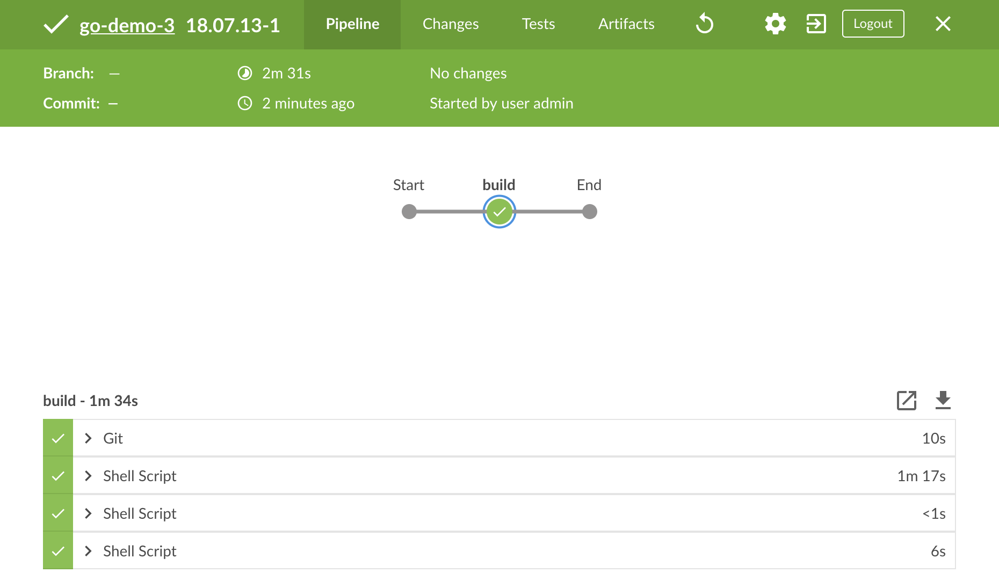
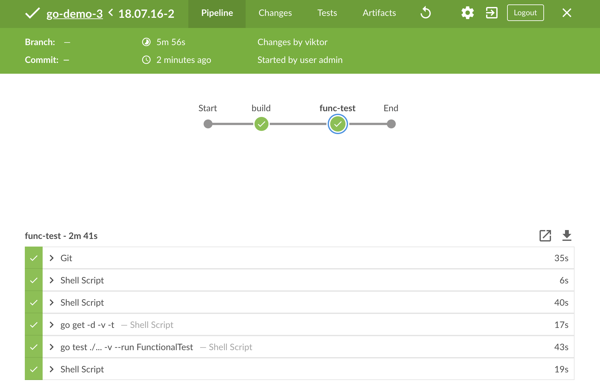
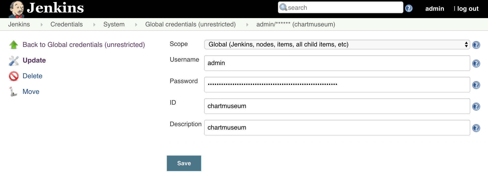
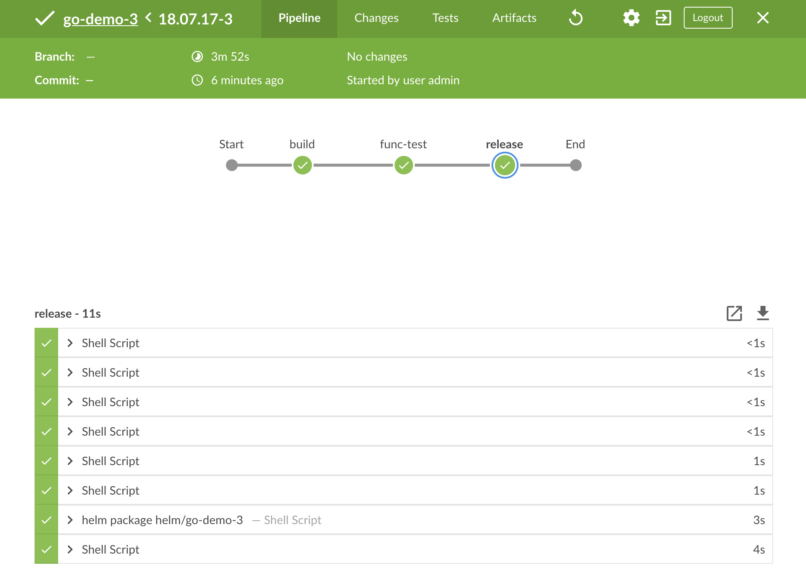
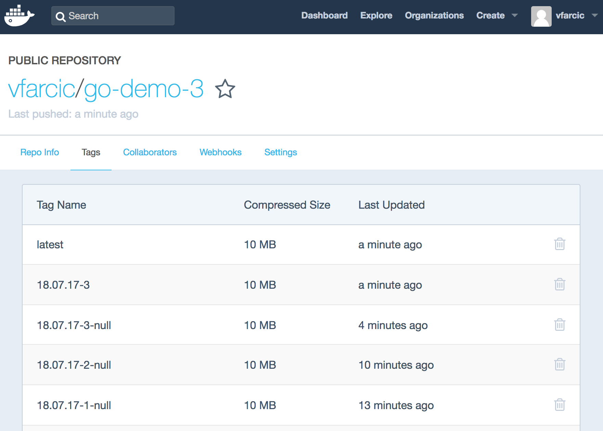
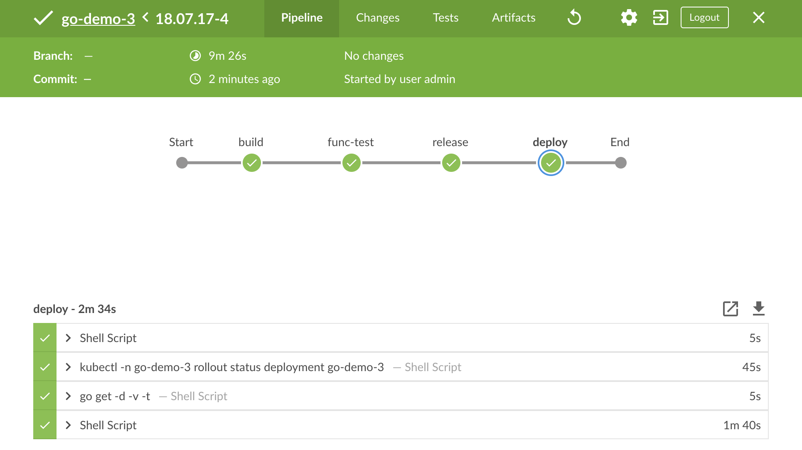
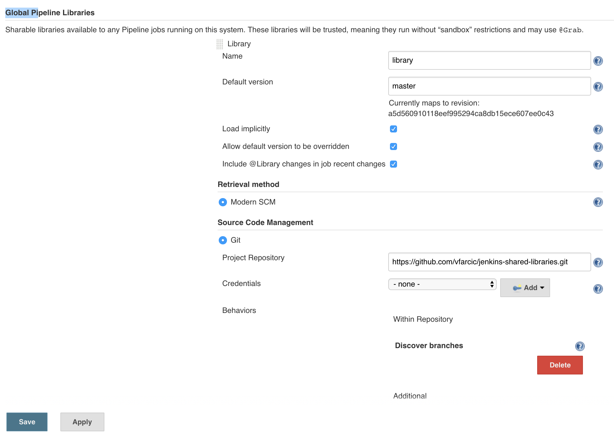
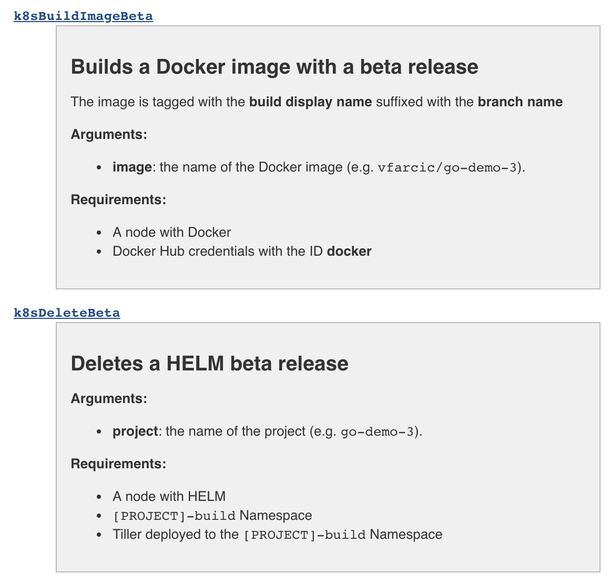
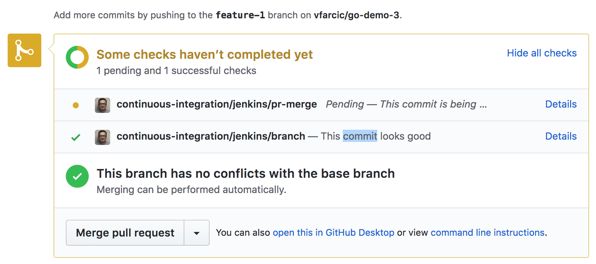
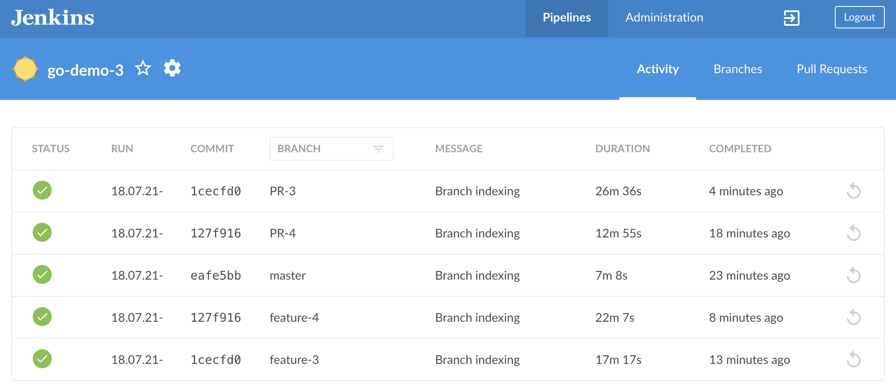

## TODO

- [X] Code
- [X] Code review Docker for Mac/Windows
- [X] Code review minikube
- [X] Code review kops
- [X] Code review minishift
- [ ] Code review GKE
- [X] Code review EKS
- [X] Write
- [ ] Text review
- [X] Diagrams
- [X] Gist
- [ ] Review the title
- [ ] Proofread
- [ ] Add to slides
- [ ] Publish on TechnologyConversations.com
- [ ] Add to Book.txt
- [ ] Publish on LeanPub.com

# Creating A Continuous Deployment Pipeline With Jenkins

T> Having A Continuous Deployment pipeline capable of a fully automated application life-cycle is a true sign of maturity of an organization.

This is it. The time has come to put all the knowledge we obtained into a good use. We are about to define a "real" continuous deployment pipeline in Jenkins. Our goal is to move every commit through a set of steps until the application is installed (upgraded) and tested in production. We will surely face some new challenges, but I am confident that we'll manage to overcome them. We already have all the ingredients, and the only thing left is to put them all together into a continuous deployment pipeline.

W> If you read the previous chapter before August 2018, you'll need to re-run the commands from it. While writing this chapter I realized that the previous one requires a few tweaks.

Before we move into a practical section, we might want to spend a few moments discussing our goals.

## Exploring The Continuous Deployment Process

Explaining continuous deployment (CDP) is easy. Implementing it is very hard, and the challenges are often hidden and unexpected. Depending on the maturity of your processes, architecture, and code, you might find out that the real problems do not lie in the code of a continuous deployment pipeline, but everywhere else. As a matter of fact, developing a pipeline is the easiest part. That being said, you might wonder whether you made a mistake by investing your time in reading this book since we are focused mostly on the pipeline, that will be executed inside a Kubernetes cluster.

We did not discuss the changes in your other processes. We did not explore what is a good architecture that will support CDP pipelines. Nor did we dive into how to code your application to be pipeline-friendly. I assumed that you already know all that. I hope that you do understand the basic concepts behind Agile and DevOps movements and that you already started dismantling the silos in your company. I assumed that you do know what it means for your software architecture to be cloud native and that you do implement some, if not all of the [12 factors](https://12factor.net/). I guessed that you are already practicing Test-Driven Development, Behavior-Driven Development, Acceptance-Driven Development, or any other technique that help you design your applications.

I might be wrong. To be more precise, I'm sure that I'm wrong. Most of you are not there yet. If you are one of those, please get informed. Read more books, do some courses, and convince your managers. It needs to be done. All those things, and many others, are what differentiates top performers (e.g., Google, Amazon, Netflix) and the rest of us. None of them is the same. Every high-performing company is different, and yet, they all share some things in common. They all need to ship features fast. They all need to have a high level of quality. And they all acknowledge that highly-available, fault-tolerant, and distributed systems require a very different approach that what most of the rest of us is used to.

If you got depressed by thinking that you are not yet ready and you are on the verge of quitting, my advice is to continue. Even though you might need to make a lot of changes before you are able to practice continuous deployment, knowing what the end result is will put you on the right path. We are about to design a fully operational continuous deployment pipeline. Once we're done, you'll know which other changes you'll need to make. You'll understand what the end-result is, and you will be able to go back to where you are and start moving into the right direction.

We already discussed what a continuous deployment pipeline looks like. In case you're forgetful (I know I am), here's the short version.

**Rule number one**: Every commit to the master branch is deployed to production if it passes all the steps of a fully automated pipeline. If you need to involve humans after the commit, it's not continuous deployment, nor it is continuous delivery. You're doing continuous integration, at best.

**Rule number two**: You commit directly to the master branch, or you're using short lived feature branches. The master branch is the only one that matters. Production releases are made from it. If we do use branches, they are taken from the master branch. It's the only one that truly matters. And when you do create a feature branch, you are merging back to master soon afterwards. You're not waiting for weeks to do so. If you are, you are not "continuously" validating whether your code integrates with the code of others. If that's the case, you're not even doing continuous integration. Unless, you have an elaborate branching strategy, in which case you are only making everyone's lives more complicated than they should be.

**Rule number three**: You trust your automation. When a test fails, there is a bug, and you fix it before anything else. You might belong to a big group of companies that have flaky tests that sometimes work, and sometimes fail for random reasons. The same can be said for builds, deployments, and just about any other step of the process. If you see yourself in that group, you'll have to fix your code first. Tests are code, just as builds, and deployments, and everything else is. When code produces inconsistent results, we fix it, we do not restart it. Unfortunately, I do see a lot of companies that rather re-run a build that failed because of flaky tests than fix the cause of that flakiness. Or, companies that solve half of production problems by restarting applications. Anyways, if you do not trust your automation, you cannot deploy to production automatically. You cannot even say that it is production ready.

Now that we established a very simple ground rules, we can move on and describe the pipeline we'll build. It'll be a simple one, and yet very close to what you might use in your "real" systems. We are going to build something. Since building without running unit and other types of static tests should be declared officially illegal and punishable with public shame, we'll include those in our **build stage**. Then we're going execute the steps of the **functional testing stage** that will execute all sort of tests that require a live application. Therefore, we'll need to deploy a test release during this stage. Once we're confident that our application behaves as expected, we're going to make a **production release**, followed with the **deploy stage** that will not only upgrade the production release but also run another round of tests to validate whether everything works as expected.


You might not agree with the names of the stages. That's OK. It does not matter much how you name things, nor how you group steps. What matters is that the pipeline has everything we need to feel confident that a release can be safely deployed to production. Steps matter, stages are only labels. However, we won't discuss the exact steps just yet. Instead, we'll break those stages apart and build one at the time. During the process, we'll discuss which steps are required.

It is almost certain that you'll need to add steps that I do not use. That's OK as well. It's all about principles and knowledge. Slight modifications should not be a problem.

Let's create a cluster and get going.

## Cluster

We'll start the practical section of the chapter by going to the fork of the *vfarcic/k8s-specs* repository and making sure that we have the latest revision.

I> All the commands from this chapter are available in the [07-jenkins-cdp.sh](https://gist.github.com/d0cbca319360eb000098383a09fd65f7) Gist.

```bash
cd k8s-specs

git pull
```

Next, we'll merge your *go-demo-3* fork with the upstream. If you forgot the commands, they are available in the [go-demo-3-merge.sh gist](https://gist.github.com/171172b69bb75903016f0676a8fe9388).

W> It is very important that you change all the references of `vfarcic/go-demo-3` to the address of your Docker Hub account. If, for example, your hub user is `jdoe`, you should change all `vfarcic/go-demo-3` references to `jdoe/go-demo-3`. Even though I invite you to change it in all the files, the mandatory changes are in files *helm/go-demo-3/Chart.yaml*, *helm/go-demo-3/templates/deployment.yaml*, and *k8s/build-config.yml*. Please make sure to apply the changes in all the branches and do not forget to push them to GitHub.

Now comes boring, but necessary part. We need to create a cluster, unless you kept the one from the previous chapter running.

The additional requirements, when compared with the Gists from the previous chapter, are **ChartMuseum** and environment variable `CM_ADDR` that contains the address through which we can access it.

If you're using a local cluster created through **Docker For Mac or Windows**, **minikube**, or **minishift**, we'll have to increase its size to **4GB RAM** and **4CPU**.

**Docker For Mac or Windows** users will need to get the "real" IP of the cluster, instead of `localhost` we used so far. You should be able to get it by executing `ifconfig` and picking the address dedicated to Docker.

For your convenience, the Gists and the specs are available below.

* [docker4mac-4gb.sh](https://gist.github.com/4b5487e707043c971989269883d20d28): **Docker for Mac** with 3 CPUs, 4 GB RAM, with **nginx Ingress**, with **tiller**, with `LB_IP` variable set to the IP of the cluster, and with **ChartMuseum** and its address set as `CM_ADDR` variable.
* [minikube-4gb.sh](https://gist.github.com/0a29803842b62c5c033e4c75cd37f3d4): **minikube** with 3 CPUs, 4 GB RAM, with `ingress`, `storage-provisioner`, and `default-storageclass` addons enabled, with **tiller**, with `LB_IP` variable set to the VM created by minikube, and with **ChartMuseum** and its address set as `CM_ADDR` variable.
* [kops-cm.sh](https://gist.github.com/603e2dca21b4475985a078b0f78db88c): **kops in AWS** with 3 t2.small masters and 2 t2.medium nodes spread in three availability zones, with **nginx Ingress**, with **tiller**, and with `LB_IP` variable set to the IP retrieved by pinging ELB's hostname, and with **ChartMuseum** and its address set as `CM_ADDR` variable.. The Gist assumes that the prerequisites are set through [Appendix B](#appendix-b).
* [minishift-4gb.sh](https://gist.github.com/b3d9c8da6e6dfd3b49d3d707595f6f99): **minishift** with 3 CPUs, 3 GB RAM, with version 1.16+, with **tiller**, and with `LB_IP` variable set to the VM created by minishift, and with **ChartMuseum** and its address set as `CM_ADDR` variable.
* [gke-cm.sh](https://gist.github.com/52b52500c469548e9d98c3f03529c609): **Google Kubernetes Engine (GKE)** with 3 n1-highcpu-2 (2 CPUs, 1.8 GB RAM) nodes (one in each zone), with **nginx Ingress** controller running on top of the "standard" one that comes with GKE, with **tiller**, with `LB_IP` variable set to the IP of the external load balancer created when installing nginx Ingress, and with **ChartMuseum** and its address set as `CM_ADDR` variable. We'll use nginx Ingress for compatibility with other platforms. Feel free to modify the YAML files and Helm Charts if you prefer NOT to install nginx Ingress.
* [eks-cm.sh](https://gist.github.com/fd9c0cdb3a104e7c745e1c91f7f75a2e): **Elastic Kubernetes Service (EKS)** with 2 t2.medium nodes, with **nginx Ingress** controller, with a **default StorageClass**, with **tiller**, with `LB_IP` variable set tot he IP retrieved by pinging ELB's hostname, and with **ChartMuseum** and its address set as `CM_ADDR` variable.

Now we are ready to install Jenkins.

## Installing Jenkins

We already automated Jenkins installation so that it provides all the features we need out-of-the-box. Therefore, the exercises that follow should be very straightforward.

If you are a **Docker For Mac or Windows**, **minikube**, or **minishift** user, we'll need to bring back up the VM we created in the previous chapter. Feel free to skip the commands that follow if you did not `suspend` the VM at the end of the previous chapter, or if you are hosting your cluster in AWS or GCP.

```bash
cd cd/docker-build

vagrant up

cd ../../

export DOCKER_VM=true
```

If you prefer running your cluster in **AWS** with *kops* or **EKS**, we'll need to retrieve the AMI ID we stored in `docker-ami.log` in the previous chapter.

```bash
AMI_ID=$(grep 'artifact,0,id' \
    cluster/docker-ami.log \
    | cut -d: -f2)

echo $AMI_ID
```

If **GKE** is your cluster of choice, we'll need to define variables `G_PROJECT` and `G_AUTH_FILE` which we'll pass to Helm Chart. We'll retrieve the project using `gcloud` CLI and the authentication file is a reference to the one we stored in `/cluster/jenkins/secrets` directory in the previous chapter.

```bash
export G_PROJECT=$(gcloud info \
    --format='value(config.project)')

echo $G_PROJECT

G_AUTH_FILE=$(ls cluster/jenkins/secrets/key*json | xargs -n 1 basename)

echo $G_AUTH_FILE
```

Next, we'll need to create the Namespaces we'll need. Let's take a look at the definition we'll use.

```bash
cat ../go-demo-3/k8s/ns.yml
```

You'll notice that the definition is a combination of a few we used in the previous chapters. It contains three Namespaces.

The `go-demo-3-build` Namespace is where we'll run Pods from which we'll execute most of the steps of our pipeline. Those Pods will contain tools like kubectl, Helm, and Go compiler. We'll use the same Namespace to deploy our releases under test. All in all, the `go-demo-3-build` Namespace is for short lived Pods. The tools will be removed when a build is finished, just as installations of releases under test will be deleted when tests are finished executing. This Namespace will be like a trash can that needs to be emptied whenever it gets filled or start smelling.

The second Namespace is `go-demo-3`. That is the Namespace dedicated to the applications developed by the `go-demo-3` team. We'll work only on their main product, named after the team, but we can imagine that they might be in charge of other application. Therefore, do not think of this Namespace as dedicated to a single application, but dedicated to a team. They have full right to operate that Namespace, just as the others defined in `ns.yml`. They own them and `go-demo-3` is dedicated for production releases.

While we already used the two Namespaces, the third one is a bit new. The `go-demo-3-jenkins` is dedicated to Jenkins and you might wonder why we do not use the `jenkins` Namespace as we did so far. The answer lies in my belief that it is a good idea to give each team their own Jenkins. That way, we do not need to create an elaborate system with user permissions, we do not need to think whether a plugin desired by one team will break a job owned by another, and we do not need to worry about performance issues when Jenkins is stressed by hundreds or thousands of parallel builds. So, we're moving into **every team gets Jenkins** logic. *"It's your Jenkins, do whatever you want to do with it."* Now, if your organization has only twenty developers, there's probably no need for splitting Jenkins into multiple instances. Fifty should be OK as well. But, when that number rises to hundreds, or even thousands, having multiple Jenkins masters has clear benefits. Traditionally, that would not be practical due to increased operational costs. But, now that we are deep into Kubernetes, and we already saw that a fully operational and configured Jenkins is only a few commands away, monster instances do not make much sense any more. If you are small and that logic does not apply, the logic is still the same no matter whether you have one or a hundred Jenkins masters. Only the Namespace will be different (e.g., `jenkins`).

The rest of the definition is the same as what we used before. We have ServiceAccounts and RoleBindings that allow containers to interact with KubeAPI. We have LimitRanges and ResourceQuotas that protect the cluster from rogue Pods. The LimitRange defined for the `go-demo-3-build` Namespace is specially important. We can assume that many of the Pods created through CDP pipeline will not have memory and CPU requests and limits. That can be disastrous since it might produce undesired effects in the cluster. If nothing else, that would limit Kubernetes' capacity to schedule Pods. So, defining LimitRange entries `default` and `defaultRequest`is a crucial step.

Please go through the whole `ns.yml` definition to refresh your memory of the things we explored in the previous chapters. We'll `apply` it once you're back.

```bash
kubectl apply \
    -f ../go-demo-3/k8s/ns.yml \
    --record
```

Now that we have the Namespaces, ServiceAccounts, RoleBindings, LimitRanges, and ResourceQuotas, we can proceed and create the secrets and credentails required by Jenkins.

```bash
kubectl -n go-demo-3-jenkins \
    create secret generic \
    jenkins-credentials \
    --from-file cluster/jenkins/credentials.xml

kubectl -n go-demo-3-jenkins \
    create secret generic \
    jenkins-secrets \
    --from-file cluster/jenkins/secrets
```

Only one more thing is missing before we install Jenkins. We need to install Tiller in the `go-demo-3-build` Namespace.

```bash
helm init --service-account build \
    --tiller-namespace go-demo-3-build
```

Now we are ready to install Jenkins.

W> ## A note to minishift users
W>
W> Helm will try to install Jenkins Chart with the process in a container running as user 0. By default, that is not allowed in OpenShift. We'll skip discussing the best approach to correct the issue, and I'll assume you already know how to set the permissions on the per-Pod basis. Instead, we'll do the most straightforward fix. Please execute the command that follows to allow the creation of restricted Pods to run as any user.
W>
W> `oc patch scc restricted -p '{"runAsUser":{"type": "RunAsAny"}}'`

```bash
JENKINS_ADDR="go-demo-3-jenkins.$LB_IP.nip.io"

helm install helm/jenkins \
    --name go-demo-3-jenkins \
    --namespace go-demo-3-jenkins \
    --set jenkins.Master.HostName=$JENKINS_ADDR \
    --set jenkins.Master.DockerVM=$DOCKER_VM \
    --set jenkins.Master.DockerAMI=$AMI_ID \
    --set jenkins.Master.GProject=$G_PROJECT \
    --set jenkins.Master.GAuthFile=$G_AUTH_FILE
```

W> ## A note to minishift users
W>
W> OpenShift requires Routes to make services accessible outside the cluster. To make things more complicated, they are not part of "standard Kubernetes" so we'll need to create one using `oc`. Please execute the command that follows.
W>
W> `oc -n go-demo-3-jenkins create route edge --service go-demo-3-jenkins --insecure-policy Allow --hostname $JENKINS_ADDR`
W>
W> That command created an `edge` Router tied to the `go-demo-3-jenkins` Service. Since we do not have SSL certificates for HTTPS communication, we also specified that it is OK to use insecure policy which will allow us to access Jenkins through plain HTTP. Finally, the last argument defined the address through which we'd like to access Jenkins UI.

We generated a `nip.io` address and installed Jenkins in the `go-demo-3-jenkins` Namespace. Remember, this Jenkins is dedicated to the *go-demo-3* team, and we might have many other instances serving the needs of other teams.

So far, everything we did is almost the same as what we did in the previous chapters. The only difference is that we changed the Namespace where we deployed Jenkins. Now, the only thing left, before we jump into experiences, is to wait until Jenkins is rolled out and confirm a few things.

```bash
kubectl -n go-demo-3-jenkins \
    rollout status deployment \
    go-demo-3-jenkins
```

The only thing we'll validate, right now, is whether the node that we'll use to build and push Docker images, is indeed connected to Jenkins.

W> ## A note to Windows users
W> 
W> Don't forget that `open` command might not work in Windows and that you might need to replace it with `echo`, copy the output, and paste it into a tab of your favorite browser.

```bash
open "http://$JENKINS_ADDR/computer"
```

Just as before, we'll need the auto-generated password.

```bash
JENKINS_PASS=$(kubectl -n go-demo-3-jenkins \
    get secret go-demo-3-jenkins \
    -o jsonpath="{.data.jenkins-admin-password}" \
    | base64 --decode; echo)

echo $JENKINS_PASS
```

Please copy the output of the `echo` command, go back to the browser, and use it to log in as the `admin` user.

Once inside the nodes screen, you'll see different results depending on how you set up the node for building and pushing Docker images.

If you are a **Docker For Mac or Windows**, a **minikube** user, or a **minishift** user, you'll see a node called `docker-build`. That confirms that we successfully connected Jenkins with the VM we created with Vagrant.

If you created a cluster in **AWS** using **kops**, you should see a drop-down list called **docker-agents**.

**GKE** users should see a drop-down list called **docker**.

W> ## A note to AWS EC2 users
W>
W> Unlike on-prem and GKE solutions, AWS requires a single manual step to complete the Jenkins setup.
W>
W> `cat cluster/devops24.pem`
W>
W> Copy the output.
W> 
W> `open "http://$JENKINS_ADDR/configure"`
W> Scroll to the *EC2 Key Pair's Private Key* field, and paste the key. Don't forget to click the *Apply* button to persist the change.

Now that we confirmed that a node (static or dynamic) is available for building and pushing Docker images, we can start designing our first stage of the continuous deployment pipeline.

## Build Stage

The primary function of the **build stage** of the continuous deployment pipeline is to build artifacts and a container image and push it to a registry from which it can be deployed and tested. Ofcourse, we cannot build anything without code, so we'll have to checkout the repository.

Since building things without running static analysis, unit tests, and other types of validation against static code should be illegal and punishable by public shame, we'll include those steps as well.

We won't deal with building artifacts nor we are going to run static testing and analysis from inside the pipeline. Instead, we'll continue relying on Docker's multi-stage builds for all those things, just as we did in the previous chapters.

We couldn't push to a registry without authentication, so we'll have to login to Docker Hub just before we push a new image.

There are a few things that we are NOT going to do, even though you probably should when applying the lessons learned your "real" projects. We do not have static analysis. We are NOT generating code coverage, we are NOT creating reports, and we are not sending the result to analysis tools like [SonarQube](https://www.sonarqube.org/). More importantly, we are NOT running any security scanning. There are many other things we could do in this chapter, but we are not. The reason is simple. There is an almost infinite number of tools and steps we could do. They depend on programming languages, internal processes, and what so not. The goal is to understand the logic, and adapt the examples to your own needs. With that in mind, we'll stick only to the bare minimum, not only in this stage, but also in those that follow. It is up to you to extend them to fit your specific needs.


Let's define the steps of the build stage as a Jenkins job.

```bash
open "http://$JENKINS_ADDR"
```

From the Jenkins home screen, please click the *New Item* link from the left-hand menu. The script for creating new jobs will appear.

Type *go-demo-3* as the *item name*, select *Pipeline* as the job type, and click the *OK* button.

I> As a rule of thumb, name your pipeline job after the application/repository you're building.

Once inside job's configuration screen, click the *Pipeline* tab in the top of the screen, and type the script that follows inside the *Script* field.

```groovy
import java.text.SimpleDateFormat

currentBuild.displayName = new SimpleDateFormat("yy.MM.dd").format(new Date()) + "-" + env.BUILD_NUMBER
env.REPO = "https://github.com/vfarcic/go-demo-3.git"
env.IMAGE = "vfarcic/go-demo-3"
env.TAG_BETA = "${currentBuild.displayName}-${env.BRANCH_NAME}"

node("docker") {
  stage("build") {
    git "${env.REPO}"
    sh """sudo docker image build \
      -t ${env.IMAGE}:${env.TAG_BETA} ."""
    withCredentials([usernamePassword(
      credentialsId: "docker",
      usernameVariable: "USER",
      passwordVariable: "PASS"
    )]) {
      sh """sudo docker login \
        -u $USER -p $PASS"""
    }
    sh """sudo docker image push \
      ${env.IMAGE}:${env.TAG_BETA}"""
  }
}
```

I> If you prefer to copy and paste, the job is available in the [cdp-jenkins-build.groovy Gist](https://gist.github.com/f990482b94e1c292d36da4526a4fa536).

Since we already went through all those steps manually, the same steps inside a Jenkins job should be self-explanatory. However, this might be your first contact with Jenkins pipeline, so we'll briefly explain what's going on.

First of all, the job is written using the **scripted pipeline**. The alternative would be to use **declarative pipeline** which forces a certain structure and naming convention. Personally, I prefer the latter. Declarative pipeline is easier to write and read, and it provides structure that makes implementation of some patterns much easier. However, it also comes with a few limitations. In our case, those limitations are enough to make declarative pipeline a bad choice. Namely, it does not allow us to mix different types of agents and it does not support all the options available in `podTemplate`. Since scripted pipeline has no limitations, we opted for that flavour, even though it makes the code often harder to maintain.

I> Visit [jenkins.io](https://jenkins.io/doc/book/pipeline/) if you're somewhat new to Jenkins pipeline and want to learn more.

What did we do so far?

We imported `SimpleDateFormat` library that allows us to retrieve dates. The reason for the `import` becomes obvious in the next line where we are changing the name of the build. By default, each build is named sequentially. The first build is named `1`, the second `2`, and so on. We changed the naming pattern so that it contains the date in `yy.MM.dd` format, followed with the sequential number.

Next, we're defining a few environment variables that contain the information we'll need in the pipeline steps. `REPO` hold the GitHub repository we're using, `IMAGE` is the name of the Docker image we'll build, and `TAG_BETA` has the format we'll use to tag the images. The latter is a combination of the build and the branch name.

Before we proceed, please change the `REPO` and the `IMAGE` variables to match the address of the repository you forked and the name of the image. In most cases, changing `vfarcic` to your GitHub and Docker Hub user should be enough.

The `node` block is where the "real" action is happening.

By setting the `node` to `docker`, we're telling Jenkins to use the agent with the matching name or label for all the steps within that block. The mechanism will differ from one case to another. It could match the VM we created with Vagrant, or it could be a dynamically created node in AWS or GCP.

Inside the `node` is the `stage` block. It is used to group steps and has not practical purpose. It is purely cosmetic and used to visualize the pipeline.

Inside the `stage` are the steps. The full list of available steps depends on the available plugins. The most commonly used ones are documented in the [Pipeline Steps Reference](https://jenkins.io/doc/pipeline/steps/). As you'll see, most of the pipeline we'll define will be based on the [sh: Shell Script](https://jenkins.io/doc/pipeline/steps/workflow-durable-task-step/#sh-shell-script) step. Since in the previous chapters we defined almost everything we need through commands executed in a terminal, using `sh` allows us to copy and paste those same commands. That way, we'll have very little dependency on Jenkins-specific way of working, and we'll have parity between command line used by developers on their laptops, and Jenkins pipelines.

Inside the `build` stage, we're using `git` to retrieve the repository. Further on, we're using `sh` to execute Docker commands to `build` an image, `login` to Docker Hub, and `push` the image.

The only "special" part of the pipeline is the `withCredentials` block. Since it would be very insecure to hard-code Docker Hub's username and password into our jobs, we're retrieving the information from Jenkins. The credentials with the ID `docker` will be converted into variables `USER` and `PASS`, which are used with the `docker login` command. Besides the obvious do-not-hard-code-secrets reason, the main motivation for using the `withCredentials` block lies in Jenkins' ability to obfuscate confidential information. As you'll see later on, the credentials will be removed from logs making them hidden to anyone poking around our builds.

I> I split some of the instructions into multiple-lines to avoid potential problems with the width limitations in books. You won't have those limitations in your pipelines and might want to refactor examples into single-line steps thus making them easier to read and maintain.

Now that we had a brief exploration about our first draft of the pipeline, the time has come to try it out.

Please click the *Save* button to persist the job.

We'll use the new UI to run the builds and visualize them.

Click the *Open Blue Ocean* link from the left-hand menu, followed with a click on the *Run* button.

Once the build starts, a new row will appear. Click it to enter into the details of the build, and observe the progress until it's finished and everything is green.



Let's check whether Jenkins executed the steps correctly. If it did, we should have a new image pushed to our Docker Hub account.

```bash
export DH_USER=[...]

open "https://hub.docker.com/r/$DH_USER/go-demo-3/tags/"
```

Please replace `[...]` with your Docker Hub username.

You should see a new image tagged as a combination of the date, build number (`1`), and the branch. Except, that the branch is set to `null`. That is the expected behavior since we did not tell Jenkins which branch to retrieve. As a result, the environment variable `BRANCH_NAME` is set to `null` and, with it, our image tag as well. We'll fix that problem later on. For now, we'll have to live with `null`.

Now that we finished defining and verifying the `build` stage, we can proceed to *functional testing*.

## Functional Stage

For the *functional testing* stage install the application under test. To avoid the potential error of installing the same release twice, we'll use `helm upgrade` instead of `install`.

As you already know, Helm only acknowledges that the resources are created, not that all the Pods are running. To mitigate that, we'll wait for `rollout status` before proceeding with tests.

Once the application is rolled out, we'll run functional tests. Please note that in this case we will run only one set of tests. In the "real" world scenario, there would probably be others. Among others, we might need to run performance tests or we might run tests in different browsers.

I> When running multiple sets of different tests, consider using `parallel` construct. More information can be found in the [Parallelism and Distributed Builds with Jenkins](https://www.cloudbees.com/blog/parallelism-and-distributed-builds-jenkins) article.

Finally, we'll have to `delete` the Chart we installed. After all, there's no point wasting resources by running an application longer than we need. In our scenario, as soon as the execution of the tests is finished, we'll remove the application under test. However, there is a twist. Jenkins, like most other CI/CD tools, will stop the execution of the first error. So, we'll have to envelop all the steps in this stage inside a big `try`/`catch`/`finally` statement.


Before we move on and write the new version of the pipeline, we'll need an address that we'll use as Ingress host of our application under tests.

```bash
export ADDR=$LB_IP.nip.io

echo $ADDR
```

Please copy the output of the `echo`. We'll need it soon.

Next, we'll open the job's configuration screen.

```bash
open "http://$JENKINS_ADDR/job/go-demo-3/configure"
```

If you are **NOT using minishift**, please replace the existing code with the content of the [cdp-jenkins-func.groovy Gist](https://gist.github.com/4edc53d5dd11814651485c9ff3672fb7).

If you are using **minishift**, replace the existing code with the content of the [cdp-jenkins-func-oc.groovy Gist](https://gist.github.com/1661c2527eda2bfe1e35c77f448f7c34).

We'll explore only the differences between the two revisions of the pipeline. They are as follows.

```groovy
...
env.ADDRESS = "go-demo-3-${env.BUILD_NUMBER}-${env.BRANCH_NAME}.acme.com"
env.CHART_NAME = "go-demo-3-${env.BUILD_NUMBER}-${env.BRANCH_NAME}"
def label = "jenkins-slave-${UUID.randomUUID().toString()}"

podTemplate(
  label: label,
  namespace: "go-demo-3-build",
  serviceAccount: "build",
  yaml: """
apiVersion: v1
kind: Pod
spec:
  containers:
  - name: helm
    image: vfarcic/helm:2.9.1
    command: ["cat"]
    tty: true
  - name: kubectl
    image: vfarcic/kubectl
    command: ["cat"]
    tty: true
  - name: golang
    image: golang:1.9
    command: ["cat"]
    tty: true
"""
) {
  node(label) {
    node("docker") {
      stage("build") {
        ...
      }
    }
    stage("func-test") {
      try {
        container("helm") {
          git "${env.REPO}"
          sh """helm upgrade \
            ${env.CHART_NAME} \
            helm/go-demo-3 -i \
            --tiller-namespace go-demo-3-build \
            --set image.tag=${env.TAG_BETA} \
            --set ingress.host=${env.ADDRESS} \
            --set replicaCount=2 \
            --set dbReplicaCount=1"""
        }
        container("kubectl") {
          sh """kubectl -n go-demo-3-build \
            rollout status deployment \
            ${env.CHART_NAME}"""
        }
        container("golang") { // Uses env ADDRESS
          sh "go get -d -v -t"
          sh """go test ./... -v \
            --run FunctionalTest"""
        }
      } catch(e) {
          error "Failed functional tests"
      } finally {
        container("helm") {
          sh """helm delete \
            ${env.CHART_NAME} \
            --tiller-namespace go-demo-3-build \
            --purge"""
        }
      }
    }
  }
}
```

We added a few new environment variables that will simplify the steps that follow. The `ADDRESS` will be used to provide a unique host for the Ingress of the application under test. The uniqueness is accomplished by combining the name of the project (`go-demo-3`), the build number, and the name of the branch. We used a similar pattern to generate the name of the Chart that will be installed. All in all, both the address and the Chart are unique for each release of each application, no matter the branch.

We also defined `label` with a unique value by adding a suffix based on random UUID. Further down, when we define `podTemplate`, we'll use the `label` to ensure that each build uses its own Pod.

The `podTemplate` itself is very similar to those we used in quite a few occasions. It'll be created in the `go-demo-3-build` Namespace dedicated to building and testing applications owned by the `go-demo-3` team. The `yaml` contains definitions of the Pod that contains containers with `helm`, `kubectl`, and `golang`. Those are the tools we'll need to execute the steps of the *functional testing* stage.

W> ## A note to minishift users
W>
W> Your version of the pipeline contains a few things that other Kubernetes users do not need. You'll notice that there is an additional container named `oc` in the `podTemplate`. Further down, in the `func-test` stage, we're using that container to create an Edge Route that provides the same functionality as Ingress controller used by other Kubernetes flavours.

The curious part is the way nodes (agents) are organized in this iteration of the pipeline. Everything is inside one big block of `node(label)`. As a result, all the steps will be executed in one of the containers of the `podTemplate`. However, since we do not want every part of the build to run inside the cluster, inside the node based on the `podTemplate`, is the same `node("docker")` block we are using for building and pushing Docker images.

The reason for using nested `node` blocks lies in Jenkins' ability to delete unused Pods. The moment `podTemplate` node block is closed, Jenkins would remove the associated Pod. To preserve the state we'll generate inside that Pod, we're making sure that it is alive through the whole build by enveloping all the steps (even thouse running somewhere else) inside one huge `node(label)` block.

Inside the `func-test` stage is a `try` block that contains all the steps (except cleanup). Each of the steps is executed inside a different container. We enter `helm` to clone the code and execute `helm upgrade` that installs the release under test. Next, we jump into the `kubectl` container to wait for the `rollout status` that confirms that the application is rolled out completely. Finally, we switch into the `golang` container to run our tests since they require Go.

Please note that we are installing only two replicas of the application under test and one replica of the DB. That's more than enough to validate whether it works as expected from the functional point of view. There's no need to have the same number of replicas as what we'll run in the production Namespace.

You might be wondering why we checked out the code for the second time. The reason is simple. In the first stage, we cloned the code inside the VM dedicated (or dynamically created) for building Docker images. The Pod created through `podTemplate` does not have that code so we had to clone it again. We did that inside the `helm` container since that's the first one we're using.

Now, you might be wondering why we didn't clone the code to all the containers of the Pod. After all, almost everything we do needs the code of the application. While that might not be true for the `kubectl` container (it only waits for the installation to roll out), it is certainly true for `golang`. The answer lies in Jenkins `podTemplate` hidden features. Among others, it creates a volume and mounts it to all the containers of the Pod as the directory `/workspace`. That directory happens to be the default directory in which it operates when inside those containers. So, the state created inside one container, exists in all others, as long as we do not switch to a different folder.

The `try` block is followed with `catch` that is executed only if one of the steps throws an error. The only purpose for having the `catch` block is to re-throw the error, if there is any.

The sole purpose for using `try`/`catch` blocks is in `finally`. In it, we are deleting the application we deployed. Since it executes no matter whether there was an error, we have reasonable guarantee that we'll have a clean system no matter the outcome of the pipeline.

To summarize, `try` block ensures that errors are caught. Without it, pipeline would stop executing on the first sign of error, and the release under test would never be removed. The `catch` block re-throws the error, and the `finally` block deletes the release no matter what happens.


Before we test the new iteration of the pipeline, please replace the values of the environment variables to fit your situation. As a minimum, you'll need to replace `vfarcic` with your GitHub user and Docker Hub user as before, and `acme.com` with the value stored in the environment variable `ADDR` in your terminal session.

Once finished with the changes, please click the *Save* button. Use the *Open Blue Ocean* link from the left-hand menu to switch to the new UI, click the *Run* button, followed by a click on the row of the new build.

I> If you configured Jenkins to spin up new Docker nodes in AWS or GCP, it'll take around a minute until the VM is created and operational.

Please wait until the build reaches the `func-test` stage and finishes executing the second step that executes `helm upgrade`. Once the release under test is installed, switch to the terminal session to confirm that the new release is indeed installed.

```bash
helm ls \
    --tiller-namespace go-demo-3-build
```

The output is as follows.

```
NAME             REVISION UPDATED        STATUS   CHART           NAMESPACE
go-demo-3-2-null 1        Tue Jul 17 ... DEPLOYED go-demo-3-0.0.1 go-demo-3-build
```

As we can see, Jenkins did initiate the process that resulted in the new Helm Chart being installed in the `go-demo-3-build` Namespace.

To be on the safe side, we'll confirm that the Pods are running as well.

```bash
kubectl -n go-demo-3-build \
    get pods
```

The output is as follows

```
NAME                  READY STATUS  RESTARTS AGE
go-demo-3-2-null-...  1/1   Running 4        2m
go-demo-3-2-null-...  1/1   Running 4        2m
go-demo-3-2-null-db-0 2/2   Running 0        2m
jenkins-slave-...     4/4   Running 0        6m
tiller-deploy-...     1/1   Running 0        14m
```

As we can see, the two Pods of the API and one of the DB are running together with `jenkins-slave` Pod created by Jenkins as well as `tiller`.

Please return to Jenkins UI and wait until the build is finished.



If everything works as we designed, the release under test should have been removed once the testing was finished. Let's confirm that.

```bash
helm ls \
    --tiller-namespace go-demo-3-build
```

This time, the output is empty, clearly indicating that the Chart was removed.

Let's check the Pods one more time.

```bash
kubectl -n go-demo-3-build \
    get pods
```

The output is as follows

```
NAME              READY STATUS  RESTARTS AGE
tiller-deploy-... 1/1   Running 0        31m
```

Both the Pods of the release under tests as well as Jenkins agent are gone, leaving us only with Tiller. We defined the steps that remove the former, and the latter is done by Jenkins automatically.

Let's move onto the *release stage*.

## Release Stage

In the *release stage* we'll push correctly tagged Docker images to the registry as well as the project's Helm Chart.

In the *build stage*, we're tagging images by including the branch name. That way, we made it clear that an image is not yet fully tested. Now that we executed all sorts of tests that validated that the release is indeed working as expected, we can re-tag the images so that they do not include branch names. That way, everyone in our organization can easily distinguish yet-to-be-tested from production ready releases.

Since we cannot know (easily) whether the Chart included in the project's repository changed or not, during this stage we'll push it to ChartMuseum. If the Chart's release number is unchanged, the push will simply overwrite the existing Chart. Otherwise, we'll have a new Chart release as well.

The major difference between Docker images and Charts is in the way how we're generating releases. Each build will result in a new Docker image tag. Each commit to the repository probably results in changes to the code, so building new images on each build makes perfect sense. Helm Charts, on the other hand, do not change that often.

One thing worth noting is that we will not use ChartMuseum for deploying applications through Jenkins' pipelines. We already have the Chart inside the repository that we're cloning. We'll store them in ChartMuseum only for those that want to deploy Charts manually without Jenkins. A typical user of the Charts in ChartMuseum are developers that want to spin up applications inside local clusters that are outside Jenkins' control.

Just as with the previous stages, we are focused only on the essential steps which you should extend to suit your specific needs. An example that might serve as inspiration for the missing steps are those that would create a release in GitHub, GitLab, or Bitbucket. Also, it might be useful to build Docker images with manifest files in case you're planning on deploying them to different operating system families (e.g., ARM, Windows, etc). We'll skip those, as quite a few others, in an attempt to keep the pipeline simple, and yet fully functional. Another thing that would be useful to add is an automated way to create and publish release notes.


Before we move on, we'll need to create a new set of credentials in Jenkins to store ChartMuseum's username and password.

```bash
open "http://$JENKINS_ADDR/credentials/store/system/domain/_/newCredentials"
```

Please type *admin* and both the *Username* and the *Password*. The *ID* and the *Description* should be set to *chartmuseum*. Once finished, please click the *OK* button to persist the credentials.



Next, we'll retrieve the updated `credentials.xml` file and store it in the `cluster/jenkins` directory. That way, if we want to create a new Jenkins instance, the new credentials will be available just as those that we created in the previous chapter.

```bash
JENKINS_POD=$(kubectl \
    -n go-demo-3-jenkins \
    get pods \
    -l component=go-demo-3-jenkins-jenkins-master \
    -o jsonpath='{.items[0].metadata.name}')

echo $JENKINS_POD

kubectl -n go-demo-3-jenkins cp \
    $JENKINS_POD:var/jenkins_home/credentials.xml \
    cluster/jenkins
```

We retrieved the name of the Pod hosting Jenkins, and used it to copy the `credentials.xml` file.

Now we can update the job.

```bash
open "http://$JENKINS_ADDR/job/go-demo-3/configure"
```

If you are **NOT using minishift**, please replace the existing code with the content of the [cdp-jenkins-release.groovy Gist](https://gist.github.com/2e89eec6ca991ab676d740733c409d35).

If you are a **minishift** user, replace the existing code with the content of the [cdp-jenkins-release-oc.groovy Gist](https://gist.github.com/33650e28417ceb1f2f349ec71b8a934d).

Just as before, we'll explore only the differences between the two pipeline iterations.

```groovy
...
env.CM_ADDR = "cm.acme.com"
env.TAG = "${currentBuild.displayName}"
env.TAG_BETA = "${env.TAG}-${env.BRANCH_NAME}"
env.CHART_VER = "0.0.1"
...
    stage("release") {
      node("docker") {
        sh """sudo docker pull \
          ${env.IMAGE}:${env.TAG_BETA}"""
        sh """sudo docker image tag \
          ${env.IMAGE}:${env.TAG_BETA} \
          ${env.IMAGE}:${env.TAG}"""
        sh """sudo docker image tag \
          ${env.IMAGE}:${env.TAG_BETA} \
          ${env.IMAGE}:latest"""
        withCredentials([usernamePassword(
          credentialsId: "docker",
          usernameVariable: "USER",
          passwordVariable: "PASS"
        )]) {
          sh """sudo docker login \
            -u $USER -p $PASS"""
        }
        sh """sudo docker image push \
          ${env.IMAGE}:${env.TAG}"""
        sh """sudo docker image push \
          ${env.IMAGE}:latest"""
      }
      container("helm") {
        sh "helm package helm/go-demo-3"
        withCredentials([usernamePassword(
          credentialsId: "chartmuseum",
          usernameVariable: "USER",
          passwordVariable: "PASS"
        )]) {
          sh """curl -u $USER:$PASS \
            --data-binary "@go-demo-3-${CHART_VER}.tgz" \
            http://${env.CM_ADDR}/api/charts"""
        }
      }
    }
  }
}
```

We declared a few new environment variables that should be self-explanatory.

We start the steps of the *release stage* inside the `docker` node. Since the nodes in AWS and GCP are dynamic, there is no guarantee that it'll be the same agent as used in the *build stage*. We set retention to ten minutes which is more than enough time between the two requests for the node. However, some other build might have requested the node in between and, in that case, a new one would be created. Therefore, we cannot be certain that it's the same physical VM. To mitigate that, the first step is pulling the image we build previously, thus ensuring that the cache is used in subsequent steps.

Next, we're creating two tags. One is based on the release (build display name), and the other on `latest`. We'll use the more specific tag, while leaving the option to others to use the `latest`.

Further on, we're logging to Docker Hub and pushing the new tags.

Finally, we switched to the `helm` container of the `podTemplate`. Once inside, we packaged the Chart and pushed it to ChartMuseum with `curl`. The important element is the environment variable `CHART_VER`. It contains the version of the Chart that **must** correspond to the version in `Chart.yaml` file. We're using it to know which file to push. Truth be told, we could have parsed the output of the `helm package` command. However, since Charts do not change that often, it might be less work to update the version in two places, than to add the parsing to the code. It is true that having the same thing in two places increases the chances of an error by omission. Later on, we'll switch to Shared Libraries and the code will be moved to a different repository. I invite you to a challenge to to make a PR that will improve that.

Before we move on, you'll need to make the necessary changes to the values of the environment variables. Most likely, all you need to do is change `vfarcic` to your Docker Hub and GitHub users as well as `acme.com` in addresses to the value of the environment variable `ADDR` available in your terminal session.

Don't forget to click the *Save* button to persist the change. After that, follow the same processes as before to run a new build by clicking the *Open Blue Ocean* link from the left-hand menu, followed with the *Run* button. Click on the row of the new build and wait until it's finished.



If everything went as expected, we should have a couple of new images pushed to Docker Hub. Let's confirm that.

```bash
open "https://hub.docker.com/r/$DH_USER/go-demo-3/tags/"
```

This time, besides the tags based branches (for now with `null`), we got two new ones that represent the production-ready release. 



Similarly, we should also have the Chart stored in ChartMuseum.

```bash
curl -u admin:admin \
    "http://$CM_ADDR/index.yaml"
```


The output is as follows.

```yaml
apiVersion: v1
entries:
  go-demo-3:
  - apiVersion: v1
    created: "2018-07-17T21:53:30.760065856Z"
    description: A silly demo based on API written in Go and MongoDB
    digest: d73134fc9ff594e9923265476bac801b1bd38d40548799afd66328158f0617d8
    home: http://www.devopstoolkitseries.com/
    keywords:
    - api
    - backend
    - go
    - database
    - mongodb
    maintainers:
    - email: viktor@farcic.com
      name: Viktor Farcic
    name: go-demo-3
    sources:
    - https://github.com/vfarcic/go-demo-3
    urls:
    - charts/go-demo-3-0.0.1.tgz
    version: 0.0.1
generated: "2018-07-17T21:56:28Z"
```

Now that we confirmed that both the images and Charts are being pushed to their registries, we can move onto the last stage of the pipeline.

## Deploy Stage

We're almost finished with the pipeline, at least in its current form.

The purpose of the *deploy stage* is to install the new release to production and do the last round of tests that only verifies whether the new release integrates with the rest of the system. Those tests are often very simple since they do not validate the release on functional level. We already know that the features work as expected and immutability of the containers guarantee that what was deployed as a test release is the same as what will be upgraded to production.

If something goes wrong, we need to be able to act swiftly and roll back the release. I'll skip the discussion about the inability to roll back when changing database schemas and a few other cases. Instead, for the sake of simplicity, I'll assume that we'll roll back always if any of the steps in this stage fail.


Let's go back to *go-demo-3* configuration screen and update the pipeline.

```bash
open "http://$JENKINS_ADDR/job/go-demo-3/configure"
```

If you are **NOT using minishift**, please replace the existing code with the content of the [cdp-jenkins-deploy.groovy Gist](https://gist.github.com/3657e7262b65749f29ddd618cf511d72).

If you are using **minishift**, please replace the existing code with the content of the [cdp-jenkins-deploy-oc.groovy Gist](https://gist.github.com/1a490bff0c90b021e3390a66dd75284e).

The additions to the pipeline are as follows.

```groovy
...
env.PROD_ADDRESS = "go-demo-3.acme.com"
...
    stage("deploy") {
      try {
        container("helm") {
          sh """helm upgrade \
            go-demo-3 \
            helm/go-demo-3 -i \
            --tiller-namespace go-demo-3-build \
            --namespace go-demo-3 \
            --set image.tag=${env.TAG} \
            --set ingress.host=${env.PROD_ADDRESS}
            --reuse-values"""
        }
        container("kubectl") {
          sh """kubectl -n go-demo-3 \
            rollout status deployment \
            go-demo-3"""
        }
        container("golang") {
          sh "go get -d -v -t"
          sh """DURATION=1 ADDRESS=${env.PROD_ADDRESS} \
            go test ./... -v \
            --run ProductionTest"""
        }
      } catch(e) {
        container("helm") {
          sh """helm rollback \
            go-demo-3 0 \
            --tiller-namespace go-demo-3-build"""
          error "Failed production tests"
        }
      }
    }
  }
}
```

We added yet another environment variable (`PROD_ADDRESS`) that holds the address through which our production releases are accessible. We'll use it both for defining Ingress host as well as for the final round of testing.

Inside the stage, we're upgrading the production release with the `helm upgrade` command. The key value is `image.tag` that specifies the image tag that should be used.

W> ## A note to minishift users
W>
W> Just as in the `func-test` stage, we had to add yet another Edge Route to the `deploy` stage so that we can gain the same functionality as Ingress controller used by other Kubernetes flavours.

Before we proceed with testing, we're waiting until the update rolls out. If there is something obviously wrong with the upgrade (e.g., tag does not exist or there are no available resources), the `rollout status` command will fail.

Finally, we're executing the last round of tests. In our case, the tests will run in a loop for one minute.

All the steps in this stage are inside a big `try` block, so failure of any of the steps will be handled with the `catch` block. Inside it is a simple `helm rollback` command set to revision `0` which will result in rollback to the previous release.

Just as in the other stages, we're jumping from one container to another depending on the tool we need at any given moment.

Before we move on, please make the necessary changes to the values of the environment variables. Just as before, you likely need to change `vfarcic` to your Docker Hub and GitHub users as well as `acme.com` to the value of the environment variable `ADDR` available in your terminal session.

Please click the *Save* button once you're finish with the changes that will make the pipeline work in your environment. The rest is the same as those we performed countless times before. Click the *Open Blue Ocean* link from the left-hand menu, press the *Run* button, and click on the row of the new build. Wait until the build is finished.



Since this is the first time we're running the *deploy stage*, we'll double-check that the production release was indeed deployed correctly.

```bash
helm ls \
    --tiller-namespace go-demo-3-build
```

The output is as follows.

```
NAME      REVISION UPDATED        STATUS   CHART           NAMESPACE
go-demo-3 1        Wed Jul 18 ... DEPLOYED go-demo-3-0.0.1 go-demo-3
```

This is the first time we upgraded `go-demo-3` production release, so the revision is `1`.

How about Pods? Are they running as expected inside the `go-demo-3` Namespace dedicated to production releases of that team?

```bash
kubectl -n go-demo-3 get pods
```

The output is as follows.

```
NAME           READY STATUS  RESTARTS AGE
go-demo-3-...  1/1   Running 2        6m
go-demo-3-...  1/1   Running 2        6m
go-demo-3-...  1/1   Running 2        6m
go-demo-3-db-0 2/2   Running 0        6m
go-demo-3-db-1 2/2   Running 0        6m
go-demo-3-db-2 2/2   Running 0        5m
```

All the Pods are indeed running. We have three replicas of the API and three replicas of the database.

Finally, we'll send a request to the newly deployed release and confirm that we are getting a response.

```bash
curl "http://go-demo-3.$ADDR/demo/hello"
```

The output should be the familiar `hello, world!` message.

## What Are We Missing In Our Pipeline?

We already discussed some the steps that we might be missing. We might want to store test results in SonarQube. We might want to generate release notes and store them in GitHub. We might need to run performance tests. There are many things we could have done, but we didn't. Those additional steps will differ greatly from one organization to another. Even with a company, one team might have different steps than the other. Guessing which ones you might need would be an exercise in futility. I would almost certainly guessed wrong.

One step that almost everyone needs is notification of a failure. We need to be notified when something goes wrong and fix the issue. However, there are too many destinations where those notifications might need to be sent. Some prefer email, while others opt for chats. In case latter case, it could be Slack, HipChat, Skype, and many others. We might even choose to create a JIRA issue when one of the steps in the pipeline fail. Since even a simple notification can be performed in so many different ways, I'll skip adding them to the pipeline. I'm sure that you won't have a problem looking for a plugin you need (e.g. [Slack Notification](https://plugins.jenkins.io/slack)) and injecting notifications into the stages. We already have a few `try` statements and notifications can be injected into `catch` blocks. You might need to add a few additional `try`/`catch` blocks. I'm confident you'll know how to do that, so we'll move onto the next subject.

## Shared Libraries

The pipeline we designed works as we expect. However, we'll have a problem on our hands if other teams start copying and pasting the same script for their pipelines. We'd end up with a lot of duplicated code that will be hard to maintain.

Sure, not all pipelines will be the same. Each is likely to be different, so copy and paste practice will only be the first action. People will find the pipeline that is closest to what they're trying to accomplish, replica it, and then change it to suit their needs. Some steps are likely going to be the same for many (if not all) projects, while others will be specific to only one, or only a few pipelines.

The more pipelines we design, the more patterns will emerge. Everyone might want to build Docker images with the same command, but with different arguments. Others might use Helm to install their applications, but do not yet have any tests to run (be nice, do not judge them). Someone might choose to use [Rust](https://www.rust-lang.org/) for the new project and the commands will be unique only for a single pipeline.

What we need to do is look for patterns. When we notice that a step, or a set of steps, are the same across multiple pipelines, we should be able to convert that snippet into a library, just as what we're likely doing when repetition happens in code of our applications. Those libraries need to be accessible to all those who need it and also need to be flexible so that their behavior can be adjusted to slightly different needs. We should be able to provide arguments to those libraries.

What we truly need is the ability to create new pipeline steps that are tailored to our needs. Just as there is a general step `git`, we might want to something like `k8sUpgrade` that will perform Helm's `upgrade` command. We can accomplish that, and quite a few other things through Jenkins` *Global Pipeline Libraries*.

We'll explore libraries through practical examples, so the firsts step is to configure them.

```bash
open "http://$JENKINS_ADDR/configure"
```

Please search for *Global Pipeline Libraries* section of the configuration, and click the *Add* button.

Type *my-library* as the *Name* (it can be anything else) and *master* as the *Default version*. In our context, the latter defines the branch from which we'll load the libraries.

Next, we'll click the *Load implicitly* checkbox. As a result, the libraries will be available automatically to all the pipeline jobs. Otherwise, our jobs would need to have `@Library('my-library')` instruction.

Select *Modern SCM* from the *Retrieval method* section and select *Git* from *Source Code Management*.

We're almost done. The only thing left is to specify the repository from which Jenkins will load the libraries. I already created a repo with the libraries we'll use (and a few others we won't need). However, GitHub API has a limit to the number of requests that can be made per hour so if you (and everyone else) uses my repo, you might see some undesirable effects. My recommendation is to go to [vfarcic/jenkins-shared-libraries.git](https://github.com/vfarcic/jenkins-shared-libraries.git) and fork it. Once the fork is created, copy the address from the *Clone and download* drop-down list, return to Jenkins UI, and paste it into the *Project Repository* field.

We're finished with the configuration. Don't forget to click the *Save* button to persist the changes.



Let's take a closer look at the repository we'll use as the *global pipeline library*.

```bash
export GH_USER=[...]

open "https://github.com/$GH_USER/jenkins-shared-libraries.git"
```

Please replace `[...]` with your GitHub user before opening the forked repository in a browser.

You'll see that the repository has only `.gitignore` and the `vars` dir in the root. Jenkins' *Global Pipeline Libraries* use a naming convention to discover the libraries we'd like to use. The can be either in `src` or `vars`. The formed is rarely used these days, so we're having only the latter.

If you enter into the `vars` directory, you'll see that there are quite a few `*.groovy` files mixed with a few `*.txt` files. We'll postpone exploration of the latter group of files and concentrate on the Groovy files. We'll use those with names that start with `k8s`.

Please find the *k8sBuildImageBeta.groovy* file and open it. You'll notice that the code inside it is almost the same as the one we used in the *build stage*. There are a few difference, so let's go through the structure of the shared functions. It'll be a very short explanation.

THe name of the file (e.g., *k8sBuildImageBeta.groovy*) becomes a pipeline step (e.g., `k8sBuildImageBeta`). If we use a step converted from a file, Jenkins will invoke the function `call`. So, every file needs to have such function, even though additional internal functions can be defined as well. The `call` function can have any number of arguments. If we continue using the same example, you'll see that `call` inside *k8sBuildImageBeta.groovy* has a single argument `image`. It could have been defined with the explicit type like `String image`, but in most cases there's no need for it. Groovy will figure out the type.

Inside the `call` function are almost the same steps as those we used inside the *build stage*. I copied and pasted them. The only modification to the steps was to replace Docker image references with the `image` argument. Since we already know that Groovy extrapolates arguments in a string when they are prefixed with the dollar sign (`$`) and optional curly braces (`{` and `}`), our `image` argument became `${image}`.

Using arguments in the functions is important. They make them reusable across different pipelines. If *k8sBuildImageBeta.groovy* would have `go-demo-3` image hard-coded, that would not be useful to anyone except those trying to build *go-demo* application. The alternative would be to use environment variables and ditch arguments altogether. I've seen that pattern in many organization and I think it's horrible. It does not make it clear what is needed to use the function/step. There are a few exceptions though. My usage of environment variables is limited to those available to all builds. For example, `${env.BRANCH_NAME}` is always available. One does not need to create it when writing a pipeline script. For everything else, please use arguments. That will be a clear indication to the users of those functions what is required.

I won't go through all the Groovy files that start with `k8s` since they follow the same logic as *k8sBuildImageBeta.groovy*. They are copies of what we used in our pipeline, with addition with a few arguments. So, instead of me going over all the functions, please take some time to explore them yourself. Return here once you're done and we'll put those functions to good use and clarify a few other important aspects of Jenkins' shared libraries.

Before we continue, you might want to persist the changes we did to Jenkins configuration. All the information about the shared libraries is available in *org.jenkinsci.plugins.workflow.libs.GlobalLibraries.xml* file. We just need to copy it.

```bash
kubectl -n go-demo-3-jenkins cp \
    $JENKINS_POD:var/jenkins_home/org.jenkinsci.plugins.workflow.libs.GlobalLibraries.xml \
    cluster/jenkins/secrets
```

I already modified the template of the Jenkins Helm Chart to include the file we just copied. All you have to do the next time you install Jenkins with Helm is to add `jenkins.Master.GlobalLibraries` value. The full argument should be as follows.

```
--set jenkins.Master.GlobalLibraries=true
```

Now we can refactor our pipeline to use shared libraries and see whether that simplifies things.

```bash
open "http://$JENKINS_ADDR/job/go-demo-3/configure"
```

If you are **NOT using minishift**, please replace the existing code with the content of the [cdp-jenkins-lib.groovy Gist](https://gist.github.com/e9821d0430ca909d68eecc7ccbb1825d).

If you are using **minishift**, please replace the existing code with the content of the [cdp-jenkins-lib-oc.groovy Gist](https://gist.github.com/ff6e0b04f165d2b26d326c116a7cc14f).

We'll explore only the differences when compared with the previous iteration of the pipeline. They are as follows.

```groovy
...
env.PROJECT = "go-demo-3"
env.REPO = "https://github.com/vfarcic/go-demo-3.git"
env.IMAGE = "vfarcic/go-demo-3"
env.DOMAIN = "acme.com"
env.ADDRESS = "go-demo-3.acme.com"
env.CM_ADDR = "cm.acme.com"
env.CHART_VER = "0.0.1"
...
  node("kubernetes") {
    node("docker") {
      stage("build") {
        git "${env.REPO}"
        k8sBuildImageBeta(env.IMAGE)
      }
    }
    stage("func-test") {
      try {
        container("helm") {
          git "${env.REPO}"
          k8sUpgradeBeta(env.PROJECT, env.DOMAIN, "--set replicaCount=2 --set dbReplicaCount=1")
        }
        container("kubectl") {
          k8sRolloutBeta(env.PROJECT)
        }
        container("golang") {
          k8sFuncTestGolang(env.PROJECT, env.DOMAIN)
        }
      } catch(e) {
          error "Failed functional tests"
      } finally {
        container("helm") {
          k8sDeleteBeta(env.PROJECT)
        }
      }
    }
    stage("release") {
      node("docker") {
        k8sPushImage(env.IMAGE)
      }
      container("helm") {
        k8sPushHelm(env.PROJECT, env.CHART_VER, env.CM_ADDR)
      }
    }
    stage("deploy") {
      try {
        container("helm") {
          k8sUpgrade(env.PROJECT, env.ADDRESS)
        }
        container("kubectl") {
          k8sRollout(env.PROJECT)
        }
        container("golang") {
          k8sProdTestGolang(env.ADDRESS)
        }
      } catch(e) {
        container("helm") {
          k8sRollback(env.PROJECT)
        }
      }
    }
  }
}
```

We have fewer environment variables since part of the logic for constructing the values is moved into the functions. The `podTemplate` is still the same, and the real differences are noticeable inside stages.

All the stages now contain much simpler steps. Everything is much simpler since the logic, steps, and the commands are moved to functions. All we're doing is treat those functions as simplified steps by invoking them.

You might say that even though the pipeline is now much simpler, it is still not trivial. You'd be right. We could have replaced them with bigger and fewer libraries. We could have had only four libraries like `build`, `test`, `relase`, and `deploy`. However, that would reduce flexibility. Every team in our organization would need to build in the same way, or skip using that library and do the coding inside the pipeline. By having very focused libraries that do only one, or only a few things, we gain more flexibility when combining them.

A good example are the libraries used in the `deploy` stage. If there was only one library (e.g. `k8sDeploy`), everyone would need to use Go to test. As it is now, a different team could choose to use `k8sUpgrade` and `k8sRollout` libraries, but skip `k8sProdTestGolang`. Maybe their application is coded in [Rust](https://www.rust-lang.org/) and they will need a different library. Or, that's the only project that uses Rust and there's no need for a library since there is no repetition. They could choose to re-use libraries that fit their process, and write themselves whatever they're missing.

I> From my experience, Jenkins' shared libraries can be small and with a single purpose. That way, we can combine them as if they are pieces of a puzzle, instead of constantly adding complexity by trying to fit all the scenarios into one or a few libraries.

Another thing worth mentioning is that `node` and `container` blocks are not inside libraries. There are two reasons for that. First, I think it is easier to understand the flow of the pipeline (without going into libraries) when those blocks are there. The second, and much more important reason, is that they are not allowed in declarative pipeline. We are using scripted flavor only because a few things are missing in declarative. However, declarative pipeline is the future and you should be prepared to switch once those issues are resolved. I will refactor the code into declarative once that becomes an option.

Before we move forward, please replace the values of the environment variables those that fit your situation. As a reminder, you most likely need to change `vfarcic` with your GitHub and Docker Hub users, and `acme.com` with the value of the the environment variable `ADDR` available in your terminal session.

Once you're finished adjusting the values, please click the *Save* button to persist the changes. Click the *Open Blue Ocean* link from the left-hand menu, followed with the *Run* button. Go to the new build and wait until it is finished.

We refactored the pipeline by making it more readable and easier to maintain. We did not introduce new functionalities, so the result of this build should be functionally the same as the previous that was done with the prior iteration of the code. Let's confirm that.

Did we push a new image to Docker Hub?

```bash
open "https://hub.docker.com/r/$DH_USER/go-demo-3/tags/"
```

The new image (with a few tags) was pushed. How about Helm upgrades?

```bash
helm ls \
    --tiller-namespace go-demo-3-build
```

The output is as follows.

```
NAME      REVISION UPDATED        STATUS   CHART           NAMESPACE
go-demo-3 2        Wed Jul 18 ... DEPLOYED go-demo-3-0.0.1 go-demo-3
```

We are now on the second revision, so that part seems to be working as expected. To be on the safe side, we'll check the history.

```bash
helm history go-demo-3 \
    --tiller-namespace go-demo-3-build
```

The output is as follows.

```
REVISION UPDATED        STATUS     CHART           DESCRIPTION
1        Wed Jul 18 ... SUPERSEDED go-demo-3-0.0.1 Install complete
2        Wed Jul 18 ... DEPLOYED   go-demo-3-0.0.1 Upgrade complete
```

The first revision was superseded by the second. Our mission has been accomplished, but our pipeline is still not as it's supposed to be.

## Consulting Global Libraries Documentation

We already saw that we can open a repository with global pipeline libraries, and consult the functions to find out what they do. While the developer in me prefers that option, many might find it to complicated and might prefer something more "non-developer friendly". Fortunatelly, there is an alternative way to document and consult libraries.

Let's go back to the forked repository with the libraries.

```bash
open "https://github.com/$GH_USER/jenkins-shared-libraries/tree/master/vars"
```

If you pay closer attention, you'll notice that all Groovy files with names that start with `k8s`, have an accompanying `txt` file. Let's take a closer look at one of them.

```bash
curl "https://raw.githubusercontent.com/$GH_USER/jenkins-shared-libraries/master/vars/k8sBuildImageBeta.txt"
```

The output is as follows.

```
## Builds a Docker image with a beta release

The image is tagged with the **build display name** suffixed with the **branch name**

**Arguments:**

* **image**: the name of the Docker image (e.g. `vfarcic/go-demo-3`).

**Requirements:**

* A node with Docker
* Docker Hub credentials with the ID **docker**
```

Do not get confused with `txt` extension. Documentation can be written not only in plain text, but also as HTML or Markdown. As you can see, I chose the latter.

it is completely up to you how you'll write content of a corresponding documentation of a function. There is no prescribed formula. The only thing that matters is that the name of the `txt` file is the same as the name of the `groovy` function. The only difference is in the extension.

But, how do we visualize those helper files, besides vising the repository where they reside? Before I answer that question, we'll make a slight change to Jenkins' security configuration.

```bash
open "http://$JENKINS_ADDR/configureSecurity/"
```

Please scroll down to the *Markup Formatter* section and change the value to *PegDown*. Click the *Apply* button to persist the change. From now on, Jenkins will format everything using Markdown parser. Since our helper files are also written in Markdown, we should be able to visualize them correctly.

Let's find the documentation of the libraries.

```bash
open "http://$JENKINS_ADDR/job/go-demo-3/"
```

We are in the old view of the Multi-Stage Builds job we created shortwhile ago. If you look at the left-hand menu, you'll see the link *Pipeline Syntax*. Click it.

The screen we're looking at contains quite a few useful links. There's *Snippet Generator* that we can use to generate code for each of the available steps. *Declarative Directive Generator* generates the code specific to Declarative Pipeline syntax that we're not (yet) using. I'll left you explore those and the other links at your own leisure. The one we're interested right now is the *Global Variables Reference* link. Please click it.

Inside the *Global Variable Reference* screen are all the variables and functions we can use. We're interested in those with names starting with *k8s*. Please scroll down until you find them. You'll see that *.txt* files are nicely formatted and available to anyone interested how to use our functions.



## Jenkinsfile & Multistage Builds

The pipeline we designed has at least two big shortcomings. It is not aware of branches and it is not in source control.

Every time we instructed Jenkins to use `git` step, it pulled the latest commit from the `master` branch. While that might be OK for demos, it is definitely unacceptable in real-world situations. Our pipeline must pull the commit that initiated a build from the correct branch. In other words, no matter where we push a commit, that same commit must be used by the pipeline.

If we start processing all commits, no matter from which branch they're coming, we will soon realize that it does not make sense to always execute the same stages. As an example, the *release* and *deploy* stages should be executed only if a commit is made to the master branch. Otherwise, we'd create a new production release always, even if the branch is called *i-am-bored-so-i-decided-to-experiment*. As you can imagine, that is not what we'd like to happen.

I have a mantra that I already repeated quite a few times in this book. Everything we do, no matter whether its code, configuration, or a properties file, **must** be in version control. I even go as far as to say that if someone finds something on some server that is not stored in version control, that person has full rights to remove that something. **If it's not in Git, it does not exist.* As simple as that. Everything else can be considered "hocus-pocus, ad-hoc, nobody knows what was done" type of things. Pipeline is code and, as such, it must be stored in version control. There can be no exceptions.

Fortunately, we can solve all those problems through a combination of Jenkinsfiles, Multi-Stage Builds, and a bit of refactoring.

Let's take a look at *Jenkinsfile* located in the root of *go-demo-3* repository.

```bash
cat ../go-demo-3/Jenkinsfile
```

The output is as follows.

```groovy
import java.text.SimpleDateFormat

def props
def label = "jenkins-slave-${UUID.randomUUID().toString()}"
currentBuild.displayName = new SimpleDateFormat("yy.MM.dd").format(new Date()) + "-" + env.BUILD_NUMBER

podTemplate(
  label: label,
  namespace: "go-demo-3-build",
  serviceAccount: "build",
  yaml: """
apiVersion: v1
kind: Pod
spec:
  containers:
  - name: helm
    image: vfarcic/helm:2.9.1
    command: ["cat"]
    tty: true
    volumeMounts:
    - name: build-config
      mountPath: /etc/config
  - name: kubectl
    image: vfarcic/kubectl
    command: ["cat"]
    tty: true
  - name: golang
    image: golang:1.9
    command: ["cat"]
    tty: true
  volumes:
  - name: build-config
    configMap:
      name: build-config
"""
) {
  node(label) {
    stage("build") {
      container("helm") {
        sh "cp /etc/config/build-config.properties ."
        props = readProperties interpolate: true, file: "build-config.properties"
      }
      node("docker") {
        checkout scm
        k8sBuildImageBeta(props.image)
      }
    }
    stage("func-test") {
      try {
        container("helm") {
          checkout scm
          k8sUpgradeBeta(props.project, props.domain, "--set replicaCount=2 --set dbReplicaCount=1")
        }
        container("kubectl") {
          k8sRolloutBeta(props.project)
        }
        container("golang") {
          k8sFuncTestGolang(props.project, props.domain)
        }
      } catch(e) {
          error "Failed functional tests"
      } finally {
        container("helm") {
          k8sDeleteBeta(props.project)
        }
      }
    }
    if ("${BRANCH_NAME}" == "master") {
      stage("release") {
        node("docker") {
          k8sPushImage(props.image)
        }
        container("helm") {
          k8sPushHelm(props.project, props.chartVer, props.cmAddr)
        }
      }
      stage("deploy") {
        try {
          container("helm") {
            k8sUpgrade(props.project, props.addr)
          }
          container("kubectl") {
            k8sRollout(props.project)
          }
          container("golang") {
            k8sProdTestGolang(props.addr)
          }
        } catch(e) {
          container("helm") {
            k8sRollback(props.project)
          }
        }
      }
    }
  }
}
```

W> ## A note to minishift users
W>
W> Due to differences between OpenShift and other Kubernetes flavors, you'll have to explore the file called Jenkinsfile.oc. It contains a similar differences as those we commented earlier.

As you can see, the content of Jenkinsfile is a pipeline similar to the one we previously created in Jenkins. Soon we'll discover how to tell Jenkins to use that file instead. For now, we'll explore the differences between the pipeline we defined in Jenkins and the one available in Jenkinsfile.

On the first look, you might say that both pipelines are the same. Take a closer look and you'll notice that there are quite a few differences. They might be subtle, but they are important nevertheless.

The first difference is that there are no environment variables. Instead, there is a single variable `props`. Now let's fast forward to the `build` stage.

We added a set of new steps to the `build` stage. We are using `readProperties` to read the `build-config.properties` file and store interpolated values to the `props` variable. There is a bug in Jenkins that prevents us from using absolute paths, so before we `readProperies`, we copy the file from `/etc/config/` to the current directory.

If you go back to `podTemplate` definition you'll notice that the `helm` container has a mount to the directory `/etc/config`. Further down, the same volume is defined as `configMap`. In other words, we're injecting the `build-config.properties` file as Kubernetes ConfigMap and using its content to interpolate all the variables we need.

You don't have to use ConfigMap. It could be a Secret, or it could be a file located in code repository. It does not matter how the file gets there, but that it contains the values we'll need for our pipeline. Those are the same values we defined previously as environment variables. In my opinion, that's a much more elegant and easier way to define them. If you do not like the idea of a properties file, feel free to continue using environment variables as we did in previous iterations of the pipeline.

The next important difference is that we changed `git` steps with `checkout scm`. Later on, we'll establish a connection between pipeline jobs and repositories and branches and Jenkins will know which repository, branch, and commit to pull. Until now, we were always pulling HEAD of the master branch and that is, obviously, unacceptable. We'll see how `checkout scm` works later on. For now, just remember that Jenkins will know what to pull with that instruction.

The step directly below `checkout scm` features the usage of `readProperties` step we declared earlier. Since we specified `interpolate: true`, Jenkins converted each property into a different variable or, to be more precise, a different map entry. We're leveraging that with steps like `k8sBuildImageBeta(props.image)` where `props.image` is one of the interpolated property keys.

The rest of the pipeline is the same as what we had before, except that environment variables are replaced with `props.SOMETHING` variables.

There is one more important difference though. Two of the stages (`release` and `deploy`) are now enveloped in `if ("${BRANCH_NAME}" == "master")` blocks. That allows us to control which parts of the pipeline are executed always, and which will run only if the branch is *master*. You might choose different conditions. For our use case, the logic is straightforward. If a commit (or a merge) is done to master, we want to execute the whole pipeline that, ultimately, upgrades the production release. All the other branches (typically feature branches), should only validate whether the commit works as expected. They should not make a (production) release nor they should deploy to production.

W> ## A note to minishift users
W>
W> Please replace *Jenkinsfile* with *Jenkinsfile.oc*, commit the change, and push it to the forked repository. You'll have to repeat the same step for all the branches.

Now that we know that our pipeline needs a ConfigMap named `go-demo-3-build`, our next step will be to create it. We already have a YAML file in the application's repository.

```bash
cat ../go-demo-3/k8s/build-config.yml
```

The output is as follows.

```yaml
kind: ConfigMap
apiVersion: v1
metadata:
  creationTimestamp: 2016-02-18...
  name: build-config
  namespace: go-demo-3-build
data:
  build-config.properties: |
    project=go-demo-3
    image=vfarcic/go-demo-3
    domain=acme.com
    addr=go-demo-3.acme.com
    cmAddr=cm.acme.com
    chartVer=0.0.1
```

If you focus on the `build-config.properties` data entry, you'll notice that it contains similar values as those we used before through environment variables. Obviously, we won't be able to create the ConfigMap as-is since we need to replace `acme.com` with the address and `vfarcic` with your Docker Hub user. We'll use a bit of `sed` magic to modify the YAML before passing it to `kubectl`.

```bash
cat ../go-demo-3/k8s/build-config.yml \
    | sed -e "s@acme.com@$ADDR@g" \
    | sed -e "s@vfarcic@$DH_USER@g" \
    | kubectl apply -f - --record
```

We'll replace the job we used so far with a different kind so our next step is to delete it.

```bash
open "http://$JENKINS_ADDR/job/go-demo-3/"
```

Please click the *Delete Pipeline* link and confirm the action.

Now we are ready to create a job in the way we should have done it all along if we didn't need an easy to modify playground.

```bash
open "http://$JENKINS_ADDR/blue/create-pipeline"
```

Please select *GitHub* and you'll be asked for *Your GitHub access token*. If you do NOT have a token at hand, please click the *Create an access token here* link and you will be redirected to the page in GitHub that is already pre-configured with all the permissions the token needs. All you have to do is type *Token description (anything should do, use *jenkins* is today is not your creative day) and click the *Generate token* button at the bottom.

You'll see the newly generated token. Make sure to copy it and optionally save it somewhere. This is the first and the last time you will see the value of the token.

Go back to Jenkins UI, paste the token into the *Your GitHub access token* field, and click the *Connect* button.

Next, we need to select the organization. You might see more than one if you are an active GitHub user. Choose the one where you forked *go-demo-3* repository.

You'll see the list of all the repositories you own. Select *go-demo-3*. If there are too many, you can use the *Search...* field to filter the results.

The only thing left is to click the *Create Pipeline* button, and Jenkins will start create jobs. There will be one for each branch. You should, as a minimum, see three jobs; *master*, *feature-3*, and *feature-4*. If we add a WebHook to our GitHub repository, Jenkins would be notified every time we create a new branch, and it would create a corresponding job. Similarly, when we delete a branch, the job would be deleted as well.

Unfortunately, we might not be able to create a WebHook for our examples. At least, not for all of you. Those that are running a local cluster using Docker For Mac or Windows, minikube, or minishift, do not have an IP that is reachable from GitHub. Since I don't want to discriminate those that run a cluster locally from those running it in one of the Cloud providers, I'll skip providing detailed instructions. Instead, when you translate lessons learned from this book into your production cluster, please follow the instructions from [GitHub Webhook: Pipeline Multibranch](https://support.cloudbees.com/hc/en-us/articles/115003019232-GitHub-Webhook-Pipeline-Multibranch) (the *C. Validate GitHub WebHook section*). Google is your friend if you prefer using GitLab, BitBucket, or some other Git solution.

Going back to Jenkins...

The first build of each job that corresponds to a different branch or a pull request is running. You can click on the *Branches* tab if you are interested only in jobs based on branches. Similarly, you can click on the *Pull Requests* tab to see the PRs. I did create a few pull requests in the *vfarcic/go-demo-3* repository but they were not transferred to your fork. For now, you'll need to trust that new jobs will be created for each PR, as long as there is a GitHub WebHook that will notify Jenkins when we create them.

The communication between GitHub and Jenkins goes both ways. On the one hand, GitHub is notifying Jenkins whenever we create a new branch, commit something, or on any other action configured through WebHooks. On the other hand, Jenkins will notify GitHub as well. A good example are pull requests. If we'd have one, would see that the status of the corresponding build would be available in PRs screen. We'd see both the activity while build is running, as well as the outcome once it's finished.



The *Activity* tab shows all the builds, independently whether they come from a branch or a pull request.

We have a problem. The `go-demo-3-build` Namespace does not have enough capacity to run more than one build at a time. I did my best to keep ResourceQuotas and overall cluster capacity to a minimum so that the cost for those running in Cloud is as small as possible. For those running a cluster locally, we have limits of your laptops which also do not allow us to have a big cluster. Small capacity is not really a big deal though if we have enough patience. One of the builds is running while others are waiting in a queue. Once the first build is finished, the second one will start, and then the third, all the way until all the builds are finished. So, we'll have to wait for a while.

Please wait until a build of a feature branch is finished (e.g., *feature-3*  or *feature-4*). Click on the row that represents that build and observe the stages. You'll notice that there are only two (*build* and *func-test*). The second half of the pipeline (*release* and *deploy*) was not executed since the `if` condition did not evaluate to `true`.

Similarly, once the build of the *master* branch is finished, enter inside it and observe that all the stages were executed thus upgrading our production release. Feel free to go to your cluster and confirm that a new Helm revision was created and that new Pods are running. Similarly, a new image should be available in Docker Hub.



## What Now?

We are, finally, finished designing the first iteration of a fully functioning continuous deployment pipeline. All the subjects we explored in previous chapters and all the problems we solved led us to this point. Everything we learned before were prerequisites for the pipeline we just created.

We succeeded! We are victorious! And we deserve a break.

Before you run away, there are two things I'd like to comment.

Our builds were very slow. Realistically, they should be at least twice as fast. However, we are operating in a very small cluster and, more importantly, `go-demo-3-build` Namespace has very limited resources and very low defaults. Kubernetes throttled CPU usage of the containers involved in builds to maintain the default values we set on that Namespace. That was intentional. I wanted to keep the cluster and the Namespaces small so that the costs are at a minimum. If you're running a cluster in AWS or GCE, the total price should be minimal. On the other hand, if you are running it locally, the changes are that you don't have a laptop in which you can spare much more memory and CPU for the cluster. In either case, the important thing to note is that you should be more generous when creating a "real" production pipelines.

The second, and the last note concerns the VM we're using to build and push Docker images. If you're using AWS or GCE, it was created dynamically with each build. If you recall the settings, the VMs are removed only after ten minutes of inactivity. Please make sure that period passed before you destroy your cluster. If, on the other hand, you created a local VM with Vagrant, please execute the commands that follow to suspend it.

```bash
cd cd/docker-build

vagrant suspend

cd ../../
```

That's it. We reached yet another end of a chapter. Feel free to destroy the cluster if you're not planning to continue with the next chapter straight away.
