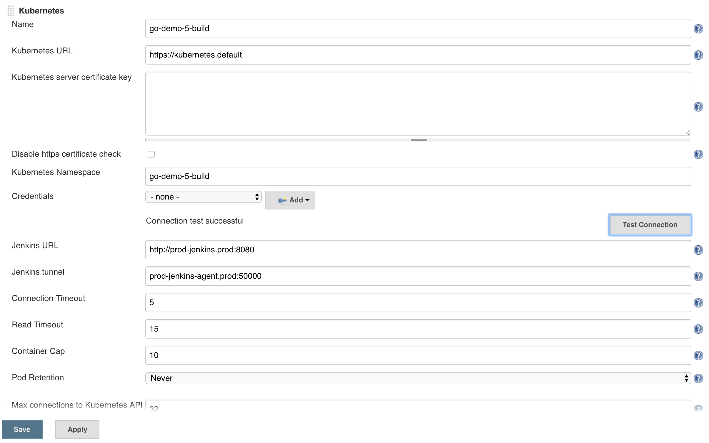
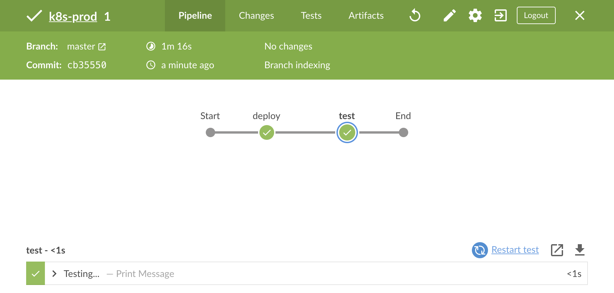

## TODO

- [X] Code
- [X] Code review Docker for Mac/Windows
- [X] Code review minikube
- [X] Code review kops
- [ ] Code review minishift
- [ ] Code review GKE
- [ ] Write
- [ ] Text review
- [ ] Diagrams
- [ ] Gist
- [ ] Review the title
- [ ] Proofread
- [ ] Add to slides
- [ ] Publish on TechnologyConversations.com
- [ ] Add to Book.txt
- [ ] Publish on LeanPub.com

# Continuous Delivery With Jenkins And Git Operations

Continuous delivery is a step down from continuous deployment. Instead of deploying every commit to the master branch to production, we are choosing which build should be promoted. Continuous delivery has that single manual step that forces us (humans) to choose which release should be upgraded in production.

Given that we already explored continuous deployment, you might be wondering why are we even talking at this point about continuous delivery. There are a few reasons for that. First of all, I am conscious that many of you will not or can not implement continuous deployment. Your tests might not be as reliable as you'd need them to be. Your processes might not allow full automation. You might have to follow regulations that prevent you from reaching nirvana. There could be many other reasons and the point is that not everyone can apply continuous deployment. Even among those that can get there, there are certainly some that do not want that as the destination. All in all, we'll explore continuous delivery as alternative to continuous deployment.

There are other reasons for writing this chapter. So far, I showed you one possible implementation of the continuous deployment pipeline. We could modify the existing pipeline by adding an `input` step before making the release and upgrading production. That would add *proceed* and *cancel* buttons that we could use to choose whether to upgrade the production release or not. This chapter would be the shortest chapter ever and that would be boring. Where's the fun in doing a small variation of the same?

We'll use this chapter to explore a few alternative approaches to creating a continuous delivery pipeline. Just as the pipeline from the previous chapter could be easily converted from continuous deployment to continuous delivery process, what we're going to do next could also go both ways. So, even though our objective is to write a continuous delivery pipeline, it could easily apply to continuous deployment as well.

We'll use this opportunity to explore declarative pipeline as an alternative to scripted. We'll switch from using a separate VM for building docker image to using the Docker socket to build it in one of the nodes of the cluster. We'll explore how we can define our whole productions environment in a different way. We'll even introduce GitOps.

The real goal is to give you valid alternatives to the approaches we used so far thus allowing you to make better decisions when implementing lessons-learned in your organization. My hope is that by the end of this chapter you will be able to cherry-pick things that suits you the best and assemble your own process.

That's it for the prep-talk. You know what continuous delivery is, and you know how to use Kubernetes. Let's define some pipelines.

## Cluster

TODO: Write

* [docker4mac-cd.sh](TODO): TODO
* [minikube-cd.sh](TODO): TODO
* [kops-cd.sh](TODO): TODO

```bash
cd k8s-specs

git pull
```

## Defining The Whole Production Environment

All the chapters until this one followed the same pattern. We'd learn about a new tool and, from there on, we'd streamline its installation through Gists in all subsequent chapters. As an example, we introduced ChartMuseum a few chapters ago. We learned how to install it and there was no point reiterating the same set of steps in the chapters that followed. Instead, we had the steps in Gists. Knowing that, you might be wondering why we did not follow the same pattern now. Why was ChartMuseum excluded from the Gists? Why isn't Jenkins there as well? Are we going to install ChartMuseum and Jenkins with a different configuration now? We're not. Both will have the same configuration but will be installed in a slightly different way.

We already saw the benefits provided by Helm. Among other features, it provides templating mechanism that allows us to customize our Kubernetes definitions. We used `requirements.yaml` file to create our own Jenkins distribution. Helm requirements are a nifty feature initially designed to provide means to define dependencies of our application. As an example, if we'd create an application that uses Redis DB, our application would be defined in templates and Reddis as a requirement. After all, if the community already has a Chart for Redis, why would we reinvent the wheel by creating our own definitions. Instead, we'd put it as an entry in `requirements.yaml`. Even though our motivation was slighly different, we did just that with Jenkins. As you might have guessed, content of `requirements.yaml` is not limited to a single entry. We can define as many dependencies as we need.

The Helm requirements feature opens new possibilities. We could, for example, create a Chart that would define Namespaces, RoleBindings, and all the other infrastructure-level things that our production environment needs. Such a Chart could treat all production releases as requirements. If we could do something like that, we could store everything related to production in a single repository. That would simplify the initial installation as well as upgrades of the production applications. Such an approach does not need to be limited to production. There could be another repository for other environments. Testing would be a good example if we still rely on manual tasks in that area.

Since we'd keep those Charts in repository, changes to what constitures production could be code reviewed and, if necessary, approved before they're merged to the master branch. There are certainly other benefits of having a whole environment in a Git repository. I'll leave it to your imagination to figure them out.

The beauty of Helm requirements is that they still allow us to keep the definition of an application in the same repository as the code. If we take our *go-demo* application as an example, the Chart that defines the application can and should continue residing in its repository. However, a different repository could define all the applications running in the production environment as requirements, including *go-demo*. That way, we'll accomplish two things. Everything related to an application, including its Chart would be in the same repository without breaking the everything-in-git rule. So far, our continuous deployment pipeline (the one we defined in the previous chapter) breaks that rule. Jenkins was upgrading production release without storing that information in Git. We had undocumented deployments. Since releases under test are temporary and live only for the duration of those automated tests, production releases last longer and should be documented, even if thair life-span is potentially short (until the next commit).

All in all, our next task is to have the whole production environment in a single repository, without duplicating the information already available in repositories where we keep the code and definitions of our applications.

I already created a repository [vfarcic/k8s-prod](https://github.com/vfarcic/k8s-prod) that defines a production environment. Since we'll have to make some changes to a few files, our first task is to fork it. Otherwise, I'd need to give you my GitHub credentials so that you can push those changes to my repo. As you can probably imagine, that is not going to happen.

Please open [vfarcic/k8s-prod](https://github.com/vfarcic/k8s-prod) in a browser and fork the repository. I'm sure you already know how to do that. If you don't, all you have to do is to click on the *Fork* button located in the top-right corner and follow the wizard.

Next, we'll clone the forked repository before we explore some of its files.

Please replace `[...]` with your GitHub username before running the commands that follow.

```bash
GH_USER=[...]

cd ..

git clone https://github.com/$GH_USER/k8s-prod.git

cd k8s-prod
```

We cloned the forked repository and entered into its root directory.

Let's see what we have.

```bash
cat helm/Chart.yaml
```

The output is as follows.

```yaml
apiVersion: v1
name: prod-env
version: 0.0.1
description: Docker For Mac or Windows Production Environment
maintainers:
- name: Viktor Farcic
  email: viktor@farcic.com
```

The `Chart.yaml` file is very uneventful, so we'll skip explaining it. The only thing that truly matters is the `version`.

I> You might see a different `version` than the one from the above output. Don't panic! I probably bumped it in one of my tests.

Let's take a look at the `requirements.yaml`.

```bash
cat helm/requirements.yaml
```

The output is as follows.

```yaml
dependencies:
- name: chartmuseum
  repository: "@stable"
  version: 1.6.0
- name: jenkins
  repository: "@stable"
  version: 0.16.6
```

We can see that the requirements for our production environments are `chartmuseum` and `jenkins`, both located in the `stable` repository (official Helm repo).

Offcourse, just stating the requirements is not enough. Our applications almost always require customized versions of both public and private Charts. We already know from the previous chapters that we can leverage `values.yaml` file to customize Charts. The repository already has one, so let's take a quick look.

```bash
cat helm/values-orig.yaml
```

The output is as follows.

```yaml
chartmuseum:
  env:
    open:
      DISABLE_API: false
      AUTH_ANONYMOUS_GET: true
    secret:
      BASIC_AUTH_USER: admin # Change me!
      BASIC_AUTH_PASS: admin # Change me!
  resources:
    limits:
      cpu: 100m
      memory: 128Mi
    requests:
      cpu: 80m
      memory: 64Mi
  persistence:
    enabled: true
  ingress:
    enabled: true
    annotations:
      kubernetes.io/ingress.class: "nginx"
      ingress.kubernetes.io/ssl-redirect: "false"
      nginx.ingress.kubernetes.io/ssl-redirect: "false"
    hosts:
      cm.acme-escaped.com: # Change me!
      - /

jenkins:
  Master:
    ImageTag: "2.129-alpine"
    Cpu: "500m"
    Memory: "500Mi"
    ServiceType: ClusterIP
    ServiceAnnotations:
      service.beta.kubernetes.io/aws-load-balancer-backend-protocol: http
    GlobalLibraries: true
    InstallPlugins:
    - durable-task:1.22
    - blueocean:1.7.1
    - credentials:2.1.18
    - ec2:1.39
    - git:3.9.1
    - git-client:2.7.3
    - github:1.29.2
    - kubernetes:1.12.0
    - pipeline-utility-steps:2.1.0
    - pipeline-model-definition:1.3.1
    - script-security:1.44
    - slack:2.3
    - thinBackup:1.9
    - workflow-aggregator:2.5
    - ssh-slaves:1.26
    - ssh-agent:1.15
    - jdk-tool:1.1
    - command-launcher:1.2
    - github-oauth:0.29
    - google-compute-engine:1.0.4
    - pegdown-formatter:1.3
    Ingress:
      Annotations:
        kubernetes.io/ingress.class: "nginx"
        nginx.ingress.kubernetes.io/ssl-redirect: "false"
        nginx.ingress.kubernetes.io/proxy-body-size: 50m
        nginx.ingress.kubernetes.io/proxy-request-buffering: "off"
        ingress.kubernetes.io/ssl-redirect: "false"
        ingress.kubernetes.io/proxy-body-size: 50m
        ingress.kubernetes.io/proxy-request-buffering: "off"
    HostName: jenkins.acme.com # Change me!
    CustomConfigMap: true
    CredentialsXmlSecret: jenkins-credentials
    SecretsFilesSecret: jenkins-secrets
    DockerVM: false
  rbac:
    install: true
```

We can see that the values are split into two groups; `chartmuseum` and `jenkins`. Other than that, they are almost the same as the values we used in previous chapters. The only important difference is that both are now defined in the same file and will be used as values for the requirements.

I> I hope that you noticed that the file is named `values-orig.yaml` instead of `values.yaml`. I could not predict in advance what will be the address through which you can access the cluster. We'll combine that file with a bit of `sed` magic to generate `values.yaml` that contains the correct address.

Next, we'll take a look at the templates of this Chart.

```bash
ls -1 helm/templates
```

The output is as follows.

```
config.tpl
ns.yaml
```

The `config.tpl` file is the same Jenkins configuration template we used before, so there should be no need explaining it. We'll skip it and jump into `ns.yaml`.

```bash
cat helm/templates/ns.yaml
```

The output is as follows.

```yaml
apiVersion: v1
kind: ServiceAccount
metadata:
  name: build

---

apiVersion: rbac.authorization.k8s.io/v1beta1
kind: RoleBinding
metadata:
  name: build
roleRef:
  apiGroup: rbac.authorization.k8s.io
  kind: ClusterRole
  name: admin
subjects:
- kind: ServiceAccount
  name: build

---

apiVersion: rbac.authorization.k8s.io/v1beta1
kind: RoleBinding
metadata:
  name: build
  namespace: kube-system
roleRef:
  apiGroup: rbac.authorization.k8s.io
  kind: ClusterRole
  name: admin
subjects:
- kind: ServiceAccount
  name: build
  namespace: {{ .Release.Namespace }}
```

That definition holds no mysteries. It is a very similar one as those we used before. The first two entries provide permissions Jenkins builds need for running in the same Namespace while the third is meant to allow builds to interact with tiller running `kube-system`. You can see that through the `namespace` set to `kube-system` and the reference to the `ServiceAccount` in the Namespace where we'll install this Chart.

All in all, this chart is a combination of custom templates meant to provide permissions and a set of requirements that will install the applications our production environment needs. For now, those requirements are only two applications (ChartMuseum and Jenkins) and we are likely going to expand it later on with additional ones.

I already mentioned that `values-orig.yaml` is too generic and that we should update it with the cluster address before we convert it into `values.yaml` the Chart expects to have. That's our next mission.

```bash
ADDR=$LB_IP.nip.io

echo $ADDR

ADDR_ESC=$(echo $ADDR \
    | sed -e "s@\.@\\\.@g")

echo $ADDR_ESC
```

We defined the address of the cluster (`ADDR`) as well as the escaped variant required by ChartMuseum since it uses address as the key, not the value. As you already know from previous chapters, keys cannot contain "special" characters like dots (`.`).

Now that we have the address of your cluster, we can use `sed` to modify `values-orig.yaml` and output the result to `values.yaml`.

```bash
cat helm/values-orig.yaml \
    | sed -e "s@acme-escaped.com@$ADDR_ESC@g" \
    | sed -e "s@acme.com@$ADDR@g" \
    | tee helm/values.yaml
```

Later on, we'll use Jenkins to install (or upgrade) the Chart, so we should push the changes to GitHub.

```bash
git add .

git commit -m "Address"

git push
```

All the requirements need to be downloaded to the `charts` directory before they are installed. We'll do that through `helm dependency update` command.

```bash
helm dependency update helm
```

The relevant parts of the output is as follows.

```
...
Saving 2 charts
Downloading chartmuseum from repo https://kubernetes-charts.storage.googleapis.com
Downloading jenkins from repo https://kubernetes-charts.storage.googleapis.com
Deleting outdated charts
```

Don't worry if some of the repositories are not reachable. You might see messages stating that Helm was `unable to get an update` from `local` or `chartmuseum` repositories. Local Helm configuration probably has those (and maybe other) references from previous exercises.

The last lines of the output are important. We can see that Helm saved two Charts (`chartmuseum` and `jenkins`). Those are the Charts we specified in `requirements.yaml`.

We can confirm that by listing the files in the `charts` directory.

```bash
ls -1 helm/charts
```

The output is as follows.

```
chartmuseum-1.6.0.tgz
jenkins-0.16.6.tgz
```

Now that the requirements are downloaded and saved to the `charts` directory, we can proceed and install our full production environment. It consists of only two applications. We'll increase that number soon and I expect that you'll add other applications you need to your "real" environment if you choose to use this approach.

```bash
helm install helm \
    -n prod \
    --namespace prod
```

The output, limited to the Pods, is as follows.

```
...
==> v1/Pod(related)
NAME                               READY  STATUS   RESTARTS  AGE
prod-chartmuseum-68bc575fb7-jgs98  0/1    Pending  0         1s
prod-jenkins-6dbc74554d-gbzp4      0/1    Pending  0         1s
```

We can see that Helm sent requests to Kube API to create all the resources defined in our Chart. As a result, among other resources, we got the Pods which run containers with Jenkins and ChartMuseum.

However, Jenkins will fail to start without the secrets we were using in previous chapters, so we'll create them next.

```bash
kubectl -n prod \
    create secret generic \
    jenkins-credentials \
    --from-file ../k8s-specs/cluster/jenkins/credentials.xml

kubectl -n prod \
    create secret generic \
    jenkins-secrets \
    --from-file ../k8s-specs/cluster/jenkins/secrets
```

Let's list the Charts running inside the cluster and thus confirm that `prod-env` was indeed deployed.

```bash
helm ls
```

The output is as follows.

```
NAME REVISION UPDATED        STATUS   CHART          NAMESPACE
prod 1        Tue Aug  7 ... DEPLOYED prod-env-0.0.1 prod
```

Now that we saw that the Chart was indeed deployed, the only thing left is to confirm that the two applications are indeed running correctly.

First, we'll wait for ChartMuseum to roll out (if it didn't already).

```bash
kubectl -n prod \
    rollout status \
    deploy prod-chartmuseum
```

The output should state that the `deployment "prod-chartmuseum"` was `successfully rolled out`.

We won't do a real testing of the two applications, but only a superficial one that will give us a piece of mind.

```bash
curl "http://cm.$ADDR/health"
```

The output is `{"healthy":true}`, so ChartMuseum seems to be working correctly.

Next, we'll turn our attention to Jenkins.

```bash
kubectl -n prod \
    rollout status \
    deploy prod-jenkins
```

Once the `deployment "prod-jenkins"` is `successfully rolled out`, we can open it in browser as a very light validation.

```bash
JENKINS_ADDR="jenkins.$ADDR"

open "http://$JENKINS_ADDR"
```

We'll need the initial admin password to log in. Just as we did it countless times before, we'll fetch it from the `secret` generated through the Chart.

```bash
JENKINS_PASS=$(kubectl -n prod \
    get secret prod-jenkins \
    -o jsonpath="{.data.jenkins-admin-password}" \
    | base64 --decode; echo)

echo $JENKINS_PASS
```

Please go back to Jenkins UI in your favourite browser and login using *admin* as the username and the output of `JENKINS_PASS` as password. If, later on, your Jenkins session expires and you need to log in again, all you have to do is output `JENKINS_PASS` variable to find out the password.

Now that we have the base production environment, we can turn our attention towards defining a continuous delivery pipeline.

### What Is A Continuous Delivery Pipeline?

Now that we have a cluster and the third-party applications running in a production environment, we can turn our attention towards defining a contrinuous delivery pipeline.

Before we proceed, I'll recap the definitions of continuous deployment and continuous delivery.

Continuous deployment is a fully automated process that executes a set of steps aimed at converting each commit to the master branch into a fully tested release deployed to production.

Continuous delivery is almost a fully automated process that executed a set of steps aimed at converting each commit to the master branch a fully tested release that is NOT deployed to production. Instead, we (humans) retain the ability to choose which of the production ready releases will be deployed to production and when is that deployment going to happen.

When compared to continuous deployment, continuous delivery is split into two automated processes with a manual action in between. The first processes ensures that a commit is built, tested, and converted into a release. The second is in charge of performing the actual deployment to production and executing a set of tests that validate the deployment.

In other words, the only important difference between the two processes is that continuous delivery has a manual action that allows us to choose whether we want to proceed with the deployment to production. That choice is not based on technical knowledge since we already validated that a release is production ready. Instead, it is a business or marketing decision when to deliver a set of features to our users.

Since this is not the first time we are discussing continuous deployment and continuous delivery, there's probably no need to dive deeper into the processes. Instead, we'll dive straight into one possible implementation of continuous delivery.

If we compare the process that follows with the one from the previous chapter, some of the steps will be different. That is not to say that those described here are not well suited in a continuous deployment pipeline. Quite the contrary. The steps are interchangeable. My main goal is not only to present a possible implementation of a continuous delivery pipeline but also to showcase a different approach that case, with small adjustments, be applied to any type of a pipeline.

## Exploring Application's Repository And Preparing The Environment

Before I wrote this chapter, I forked the [vfarcic/go-demo-3](https://github.com/vfarcic/go-demo-3) repository into [vfarcic/go-demo-5](https://github.com/vfarcic/go-demo-5). Even though the code of the application is still the same, I thought it would be easier to apply and demonstrate the changes in a new repository instead of creating a new branch or do some other workaround that would allow us to have both processes in the same repository. All in all, *go-demo-5* is a copy of *go-demo-3* on top of which I made some changes which I'll comment soon.

Since we'll need to change a few configuration files and push them back to the repository, you should fork [vfarcic/go-demo-5](https://github.com/vfarcic/go-demo-5), just as you forked [vfarcic/k8s-prod](https://github.com/vfarcic/k8s-prod).

Next, we'll clone the repository before we explore the relevant files.

```bash
cd ..

git clone \
    https://github.com/$GH_USER/go-demo-5.git

cd go-demo-5
```

The Chart located in `helm` directory is the same as the one we used in *go-demo-3* so we'll skip commenting it. Instead, we'll replace my GitHub user (`vfarcic`) with yours.

Before you execute the commands that follow, make sure you replace `[...]` with your GitHub user.

```bash
DH_USER=[...]

cat helm/go-demo-5/deployment.yaml.orig \
    | sed -e "s@vfarcic@$DH_USER@g" \
    | tee helm/go-demo-5/templates/deployment.yaml
```

In *go-demo-3*, the resources that define the Namespace, ServiceAccount, RoleBinding, LimitRange, and ResourceQuota were split between `ns.yml` and `build-config.yml` files. I got tired of having them separated, so I joined them into a single file `build.yml`. Other than that, the resources are the same as those we used before so we'll skip commenting them as well. The only difference is that the Namespace is now *go-demo-5*.

```bash
kubectl apply -f k8s/build.yml --record
```

Finally, the only thing related to the setup of the environment we'll use for *go-demo-5* is to install Tiller, just as we did before.

```bash
helm init --service-account build \
    --tiller-namespace go-demo-5-build
```

The two key elements of our pipeline will be *Dockerfile* and *Jenkinsfile* files. Let's explore the former first.

```bash
cat Dockerfile
```

The output is as follows.

```
FROM alpine:3.4
MAINTAINER 	Viktor Farcic <viktor@farcic.com>

RUN mkdir /lib64 && ln -s /lib/libc.musl-x86_64.so.1 /lib64/ld-linux-x86-64.so.2

EXPOSE 8080
ENV DB db
CMD ["go-demo"]

COPY go-demo /usr/local/bin/go-demo
RUN chmod +x /usr/local/bin/go-demo
```

You'll notice that we are not using multi-stage builds. That makes me sad since I think that is one of the greatest additions to Docker's build process. The ability to run unit tests and build a binary served us well so far. The process was streamlined in through a single `docker image build` command, documented in a single *Dockerfile* file, and we did not have to sacrifice the size of the final image. So, why did I choose not to use it now?

We'll switch from building Docker images in a separate VM outside the cluster to using Docker socket to build it in one of the Kubernetes worker nodes. That does reduce security (Docker on that node could be obducted) and it can cause potential problems with Kubernetes (we're using containers without it's knowledge). Yet, using the socket is somewhat easier, cleaner, and faster. Even though we explored this option through Shell commands, we did not use it in our Jenkins pipelines. So, I though that you should experience both ways of building images in a Jenkins pipeline and choose for yourself which method fits your use-case better. The goal is to find the balance and gain experience that will let you choose what works better for you. There will be quite a few changes further on that are aimed at giving you better insight into different ways of accomplishing the same goals. You will have to make the choice how to combine them into the solution that works the best in your organization.

All in all, that *Dockerfile* assumes that we already run our tests and that we already built the binary. We'll see how to do that inside a Jenkins pipeline soon.

Soon we'll explore the pipeline stored in Jenkinsfile in the repository we cloned. However, before we do that, we'll go through declarative pipeline syntax since that's the one we'll use in this chapter.

## Switching From Scripted To Declarative Pipeline

TODO: What is declarative pipeline?

TODO: Explain the structure

```groovy
pipeline {
  options {
    ...
  }
  agent {
    ...
  }
  environment {
    ...
  }
  parameters {
    ...
  }
  triggers {
    ...
  }
  tools {
    ...
  }
  stages {
    ...
  }
  post {
    ...
  }
}
```

```bash
cat Jenkinsfile.orig
```

```groovy
...
  options {
    buildDiscarder logRotator(numToKeepStr: '5')
    disableConcurrentBuilds()
  }
...
```

```groovy
...
  agent {
    kubernetes {
      cloud "go-demo-5-build"
      label "go-demo-5-build"
      serviceAccount "build"
      yamlFile "KubernetesPod.yaml"
    }      
  }
...
```

We did not specify the default `kubernetes` `cloud`. Instead, we're using a new definition named `go-demo-5-build`. The benefit of that approach is that we can define part of the agent information outside Pipeline and help other teams worry less about the things they need need to put to their Jenkinsfile. As an example, you will not see a mention of a Namespace where the build should create a Pod that acts as Jenkins agent. That will be defined elsewhere and every build that uses `go-demo-5-build` will be run in that same Namespace.

TODO: Declarative does not support Namespace.

```groovy
...
  environment {
    image = "vfarcic/go-demo-5"
    project = "go-demo-5"
    domain = "acme.com"
    cmAddr = "cm.acme.com"
  }
  stages {
    stage("build") {
      steps {
        container("golang") {
          script {
            currentBuild.displayName = new SimpleDateFormat("yy.MM.dd").format(new Date()) + "-${env.BUILD_NUMBER}"
          }
          k8sBuildGolang("go-demo")
        }
        container("docker") {
          k8sBuildImageBeta(image, false)
        }
      }
    }
    stage("func-test") {
      steps {
        container("helm") {
          k8sUpgradeBeta(project, domain, "--set replicaCount=2 --set dbReplicaCount=1")
        }
        container("kubectl") {
          k8sRolloutBeta(project)
        }
        container("golang") {
          k8sFuncTestGolang(project, domain)
        }
      }
      post {
        always {
          container("helm") {
            k8sDeleteBeta(project)
          }
        }
      }
    }
    stage("release") {
      when {
          branch "master"
      }
      steps {
        container("docker") {
          k8sPushImage(image, false)
        }
        container("helm") {
          k8sPushHelm(project, "", cmAddr, true, true)
        }
      }
    }
  }
}
```

```bash
cat KubernetesPod.yaml
```

```yaml
apiVersion: v1
kind: Pod
spec:
  containers:
  - name: docker
    image: docker:18.06
    command: ["cat"]
    tty: true
    volumeMounts:
    - mountPath: /var/run/docker.sock
      name: docker-socket
  - name: helm
    image: vfarcic/helm:2.9.1
    command: ["cat"]
    tty: true
  - name: kubectl
    image: vfarcic/kubectl
    command: ["cat"]
    tty: true
  - name: golang
    image: golang:1.9
    command: ["cat"]
    tty: true
  volumes:
  - name: docker-socket
    hostPath:
      path: /var/run/docker.sock
      type: Socket
```

```bash
cat Jenkinsfile.orig \
    | sed -e "s@acme.com@$ADDR@g" \
    | sed -e "s@vfarcic@$DH_USER@g" \
    | tee Jenkinsfile

git add .

git commit -m "Jenkinsfile"

git push

open "http://$JENKINS_ADDR/configure"

# Add a new cloud > Kubernetes
# Name = go-demo-5-build
# Kubernetes URL = https://kubernetes.default
# Kubernetes Namespace = go-demo-5-build
# Jenkins URL = http://prod-jenkins.prod:8080
# Jenkins tunnel = prod-jenkins-agent.prod:50000
# Save
```



```bash
open "http://$JENKINS_ADDR/blue/organizations/jenkins/"

# Click the *Create a New Pipeline* button
# Select *GitHub*
# Type *Your GitHub access token* and click the *Connect* button
# Select the organization
# Select *go-demo-5* repository
# Click the *Create Pipelin* button

# Wait until the build is finished

# TODO: Screenshot

curl "http://cm.$ADDR/index.yaml"
```

```yaml
apiVersion: v1
entries:
  go-demo-5:
  - apiVersion: v1
    created: "2018-08-08T20:47:34.322943263Z"
    description: A silly demo based on API written in Go and MongoDB
    digest: a30aa7921b890b1f919286113e4a8193a2d4d3137e8865b958acd1a2bfd97c7e
    home: http://www.devopstoolkitseries.com/
    keywords:
    - api
    - backend
    - go
    - database
    - mongodb
    maintainers:
    - email: viktor@farcic.com
      name: Viktor Farcic
    name: go-demo-5
    sources:
    - https://github.com/vfarcic/go-demo-5
    urls:
    - charts/go-demo-5-0.0.1.tgz
    version: 0.0.1
generated: "2018-08-08T21:03:01Z"
```

```bash
VERSION=[...]

helm repo add chartmuseum \
    http://cm.$ADDR

helm repo list
```

```
NAME            URL
stable          https://kubernetes-charts.storage.googleapis.com
local           http://127.0.0.1:8879/charts
chartmuseum     http://cm.18.219.191.38.nip.io
```

```bash
helm repo update
```

```
Hang tight while we grab the latest from your chart repositories...
...Skip local chart repository
...Successfully got an update from the "chartmuseum" chart repository
...Successfully got an update from the "stable" chart repository
Update Complete. ⎈ Happy Helming!⎈
```

```bash
helm inspect chartmuseum/go-demo-5 \
    --version $VERSION
```

```yaml
apiVersion: v1
description: A silly demo based on API written in Go and MongoDB
home: http://www.devopstoolkitseries.com/
keywords:
- api
- backend
- go
- database
- mongodb
maintainers:
- email: viktor@farcic.com
  name: Viktor Farcic
name: go-demo-5
sources:
- https://github.com/vfarcic/go-demo-5
version: 0.0.1

---
replicaCount: 3
dbReplicaCount: 3
image:
  tag: 18.08.08-3
  dbTag: 3.3
ingress:
  enabled: true
  host: acme.com
service:
  type: ClusterIP
rbac:
  enabled: true
resources:
  limits:
    cpu: 0.2
    memory: 20Mi
  requests:
    cpu: 0.1
    memory: 10Mi
dbResources:
  limits:
    memory: 200Mi
    cpu: 0.2
  requests:
    memory: 100Mi
    cpu: 0.1
dbPersistence:
  accessMode: ReadWriteOnce
  size: 2Gi

---
This is just a silly demo.
```

```bash
cd ../k8s-prod

cat helm/requirements.yaml
```

```yaml
dependencies:
- name: chartmuseum
  repository: "@stable"
  version: 1.6.0
- name: jenkins
  repository: "@stable"
  version: 0.16.6
```

```bash
echo "- name: go-demo-5
  repository: \"@chartmuseum\"
  version: $VERSION" \
  | tee -a helm/requirements.yaml

cat helm/requirements.yaml
```

```yaml
dependencies:
- name: chartmuseum
  repository: "@stable"
  version: 1.6.0
- name: jenkins
  repository: "@stable"
  version: 0.16.6
- name: go-demo-5
  repository: "@chartmuseum"
  version: 0.0.1
```

```bash
echo "go-demo-5:
  ingress:
    host: go-demo-5.$ADDR" \
    | tee -a helm/values.yaml

cat helm/values.yaml
```

```yaml
chartmuseum:
  env:
    open:
      DISABLE_API: false
      AUTH_ANONYMOUS_GET: true
    secret:
      BASIC_AUTH_USER: admin # Change me!
      BASIC_AUTH_PASS: admin # Change me!
  resources:
    limits:
      cpu: 100m
      memory: 128Mi
    requests:
      cpu: 80m
      memory: 64Mi
  persistence:
    enabled: true
  ingress:
    enabled: true
    annotations:
      kubernetes.io/ingress.class: "nginx"
      ingress.kubernetes.io/ssl-redirect: "false"
      nginx.ingress.kubernetes.io/ssl-redirect: "false"
    hosts:
      cm.18.219.191.38.nip.io: # Change me!
      - /

jenkins:
  Master:
    ImageTag: "2.129-alpine"
    Cpu: "500m"
    Memory: "500Mi"
    ServiceType: ClusterIP
    ServiceAnnotations:
      service.beta.kubernetes.io/aws-load-balancer-backend-protocol: http
    GlobalLibraries: true
    InstallPlugins:
    - durable-task:1.22
    - workflow-durable-task-step:2.19
    - blueocean:1.7.1
    - credentials:2.1.18
    - ec2:1.39
    - git:3.9.1
    - git-client:2.7.3
    - github:1.29.2
    - kubernetes:1.12.0
    - pipeline-utility-steps:2.1.0
    - pipeline-model-definition:1.3.1
    - script-security:1.44
    - slack:2.3
    - thinBackup:1.9
    - workflow-aggregator:2.5
    - ssh-slaves:1.26
    - ssh-agent:1.15
    - jdk-tool:1.1
    - command-launcher:1.2
    - github-oauth:0.29
    - google-compute-engine:1.0.4
    - pegdown-formatter:1.3
    Ingress:
      Annotations:
        kubernetes.io/ingress.class: "nginx"
        nginx.ingress.kubernetes.io/ssl-redirect: "false"
        nginx.ingress.kubernetes.io/proxy-body-size: 50m
        nginx.ingress.kubernetes.io/proxy-request-buffering: "off"
        ingress.kubernetes.io/ssl-redirect: "false"
        ingress.kubernetes.io/proxy-body-size: 50m
        ingress.kubernetes.io/proxy-request-buffering: "off"
    HostName: jenkins.18.219.191.38.nip.io # Change me!
    CustomConfigMap: true
    CredentialsXmlSecret: jenkins-credentials
    SecretsFilesSecret: jenkins-secrets
    DockerVM: false
  rbac:
    install: true
go-demo-5:
  ingress:
    host: go-demo-5.18.219.191.38.nip.io
```

```bash
git add .

git commit -m "Added go-demo-5"

git push

helm dependency update helm
```

```
Hang tight while we grab the latest from your chart repositories...
...Unable to get an update from the "local" chart repository (http://127.0.0.1:8879/charts):
        Get http://127.0.0.1:8879/charts/index.yaml: dial tcp 127.0.0.1:8879: connect: connection refused
...Successfully got an update from the "chartmuseum" chart repository
...Successfully got an update from the "stable" chart repository
Update Complete. ⎈Happy Helming!⎈
Saving 3 charts
Downloading chartmuseum from repo https://kubernetes-charts.storage.googleapis.com
Downloading jenkins from repo https://kubernetes-charts.storage.googleapis.com
Downloading go-demo-5 from repo http://cm.18.219.191.38.nip.io
Deleting outdated charts
```

```bash
ls -1 helm/charts
```

```
chartmuseum-1.6.0.tgz
go-demo-5-0.0.1.tgz
jenkins-0.16.6.tgz
```

```bash
helm upgrade prod helm \
    --namespace prod
```

```
Release "prod" has been upgraded. Happy Helming!
LAST DEPLOYED: Wed Aug  8 23:10:45 2018
NAMESPACE: prod
STATUS: DEPLOYED

RESOURCES:
==> v1/Service
NAME                TYPE       CLUSTER-IP      EXTERNAL-IP  PORT(S)    AGE
prod-chartmuseum    ClusterIP  100.66.187.127  <none>       8080/TCP   4h
prod-go-demo-5      ClusterIP  100.64.173.243  <none>       8080/TCP   1s
prod-go-demo-5-db   ClusterIP  None            <none>       27017/TCP  1s
prod-jenkins-agent  ClusterIP  100.66.213.155  <none>       50000/TCP  4h
prod-jenkins        ClusterIP  100.67.196.236  <none>       8080/TCP   4h

==> v1/Secret
NAME              TYPE    DATA  AGE
prod-chartmuseum  Opaque  2     4h
prod-jenkins      Opaque  2     4h

==> v1beta1/ClusterRoleBinding
NAME                       AGE
prod-jenkins-role-binding  4h

==> v1beta1/RoleBinding
NAME               AGE
prod-go-demo-5-db  1s
build              4h
build              4h

==> v1beta1/Role
NAME               AGE
prod-go-demo-5-db  1s

==> v1beta1/Deployment
NAME              DESIRED  CURRENT  UP-TO-DATE  AVAILABLE  AGE
prod-chartmuseum  1        1        1           1          4h
prod-jenkins      1        1        1           1          4h

==> v1beta2/Deployment
prod-go-demo-5  3  3  3  0  1s

==> v1beta2/StatefulSet
NAME               DESIRED  CURRENT  AGE
prod-go-demo-5-db  3        1        1s

==> v1beta1/Ingress
NAME              HOSTS                           ADDRESS           PORTS  AGE
prod-chartmuseum  cm.18.219.191.38.nip.io         a097d24929b28...  80     4h
prod-go-demo-5    go-demo-5.18.219.191.38.nip.io  80                1s
prod-jenkins      jenkins.18.219.191.38.nip.io    a097d24929b28...  80  4h

==> v1/ConfigMap
NAME                DATA  AGE
prod-jenkins        4     4h
prod-jenkins-tests  1     4h

==> v1/PersistentVolumeClaim
NAME              STATUS  VOLUME                                    CAPACITY  ACCESS MODES  STORAGECLASS  AGE
prod-chartmuseum  Bound   pvc-5f483fc7-9b29-11e8-a994-0a37c44add8a  8Gi       RWO           gp2           4h
prod-jenkins      Bound   pvc-5f49d107-9b29-11e8-a994-0a37c44add8a  8Gi       RWO           gp2           4h

==> v1/ServiceAccount
NAME               SECRETS  AGE
prod-go-demo-5-db  1        1s
prod-jenkins       1        4h
build              1        4h

==> v1/Pod(related)
NAME                               READY  STATUS             RESTARTS  AGE
prod-chartmuseum-68bc575fb7-dn6h5  1/1    Running            0         4h
prod-go-demo-5-66c9d649bd-kq45m    0/1    ContainerCreating  0         1s
prod-go-demo-5-66c9d649bd-lgjb7    0/1    ContainerCreating  0         1s
prod-go-demo-5-66c9d649bd-pwnjg    0/1    ContainerCreating  0         1s
prod-jenkins-676cc64756-bj45v      1/1    Running            0         4h
prod-go-demo-5-db-0                0/2    Pending            0         1s
```

```bash
kubectl -n prod get pods
```

```
NAME                                READY     STATUS              RESTARTS   AGE
prod-chartmuseum-68bc575fb7-dn6h5   1/1       Running             0          4h
prod-go-demo-5-66c9d649bd-kq45m     1/1       Running             2          51s
prod-go-demo-5-66c9d649bd-lgjb7     1/1       Running             2          51s
prod-go-demo-5-66c9d649bd-pwnjg     1/1       Running             2          51s
prod-go-demo-5-db-0                 2/2       Running             0          51s
prod-go-demo-5-db-1                 0/2       ContainerCreating   0          15s
prod-jenkins-676cc64756-bj45v       1/1       Running             0          4h
```

```bash
kubectl -n prod rollout status \
    deployment prod-go-demo-5
```

```
deployment "prod-go-demo-5" successfully rolled out
```

```bash
curl -i "http://go-demo-5.$ADDR/demo/hello"
```

```
HTTP/1.1 200 OK
Server: nginx/1.13.9
Date: Wed, 08 Aug 2018 21:12:31 GMT
Content-Type: text/plain; charset=utf-8
Content-Length: 14
Connection: keep-alive

hello, world!
```

```bash
kubectl -n prod \
    describe deploy prod-go-demo-5
```

```yaml
Name:                   prod-go-demo-5
Namespace:              prod
CreationTimestamp:      Wed, 08 Aug 2018 23:10:45 +0200
Labels:                 app=go-demo-5
                        chart=go-demo-5-0.0.1
                        heritage=Tiller
                        release=prod
Annotations:            deployment.kubernetes.io/revision=1
Selector:               app=go-demo-5,release=prod
Replicas:               3 desired | 3 updated | 3 total | 3 available | 0 unavailable
StrategyType:           RollingUpdate
MinReadySeconds:        0
RollingUpdateStrategy:  25% max unavailable, 25% max surge
Pod Template:
  Labels:  app=go-demo-5
           release=prod
  Containers:
   api:
    Image:      vfarcic/go-demo-5:18.08.08-3
    Port:       <none>
    Host Port:  <none>
    Limits:
      cpu:     200m
      memory:  20Mi
    Requests:
      cpu:      100m
      memory:   10Mi
    Liveness:   http-get http://:8080/demo/hello delay=0s timeout=1s period=10s #success=1 #failure=3
    Readiness:  http-get http://:8080/demo/hello delay=0s timeout=1s period=1s #success=1 #failure=3
    Environment:
      DB:    prod-go-demo-5-db
    Mounts:  <none>
  Volumes:   <none>
Conditions:
  Type           Status  Reason
  ----           ------  ------
  Available      True    MinimumReplicasAvailable
  Progressing    True    NewReplicaSetAvailable
OldReplicaSets:  <none>
NewReplicaSet:   prod-go-demo-5-66c9d649bd (3/3 replicas created)
Events:
  Type    Reason             Age   From                   Message
  ----    ------             ----  ----                   -------
  Normal  ScalingReplicaSet  2m    deployment-controller  Scaled up replica set prod-go-demo-5-66c9d649bd to 3
```

```bash
open "http://$JENKINS_ADDR/blue/organizations/jenkins/go-demo-5/branches"

# Click the play button from the right side of the *master* row.

# Wait until the build is finished

# TODO: Screenshot

cd ../go-demo-5

# Increment the version of *helm/go-demo-5/Chart.yaml*

git add .

git commit -m "Version bump"

git push

open "http://$JENKINS_ADDR/blue/organizations/jenkins/go-demo-5/branches"

# Click the play button from the right side of the *master* row.

# Wait until the build is finished

cd ../k8s-prod

cat Jenkinsfile.orig

cat Jenkinsfile.orig \
    | sed -e "s@acme.com@$ADDR@g" \
    | tee Jenkinsfile

# Increment go-demo-5 version in helm/requirements.yaml

# Increment version in helm/Chart.yaml

git add .

git commit -m "Jenkinsfile"

git push

open "http://$JENKINS_ADDR/blue/pipelines"

# Click *New Pipeline"
# Select *GitHub*
# Select the organization
# Select *k8s-prod* repository
# Click the *Create Pipelin* button

# Wait until the new build is finished
```



```bash
helm history prod
```

```
REVISION        UPDATED                         STATUS          CHART           DESCRIPTION
1               Wed Aug  8 18:37:42 2018        SUPERSEDED      prod-env-0.0.1  Install complete
2               Wed Aug  8 23:10:45 2018        SUPERSEDED      prod-env-0.0.1  Upgrade complete
3               Wed Aug  8 23:47:35 2018        DEPLOYED        prod-env-0.0.2  Upgrade complete
```

```bash
kubectl -n prod \
    describe deploy prod-go-demo-5
```

```yaml
Name:                   prod-go-demo-5
Namespace:              prod
CreationTimestamp:      Wed, 08 Aug 2018 23:10:45 +0200
Labels:                 app=go-demo-5
                        chart=go-demo-5-0.0.2
                        heritage=Tiller
                        release=prod
Annotations:            deployment.kubernetes.io/revision=2
Selector:               app=go-demo-5,release=prod
Replicas:               3 desired | 3 updated | 3 total | 3 available | 0 unavailable
StrategyType:           RollingUpdate
MinReadySeconds:        0
RollingUpdateStrategy:  25% max unavailable, 25% max surge
Pod Template:
  Labels:  app=go-demo-5
           release=prod
  Containers:
   api:
    Image:      vfarcic/go-demo-5:18.08.08-5
    Port:       <none>
    Host Port:  <none>
    Limits:
      cpu:     200m
      memory:  20Mi
    Requests:
      cpu:      100m
      memory:   10Mi
    Liveness:   http-get http://:8080/demo/hello delay=0s timeout=1s period=10s #success=1 #failure=3
    Readiness:  http-get http://:8080/demo/hello delay=0s timeout=1s period=1s #success=1 #failure=3
    Environment:
      DB:    prod-go-demo-5-db
    Mounts:  <none>
  Volumes:   <none>
Conditions:
  Type           Status  Reason
  ----           ------  ------
  Available      True    MinimumReplicasAvailable
  Progressing    True    NewReplicaSetAvailable
OldReplicaSets:  <none>
NewReplicaSet:   prod-go-demo-5-666b96c46 (3/3 replicas created)
Events:
  Type    Reason             Age   From                   Message
  ----    ------             ----  ----                   -------
  Normal  ScalingReplicaSet  40m   deployment-controller  Scaled up replica set prod-go-demo-5-66c9d649bd to 3
  Normal  ScalingReplicaSet  3m    deployment-controller  Scaled up replica set prod-go-demo-5-666b96c46 to 1
  Normal  ScalingReplicaSet  3m    deployment-controller  Scaled down replica set prod-go-demo-5-66c9d649bd to 2
  Normal  ScalingReplicaSet  3m    deployment-controller  Scaled up replica set prod-go-demo-5-666b96c46 to 2
  Normal  ScalingReplicaSet  3m    deployment-controller  Scaled down replica set prod-go-demo-5-66c9d649bd to 1
  Normal  ScalingReplicaSet  3m    deployment-controller  Scaled up replica set prod-go-demo-5-666b96c46 to 3
  Normal  ScalingReplicaSet  3m    deployment-controller  Scaled down replica set prod-go-demo-5-66c9d649bd to 0
```

```bash
curl -i "http://go-demo-5.$ADDR/demo/hello"
```

```
HTTP/1.1 200 OK
Server: nginx/1.13.9
Date: Wed, 08 Aug 2018 21:51:57 GMT
Content-Type: text/plain; charset=utf-8
Content-Length: 14
Connection: keep-alive

hello, world!
```