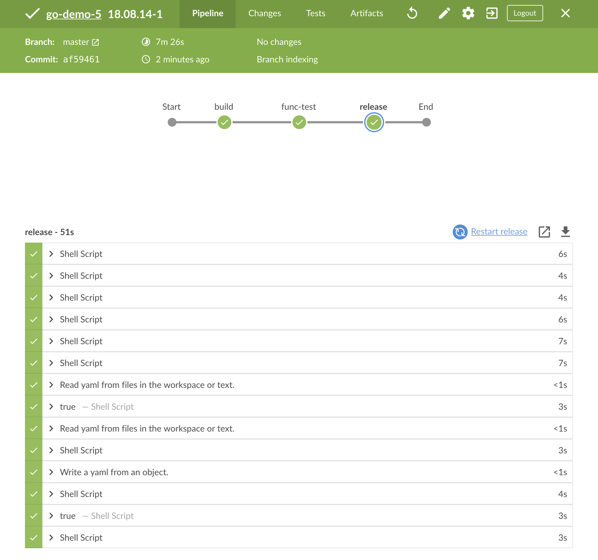
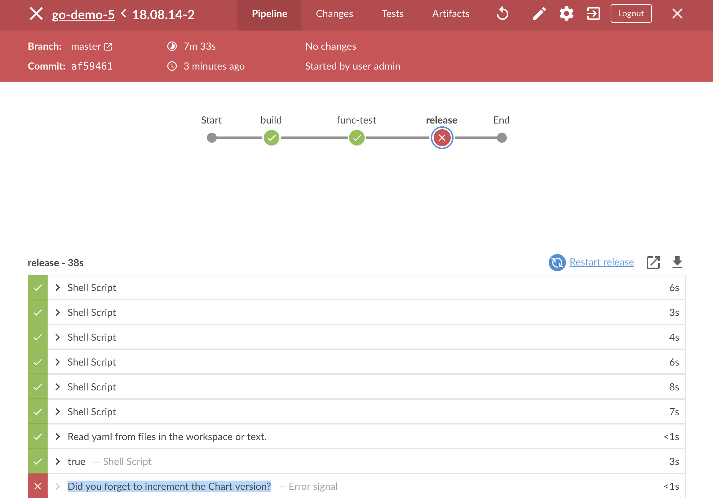

# Continuous Delivery With Jenkins And GitOps

T> Continuous delivery is a step down from continuous deployment. Instead of deploying every commit from the master branch to production, we are choosing which build should be promoted. Continuous delivery has that single manual step that forces us (humans) to decide which release should be upgraded in production.

Given that we already explored continuous deployment, you might be wondering why are we even talking at this point about continuous delivery. There are a few reasons for that. First of all, I am conscious that many of you will not or can not implement continuous deployment. Your tests might not be as reliable as you'd need them to be. Your processes might not allow full automation. You might have to follow regulations that prevent you from reaching nirvana. There could be many other reasons. The point is that not everyone can apply continuous deployment. Even among those that can get there, there are indeed some that do not want that as the destination. So, we'll explore continuous delivery as an alternative to continuous deployment.

There are other reasons for writing this chapter. So far, I showed you one possible implementation of the continuous deployment pipeline. We could modify the existing pipeline by adding an `input` step before making the release and upgrading production. That would add *proceed* and *cancel* buttons that we could use to choose whether to upgrade the production release or not. This chapter would be the shortest chapter ever, and that would be boring. Where's the fun in doing a small variation of the same?

We'll use this chapter to explore a few alternative approaches to writing Jenkins pipeline. Just as the pipeline from the previous chapter could be easily converted from continuous deployment to continuous delivery process, what we're going to do next could also go both ways. So, even though our objective is to write a continuous delivery pipeline, the lessons from this chapter could be easily applied to continuous deployment as well.

We'll use this opportunity to explore declarative pipeline as an alternative to scripted. We'll switch from using a separate VM for building docker image to using the Docker socket to build it in one of the nodes of the cluster. We'll explore how we can define our whole productions environment differently. We'll even introduce GitOps.

The real goal is to give you valid alternatives to the approaches we used so far, thus allowing you to make better decisions when implementing lessons-learned in your organization. I hope that by the end of this chapter you will be able to cherry-pick things that suit you the best and assemble your own process.

That's it for the prep-talk. You know what continuous delivery is, and you know how to use Kubernetes. Let's define some pipelines.

## Creating A Cluster

Just as before, we'll start the practical part by making sure that we have the latest version of the *k8s-specs* repository.

I> All the commands from this chapter are available in the [08-jenkins-cd.sh](https://gist.github.com/cb0ececf6600745daeac8cc3ae400a86) Gist.

```bash
cd k8s-specs

git pull
```

Unlike the previous chapters, you cannot use an existing cluster this time. The reason behind that lies in reduced requirements. This time, the cluster should **NOT have ChartMuseum**. Soon you'll see why. What we need are the same hardware specs (excluding GKE), with NGINX Ingress and Tiller running inside the cluster, and with the environment variable `LB_IP` that holds the address of the IP through which we can access the external load balancer, or with the IP of the VM in case of single VM local clusters like minikube, minishift, and Docker For Mac or Windows.

For **GKE** we'll need to increase memory slightly so we'll use **n1-highcpu-4** instance types instead of *n1-highcpu-2* we used so far.

* [docker4mac-cd.sh](https://gist.github.com/d07bcbc7c88e8bd104fedde63aee8374): **Docker for Mac** with 3 CPUs, 4 GB RAM, with **nginx Ingress**, with **tiller**, and with `LB_IP` variable set to the IP of the cluster.
* [minikube-cd.sh](https://gist.github.com/06bb38787932520906ede2d4c72c2bd8): **minikube** with 3 CPUs, 4 GB RAM, with `ingress`, `storage-provisioner`, and `default-storageclass` addons enabled, with **tiller**, and with `LB_IP` variable set to the VM created by minikube.
* [kops-cd.sh](https://gist.github.com/d96c27204ff4b3ad3f4ae80ca3adb891): **kops in AWS** with 3 t2.small masters and 2 t2.medium nodes spread in three availability zones, with **nginx Ingress**, with **tiller**, and with `LB_IP` variable set to the IP retrieved by pinging ELB's hostname. The Gist assumes that the prerequisites are set through [Appendix B](#appendix-b).
* [minishift-cd.sh](https://gist.github.com/94cfcb3f9e6df965ec233bbb5bf54110): **minishift** with 4 CPUs, 4 GB RAM, with version 1.16+, with **tiller**, and with `LB_IP` variable set to the VM created by minishift.
* [gke-cd.sh](https://gist.github.com/1b126df156abc91d51286c603b8f8718): **Google Kubernetes Engine (GKE)** with 3 n1-highcpu-4 (4 CPUs, 3.6 GB RAM) nodes (one in each zone), with **nginx Ingress** controller running on top of the "standard" one that comes with GKE, with **tiller**, and with `LB_IP` variable set to the IP of the external load balancer created when installing nginx Ingress. We'll use nginx Ingress for compatibility with other platforms. Feel free to modify the YAML files and Helm Charts if you prefer NOT to install nginx Ingress.
* [eks-cd.sh](https://gist.github.com/2af71594d5da3ca550de9dca0f23a2c5): **Elastic Kubernetes Service (EKS)** with 2 t2.medium nodes, with **nginx Ingress** controller, with a **default StorageClass**, with **tiller**, and with `LB_IP` variable set tot he IP retrieved by pinging ELB's hostname.

Here we go.

## Defining The Whole Production Environment

All the chapters until this one followed the same pattern. We'd learn about a new tool and, from there on, we'd streamline its installation through Gists in all subsequent chapters. As an example, we introduced ChartMuseum a few chapters ago, we learned how to install it, and, from there on, there was no point reiterating the same set of steps in the chapters that followed. Instead, we had the installation steps in Gists. Knowing that, you might be wondering why we did not follow the same pattern now. Why was ChartMuseum excluded from the Gists we're using in this chapter? Why isn't Jenkins there as well? Are we going to install ChartMuseum and Jenkins with a different configuration? We're not. Both will have the same configuration, but they will be installed in a slightly different way.

We already saw the benefits provided by Helm. Among other things, it features a templating mechanism that allows us to customize our Kubernetes definitions. We used `requirements.yaml` file to create our own Jenkins distribution. Helm requirements are a nifty feature initially designed to provide means to define dependencies of our application. As an example, if we'd create an application that uses Redis DB, our application would be defined in templates and Redis would be a dependency defined in `requirement.yaml`. After all, if the community already has a Chart for Redis, why would we reinvent the wheel by creating our own definitions? Instead, we'd put it as an entry in `requirements.yaml`. Even though our motivation was slightly different, we did just that with Jenkins. As you might have guessed, dependencies in `requirements.yaml` are not limited to a single entry. We can define as many dependencies as we need.

We could, for example, create a Chart that would define Namespaces, RoleBindings, and all the other infrastructure-level things that our production environment needs. Such a Chart could treat all production releases as dependencies. If we could do something like that, we could store everything related to production in a single repository. That would simplify the initial installation as well as upgrades of the production applications. Such an approach does not need to be limited to production. There could be another repository for other environments. Testing would be a good example if we still rely on manual tasks in that area.

Since we'd keep those Charts in Git repositories, changes to what constitutes production could be reviewed and, if necessary, approved before they're merged to the master branch. There are indeed other benefits to having a whole environment in a Git repository. I'll leave it to your imagination to figure them out.

The beauty of Helm requirements is that they still allow us to keep the definition of an application in the same repository as the code. If we take our *go-demo* application as an example, the Chart that defines the application can and should continue residing in its repository. However, a different repository could define all the applications running in the production environment as dependencies, including *go-demo*. That way, we'll accomplish two things. Everything related to an application, including its Chart would be in the same repository without breaking the everything-in-git rule. So far, our continuous deployment pipeline (the one we defined in the previous chapter) breaks that rule. Jenkins was upgrading production releases without storing that information in Git. We had undocumented deployments. While releases under test are temporary and live only for the duration of those automated tests, production releases last longer and should be documented, even if their life-span is also potentially short (until the next commit).

All in all, our next task is to have the whole production environment in a single repository, without duplicating the information already available in repositories where we keep the code and definitions of our applications.

I already created a repository [vfarcic/k8s-prod](https://github.com/vfarcic/k8s-prod) that defines a production environment. Since we'll have to make some changes to a few files, our first task is to fork it. Otherwise, I'd need to give you my GitHub credentials so that you could push those changes to my repo. As you can probably guess, that is not going to happen.

Please open [vfarcic/k8s-prod](https://github.com/vfarcic/k8s-prod) in a browser and fork the repository. I'm sure you already know how to do that. If you don't, all you have to do is to click on the *Fork* button located in the top-right corner and follow the wizard instructions.

Next, we'll clone the forked repository before we explore some of its files.

Please replace `[...]` with your GitHub username before running the commands that follow.

```bash
GH_USER=[...]

cd ..

git clone https://github.com/$GH_USER/k8s-prod.git

cd k8s-prod
```

We cloned the forked repository and entered into its root directory.

Let's see what we have.

```bash
cat helm/Chart.yaml
```

The output is as follows.

```yaml
apiVersion: v1
name: prod-env
version: 0.0.1
description: Docker For Mac or Windows Production Environment
maintainers:
- name: Viktor Farcic
  email: viktor@farcic.com
```

The `Chart.yaml` file is very uneventful, so we'll skip explaining it. The only thing that truly matters is the `version`.

W> You might see a different `version` than the one from the output above. Don't panic! I probably bumped it in one of my tests.

Let's take a look at the `requirements.yaml`.

```bash
cp helm/requirements-orig.yaml \
    helm/requirements.yaml

cat helm/requirements.yaml
```

We copied the original requirements as a precaution since I might have changed `requirements.yaml` during one of my experiments.

The output of the latter command is as follows.

```yaml
dependencies:
- name: chartmuseum
  repository: "@stable"
  version: 1.6.0
- name: jenkins
  repository: "@stable"
  version: 0.16.6
```

We can see that the requirements for our production environments are `chartmuseum` and `jenkins`. Both are located in the `stable` repository (the official Helm repo).

Offcourse, just stating the requirements is not enough. Our applications almost always require customized versions of both public and private Charts.

We already know from the previous chapters that we can leverage `values.yaml` file to customize Charts. The repository already has one, so let's take a quick look.

```bash
cat helm/values-orig.yaml
```

The output is as follows.

```yaml
chartmuseum:
  env:
    open:
      DISABLE_API: false
      AUTH_ANONYMOUS_GET: true
    secret:
      BASIC_AUTH_USER: admin # Change me!
      BASIC_AUTH_PASS: admin # Change me!
  resources:
    limits:
      cpu: 100m
      memory: 128Mi
    requests:
      cpu: 80m
      memory: 64Mi
  persistence:
    enabled: true
  ingress:
    enabled: true
    annotations:
      kubernetes.io/ingress.class: "nginx"
      ingress.kubernetes.io/ssl-redirect: "false"
      nginx.ingress.kubernetes.io/ssl-redirect: "false"
    hosts:
      cm.acme-escaped.com: # Change me!
      - /

jenkins:
  Master:
    ImageTag: "2.129-alpine"
    Cpu: "500m"
    Memory: "500Mi"
    ServiceType: ClusterIP
    ServiceAnnotations:
      service.beta.kubernetes.io/aws-load-balancer-backend-protocol: http
    GlobalLibraries: true
    InstallPlugins:
    - durable-task:1.22
    - blueocean:1.7.1
    - credentials:2.1.18
    - ec2:1.39
    - git:3.9.1
    - git-client:2.7.3
    - github:1.29.2
    - kubernetes:1.12.0
    - pipeline-utility-steps:2.1.0
    - pipeline-model-definition:1.3.1
    - script-security:1.44
    - slack:2.3
    - thinBackup:1.9
    - workflow-aggregator:2.5
    - ssh-slaves:1.26
    - ssh-agent:1.15
    - jdk-tool:1.1
    - command-launcher:1.2
    - github-oauth:0.29
    - google-compute-engine:1.0.4
    - pegdown-formatter:1.3
    Ingress:
      Annotations:
        kubernetes.io/ingress.class: "nginx"
        nginx.ingress.kubernetes.io/ssl-redirect: "false"
        nginx.ingress.kubernetes.io/proxy-body-size: 50m
        nginx.ingress.kubernetes.io/proxy-request-buffering: "off"
        ingress.kubernetes.io/ssl-redirect: "false"
        ingress.kubernetes.io/proxy-body-size: 50m
        ingress.kubernetes.io/proxy-request-buffering: "off"
    HostName: jenkins.acme.com # Change me!
    CustomConfigMap: true
    CredentialsXmlSecret: jenkins-credentials
    SecretsFilesSecret: jenkins-secrets
    DockerVM: false
  rbac:
    install: true
```

We can see that the values are split into two groups; `chartmuseum` and `jenkins`. Other than that, they are almost the same as the values we used in the previous chapters. The only important difference is that both are now defined in the same file and that they will be used as values for the requirements.

I> I hope that you noticed that the file is named `values-orig.yaml` instead of `values.yaml`. I could not predict in advance what will be the address through which you can access the cluster. We'll combine that file with a bit of `sed` magic to generate `values.yaml` that contains the correct address.

Next, we'll take a look at the templates of this Chart.

```bash
ls -1 helm/templates
```

The output is as follows.

```
config.tpl
ns.yaml
```

The `config.tpl` file is the same Jenkins configuration template we used before, so there should be no need explaining it. We'll skip it and jump straight into `ns.yaml`.

```bash
cat helm/templates/ns.yaml
```

The output is as follows.

```yaml
apiVersion: v1
kind: ServiceAccount
metadata:
  name: build

---

apiVersion: rbac.authorization.k8s.io/v1beta1
kind: RoleBinding
metadata:
  name: build
roleRef:
  apiGroup: rbac.authorization.k8s.io
  kind: ClusterRole
  name: admin
subjects:
- kind: ServiceAccount
  name: build

---

apiVersion: rbac.authorization.k8s.io/v1beta1
kind: RoleBinding
metadata:
  name: build
  namespace: kube-system
roleRef:
  apiGroup: rbac.authorization.k8s.io
  kind: ClusterRole
  name: admin
subjects:
- kind: ServiceAccount
  name: build
  namespace: {{ .Release.Namespace }}
```

That definition holds no mysteries. It is a very similar one to those we used before. The first two entries provide permissions Jenkins builds need for running in the same Namespace, while the third is meant to allow builds to interact with tiller running `kube-system`. You can see that through the `namespace` entry that is set to `kube-system`, and through the reference to the `ServiceAccount` in the Namespace where we'll install this Chart.

All in all, this chart is a combination of custom templates meant to provide permissions and a set of requirements that will install the applications our production environment needs. For now, those requirements are only two applications (ChartMuseum and Jenkins), and we are likely going to expand it later with additional ones.

I already mentioned that `values-orig.yaml` is too generic and that we should update it with the cluster address before we convert it into `values.yaml`. That's our next mission.

```bash
ADDR=$LB_IP.nip.io

echo $ADDR

ADDR_ESC=$(echo $ADDR \
    | sed -e "s@\.@\\\.@g")

echo $ADDR_ESC
```

We defined the address of the cluster (`ADDR`) as well as the escaped variant required by ChartMuseum since it uses address as the key, not the value. As you already know from previous chapters, keys cannot contain "special" characters like dots (`.`).

Now that we have the address of your cluster, we can use `sed` to modify `values-orig.yaml` and output the result to `values.yaml`.

```bash
cat helm/values-orig.yaml \
    | sed -e "s@acme-escaped.com@$ADDR_ESC@g" \
    | sed -e "s@acme.com@$ADDR@g" \
    | tee helm/values.yaml
```

Later on, we'll use Jenkins to install (or upgrade) the Chart, so we should push the changes to GitHub.

```bash
git add .

git commit -m "Address"

git push
```

All Helm dependencies need to be downloaded to the `charts` directory before they are installed. We'll do that through the `helm dependency update` command.

```bash
helm dependency update helm
```

The relevant part of the output is as follows.

```
...
Saving 2 charts
Downloading chartmuseum from repo https://kubernetes-charts.storage.googleapis.com
Downloading jenkins from repo https://kubernetes-charts.storage.googleapis.com
Deleting outdated charts
```

Don't worry if some of the repositories are not reachable. You might see messages stating that Helm was `unable to get an update` from `local` or `chartmuseum` repositories. Local Helm configuration probably has those (and maybe other) references from previous exercises.

The last lines of the output are essential. We can see that Helm saved two Charts (`chartmuseum` and `jenkins`). Those are the Charts we specified as dependencies in `requirements.yaml`.

We can confirm that the dependencies were indeed downloaded by listing the files in the `charts` directory.

```bash
ls -1 helm/charts
```

The output is as follows.

```
chartmuseum-1.6.0.tgz
jenkins-0.16.6.tgz
```

Now that the dependencies are downloaded and saved to the `charts` directory, we can proceed and install our full production environment. It consists of only two applications. We'll increase that number soon, and I expect that you'll add other applications you need to your "real" environment if you choose to use this approach.

W> ## A note to minishift users
W>
W> Helm will try to install Jenkins dependency Chart with the process in a container running as user `0`. By default, that is not allowed in OpenShift. We'll skip discussing the best approach to correct the issue, and I'll assume you already know how to set the permissions on the per-Pod basis. Instead, we'll do the most straightforward fix by executing the command that follows that will allow the creation of restricted Pods to run as any user.
W>
W> `oc patch scc restricted -p '{"runAsUser":{"type": "RunAsAny"}}'`

```bash
helm install helm \
    -n prod \
    --namespace prod
```

The output, limited to the Pods, is as follows.

```
...
==> v1/Pod(related)
NAME                               READY  STATUS   RESTARTS  AGE
prod-chartmuseum-68bc575fb7-jgs98  0/1    Pending  0         1s
prod-jenkins-6dbc74554d-gbzp4      0/1    Pending  0         1s
...
```

We can see that Helm sent requests to Kube API to create all the resources defined in our Chart. As a result, among other resources, we got the Pods which run containers with Jenkins and ChartMuseum.

However, Jenkins will fail to start without the secrets we were using in previous chapters, so we'll create them next.

```bash
kubectl -n prod \
    create secret generic \
    jenkins-credentials \
    --from-file ../k8s-specs/cluster/jenkins/credentials.xml

kubectl -n prod \
    create secret generic \
    jenkins-secrets \
    --from-file ../k8s-specs/cluster/jenkins/secrets
```

Let's list the Charts running inside the cluster and thus confirm that `prod` was indeed deployed.

```bash
helm ls
```

The output is as follows.

```
NAME REVISION UPDATED        STATUS   CHART          NAMESPACE
prod 1        Tue Aug  7 ... DEPLOYED prod-env-0.0.1 prod
```

Now that we saw that the Chart was installed, the only thing left is to confirm that the two applications are indeed running correctly. We won't do real testing of the two applications, but only superficial ones that will give us a piece of mind. We'll start with ChartMuseum.

First, we'll wait for ChartMuseum to roll out (if it didn't already).

```bash
kubectl -n prod \
    rollout status \
    deploy prod-chartmuseum
```

The output should state that the `deployment "prod-chartmuseum"` was `successfully rolled out`.

W> ## A note to minishift users
W>
W> OpenShift ignores Ingress resources so we'll have to create a Route to accomplish the same effect. Please execute the command that follows.
W> 
W> `oc -n prod create route edge --service prod-chartmuseum --hostname cm.$ADDR --insecure-policy Allow`

```bash
curl "http://cm.$ADDR/health"
```

The output is `{"healthy":true}`, so ChartMuseum seems to be working correctly.

Next, we'll turn our attention to Jenkins.

```bash
kubectl -n prod \
    rollout status \
    deploy prod-jenkins
```

Once the `deployment "prod-jenkins"` is `successfully rolled out`, we can open it in a browser as a very light validation.

W> ## A note to minishift users
W>
W> OpenShift requires Routes to make services accessible outside the cluster. To make things more complicated, they are not part of "standard Kubernetes" so we'll need to create one using `oc`. Please execute the command that follows.
W>
W> `oc -n prod create route edge --service prod-jenkins --insecure-policy Allow --hostname jenkins.$ADDR`
W>
W> That command created an `edge` Router tied to the `prod-jenkins` Service. Since we do not have SSL certificates for HTTPS communication, we also specified that it is OK to use insecure policy which will allow us to access Jenkins through plain HTTP. The last argument defined the address through which we'd like to access Jenkins UI.

```bash
JENKINS_ADDR="jenkins.$ADDR"

open "http://$JENKINS_ADDR"
```

We'll need the initial admin password to log in. Just as we did it countless times before, we'll fetch it from the `secret` generated through the Chart.

```bash
JENKINS_PASS=$(kubectl -n prod \
    get secret prod-jenkins \
    -o jsonpath="{.data.jenkins-admin-password}" \
    | base64 --decode; echo)

echo $JENKINS_PASS
```

Please go back to Jenkins UI in your favorite browser and log in using *admin* as the username and the output of `JENKINS_PASS` as the password. If, later on, your Jenkins session expires and you need to log in again, all you have to do is output `JENKINS_PASS` variable to find the password.

Now that we have the base production environment, we can turn our attention towards defining a continuous delivery pipeline.

## What Is The Continuous Delivery Pipeline?

Now that we have a cluster and the third-party applications running in the production environment, we can turn our attention towards defining a continuous delivery pipeline.

Before we proceed, we'll recap the definitions of continuous deployment and continuous delivery.

I> Continuous deployment is a fully automated process that executes a set of steps with the goal of converting each commit to the master branch into a fully tested release deployed to production.

I> Continuous delivery is almost a fully automated process that executes a set of steps with the goal of converting each commit to the master branch into a fully tested release that is ready to be deployed to production. We (humans) retain the ability to choose which of the production-ready releases will be deployed to production and when is that deployment going to happen.

When compared to continuous deployment, continuous delivery is split into two automated processes with a manual action in between. The first process ensures that a commit is built, tested, and converted into a release. The second is in charge of performing the actual deployment to production and executing a set of tests that validate that deployment.

In other words, the only significant difference between the two processes is that continuous delivery has a manual action that allows us to choose whether we want to proceed with the deployment to production. That choice is not based on technical knowledge since we already validated that a release is production ready. Instead, it is a business or a marketing decision what to deliver to our users and when should that happen.

Since this is not the first time we are discussing continuous deployment and continuous delivery, there's probably no need to dive deeper into the processes. Instead, we'll jump straight into one possible implementation of a continuous delivery pipeline.

If we compare the process that follows with the one from the previous chapter, some of the steps will be different. That is not to say that those described here are not well suited in a continuous deployment pipeline. Quite the contrary. The steps are interchangeable. My primary goal is not only to present a possible implementation of a continuous delivery pipeline but also to showcase a different approach that, with small adjustments, can be applied to any type of pipeline.

## Exploring Application's Repository And Preparing The Environment

Before I wrote this chapter, I forked the [vfarcic/go-demo-3](https://github.com/vfarcic/go-demo-3) repository into [vfarcic/go-demo-5](https://github.com/vfarcic/go-demo-5). Even though most the code of the application is still the same, I thought it would be easier to apply and demonstrate the changes in a new repository instead of creating a new branch or doing some other workaround that would allow us to have both processes in the same repository. All in all, *go-demo-5* is a copy of *go-demo-3* on top of which I made some changes which we'll comment soon.

Since we'll need to change a few configuration files and push them back to the repository, you should fork [vfarcic/go-demo-5](https://github.com/vfarcic/go-demo-5), just as you forked [vfarcic/k8s-prod](https://github.com/vfarcic/k8s-prod).

Next, we'll clone the repository before we explore the relevant files.

```bash
cd ..

git clone \
    https://github.com/$GH_USER/go-demo-5.git

cd go-demo-5
```

The Chart located in `helm` directory is the same as the one we used in *go-demo-3* so we'll skip commenting it. Instead, we'll replace my GitHub user (`vfarcic`) with yours.

Before you execute the commands that follow, make sure you replace `[...]` with your Docker Hub user.

```bash
DH_USER=[...]

cat helm/go-demo-5/deployment-orig.yaml \
    | sed -e "s@vfarcic@$DH_USER@g" \
    | tee helm/go-demo-5/templates/deployment.yaml
```

In *go-demo-3*, the resources that define the Namespace, ServiceAccount, RoleBinding, LimitRange, and ResourceQuota were split between `ns.yml` and `build-config.yml` files. I got tired of having them separated, so I joined them into a single file `build.yml`. Other than that, the resources are the same as those we used before so we'll skip commenting on them as well. The only difference is that the Namespace is now *go-demo-5*.

```bash
kubectl apply -f k8s/build.yml --record
```

Finally, the only thing related to the setup of the environment we'll use for *go-demo-5* is to install Tiller, just as we did before.

```bash
helm init --service-account build \
    --tiller-namespace go-demo-5-build
```

The two key elements of our pipeline will be *Dockerfile* and *Jenkinsfile* files. Let's explore the former first.

```bash
cat Dockerfile
```

The output is as follows.

```
FROM alpine:3.4
MAINTAINER 	Viktor Farcic <viktor@farcic.com>

RUN mkdir /lib64 && ln -s /lib/libc.musl-x86_64.so.1 /lib64/ld-linux-x86-64.so.2

EXPOSE 8080
ENV DB db
CMD ["go-demo"]

COPY go-demo /usr/local/bin/go-demo
RUN chmod +x /usr/local/bin/go-demo
```

You'll notice that we are not using multi-stage builds. That makes me sad since I think that is one of the greatest additions to Docker's build process. The ability to run unit tests and build a binary served us well so far. The process was streamlined through a single `docker image build` command, it was documented in a single *Dockerfile* file, and we did not have to sacrifice the size of the final image. So, why did I choose not to use it now?

We'll switch from building Docker images in a separate VM outside the cluster to using Docker socket to build it in one of the Kubernetes worker nodes. That does reduce security (Docker on that node could be abducted), and it can cause potential problems with Kubernetes (we're using containers without its knowledge). Yet, using the socket is somewhat easier, cleaner, and faster. Even though we explored this option through Shell commands, we did not use it in our Jenkins pipelines. So, I thought that you should experience both ways of building images in a Jenkins pipeline and choose for yourself which method fits your use-case better. The goal is to find the balance and gain experience that will let you decide what works best for you. There will be quite a few other changes further on. They all aim at giving you better insight into different ways of accomplishing the same goals. You will have to make a choice on how to combine them into the solution that works the best in your organization.

Going back to the reason for NOT using Docker's multi-stage builds... Given that we're about to use Docker in one of the worker nodes of the cluster, we depend on Docker version running inside that cluster. At the time of this writing (August 2018), some Kubernetes clusters still use more than a year old Docker. If my memory serves me, multi-stage builds were added in Docker *17.05*, and some Kubernetes flavors (even when on the latest version), still use Docker *17.03* or even older. Kops is a good example, even though it is not the only one. Release *1.9.x* (the latest stable at the time of this writing), uses Docker *17.03*. Since I'm committed to making all the examples in this book working in many different Kubernetes flavors, I had to remove multi-stage builds.

Check Docker version in your cluster and, if it's *17.05* or newer, I'd greatly recommend you continue using multi-stage builds. They are too good of a feature to ignore it, if not necessary.

All in all, the *Dockerfile* assumes that we already executed our tests and that we built the binary. We'll see how to do that inside a Jenkins pipeline soon.

We'll explore the pipeline stored in Jenkinsfile in the repository we cloned. However, before we do that, we'll go through declarative pipeline syntax since that's the one we'll use in this chapter.

## Switching From Scripted To Declarative Pipeline

*A long time ago in a galaxy far, far away, a group of Jenkins contributors decided to reinvent the way Jenkins jobs are defined and how they operate.* (A couple of years in software terms is a lot, and Jenkins contributors are indeed spread throughout the galaxy).

The new type of jobs became known as Jenkins pipeline. It was received well by the community, and the adoption started almost instantly. Everything was excellent, and the benefits of using Pipeline compared to FreeStyle jobs were evident from the start. However, it wasn't easy for everyone to adopt Pipeline. Those who were used to scripting, and especially those familiar with Groovy, had no difficulties to switch. But, many used Jenkins without being coders. They did not find Pipeline to be as easy as we thought it would be. While I do believe that there is no place in the software industry for those who do not know how to code, it was still evident that something needed to be done to simplify Pipeline syntax even more. So, a new flavor of Pipeline syntax was born. We renamed the existing Pipeline flavor to Scripted Pipeline and created a new one called Declarative Pipeline.

Declarative Pipeline forces more simplified and more opinionated syntax. Its goal is to provide an easier way to define pipelines, to make them more readable, and to lower the entry bar. You can think of the Scripted Pipeline being initially aimed at power users and Declarative Pipeline for everyone else. In the meantime, Declarative Pipeline started getting more and more attention, and today such a separation is not necessarily valid anymore. In some ways, Declarative Pipeline is more advanced, and it is recommended for all users except when one needs something that cannot be (easily) done without switching to Scripted.

I> The recommendation is to always start with Declarative Pipeline and switch to Scripted only if you need to accomplish something that is not currently supported. Even then, you might be trying to do something you shouldn't.

Right now, you might be asking yourself something along the following lines. "Why did Viktor make us use Scripted Pipeline if Declarative is better?" The previous pipeline required two features that are not yet supported by Declarative. We wanted to use `podTemplate` for most of the process with an occasional jump into agents based on VMs for building Docker images. That is not yet supported with Declarative Pipeline. However, since we will now switch to using Docker socket to build images inside the nodes of the cluster, that is not an issue anymore. The second reason lies in the inability to define Namespace inside `podTemplate`. That also is not an issue anymore since we'll switch to the model of defining a separate Kubernetes cloud for each Namespace where builds should run. You'll see both changes in action soon when we start exploring the continuous delivery pipeline used for *go-demo-5*.

Before we jump into defining the pipeline for the *go-demo-5* application, we'll briefly explore the general structure of a Declarative pipeline.

The snippet that follows represents a skeleton of a Declarative pipeline.

```groovy
pipeline {
  agent {
    ...
  }
  environment {
    ...
  }
  options {
    ...
  }
  parameters {
    ...
  }
  triggers {
    ...
  }
  tools {
    ...
  }
  stages {
    ...
  }
  post {
    ...
  }
}
```

A Declarative Pipeline is always enclosed in a `pipeline` block. That allows Jenkins to distinguish the Declarative from the Scripted flavor. Inside it are different sections, each with a specific purpose.

The `agent` section specifies where the entire Pipeline, or a specific stage, will execute in the Jenkins environment depending on where the agent section is placed. The section must be defined at the top-level inside the pipeline block, but stage-level usage is optional. We can define different types of agents inside this block. In our case, we'll use `kubernetes` type which translates to `podTemplate` we used before. The `agent` section is mandatory.

The `post` section defines one or more additional steps that are run upon the completion of a Pipeline's or stage's run (depending on the location of the `post` section within the Pipeline). It supports any of the following post-condition blocks: `always`, `changed`, `fixed`, `regression`, `aborted`, `failure`, `success`, `unstable`, and `cleanup`. These condition blocks allow the execution of steps inside each condition depending on the completion status of the Pipeline or stage.

The `stages` block is where most of the action is happening. It contains a sequence of one or more `stage` directives inside of which are the `steps` which constitute the bulk of our pipeline. The `stages` section is mandatory.

The `environment` directive specifies a sequence of key-value pairs which will be defined as environment variables for the all steps, or stage-specific steps, depending on where the environment directive is located within the Pipeline. This directive supports a special helper method `credentials()` which can be used to access pre-defined Credentials by their identifier in the Jenkins environment.

The `options` directive allows configuring Pipeline-specific options from within the Pipeline itself. Pipeline provides a number of these options, such as `buildDiscarder`, but they may also be provided by plugins, such as `timestamps`.

The `parameters` directive provides a list of parameters which a user should provide when triggering the Pipeline. The values for these user-specified parameters are made available to Pipeline steps via the params object.

The `triggers` directive defines automated ways in which the Pipeline should be re-triggered. In most cases, we should trigger a build through a Webhook. In such situations, `triggers` block does not provide any value.

Finally, the last section is `tools`. It allows us to define tools to auto-install and put on the `PATH`. Since we're using containers, `tools` are pointless. The tools we need are already defined as container images and accessible through containers of the build Pod. Even if we'd use a VM for parts of our pipeline, like in the previous chapter, we should still bake the tools we need inside VM images instead of wasting our time installing them at runtime.

You can find much more info about the declarative pipeline in [Pipeline Syntax](https://jenkins.io/doc/book/pipeline/syntax/) page. As a matter of fact, parts of the descriptions you just read are from that page.

You probably got bored to death with the previous explanations. If you didn't, the chances are that they were insufficient. We'll fix that by going through an example that will much better illustrate how Declarative Pipeline works. We'll use most of those blocks in the example that follows. The exceptions are `parameters` (we don't have a good use case for them), `triggers` (useless when we're using Webhooks), and `tools` (a silly feature in the era of containers and tools for building VM images). Once we're finished exploring the pipeline of the *go-demo-5* project, you'll have enough experience to get you started with your own Declarative Pipelines, if you choose to use them.

## Demystifying Declarative Pipeline Through A Practical Example

Let's take a look at a *Jenkinsfile.orig* which we'll use as a base to generate *Jenkinsfile* that will contain the correct address of the cluster and the GitHub user.

```bash
cat Jenkinsfile.orig
```

The output is too big for us to explore it in one go, so we'll comment on each section separately. The first in line is the `options` block.

```groovy
...
options {
  buildDiscarder logRotator(numToKeepStr: '5')
  disableConcurrentBuilds()
}
...
```

The first option will result in only the last five builds being preserved in history. Most of the time there is no reason for us to keep all the builds we ever made. The last successful build of a branch is often the only one that matters. We set them to five just to prove that I'm not cheap. By discarding the old builds, we're ensuring that Jenkins will perform faster. Please note that the last successful build is kept even if, in this case, more than five last builds failed.

The second option disables concurrent builds. Each branch will have a separate job (just as in the previous chapter). If commits to different branches happen close to each other, Jenkins will process them in parallel by running builds for corresponding jobs. However, there is often no need for us to run multiple builds of the same job (branch) at the same time. In some cases, that can even produce adverse effects. With `disableConcurrentBuilds`, if we ever make multiple commits rapidly, they will be queued and executed sequentially.

It's up to you to decide whether those options are useful. If they are, use them. If they aren't, discard them. My mission was to show you a few of the many `options` we can use.

The next block is `agent`.

```groovy
...
agent {
  kubernetes {
    cloud "go-demo-5-build"
    label "go-demo-5-build"
    serviceAccount "build"
    yamlFile "KubernetesPod.yaml"
  }      
}
...
```

In our case, the `agent` block contains a `kubernetes` block. That is an indication that the pipeline should create a Pod based on Kubernetes Cloud configuration. That is further refined with the `cloud` entry which specifies that it must be the cloud config named `go-demo-5-build`. We'll create that cloud later. For now, we'll have to assume that it'll exist.

The benefit of that approach is that we can define only part of the agent information outside Pipeline and help other teams worry less about the things they need to put into their Jenkinsfile. As an example, you will not see a mention of a Namespace where the build should create a Pod that acts as a Jenkins agent. That will be defined elsewhere, and every build that uses `go-demo-5-build` will be run in that same Namespace.

There is another, less apparent reason for using a `cloud` dedicated to the builds in `go-demo-5-build` Namespace. Declarative syntax does not allow us to specify Namespace. So, we'll have to have as many `cloud` configurations as there are Namespaces, or more.

The `label` defines the prefix that will be used to name the Pods that will be spin by the builds based on this pipeline.

Next, we're defining `serviceAccount` as `build`. We already created that ServiceAccount inside the *go-demo-5-build* Namespace when we applied the configuration from *build.yml*. Now we're telling Jenkins that it should use it when creating Pod.

Finally, we changed the way we define a Pod that will act as Jenkins agent. Instead of embedding Pod definition inside *Jenkinsfile*, we're using an external file defined as *yamlFile*. My opinion on that feature is still divided. Having a Pod definition in Jenkinsfile (as we did in the previous chapter) allows us to inspect everything related to the job from a single location. On the other hand, moving the Pod definition to `yamlFile` enable us to focus on the flow of the pipeline, and leave lengthy Pod definition outside. It's up to you to choose which approach you like more. We'll explore the content of the `KubernetesPod.yaml` a bit later.

The next section in Jenkinsfile.orig is `environment`.

```groovy
...
environment {
  image = "vfarcic/go-demo-5"
  project = "go-demo-5"
  domain = "acme.com"
  cmAddr = "cm.acme.com"
}
...
```

The `environment` block defines a few variables that we'll use in our steps. They are similar to those we used before, and they should be self-explanatory. Later on, we'll have to change `vfarcic` to your Docker Hub user and `acme.com` to the address of your cluster.

You should note that Declarative Pipeline allows us to use the variables defined in `environment` block both as "normal" (e.g., `${VARIABLE_NAME}`) and as environment variables `${env.VARIABLE_NAME}`.

Now we reached the "meat" of the pipeline. The `stages` block contains three `stage` sub-blocks, with `steps` inside each.

```groovy
...
stages {
  stage("build") {
    steps {
      ...
    }
  }
  stage("func-test") {
    steps {
      ...
    }
  }
  stage("release") {
    steps {
      ...
    }
  }
}
...
```

Just as in the continuous deployment pipeline, we're having `build`, `func-test`, and `release` stages. However, the `deploy` stage is missing. This time, we are NOT going to deploy a new release to production automatically. We'll need a manual intervention to do that. One possible way to accomplish that would be to add the `deploy` block to the pipeline and an additional `input` step in front of it. It would pause the execution of the pipeline until we choose to click the button to proceed with deployment to production. However, we will not take that approach. Instead, we'll opt for GitOps principle which we'll discuss later. For now, just remember that our pipeline's goal is to make a release, not to deploy it to production.

Let us briefly go through each of the stages of the pipeline. The first one is the `build` stage.

```groovy
...
stage("build") {
  steps {
    container("golang") {
      script {
        currentBuild.displayName = new SimpleDateFormat("yy.MM.dd").format(new Date()) + "-${env.BUILD_NUMBER}"
      }
      k8sBuildGolang("go-demo")
    }
    container("docker") {
      k8sBuildImageBeta(image, false)
    }
  }
}
...
```

The first set of steps of the `build` stage starts in the `golang` container. The first action is to customize the name of the build by changing the value of the `displayName`. However, that is not allowed in Declarative Pipeline. Luckily, there is a way to bypass that limitation by defining the `script` block. Inside it can be any set of pipeline instructions we'd typically define in a Scripted Pipeline. A `script` block is a nifty way to temporarily switch from Declarative to Scripted Pipeline which allows much more freedom and is not bound by Declarative's strict format rules.

There was no particular reason for using `golang` container to set the `displayName`. We could have done it in any of the other containers available in our agent defined through `yamlFile`. The only reason why we chose `golang` over any other lies in the next step.

Since, this time, our Dockerfile does not use multi-stage builds and, therefore, does not run unit tests nor it builds the binary needed for the final image, we have to run those steps separately. Given that the application is written in Go, we need its compiler available in the `golang` container. The actual steps are defined as [k8sBuildGolang.groovy](https://github.com/vfarcic/jenkins-shared-libraries/blob/master/vars/k8sBuildGolang.groovy) inside the same repository we used in the previous chapter. Feel free to explore it, and you'll see that it contains the same commands we used before inside the first stage of our multi-stage build defined in *go-demo-3 Dockerfile*.

Once the unit tests are executed, and the binary is built, we're switching to the `docker` container to build the image. This one is based on the same shared libraries we used before, just as the most of the other steps in this pipeline. Since you're already familiar with them, I'll comment only if there is a substantial change in the way we utilize those libraries, or if we add a new one that we haven't used before. If you already forgot how those libraries work, please consult their code (`*.groovy`) or their corresponding helper files (`*.txt`) located in the *vars* dir of the *jenkins-shared-libraries* repository you already forked.

Let's move into the next stage.

```groovy
...
stage("func-test") {
  steps {
    container("helm") {
      k8sUpgradeBeta(project, domain, "--set replicaCount=2 --set dbReplicaCount=1")
    }
    container("kubectl") {
      k8sRolloutBeta(project)
    }
    container("golang") {
      k8sFuncTestGolang(project, domain)
    }
  }
  post {
    always {
      container("helm") {
        k8sDeleteBeta(project)
      }
    }
  }
}
...
```

The steps of the `func-test` stage are the same as those we used in the continuous deployment pipeline. The only difference is in the format of the blocks that surround them. We're jumping from one container to another and executing the same shared libraries as before.

The real difference is in the `post` section of the stage. It contains an `always` block that guarantees that the steps inside it will execute no matter the outcome of the steps in this stage. In our case, the `post` section has only one step that invokes that `k8sDeleteBeta` library which deletes the installation of the release under test.

As you can see, the `func-test` stage we just explored is functionally the same as the one we used in the previous chapter when we defined the continuous deployment pipeline. However, I'd argue that the `post` section available in Declarative Pipeline is much more elegant and easier to understand than `try/catch/finally` blocks we used inside the Scripted Pipeline. That would be even more evident if we'd use a more complex type of `post` criteria, but we don't have a good use-case for them.

It's time to move into the next stage.

```groovy
...
stage("release") {
  when {
      branch "master"
  }
  steps {
    container("docker") {
      k8sPushImage(image, false)
    }
    container("helm") {
      k8sPushHelm(project, "", cmAddr, true, true)
    }
  }
}
...
```

The `release` stage, just as its counterpart from the previous chapter, features the same step that tags and pushes the production release to Docker Hub (`k8sPushImage`) as well as the one that packages and pushes the Helm Chart to ChartMuseum (`k8sPushHelm`). The only difference is that the latter library invocation now uses two additional arguments. The third one, when set to `true`, replaces the `image.tag` value to the tag of the image built in the previous step. The fourth argument, also when set to `true`, fails the build if the version of the Chart is unchanged or, in other words, if it already exists in ChartMuseum. When combining those two, we are guaranteeing that the `image.tag` value in the Chart is the same as the image we built, and that the version of the Chart is unique. The latter forces us to update the version manually. If we'd work on continuous deployment, manual update (or any other manual action), would be unacceptable. But, continuous delivery does involve a human decision when and what to deploy to production. We're just ensuring that the human action of changing the version of the Chart was indeed performed. Please open the source code of [k8sPushHelm.groovy](https://github.com/vfarcic/jenkins-shared-libraries/blob/master/vars/k8sPushHelm.groovy) to check the code behind that library and compare it with the statements you just read.

You'll notice that there is a `when` statement above the steps. Generally speaking, it is used to limit the executions within a stage only to those cases that match the condition. In our case, that condition states that the stage should be executed only if the build is using a commit from the `master` branch. It is equivalent to the `if ("${BRANCH_NAME}" == "master")` block we used in the continuous deployment pipeline in the previous chapter. There are other conditions we could have used but, for our use-case, that one is enough.

I> You might want to explore other types of `when` conditions 
by going through the [when statement documentation](https://jenkins.io/doc/book/pipeline/syntax/#when).

You'll notice that we did not define `git` or `checkout scm` step anywhere in our pipeline script. There's no need for that with Declarative Pipeline. It is intelligent enough to know that we want to clone the code of the commit that initiated a build (through a Webhook, if we'd have it). When a build starts, cloning the code will be one of its first actions.

Now that we went through the content of the *Jenkinsfile.orig* file, we should go back to the referenced `KubernetesPod.yaml` file that defines the Pod that will be used as a Jenkins agent.

```bash
cat KubernetesPod.yaml
```

The output is as follows.

```yaml
apiVersion: v1
kind: Pod
spec:
  containers:
  - name: docker
    image: docker:18.06
    command: ["cat"]
    tty: true
    volumeMounts:
    - mountPath: /var/run/docker.sock
      name: docker-socket
  - name: helm
    image: vfarcic/helm:2.9.1
    command: ["cat"]
    tty: true
  - name: kubectl
    image: vfarcic/kubectl
    command: ["cat"]
    tty: true
  - name: golang
    image: golang:1.9
    command: ["cat"]
    tty: true
  volumes:
  - name: docker-socket
    hostPath:
      path: /var/run/docker.sock
      type: Socket
```

That Pod definition is almost the same as the one we used inside *Jenkinsfile* in the *go-demo-3* repository. Apart from residing in a separate file, the only difference is in an additional container named `docker`. In this scenario, we are not using external VMs to build Docker images. Instead, we have an additional container through which we can execute Docker-related steps. Since we want to execute Docker commands on the node, and avoid running Docker-in-Docker, we mounted `/var/run/docker.sock` as a Volume.

W> ## A note to minishift users
W>
W> We need to relax security so that Pods are allowed to use `hostPath` volume plug-in. Please execute the command that follows.
W>
W> `oc adm policy add-scc-to-user hostmount-anyuid -z build -n go-demo-5-build`

## Creating And Running A Continuous Delivery Job

That's it. We explored (soon to be) *Jenkinsfile* that contains our continuous delivery pipeline and *KubernetesPod.yaml* that contains the Pod definition that will be used to create Jenkins agents. There are a few other things we need to do but, before we discuss them, we'll change the address and the Docker Hub user in *Jenkinsfile.orig*, store the output as *Jenkinsfile* and push the changes to the forked GitHub repository.

W> ## A note to minishift users
W>
W> We'll use a slightly modified version of Jenkins file. Just as in the previous chapter, we'll add the `ocCreateEdgeRouteBuild` step that will accomplish the same results as if we'd have NGINX Ingress controller.
W> Please use `Jenkinsfile.oc` instead of `Jenkinsfile.orig` in the command that follows.

```bash
cat Jenkinsfile.orig \
    | sed -e "s@acme.com@$ADDR@g" \
    | sed -e "s@vfarcic@$DH_USER@g" \
    | tee Jenkinsfile

git add .

git commit -m "Jenkinsfile"

git push
```

Since we are into running Git commands, we might just as well merge your *jenkins-shared-libraries* fork with the `upstream/master`. That will ensure that you have the latest version that includes potential changes I might have made since the time you forked the repository.

```bash
cd ..

git clone https://github.com/$GH_USER/jenkins-shared-libraries.git

cd jenkins-shared-libraries

git remote add upstream \
    https://github.com/vfarcic/jenkins-shared-libraries.git

git fetch upstream

git checkout master

git merge upstream/master

cd ../go-demo-5
```

We're almost ready to create a Jenkins pipeline for *go-demo-5*. The only thing missing is to create a new Kubernetes Cloud configuration.

For now, we have only one Kubernetes Cloud configured in Jenkins. Its name is *kubernetes*. However, the pipeline we just explored uses a cloud named `go-demo-5-build`. So, we should create a new one before we create jobs tied to the *go-demo-5* repository.

```bash
open "http://$JENKINS_ADDR/configure"
```

Please scroll to the bottom of the page, expand the *Add a new cloud* list, and select *Kubernetes*. A new set of fields will appear.

Type *go-demo-5-build* as the name. It matches the `cloud` entry inside `kubernetes` block of our pipeline.

Next, type *go-demo-5-build* as the *Kubernetes Namespace*.

Just as with the other Kubernetes Cloud that was already defined in our Jenkins instance, the value of the *Jenkins URL* should be *http://prod-jenkins.prod:8080*, and the *Jenkins tunnel* should be set to *prod-jenkins-agent.prod:50000*.

Don't forget to click the *Save* button to persist the changes.

Right now, we have two Kubernetes Clouds configured in our Jenkins instance. One is called *kubernetes*, and it uses the *prod* Namespace, while the other (the new one) is called *go-demo-5-build* and it can be used for all the builds that should be performed in the *go-demo-5-build* Namespace.

Even though we have two Kubernetes Clouds, their configurations are almost the same. Besides having different names, the only substantial difference is in the Namespace they use. I wanted to keep it simple and demonstrate that multiple clouds are possible, and often useful. In the "real world" situations, you'll probably use more fields and differentiate them even further. As an example, we could have defined the default set of containers that will be used with those clouds.


Now we're ready to create a job that will be tied to the *go-demo-5* repository and validate whether the pipeline defined in the *Jenkinsfile* works as expected.

We'll create our job from the BlueOcean home screen.

```bash
open "http://$JENKINS_ADDR/blue/organizations/jenkins/"
```

Please click the *Create a New Pipeline* button and select *GitHub* as the repository type. Type *Your GitHub access token* and click the *Connect* button. A moment later, you'll see the list of organizations that token belongs to. Select the one where you forked the applications. The list of repositories will appear. Select *go-demo-5* and click the *Create Pipeline* button.

Jenkins will create jobs for each branch of the *go-demo-5* repository. There is only one (*master*), so there will be one job in total. We already explored in the previous chapter how Jenkins handles multiple repositories by creating a job for each, so I thought that there is no need to demonstrate the same feature again. Right now, *master* job/branch should be more than enough.

Please wait until the build is finished.



Since the build was executed against the *master* branch, the `when` condition inside the `release` stage evaluated to `true` so the production-ready image was pushed to Docker Hub and the Helm Chart with the updated tag was pushed to ChartMuseum. We'll check the latter by retrieving the list of all the Charts.

```bash
curl "http://cm.$ADDR/index.yaml"
```

The output is as follows.

```yaml
apiVersion: v1
entries:
  go-demo-5:
  - apiVersion: v1
    created: "2018-08-08T20:47:34.322943263Z"
    description: A silly demo based on API written in Go and MongoDB
    digest: a30aa7921b890b1f919286113e4a8193a2d4d3137e8865b958acd1a2bfd97c7e
    home: http://www.devopstoolkitseries.com/
    keywords:
    - api
    - backend
    - go
    - database
    - mongodb
    maintainers:
    - email: viktor@farcic.com
      name: Viktor Farcic
    name: go-demo-5
    sources:
    - https://github.com/vfarcic/go-demo-5
    urls:
    - charts/go-demo-5-0.0.1.tgz
    version: 0.0.1
generated: "2018-08-08T21:03:01Z"
```

We can see that we have only one Chart (so far). It is the *go-demo-5* Chart. The important thing to note is the version of the Chart. In that output, it's `0.0.1`. However, I might have bumped it later since I wrote this text, so your version might be different. We'll need that version soon, so let's put it into an environment variable.

```bash
VERSION=[...]
```

Please make sure to change `[...]` with the version you obtained earlier from `index.yaml`.

Among other things, the build modified the Chart before pushing it to ChartMuseum. It changed the image tag to the new release. We'll add ChartMuseum as a repository in our local Helm client so that we can inspect the Chart and confirm that `image.tag` value is indeed correct.

```bash
helm repo add chartmuseum \
    http://cm.$ADDR

helm repo list
```

The output of the latter command is as follows.

```
NAME            URL
stable          https://kubernetes-charts.storage.googleapis.com
local           http://127.0.0.1:8879/charts
chartmuseum     http://cm.18.219.191.38.nip.io
```

You might have additional repositories configured in your local Helm client. That's not of importance. What matters right now is that the output showed `chartmuseum` as one of the repositories.

Now that we added the new repository, we should update local cache.

```bash
helm repo update
```

Finally, we can inspect the Chart Jenkins pushed to ChartMuseum.

```bash
helm inspect chartmuseum/go-demo-5 \
    --version $VERSION
```

The output, limited to relevant parts, is as follows.

```yaml
...
version: 0.0.1
...
image:
  tag: 18.08.08-3
...
```

We can see that the build modified the `image.tag` before it packaged the Chart and pushed it to ChartMuseum.

The first build of our continuous delivery pipeline was successful. However, the whole process is still not finished. We are yet to design the process that will allow us to choose which release to deploy to production. Even though our goal is to let Jenkins handle deployments to production, we'll leave it aside for a while and first explore how we could do it manually from a terminal.

Did I mention that we'll introduce GitOps to the process?

## What Is GitOps And Do We Want It?

**Git is the only source of truth.** If you understand that sentence, you know GitOps. Every time we want to apply a change, we need to push a commit to Git. Want to change the configuration of your servers? Commit a change to Git, and let an automated process propagate it to servers. Want to upgrade ChartMuseum? Change *requirements.yaml*, push the change to the *k8s-prod* repository, and let an automated process do the rest. Want to review a change before applying it? Make a pull request. Want to rollback a release? You probably get the point, and I can save you from listing hundreds of other "want to" questions.

Did we do GitOps in the previous chapter? Was our continuous deployment process following GitOps? The answer to both questions is *no*. We did keep the code, configurations, and Kubernetes definitions in Git. Most of it, at least. However, we were updating production releases with new image tags without committing those changes to Git. Our complete source of truth was the cluster, not Git. It contained most of the truth, but not all of it.

Does this mean that we should fully embrace GitOps? I don't think so. Some things would be impractical to do by committing them to Git.

Take installations of applications under test as an example. We need to install a test release inside a test environment (a Namespace), we need to run some automated tests, and we need to remove the applications once we're finished. If we'd fully embrace GitOps, we'd need to push a definition of the application under test to a Git repository and probably to initiate a different pipeline that would install it. After that, we'd run some tests and remove the information we just pushed to Git so that yet another process can remove it from the cluster. Using GitOps with temporary installations would only increase the complexity of the process and slow it down without any tangible benefit. Why would we store something in Git only to remove it a few minutes later?

There are other use cases where I think GitOps is not a right fit. Take auto-scaling as an example. We might want to use [Horizontal Pod Autoscaler (HPA)](https://kubernetes.io/docs/tasks/run-application/horizontal-pod-autoscale/). Or, maybe we want Prometheus to fire alerts which will result in increasing and decreasing the number of replicas of our applications depending on, let's say, response times. If those changes are infrequent (e.g., once a month or even once a week), storing them in Git and firing Webhooks that will do the scaling makes sense. But, if scaling is more frequent, the information in Git would vary so much that it would only result in more confusion.

The same can be said to auto-scaling of infrastructure. Should we ignore the fact that GKE (and most other Kubernetes clusters) can automatically increase and decrease the number of nodes of the cluster depending on resource usage and how many pending Pods we have? We probably shouldn't.

Those examples should not discourage you from applying GitOps logic. Instead, they should demonstrate that we should not see the world as black-and-white. The fact that I think that we should not embrace GitOps hundred percent does not mean that we should not embrace it at all. We should always try to strike a balance between different practices and create a combination that best fits our scenarios.

In our case, we'll use GitOps to an extent, even though we might not follow the mantra to the fullest.

Now, let's try to upgrade our production environment by adding the *go-demo-5* release to it.

## Upgrading The Production Environment Using GitOps Practices

Right now, our production environment contains Jenkins and ChartMuseum. On the other hand, we created a new production-ready release of *go-demo-5*. Now we should let our business, marketing, or some other department make a decision on whether they'd like to deploy the new release to production and when should that happen. We'll imagine that they gave us the green light to install the *go-demo-5* release and that it should be done now. Our users are ready for it.

We'll deploy the new release manually first. That way we'll confirm that our deployment process works as expected. Later on, we'll try to automate the process through Jenkins.

Our whole production environment is stored in the *k8s-prod* repository. The applications that constitute it are defined in *requirements.yaml* file. Let's take another look at it.

```bash
cd ../k8s-prod

cat helm/requirements.yaml
```

The output is as follows.

```yaml
dependencies:
- name: chartmuseum
  repository: "@stable"
  version: 1.6.0
- name: jenkins
  repository: "@stable"
  version: 0.16.6
```

We already discussed those dependencies and used them to install Jenkins and ChartMuseum from the `@stable` repository. Since we do not want to bump versions of the two, we'll leave them intact, and we'll add *go-demo-5* to the mix.

```bash
echo "- name: go-demo-5
  repository: \"@chartmuseum\"
  version: $VERSION" \
  | tee -a helm/requirements.yaml

cat helm/requirements.yaml
```

The output of the latter command is as follows.

```yaml
dependencies:
- name: chartmuseum
  repository: "@stable"
  version: 1.6.0
- name: jenkins
  repository: "@stable"
  version: 0.16.6
- name: go-demo-5
  repository: "@chartmuseum"
  version: 0.0.1
```

Our dependencies increased from two to three dependencies.

Usually, that would be all, and we would upgrade the Chart. However, we still need to change the `host` value. In the "real world" situation, you'd have it pre-defined since hosts rarely change. But, in our case, I could not know your host in advance so we'll need to overwrite the `ingress.host` value of `go-demo-5`.

```bash
echo "go-demo-5:
  ingress:
    host: go-demo-5.$ADDR" \
    | tee -a helm/values.yaml

cat helm/values.yaml
```

The latter command outputs the final version of the values. The section related to `go-demo-5` should be similar to the one that follows.

```yaml
...
go-demo-5:
  ingress:
    host: go-demo-5.18.219.191.38.nip.io
```

We already discussed that we'll document production environment in Git and, therefore, adhere to GitOps principles.

Typically, we'd push the changes we made to a different branch or to a forked repo, and we'd make a pull request. Someone would review it and accept the changes or provide notes with potential improvements. I'm sure you already know how pull requests work, the value behind code reviews, and all the other good things we're doing with code in Git. So, we'll skip all that and push directly to the *master* branch. Just remember that we're not going to skip pull request and the rest because we should, but because I'm trying to skip the things you already know and jump straight to the point.

```bash
git add .

git commit -m "Added go-demo-5"

git push
```

As you already know, we need to update local Helm cache with the new dependencies.

```bash
helm dependency update helm
```

The last lines of the output are as follows.

```
...
Saving 3 charts
Downloading chartmuseum from repo https://kubernetes-charts.storage.googleapis.com
Downloading jenkins from repo https://kubernetes-charts.storage.googleapis.com
Downloading go-demo-5 from repo http://cm.18.219.191.38.nip.io
Deleting outdated charts
```

We can see that this time Helm downloaded three Charts, including `go-demo-5` we just added as a dependency in `requirements.yaml`. We can confirm that by listing the files in the `helm/charts` directory.

```bash
ls -1 helm/charts
```

The output is as follows.

```
chartmuseum-1.6.0.tgz
go-demo-5-0.0.1.tgz
jenkins-0.16.6.tgz
```

The *go-demo-5* package is there, and we are ready to `update` our production environment.

```bash
helm upgrade prod helm \
    --namespace prod
```

Let's take a look at the Pods running inside the `prod` Namespace.

```bash
kubectl -n prod get pods
```

The output is as follows.

```
NAME                                READY     STATUS              RESTARTS   AGE
prod-chartmuseum-68bc575fb7-dn6h5   1/1       Running             0          4h
prod-go-demo-5-66c9d649bd-kq45m     1/1       Running             2          51s
prod-go-demo-5-66c9d649bd-lgjb7     1/1       Running             2          51s
prod-go-demo-5-66c9d649bd-pwnjg     1/1       Running             2          51s
prod-go-demo-5-db-0                 2/2       Running             0          51s
prod-go-demo-5-db-1                 0/2       ContainerCreating   0          15s
prod-jenkins-676cc64756-bj45v       1/1       Running             0          4h
```

Judging by the `AGE`, we can see that ChartMuseum and Jenkins were left intact. That makes sense since we did not change any of their properties. The new Pods are those related to *go-demo-5*. The output will differ depending on when we executed `get pods`. In my case, we can see that three replicas of the *go-demo-5* API are running and that we are in the process of deploying the second database Pod. Soon all three DB replicas will be running, and our mission will be accomplished.

W> ## A note to minishift users
W>
W> OpenShift ignores Ingress resources so we'll have to create a Route to accomplish the same effect. Please execute the command that follows.
W> 
W> `oc -n prod create route edge --service prod-go-demo-5 --hostname go-demo-5.$ADDR --insecure-policy Allow`

To be on the safe side, we'll confirm that the newly deployed *go-demo-5* application is indeed accessible.

```bash
kubectl -n prod rollout status \
    deployment prod-go-demo-5

curl -i "http://go-demo-5.$ADDR/demo/hello"
```

We waited until `rollout status` confirms that the application is deployed and we sent a request to it. The output of the latter command should show the status code `200 OK` and the familiar message `hello, world!`.

As the last validation, we'll describe the application and confirm that the image is indeed correct (and not `latest`).

```bash
kubectl -n prod \
    describe deploy prod-go-demo-5
```

The output, limited to the relevant parts, is as follows.

```yaml
...
Pod Template:
  ...
  Containers:
   api:
    Image: vfarcic/go-demo-5:18.08.08-3
    ...
```

Now that we explored how to perform the upgrade manually, we'll try to replicate the same process from a Jenkins job.

## Creating A Jenkins Job That Upgrades The Whole Production Environment

Before we upgrade the production environment, we'll create one more release of *go-demo-5* so that we have something new to deploy.

```bash
open "http://$JENKINS_ADDR/blue/organizations/jenkins/go-demo-5/branches"
```

We opened the *branches* screen of the *go-demo-5* job.

Please click the play button from the right side of the *master* row and wait until the new build is finished.

Lo and behold! Our build failed! If you explore the job in detail, you will know why it's broken. You'll see *"Did you forget to increment the Chart version?"* message.



Our job does not allow us to push a commit to the *master* branch without bumping the version of the *go-demo-5* Chart. That way, we guarantee that every production-ready release is versioned correctly. Let's fix that.

```bash
cd ../go-demo-5
```

Please open *helm/go-demo-5/Chart.yaml* in your favorite editor and increment the `version`. If, for example, the current version is `0.0.1`, change it to `0.02`, if it's `0.0.2`, change it to `0.0.3`, and so on. You get the point. Just increase it.

Next, we'll push the change to the *master* branch.

```bash
git add .

git commit -m "Version bump"

git push
```

Usually, you'd push the change to a branch, make a pull request, and let someone review it. Such a pull request would execute a Jenkins build that would give the reviewer the information about the quality of the changes. If the build was successful and the review did not reveal any deficiencies, we would merge the pull request.

We skipped all that, and we pushed the changes directly to the *master* branch only to speed things up.

Now let's go back to Jenkins and run another build.

```bash
open "http://$JENKINS_ADDR/blue/organizations/jenkins/go-demo-5/branches"
```

Please click the play button from the right side of the *master* row and wait until the new build is finished. This time, it should be successful, and we'll have a new *go-demo-5* release waiting to be deployed to the production environment.

## Automating Upgrade Of The Production Environment

Now that we have a new release waiting, we would go through the same process as before. Someone would make a decision whether the release should be deployed to production or to let it rot until the new one comes along. If the decision is made that our users should benefit from the features available in that release, we'd need to update a few files in our *k8s-prod* repository.

```bash
cd ../k8s-prod
```

The first file we'll update is *helm/requirements.yaml*. Please open it in your favorite editor and change the *go-demo-5* version to match the version of the Chart we pushed a few moments ago.

We should also increase the version of the *prod-env* Chart as a whole. Open *helm/Chart.yaml* and bump the version.

Let's take a look at *Jenkinsfile.orig* from the repository.

```bash
cat Jenkinsfile.orig
```

The output is as follows.

```groovy
import java.text.SimpleDateFormat

pipeline {
  options {
    buildDiscarder logRotator(numToKeepStr: '5')
    disableConcurrentBuilds()
  }
  agent {
    kubernetes {
      cloud "kubernetes"
      label "prod"
      serviceAccount "build"
      yamlFile "KubernetesPod.yaml"
    }      
  }
  environment {
    cmAddr = "cm.acme.com"
  }
  stages {
    stage("deploy") {
      when {
        branch "master"
      }
      steps {
        container("helm") {
          sh "helm repo add chartmuseum http://${cmAddr}"
          sh "helm repo update"
          sh "helm dependency update helm"
          sh "helm upgrade -i prod helm --namespace prod --force"
        }
      }
    }
    stage("test") {
      when {
        branch "master"
      }
      steps {
        echo "Testing..."
      }
      post {
        failure {
          container("helm") {
            sh "helm rollback prod 0"
          }
        }
      }
    }
  }
}
```

This time we're using the `kubernetes` Cloud configured to spin up Pods in the `prod` Namespace. The `build` ServiceAccount already has the permissions to access Tiller in `kube-system` thus allowing us to install applications anywhere inside the cluster. We won't need to go that far. Full permissions inside the `prod` Namespace are more than enough.

Just as with the *Jenkinsfile* inside the *go-demo-5* repository, the definition of the agent Pod is inside the `KubernetesPod.yaml` file. I'll let you explore it yourself.

The `environment` block contains `cmAddr` set to `cm.acme.com`. That's why we're exploring *Jenkinsfile.orig*. We'll need to create our own *Jenkinsfile* that will contain the correct address.

We have only two stages; `deploy` and `test`. Both of them have the `when` block that limits the execution of the steps only to builds initiated through a commit to the `branch "master"`.

The `deploy` stage runs in the `helm` container. The steps inside it are performing the same actions we did manually a while ago. They add `chartmuseum` to the list of repositories, they update the repos, the update the dependencies, and, finally, they `upgrade` the Chart. Since we already executed all those steps from a terminal, it should be pretty clear what they do.

The `test` stage has a simple `echo` step. I'll be honest with you. I did not write tests we'd need, and the `echo` is only a placeholder. You should know how to write your own tests for the applications you're developing, and there's probably no need for you to see yet another set of tests written in Go.

The critical part of the stage is the `post` section that'll rollback the `upgrade` if one of the tests fail. This is the part where we're ignoring GitOps principles. The chances that those tests will fail are meager. The new release was already tested, and containers guarantee that our applications will behave the same in any environment. The tests we're running in this pipeline are more like sanity checks, than some kind of in-depth validation.

If we'd adhere fully to GitOps, if tests do fail, we'd need to change the version of the Chart to the previous value, and we'd need to push it back to the repository. That would trigger yet another build that would perform another upgrade, only this time to the previous release. Instead, we're rolling back directly inside the pipeline assuming that someone will fix the issue soon after and initiate another upgrade that will contain the correction.

W> ## A note to minishift users
W>
W> We already created a Route as a substitute for Ingress. Since, from now on, we're only updating the *go-demo-5* application while preserving the related Service, there's no need to add the `oc create route` command to the pipeline.

As you can see, we are applying GitOps principles only partially. In my opinion, they make sense in some cases and do not in others. It's up to you to decide whether you'll go towards full GitOps, or, like me, adopt it only partially.

Now, let's create *Jenkinsfile* with the correct address.

```bash
cat Jenkinsfile.orig \
    | sed -e "s@acme.com@$ADDR@g" \
    | tee Jenkinsfile
```

With all the files updated, we can proceed and push the changes to GitHub. Just as before, we're taking a shortcut by skipping the processes of making a pull request, reviewing it, approving it, and executing any other steps that we would normally do.

```bash
git add .

git commit -m "Jenkinsfile"

git push
```

The only thing left is to create a new Jenkins job and hope that everything works correctly.

```bash
open "http://$JENKINS_ADDR/blue/pipelines"
```

Please click the *New Pipeline* button, and select *GitHub* and the organization. Next, we'll choose *k8s-prod* repository and click the *Create Pipeline* button.

The new job was created, and all we have to do is wait for a few moments until it's finished.


Let's see the `history` of the Chart.

```bash
helm history prod
```

The output is as follows.

```
REVISION UPDATED      STATUS     CHART          DESCRIPTION
1        Wed Aug  ... SUPERSEDED prod-env-0.0.1 Install complete
2        Wed Aug  ... SUPERSEDED prod-env-0.0.1 Upgrade complete
3        Wed Aug  ... DEPLOYED   prod-env-0.0.2 Upgrade complete
```

We can see from the `CHART` column that the currently deployed release is `0.0.2` (or whichever version you defined last).

Our system is working! We have a fully operational continuous delivery pipeline.

## High-Level Overview Of The Continuous Delivery Pipeline

Let's step back and paint a high-level picture of the continuous delivery pipeline we created. To be more precise, we'll draw a diagram instead of painting anything. But, before we dive into a continuous delivery diagram, we'll refresh our memory with the one we used before for describing continuous deployment.


The continuous deployment pipeline contains all the steps from pushing a commit to deploying and testing a release in production.

Continuous delivery removes one of the stages from the continuous deployment pipeline. We do NOT want to deploy a new release automatically. Instead, we want humans to decide whether a release should be upgraded in production. If it should, we need to decide when will that happen. Those (human) decisions are, in our case, happening as Git operations. We'll comment on them soon. For now, the important note is that the *deploy* stage is now removed from pipelines residing in application repositories.


The fact that our application pipeline (e.g., *go-demo-5*) does not perform deployment does not mean that it is not automated. The decisions which versions to use and when to initiate the upgrade process is manual, but everything else proceeding those actions is automated.

In our case, there is a separate repository (*k8s-prod*) that contains a full definition of what constitutes production environment. Whenever we make a decision to install a new application or to upgrade an existing one, we need to update files in *k8s-prod* and push them to the repository. Whether that push is performed directly to the *master* branch or to a separate branch, is of no importance to the process that relies solely on the *master* branch. If you choose to use separate branches (as you should), you can do pull requests, code reviews, and all the other things we usually do with code. But, as I already mentioned, those actions are irrelevant from the automation perspective. The *master* branch is the one that matters. Once a commit reaches it, it initiates a Webhook request that notifies Jenkins that there is a change and, from there on, we run a build that upgrades the production environment and executes light-weight tests with sanity checks. Except, that we did not set up GitHub Webhooks. I expect that you will have them once you create a "real" cluster with a "real" domain.


How does continuous delivery of applications combine with unified deployment to the production environment?

Let's imagine that we have four applications in total. We'll call them *app 1*, *app 2*, *app 3*, and *app 4*. Those applications are developed independently of each other. Whenever we push a commit to the *master* branch of one of those applications, corresponding continuous delivery pipeline is initiated and, if all the steps are successful, results in a new production-ready release. Pipelines are launched when code is pushed to other branches as well, but in those cases, production-ready releases are NOT created. So, we'll ignore them in this story.

We are accumulating production-ready releases in those applications and, at some point, someone makes a decision to upgrade the production environment. Those upgrades might involve an update of a single application, or it might entail update of a few. It all depends on the architecture of our applications (sometimes they are not independent), business decisions, and quite a few other criteria. No matter how we made the decision which applications to update and which releases to use, we need to make appropriate changes in the repository that serves as the source of truth of the production environment.

Let's say that we decided to upgrade app 1 to the release 2 and app 4 to release 4, to install the release 3 of app 2 for the first time, and to leave app 3 intact. In such a situation, we'd bump versions of app 1 and 4 in `requirements.yaml`. We'd add a new entry for app 2 since that's the first time we're installing that application. Finally, we'd leave app 3 in `requirements.yaml` as-is since we are not planning to upgrade it.

Once we're finished with modifications to `requirements.yaml`, all that's left is to bump the version in `Chart.yaml` and push the changes directly to master or to make a pull request and merge it after a review. No matter the route, once the change reaches the *master* branch, it fires a Webhook which, in turn, initiates a new build of the Jenkins job related to the repository. If all of the steps are successful, the Chart representing the production environment is upgraded and, with it, all the applications specified in `requirements.yaml` are upgraded as well. To be more precise, not all the dependencies are upgraded, but only those we modified. All in all, the production environment will converge to the desired stage after which we'll execute the last round of tests. If something fails, we roll back. Otherwise, another iteration of production deployments is finished, until we repeat the same process.


## To Continuously Deploy Or To Continuously Deliver?

Should we use the continuous deployment (CDP) or the continuous delivery (CD) process? That's a hard question to answer which mainly depends on your internal processes. There are a few questions that might guide us.

1. Are your applications truly independent and can be deployed without changing anything else in your cluster?
2. Do you have such a high level of trust in your automated tests that you are confident that there's no need for manual actions?
3. Are the teams working on applications authorized to make decisions on what to deploy to production and when?
4. Are those teams self-sufficient and do not depend on other teams?
5. Do you really want to upgrade production with every commit to the *master* branch?

If you answered with *no* to at least one of those questions, you cannot do continuous deployment. You should aim for continuous delivery, or not even that. Continuous delivery is almost as hard to practice as continuous deployment. The chances are that you cannot get there any time soon. If you can't, that's still not the end of the world. The lessons from this chapter can be easily modified to serve other processes.

If you answered with *no* to the second question (the one about tests), you cannot do either of those two processes. It's not that one requires less confidence in tests than the other. The level of trust is the same. We do not use continuous delivery because we trust our tests less, but because we choose not to deploy every commit to production. Our business might not be ready to deploy every production-ready release. Or, maybe, we need to wait for a marketing campaign to start (I'm ignoring the fact that we'd solve that with feature toggles). There might be many reasons to use continuous delivery instead of deployment, but none of them is technical. Both processes produce production-ready releases, and only one of them deploys it to production automatically.

Now, if you do NOT trust your tests, you need to fall back to continuous integration. Fortunately, the pipeline can be very similar. The major difference is that you should create one more repository (call it *k8s-test*) and have a similar Jenkinsfile inside it. When you think you're ready, you'll bump the versions in that repo and let Jenkins upgrade the test environment. From there on, you can let the army of manual testers do their work. They will surely find more problems than you're willing to fix but, once they stop finding those that impede you from upgrading the production, you can bump those versions in the repository that describes your production environment (*k8s-prod*). Apart from different Namespaces and, maybe, reduced number of replicas and Ingress hosts, the two repositories should contain the same Chart with similar dependencies, and changes to their *master* branch would result in very similar automated processes. You can even skip having the *k8s-test* repository and create a *test-env* branch in *k8s-prod*. That way, you can make changes to *test-env*, deploy them to the cluster, run manual testing, and, once you're confident that the release is production-ready, merge the branch to *master*.

## What Now?

We are finished with the exploration of continuous delivery processes. Destroy the cluster if you created it only for the purpose of this chapter. Have a break. You deserve it.
