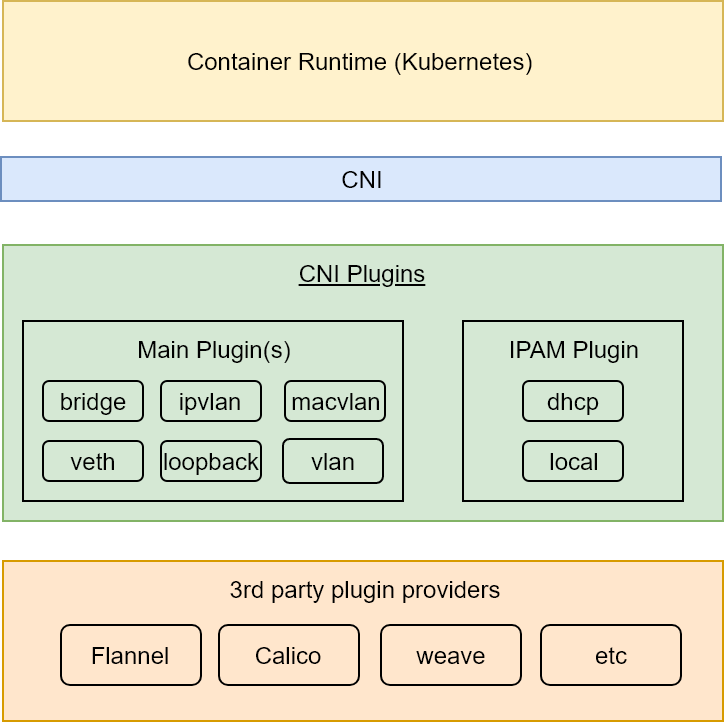

## TODO

- [-] Code (neerajkothari)
- [-] Code review (vfarcic)
- [ ] Write (neerajkothari)
- [ ] Text review (vfarcic)
- [ ] Diagrams (neerajkothari)
- [-] Gist (neerajkothari)
- [ ] Review the title (neerajkothari)
- [ ] Proofread (vfarcic)
- [ ] Add to Book.txt (vfarcic)
- [ ] Publish on LeanPub.com (vfarcic)

# Kubernetes Networking

T> Networking is the backbone of distributed applications. Without dynamicly created software defined networks connected to service discovery, distributed applications would not be able to find each others.

Kubernetes has pluggable architecure. Team behind it made a right decision to keep networking (just as almost everything else) as pluggable modules. Each organization is free to choose the type of networking that suit specific goals. Choosing the correct type of networking is one of the critical decisions we need to make when setting up a Kubernetes cluster.

Kubernetes approaches communication problem in the container world by different means using components like Services, Ingress, kubeDNS, etc. For Pod-to-Pod communication Kubernetes doesn't dictate how networking is implemented. However, it imposes some basic requirements which providers need to fullfil.

At its core, Kubernetes networking model guarantees a few things. They are as follows.

* All Pods can communicate with all other pods without NAT.
* All nodes can communicate with all pods (and vice-versa) without NAT.
* The IP that a Pod sees is the same IP others use to communicate with it.

Currently, Kubernetes provides networking using either *Container Network Interface* (CNI) plugins or kubenet plugin. CNI is used as an interface between network providers and Kubernetes networking.

Kubernetes' default networking driver is kubenet. It is a very basic networking plugin typically useful for single node environments or in cloud environment with routing rules. It has limited features and it is probably not good for vast majority of implementations, especially when running bigger clusters. As an example, kubenet used in AWS is limited to 50 nodes. Such a limitation is imposed by the limits of routing tables. To make things more complicated, kubenet will become deprecated in favour of CNI.

## What Is Container Network Interface (CNI)?

Container Network Interface (CNI) consists of a specification and libraries for writing plugins to configure network interfaces in containers, along with a number of basic plugins. CNI is a very simple specification which concerns only with network connectivity of containers and removing networking resources when a container is deleted. 

CNI specs were originally developed by CoreOS for [rkt](https://coreos.com/rkt) project and are now managed by [Cloud Native Computing Foundation (CNCF)](https://www.cncf.io/) under the [ContainerNetworking team](https://github.com/containernetworking). It has two branches. The first one is in charge of defining CNI specifications which are implemented by different networking providers. The second branch is working on basic plugins reference implementation of CNI specs.

CNI and container runtimes are intricately tied together. Container runtime creates new network namespace and hands it over to a set of CNI plugin(s) to setup interfaces, iptables, routing, etc.

CNI plugins are categorized into two parts. The main plugins are responsible for setting up a network interface into the container network namespace as well as to assign the IP to the interface and setup the routes. The routes are set up by invoking appropriate IPAM plugin. The IPAM plugin determines the interface IP/subnet, gateway and routes, and returns that information to the *main* plugin to apply.

TODO: Export PNG with 300% size for better printing quality
TODO: Add figure number once we decide on chapters structure

ContainerNetworking team created several basic plugins as reference implementations. We going to use some of those later. Please visit [containernetworking/plugins](https://github.com/containernetworking/plugins) repository for more info.

The steps that follow describe how a Pod gets its network.

1. User supplies network conf file to kubernetes which contains plugin type and IP related information.
2. Kubelet works with CNI pulgins on each host in kubernetes cluster. It creates pod namespace with pause container. Pause container is created for each pod to serve network namespace to other containers in the pod.  
3. Kubelet has CNI library which invokes CNI main plugin and handover namespace and other network information like ADD or DELETE container to network.
4. CNI plugin setup network elements like interfaces, iptables, routing, etc. for pod and host network namespace.
5. CNI main plugin invokes IPAM plugin for IP allocation and IPAM returns IP information in json object to main plugin.
6. Main plugin uses this information to configure network interface.
7. Main plugin updates API server with network information for the pod.  

TODO: Export PNG with 300% size for better printing quality
TODO: Add figure number once we decide on chapters structure

The most commonly used networking options can be grouped into *Overlay*, *Layer 2*, and *Layer 3* solutions.

Some of the third-party providers are extending the core networking features. A good example is NetworkPolicy which can be defined only through a few networking solutions.

Choosing the right networking is one of the essential tasks. The choice should be based on a few criteria we'll explore through practical examples.

First things first. We cannot explore networking through hands-on examples without having a cluster. So, our first task will be to create one.
