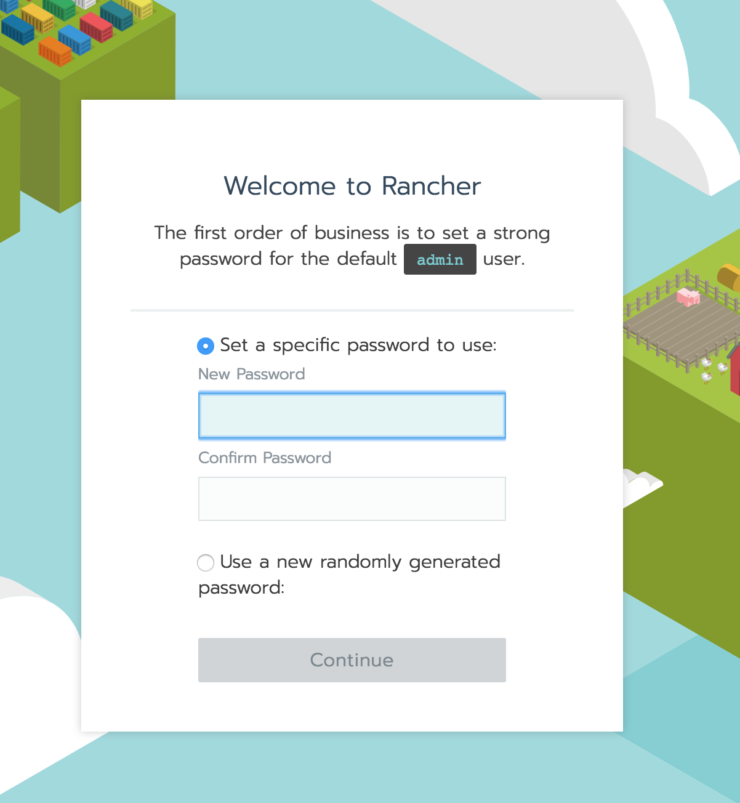
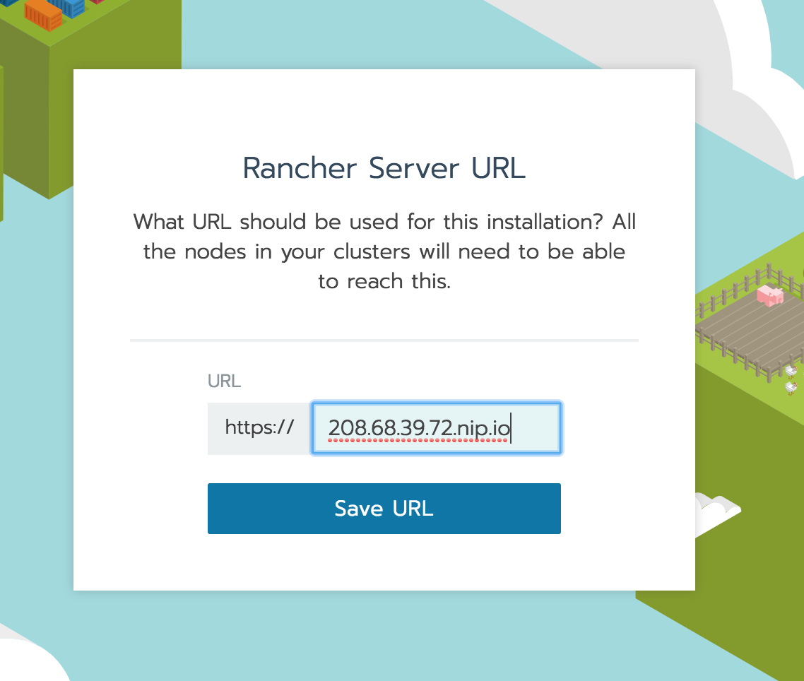
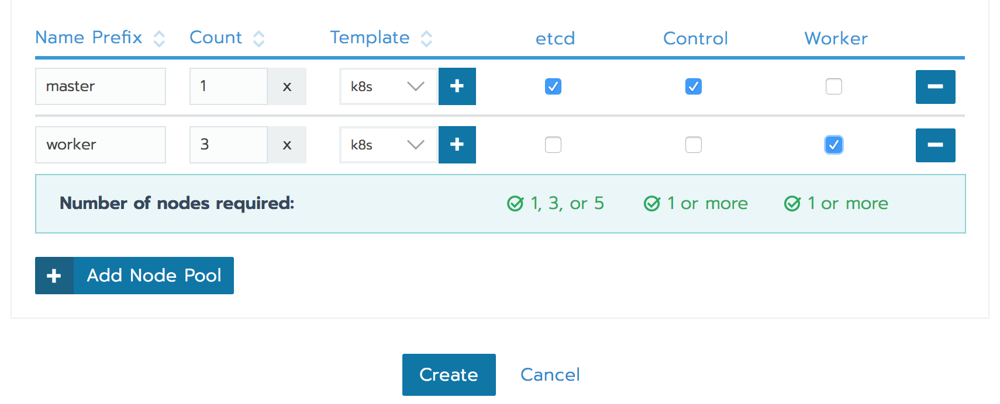
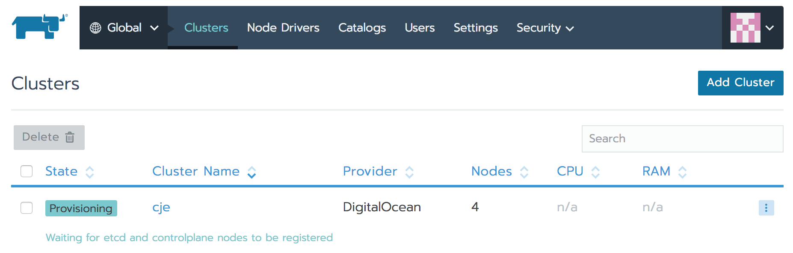
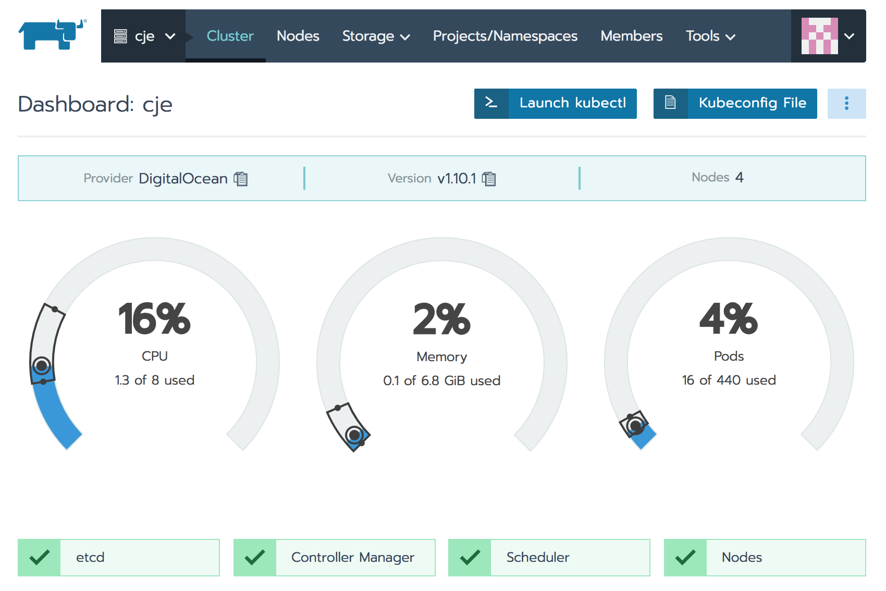
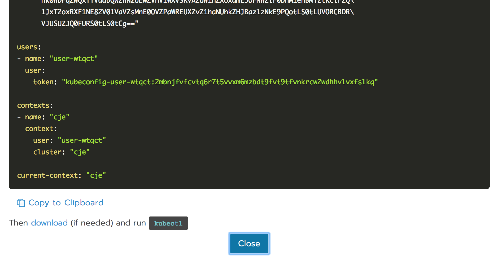

# Installing CJE In Digital Ocean

The goal of this document is to describe how to install a Kubernets cluster in **DigitalOcean** using **Rancher**. Unlike AWS, GCE, and Azure, DigitalOcean does not offer many services and it's used mostly for spinning up VMs. As such, running a cluster in DigitalOcean is very close to what we'd experience when running a cluster **on-prem**, be it **bare metal or VMs** created with, for example, VMWare.

You will be able to choose between **Ubuntu** and **CentOS** as operating systems. For storage, the instructions explain setup of a Kubernetes **NFS** client. We'll use Digital Ocean's load balancer. The logic behind its setup should be applicable to any other load balancer.

Throughout the document, we'll have sets of validations aimed at confirming that the cluster is set up correctly and can be used to install **CJE**. Feel free to jump straight into validations if you already have an operational cluster. The validations are focused on **RBAC** and **ServiceAccounts**, **load balancers** and **Ingress**, and **storage**.

Once we're confident that the cluster works as expected, we'll proceed with the CJE installation. We'll create CJOC, a managed master, and a job that will run in a separate Namespace.

We'll try to do as much work as possible through CLI. In a few cases, it will not be possible (or practical) to accomplish some tasks through a terminal window, so we'll have to jump into UIs. Hopefully, that will be only for very brief periods. The reason for insisting on CLI over UI, lies in the fact that commands are easier to reproduce and lead us towards automation. More importantly, I have a medical condition that results in severe pain when surrounded with many colors. The only medically allowed ones are black, white, and green. Unfortunatelly, most UIs are not designed for people with disabilities like mine.

At some later date, this document will be extended with the following items. Feel free to suggest additional ones.

* HAProxy as external LB
* nginx as external LB
* Ceph storage
* Gluster storage
* Basic CNI networking
* Flannel networking
* Calico networking
* Weave networking

## Requirements

We'll need a few prerequisites first.

Please make sure that you have the following items.

* [kubectl](https://kubernetes.io/docs/tasks/tools/install-kubectl/): Used for communication with a Kubernetes cluster.
* [jq](https://stedolan.github.io/jq/): Used for formatting and filtering of JSON outputs.
* ssh-keygen: Used for generating SSH keys required for accessing nodes.
* GitBash (if Windows): Used for compatibility with other operating systems. Please use it **only if you are a Windows user**. It is available through [Git](https://git-scm.com/) setup.
* [DigitalOcean account](https://www.digitalocean.com): That's where we'll create a cluster.
* [doctl](https://github.com/digitalocean/doctl): CLI used for interaction with DigitalOcean API.

## Creating A Rancher Server

The first step towards having a Kubernetes cluster is to have a Rancher server. Once it's up and running, we'll be able to use it to spin a Kubernetes cluster.

We'll need a DigitalOcean token that will allow us to authenticate with its API. Please open the API Tokens screen.

```bash
open "https://cloud.digitalocean.com/settings/api/tokens"
```

> If you are a **Windows user**, you might not be able to use `open` command to interact with your browser. If that's the case, please replace `open` with `echo`, copy the output, and paste it into a new tab of your favorite browser.

Please type *cje* as the token name and click the *Generate Token* button. This is the first and the last time you will be able to see the token through DigitalOcean UI. Please store it somewhere safe. We'll need it soon.

Next, we'll create an SSH key that will allow us to enter into the virtual machines we'll create soon.

Please execute the command that follows.

```bash
ssh-keygen -t rsa
```

Please type `cje` as the file name. Feel free to answer to all the other question with the enter key.

Now that we have the SSH key, we can upload it to DigitalOcean. But, before we do that, we need to authenticate first.

```bash
doctl auth init
```

If this is the first time you're using `doctl`, you will be asked for the authentication token we created earlier.

The output should be similar to the one that follows.

```
Using token [...]

Validating token... OK
```

We can upload the SSH key with the `ssh-key create` command.

Please execute the command the follows.

```bash
doctl compute ssh-key create cje \
    --public-key "$(cat cje.pub)"
```

We created a new SSH key in DigitalOcean and named it `cje`. The content of the key was provided with the `--public-key` argument.

The output should be simialr to the one that follows.

```
ID       Name FingerPrint
21418650 cje  28:f8:51:f0...
```

We'll need the ID of the new key. Instead of copying and pasting it from the output, we'll execute a query that will retrieve the ID from DigitalOcean. That way, we can retrieve it at any time instead of saving the output of the previous command.

```bash
KEY_ID=$(doctl compute ssh-key list \
    | grep cje \
    | awk '{print $1}')

echo $KEY_ID
```

We executed `ssh-key list` command that retrieve all the SSH keys available in our DigitalOcean account. Further on, we used `grep` to filter the result so that only the key named `cje` is output. Finally, we used `aws` to output only the first colume that contains the ID we're looking for.

The output of the latter command should be similar to the one that follows.

```
21418650
```

Next, we need to find out the ID of the image we'll use to create a VM that will host Rancher.

If your operating system of choice is **Ubuntu**, please execute the command that follows.

```bash
DISTRIBUTION=ubuntu-18-04-x64
```

Otherwise, if you prefer CentOS, the command is as follows.

```bash
DISTRIBUTION=centos-7-x64
```

Now matter which operating system we prefer, the important thing to note is that we have the environment variable `DISTRIBUTION` that holds the `slug` we can use to find out the ID of the image we'll use. Slag is DigitalOcean term that, in this context, describes the name of a distribution.

Now we can retrieve the ID of the image we'll use.

```bash
IMAGE_ID=$(doctl compute \
    image list-distribution \
    -o json \
    | jq ".[] | select(.slug==\"$DISTRIBUTION\").id")

echo $IMAGE_ID
```

The command retrieved the list of all the distributions and sent the output to `jq` which, in turn, filtered it so that only the ID of the image that matches our desired distribution is retrieved.

The output of the latter command should be similar to the one that follows.

```
34487567
```

Now we are finally ready to create a new VM that will soon how our Rancher server.

```bash
doctl compute droplet create rancher \
    --enable-private-networking \
    --image $IMAGE_ID \
    --size s-2vcpu-4gb \
    --region nyc3 \
    --ssh-keys $KEY_ID
```

We executed a `compute droplet command` that created a Droplet (DigitalOcean name for a node or a VM). We named it `rancher`, enabled private networking, and set the image to the ID we retrieved previously. We used `s-2vcpu-4gb` VM size that provides 2 CPUs and 4 GB RAM. The server will run in New York 3 region for no particular reason besides the fact that we had to choose one. Finally, we specify the SSH key ID we retrieved earlier so that we can enter into the newly created VM and complete the installation.

The output is as follows.

```
ID       Name Public IPv4 Private IPv4 Public IPv6 Memory VCPUs Disk Region Image            Status Tags Features Volumes
96650503 rancher                                   4096   2     80   nyc1   Ubuntu 18.04 x64 new
```

Please note that your ID will be different as we'll as the `Image` if you chose CentOS as your operating system of choice.

Next, we need to retrieve the IP of the new droplet (VM).

Please execute the command the follows.

```bash
RANCHER_IP=$(doctl compute droplet list \
    -o json | \
    jq -r '.[] | select(.name=="rancher").networks.v4[0].ip_address')

echo $RANCHER_IP
```

We retrieved the list of all the droplets (VMs) in JSON format and sent the output to `jq`. It filtered the results so that only `rancher` is retrieved and output the IP address. We stored the final output as `RAnCHER_IP` variable.

The output of the latter command will differ from one case to another. Mine is as follows.

```
208.68.39.72
```

Now we can enter into the droplet.

```bash
ssh -i cje root@$RANCHER_IP
```

Rancher runs as a container. So, our first step towards setting it up is to install Docker.

Please execute only the commands that match your operating system.

If you chose **Ubuntu**, the commands are as follows.

```bash
apt update

apt install -y docker.io
```

If, on the other hand, your operating system is **CentOS**, the commands are as follows.

```bash
yum install -y \
    yum-utils \
    device-mapper-persistent-data \
    lvm2

yum-config-manager --add-repo \
    https://download.docker.com/linux/centos/docker-ce.repo

yum install -y docker-ce

systemctl start docker
```

No matter the operating system of choice, we'll validate that Docker was installed correctly by outputting its version.

```bash
docker version
```

The output is as follows.

```
Client:
 Version:      18.03.1-ce
 API version:  1.37
 Go version:   go1.9.5
 Git commit:   9ee9f40
 Built:        Thu Apr 26 07:20:16 2018
 OS/Arch:      linux/amd64
 Experimental: false
 Orchestrator: swarm

Server:
 Engine:
  Version:      18.03.1-ce
  API version:  1.37 (minimum version 1.12)
  Go version:   go1.9.5
  Git commit:   9ee9f40
  Built:        Thu Apr 26 07:23:58 2018
  OS/Arch:      linux/amd64
  Experimental: false
```

Now we are ready to set up Rancher.

```bash
docker run -d \
    --restart=unless-stopped \
    -p 80:80 -p 443:443 \
    rancher/server:preview
```

We used `-d` to run the container in background (detached). We specified `restart` strategy to `unless-stopped` which will guarantee that Docker will make sure that the container is running even if the process inside it fails. Please note that this strategy does not make your Rancher fault tolerant. If the node hosting our Rancher server goes down, we'd loose everything. However, for the purpose of this exercise, a single Rancher container should be enough.

We published ports `80` and `443`, even though we do not have SL certificates.

Finally, we're using `preview` tag since, at the time of this writing, Rancher 2 is still not production ready. Yet, version two brings a complete overhaul and it would be pointless to invest time in setting up Rancher 1.x.

Let's exit the node and test whether Rancher indeed works.

```bash
exit
```

We'll use [nip.io](http://nip.io) to generate valid domain for Rancher, as well as for the CJE later on. The service provides a wildcard DNS for any IP address. It extracts IP from the nip.io subdomain and sends it back in the response. For example, if we generate 192.168.99.100.nip.io, it'll be resolved to 192.168.99.100. We can even add sub-sub domains like something.192.168.99.100.nip.io, and it would still be resolved to 192.168.99.100. It's a simple and awesome service that quickly became an indispensable part of my toolbox.

```bash
RANCHER_ADDR=$RANCHER_IP.nip.io

echo $RANCHER_ADDR
```

The output of the latter command should be similar to the one that follows.

```
208.68.39.72.nip.io
```

Now we can finally open Rancher UI in browser.

```bash
open "https://$RANCHER_ADDR"
```

> If you are a **Windows* user, Git Bash might not be able to use the `open` command. If that's the case, replace the `open` command with `echo`. As a result, you'll get the full address that should be opened directly in your browser of choice.

If you were quick, you might have seen the message stating that *this site can’t be reached*. If that's the case, it means that Rancher process is still not up-and-running. Please wait a few moments and refresh the screen.

Since we do not have the certificates, you will probably see a warning or an error. If using Chrome, you'll have to click the *ADVANCED* link, followed with *Proceed to [YOUR_IP].nip.io (unsafe)*. If you prefer a different browser, the process should be similar and I'm sure you'll know how to proceed.

You should see Rancher's welcome screen asking you to create the initial administrative password. Feel free to choose any, and type of twice. Once finished, please click the *Continue* button.



Next, you will be asked to specify *Rancher Server URL*. It is already pre-populated with the `nip.io` domain we used and all you have to do is click the *Save URL* button.



## Creating An NFS Server

Before we proceed and create a cluster using Rancher, we'll need to set up an NFS server that will serve as storage for state generated by our applications.

> Feel free to skip this whole section if you do not plan to use NFS.

For simplicity, we'll set up an NFS server on the same node where Rancher is running. Please don't do that for in "real-world" situations. Rather, you should have one or more separate NFS servers dedicated to a Kubernetes cluster.

The first order of business is to SSH into the node where we'll install and set up NFS.

```bash
NFS_SERVER_ADDR=$RANCHER_IP

ssh -i cje root@$NFS_SERVER_ADDR
```

The steps required to install NFS server differ from one operating system to another. Please execute only the instructions matching your favorite OS.

If your operating system of choice is **Ubuntu**, please execute the commands that follow.

```bash
apt-get update

apt-get install -y nfs-kernel-server

NFS_USER=nobody:nogroup
```

On the other hand, if you prefer **CentOS**, the commands are as follows.

```bash
systemctl enable nfs-server.service

systemctl start nfs-server.service

NFS_USER=nfsnobody:nfsnobody
```

No matter the OS, the last command created the environment variable `NFS_USER` that defines the user and the group that will use soon to give a directory permissions that will allow any client to write files.

Please note that we are not setting up firewall and that we're assuming that any node can mount the NFS server we're about to set up.

Next, we'll create a directory we'll export and make the NFS user with wide permission own it.

```bash
mkdir /var/nfs/cje -p

chown $NFS_USER /var/nfs/cje
```

We'll need to configure `/etc/exports` file that will be used by the NFS server to decide where to store the files, write mode, whether it should be synched, and so on.

```bash
echo "/var/nfs/cje    *(rw,sync,no_subtree_check)" \
    | tee -a /etc/exports
```

The only thing left is to restart NFS server (if using Ubuntu), or to export NFS table (if using CentOS).

If you're OS of choice is **Ubuntu**, please execute the command that follows.

```bash
systemctl restart nfs-kernel-server
```

**CentOS** users should export NFS table with the command that follows.

```bash
exportfs -a
```

Our NFS server is now up and running. Before we start using it, we'll need a Kubernetes cluster. For now, please exit the VM.

```bash
exit
```

## Creating A Kubernetes Cluster

When using Rancher, the only option for creating a Kubernetes cluster is through its UI. So, we'll start by opening Rancher's home screen.

```bash
open "https://$RANCHER_ADDR"
```

Please click the *Add Cluster* button, and select *DigitalOcean*. Type *cje* as the *Cluster Name*.

Next, we will define the nodes that will constitute our cluster. Please scroll down to the *Node Pool* section.

First we'll create master nodes. We'll need three if we are to create a fault tolerant cluster. Master nodes need to have quorum before committing any decision. If we'd have two master nodes, and one of them fails, we'd loose quorum since over 50% is required.

Type *master* as the *Name Prefix*, set *Count* to *3*, and select *etcd* and *Control* check boxes.

The only thing left, when defining master nodes, is to decide which node specifications we'll use. We do that through Node Templates.

Please click the *Add Node Template* button (icon with a **+** sign). You'll have to type or, more likely, paste the DigitalOcean token we created earlier. Once inside the template screen, please select *New York 3* as the *Region*, select *2 GB RAM, 60 GB Disk, 2 vCPUs* as *Droplet Size*, and type *k8s* as the *Name*. The purpose of each of those fields should be self-explanatory.

The only thing left to do, before we create the new template, is to choose the image. If you prefer **Ubuntu**, please select **Ubuntu 16.04 x64**. Similarly, **CentOS** users should pick **CentOS 7.X x64**.

Once finished, click the *Create* button.

Next, we'll repeat a similar process to define worker nodes. Those are the nodes where our applications will run.

Please click the *Add Node Pool* button. A new row will be added. Type *worker* as the *Name Prefix*, set *Count* to *3*, and make sure that the  *Worker* checkbox is selected.

We are almost done. All that's left is to click the *Create* button, and be patient.



After instructing Rancher to create a new cluster, we're redirected to the *Clusters* screen. At the moment, *cje* should be the only cluster managed by Rancher and its state should be *Provisioning*. Please click the *cje* link in the *Cluster Name* column.



Now we need to be patient and wait until everything is green. It should take around 10 minutes.



Once our new cluster is fully operational, we can configure out local `kubectl`. We'll create a separate config file only for this cluster.

```bash
vim do-kube-config.yaml
```

Feel free to change `vim` to your favorite editor. All we'll need is to paste some content, so any editor you're comfortable with should do.

Please go back to Rancher UI, click the *Kubeconfig File* button, followed with a click to the *Copy to Clipboard* link.



Next, we need to go back to the terminal window where we have `do-kube-config.yaml` opened in our favorite editor, paste the content we just copied, and save the file. If you're using `vim`, you should press `i` to enter into the insert mode, paste the copied content, press *esc* button to exit the insert mode, press colon (`:`) to enter into the command mode, and type `wq` to save and quit. If you prefer something other than `vim`, I'm sure you'll know how to do the same operations (paster, save, and exit).

Kubectl uses environment variable `KUBECONFIG` to know the location of the config file, so we'll need to export it with the path to the file we just created.

```bash
export KUBECONFIG=$PWD/do-kube-config.yaml
```

For now, we'll do only a rudimentary validation of the cluster by retrieving the nodes. If everything worked as expected, we should have six of them, three dedicated to master nodes (`controlplane` and `etcd`), and the other three as workers.

```bash
kubectl get nodes
```

The output is as follows.

```
NAME    STATUS ROLES             AGE  VERSION
master1 Ready  controlplane,etcd 1h   v1.10.1
master2 Ready  controlplane,etcd 1h   v1.10.1
master3 Ready  controlplane,etcd 1h   v1.10.1
worker1 Ready  worker            1h   v1.10.1
worker2 Ready  worker            1h   v1.10.1
worker3 Ready  worker            1h   v1.10.1
```

We're almost finished with creating the cluster. All that's left is to create two namespaces. We'll use `cjoc` to host CloudBees Operations Center as well as for the managed masters we'll spin up later. The second namespace will be called `build`. That where our builds will run Pods. With such separation, we'll try to mitigate some of the risks builds might introduce to CJOC and masters.

```bash
kubectl create ns cjoc

kubectl create ns build
```

## Validating RBAC

In this section, we'll validate whether RBAC is configured correctly. Specifically, we'll check whether Pods are denied the right to communicate with KubeAPI with proper service accounts.

We'll start by creating two namespaces.

```bash
kubectl create ns test1

kubectl create ns test2
```

Assuming that RBAC is properly set up (we'll test that soon), we'd need to create a few service accounts that will allow processes running inside Pods in those namespaces, communicate with Kube API. As a test, we'll define roles that will allow us to do almost any Pod-related operation from within another Pod. At the same time, we'll need to confirm that we are not allowed to create Pods (or any other Kubernetes resource) in any other Namespace.

Let's take a quick look at a definition that creates a service account, a few roles, and a few role bindings.

```bash
curl https://raw.githubusercontent.com/vfarcic/k8s-specs/master/sa/pods-all.yml
```

```yaml
apiVersion: v1
kind: ServiceAccount
metadata:
  name: pods-all
  namespace: test1

---

kind: Role
apiVersion: rbac.authorization.k8s.io/v1beta1
metadata:
  name: pods-all
  namespace: test1
rules:
- apiGroups: [""]
  resources: ["pods", "pods/exec", "pods/log"]
  verbs: ["*"]

---

kind: Role
apiVersion: rbac.authorization.k8s.io/v1beta1
metadata:
  name: pods-all
  namespace: test2
rules:
- apiGroups: [""]
  resources: ["pods", "pods/exec", "pods/log"]
  verbs: ["*"]

---

apiVersion: rbac.authorization.k8s.io/v1beta1
kind: RoleBinding
metadata:
  name: pods-all
  namespace: test1
roleRef:
  apiGroup: rbac.authorization.k8s.io
  kind: Role
  name: pods-all
subjects:
- kind: ServiceAccount
  name: pods-all

---

apiVersion: rbac.authorization.k8s.io/v1beta1
kind: RoleBinding
metadata:
  name: pods-all
  namespace: test2
roleRef:
  apiGroup: rbac.authorization.k8s.io
  kind: Role
  name: pods-all
subjects:
- kind: ServiceAccount
  name: pods-all
  namespace: test1
```

The ServiceAccount `pods-all` will be created in the Namespace `test1`. As a result, only the Pods in the same Namespace will be able to use it.

Further on, we have two Roles named `pods-all`. Their specs are the same except for the fact that one is in the Namespace `test1`, and the other in `test2`. The permissions behind those roles provide the ability to do almost any operation on Pods, and no other resource type.

Finally, the last two resources are RoleBindings. Each references the Role `pods-all` in their respective Namespaces. The major difference is that the second RoleBinding is in the Namespace `test2` but it relates to the ServiceAccount `pods-all` in the Namespace `test1`.

As a result of that definition, we should be able to create Pods in the Namespace `test1` and from within the containers in those Pods, create new Pods, output their logs, and so on. Any Pod operation within the two Namespaces initiated through a process in a Pod running inside the Namespace `test1` should be allowed. RBAC works in a way that we specify only what is allowed, and not what isn't. So, any other operation should not be allowed.

Let's apply the resources from the `pods-all.yml` file.

```bash
kubectl apply \
    -f https://raw.githubusercontent.com/vfarcic/k8s-specs/master/sa/pods-all.yml
```

The output is as follows.

```
serviceaccount "pods-all" created
role "pods-all" created
role "pods-all" created
rolebinding "pods-all" created
rolebinding "pods-all" created
```

Next, we'll create a Pod that will allow us to test the assumptions. Let's take a look at the definition first.

```bash
curl https://raw.githubusercontent.com/vfarcic/k8s-specs/master/sa/kubectl-test2.yml
```

The output is as follows.

```yaml
apiVersion: v1
kind: Pod
metadata:
  name: kubectl
  namespace: test1
spec:
  serviceAccountName: pods-all
  containers:
  - name: kubectl
    image: vfarcic/kubectl
    command: ["sleep"]
    args: ["100000"]
```

It defines a Pod with a container based on `vfarcic/kubectl` image. It contains `kubectl` that will allow us (or not) to spin up additional Pods. The Pod uses the ServiceAccount `pods-all` and will run in the namespace `test1`.

Let's apply the definition.

```bash
kubectl apply \
    -f https://raw.githubusercontent.com/vfarcic/k8s-specs/master/sa/kubectl-test2.yml
```

Please wait a few moments until the image is pulled and the Pod is up-and-running.

Next, we'll enter into the container that forms the Pod.

```bash
kubectl -n test1 exec -it kubectl -- sh
```

Can we create a Pod in the `test2` Namespace? Let's see.

```bash
kubectl -n test2 \
    run new-test \
    --image=alpine \
    --restart=Never \
    sleep 10000
```

The output is as follows.

```
pod "new-test" created
```

Judging by the output, the Pod was created and, therefore, our ServiceAccount has the sufficient permissions.

Can we list the Pods in the `test2` Namespace?

```bash
kubectl -n test2 get pods
```

The output is as follows.

```
NAME     READY STATUS  RESTARTS AGE
new-test 1/1   Running 0        17s
```

Checking only the operations were should be allowed to execute gives us only part of the picture. Those commands do not prove that we are NOT allowed to issue requests to Kube API outside of those specified in the Roles. To test that, we'll try to create a Pod outside Namespaces `test1` and `test2`.

```bash
kubectl -n default get pods
```

The output is as follows.

```
Error from server (Forbidden): pods is forbidden: User "system:serviceaccount:test1:pods-all" cannot list pods in the namespace "default"
```

That confirms that the ServiceAccount `pods-all cannot list pods in the namespace "default"`.

We're done with a quick RBAC validation. We'll exit the `kubectl` Pod and delete the test Namespaces.

```bash
exit

kubectl delete ns test1 test2
```

## Creating A Load Balancer

We'll need to create an external load balancer (LB). It's purpose will be to guarantee a stable entry point to the cluster. Such an LB should forward requests to one of the worker nodes. There's no need to have any special criteria which worker node that is, as long as it's healthy. In other words, the external LB will guarantee that requests enter the cluster even if some of the nodes are down.

### DigitalOcean LB

We'll use DigitalOcean Load Balancer. It is a good use case since it needs to be configured manually and thus the logic behind it is similar to the logic we'd use to set up nginx, HAProxy, or F5 as the external LB.

The first step is to find out the IDs of the worker nodes that should be included in the LBs algorithm.

```
WORKER_IDS=$(doctl compute \
    droplet list -o json | \
    jq -r '.[] | select(.name | startswith("worker")).id' \
    | tr '\n' ',' | tr -d ' ')

echo $WORKER_IDS
```

The output of the latter command should be similar to the one that follows.

```
104.131.98.145,104.236.49.97,104.131.106.27,
```

We'll need to remove the trailing comma (`,`) to make it a valid value for the later use.

```bash
WORKER_IDS=${WORKER_IDS: :-1}

echo $WORKER_IDS
```

The output of the latter command should be similar to the one that follows.

```
104.131.98.145,104.236.49.97,104.131.106.27
```

The only difference is that the comma (`,`) at the end is no more.

Now that we have the IDs of all the worker nodes, we can proceed and create a load balancer.

```bash
doctl compute load-balancer create \
    --droplet-ids $WORKER_IDS \
    --forwarding-rules "entry_protocol:tcp,entry_port:80,target_protocol:tcp,target_port:80" \
    --health-check protocol:http,port:80,path:/healthz,check_interval_seconds:10,response_timeout_seconds:5,healthy_threshold:5,unhealthy_threshold:3 \
    --name cje \
    --region nyc3
```

We created an LB in `nyc3` region (the same one where the cluster nodes are).

The forwarding rules will pass requests entering on the port `80` (HTTP) to the same port on one of the worker nodes. In a "real-world" situation, we'd add SSL certificates to the load balancer and forward `443` (HTTPS) requests as well.

The health checks will ping `/healtz` endpoint every ten seconds. If a valid response (`200`) is not received within five seconds, the node will be excluded from the algorithm.

If you're wondering where does `/healtz` endpoint come from, it was created by the Ingress controller and it is available through the Ingress Service on every node of the cluster.

Now that we have the LB, we should retrieve its IP.

```bash
LB_IP=$(doctl compute load-balancer \
    list -o json | jq -r '.[0].ip')

echo $LB_IP
```

The output of the latter command should be a valid IP

The last step will be to create a domain. Since I cannot be sure whether you have a "real" domain at hand, we'll create one using [nip.io](http://nip.io/).

```bash
LB_ADDR=$LB_IP.nip.io
```

Now that we have the domain we can use to access the LB, we can proceed and validate whether the load balancer and Ingress work correctly.

## Validating Load Balancer And Ingress

We'll deploy a sample application which we'll use only to validate whether the LB and Ingress work as expected.

Let's take a quick look at its definition.

```bash
curl https://raw.githubusercontent.com/vfarcic/k8s-specs/master/ingress/go-demo-2.yml
```

The output, limited to the Ingress resource, is as follows.

```yaml
apiVersion: extensions/v1beta1
kind: Ingress
metadata:
  name: go-demo-2
  annotations:
    ingress.kubernetes.io/ssl-redirect: "false"
    nginx.ingress.kubernetes.io/ssl-redirect: "false"
spec:
  rules:
  - http:
      paths:
      - path: /demo
        backend:
          serviceName: go-demo-2-api
          servicePort: 8080
```

Any request that enters the cluster and with the path that starts with `/demo`, will be forwarded to the `go-demo-2-api` Service. For a request to enter the cluster, it'll have to be forwarded by the LB. So, the flow of a request should be DNS > external LB > one of the worker nodes > Ingress service > `go-demo-2-api` Service > `go-demo-2-api` Pods.

Let's apply the definition.

```bash
kubectl apply \
    -f https://raw.githubusercontent.com/vfarcic/k8s-specs/master/ingress/go-demo-2.yml
```

The output is as follows.

```
ingress "go-demo-2" created
deployment "go-demo-2-db" created
service "go-demo-2-db" created
deployment "go-demo-2-api" created
service "go-demo-2-api" created
```

We can see that Ingress, the Services, and the Deployments were created. Now we should wait until the Deployment rolls out.

```bash
kubectl rollout status \
    deploy go-demo-2-api
```

The output is as follows.

```
Waiting for rollout to finish: 0 of 3 updated replicas are available...
Waiting for rollout to finish: 1 of 3 updated replicas are available...
Waiting for rollout to finish: 2 of 3 updated replicas are available...
deployment "go-demo-2-api" successfully rolled out
```

With the application up-and-running, we can validate that everything works by sending a request to the external LB.

```bash
curl -i "http://$LB_ADDR/demo/hello"
```

The output is as follows.

```
HTTP/1.1 200 OK
Server: nginx/1.13.8
Date: Thu, 07 Jun 2018 00:30:51 GMT
Content-Type: text/plain; charset=utf-8
Content-Length: 14
Connection: keep-alive
Strict-Transport-Security: max-age=15724800; includeSubDomains;

hello, world!
```

By receiving the response code `200` and getting the `hello, world!` message, we confirmed that one of the paths works correctly.

TODO: Continue

```bash
curl -i "http://$LB_ADDR/this/does/not/exist"
```

```
HTTP/1.1 404 Not Found
Server: nginx/1.13.8
Date: Thu, 07 Jun 2018 00:31:23 GMT
Content-Type: text/plain; charset=utf-8
Content-Length: 21
Connection: keep-alive
Strict-Transport-Security: max-age=15724800; includeSubDomains;

default backend - 404
```

```bash
kubectl delete \
    -f https://raw.githubusercontent.com/vfarcic/k8s-specs/master/ingress/go-demo-2.yml
```

```
ingress "go-demo-2" deleted
deployment "go-demo-2-db" deleted
service "go-demo-2-db" deleted
deployment "go-demo-2-api" deleted
service "go-demo-2-api" deleted
```

## Creating StorageClasses

### NFS

```bash
kubectl -n cjoc create \
    -f https://raw.githubusercontent.com/kubernetes-incubator/external-storage/master/nfs-client/deploy/auth/serviceaccount.yaml
```

```
serviceaccount "nfs-client-provisioner" created
```

```bash
kubectl create \
    -f https://raw.githubusercontent.com/kubernetes-incubator/external-storage/master/nfs-client/deploy/auth/clusterrole.yaml
```

```
clusterrole "nfs-client-provisioner-runner" created
```

```bash
curl https://raw.githubusercontent.com/kubernetes-incubator/external-storage/master/nfs-client/deploy/auth/clusterrolebinding.yaml \
    | sed -e "s@namespace: default@namespace: cjoc@g" \
    | kubectl create -f -
```

```
clusterrolebinding "run-nfs-client-provisioner" created
```

```bash
curl https://raw.githubusercontent.com/kubernetes-incubator/external-storage/master/nfs-client/deploy/deployment.yaml \
    | sed -e "s@10.10.10.60@$NFS_SERVER_ADDR@g" \
    | sed -e "s@/ifs/kubernetes@/var/nfs/cje@g" \
    | sed -e "s@fuseim.pri/ifs@cloudbees.com/cje-nfs@g" \
    | kubectl -n cjoc create -f -
```

```
deployment "nfs-client-provisioner" created
```

```bash
kubectl -n cjoc \
    rollout status \
    deploy nfs-client-provisioner
```

```
Waiting for rollout to finish: 0 of 1 updated replicas are available...
deployment "nfs-client-provisioner" successfully rolled out
```

```bash
curl https://raw.githubusercontent.com/kubernetes-incubator/external-storage/master/nfs-client/deploy/class.yaml \
    | sed -e "s@managed-nfs-storage@cje-storage@g" \
    | sed -e "s@fuseim.pri/ifs@cloudbees.com/cje-nfs@g" \
    | kubectl -n cjoc create -f -
```

```
storageclass "cje-storage" created
```

```bash
curl https://raw.githubusercontent.com/kubernetes-incubator/external-storage/master/nfs-client/deploy/test-claim.yaml \
    | sed -e "s@managed-nfs-storage@cje-storage@g" \
    | kubectl -n cjoc create -f -
```

```
persistentvolumeclaim "test-claim" created
```

```bash
kubectl create \
    -n cjoc \
    -f https://raw.githubusercontent.com/kubernetes-incubator/external-storage/master/nfs-client/deploy/test-pod.yaml
```

```
pod "test-pod" created
```

```bash
ssh -i cje root@$NFS_SERVER_ADDR \
    "ls -l /var/nfs/cje"
```

```
drwxrwxrwx. 2 nfsnobody nfsnobody 21 Jun  7 00:44 cjoc-test-claim-pvc-d5fa9106-69eb-11e8-b65a-ea9238c4f6a5
```

```bash
ssh -i cje root@$NFS_SERVER_ADDR \
    "ls -l /var/nfs/cje/cjoc-test*"
```

```
-rw-r--r--. 1 nfsnobody nfsnobody 0 Jun  7 00:44 SUCCESS
```

```bash
kubectl delete \
    -n cjoc \
    -f https://raw.githubusercontent.com/kubernetes-incubator/external-storage/master/nfs-client/deploy/test-pod.yaml
```

```
pod "test-pod" deleted
```

```bash
kubectl delete \
    -n cjoc \
    -f https://raw.githubusercontent.com/kubernetes-incubator/external-storage/master/nfs-client/deploy/test-claim.yaml
```

```
persistentvolumeclaim "test-claim" deleted
```

```bash
ssh -i cje root@$NFS_SERVER_ADDR \
    "ls -l /var/nfs/cje"
```

```
drwxrwxrwx. 2 nfsnobody nfsnobody 21 Jun  7 00:44 archived-cjoc-test-claim-pvc-d5fa9106-69eb-11e8-b65a-ea9238c4f6a5
```

## Validating StorageClasses

```bash
kubectl -n cjoc apply \
    -f https://raw.githubusercontent.com/vfarcic/k8s-specs/master/sts/cje-test.yml
```

```
statefulset "test" created
service "test" created
```

```bash
kubectl -n cjoc exec test-0 \
    -- touch /tmp/something

kubectl -n cjoc exec test-0 \
    -- ls -l /tmp
```

```
-rw-r--r--    1 nobody   nobody           0 Jun  7 01:04 something
```

```bash
kubectl -n cjoc delete pod test-0
```

```
pod "test-0" deleted
```

```bash
kubectl -n cjoc get pods
```

```
NAME                                      READY     STATUS        RESTARTS   AGE
nfs-client-provisioner-69688c76dd-b2bjj   1/1       Running       0          33m
test-0                                    1/1       Terminating   0          3m
```

```bash
kubectl -n cjoc get pods
```

```
NAME                                      READY     STATUS    RESTARTS   AGE
nfs-client-provisioner-69688c76dd-b2bjj   1/1       Running   0          34m
test-0                                    1/1       Running   0          9s
```

```bash
kubectl -n cjoc exec test-0 \
    -- ls -l /tmp
```

```
-rw-r--r--    1 nobody   nobody           0 Jun  7 01:04 something
```

```bash
kubectl -n cjoc delete \
    -f https://raw.githubusercontent.com/vfarcic/k8s-specs/master/sts/cje-test.yml
```

```
statefulset "test" deleted
service "test" deleted
```

```bash
kubectl -n cjoc \
    delete pvc test-data-test-0
```

```
persistentvolumeclaim "test-data-test-0" deleted
```

```bash
kubectl -n build apply \
    -f https://raw.githubusercontent.com/vfarcic/k8s-specs/master/sts/cje-test.yml
```

```
statefulset "test" created
service "test" created
```

```bash
kubectl -n build exec test-0 \
    -- touch /tmp/something

kubectl -n build exec test-0 \
    -- ls -l /tmp
```

```
-rw-r--r--    1 nobody   nobody           0 Jun  7 01:11 something
```

```bash
kubectl -n build delete pod test-0
```

```
pod "test-0" deleted
```

```bash
kubectl -n build get pods
```

```
NAME      READY     STATUS        RESTARTS   AGE
test-0    1/1       Terminating   0          58s
```

```bash
kubectl -n build get pods
```

```
NAME      READY     STATUS    RESTARTS   AGE
test-0    1/1       Running   0          3s
```

```bash
kubectl -n build exec test-0 \
    -- ls -l /tmp
```

```
-rw-r--r--    1 nobody   nobody           0 Jun  7 01:11 something
```

```bash
kubectl -n build delete \
    -f https://raw.githubusercontent.com/vfarcic/k8s-specs/master/sts/cje-test.yml
```

```
statefulset "test" deleted
service "test" deleted
```

```bash
kubectl -n build \
    delete pvc test-data-test-0
```

```
persistentvolumeclaim "test-data-test-0" deleted
```

TODO: Speed tests

## Installing CJE

```bash
open "https://downloads.cloudbees.com/cje2/latest/"

# Copy the link address of cje2 Kubernetes release

RELEASE_URL=[...]

curl -o cje.tgz $RELEASE_URL

tar -xvf cje.tgz
```

```
x cje2_2.121.1.2_kubernetes/
x cje2_2.121.1.2_kubernetes/cjoc-external-masters.yml
x cje2_2.121.1.2_kubernetes/INSTALLATION.md
x cje2_2.121.1.2_kubernetes/SCALING.md
x cje2_2.121.1.2_kubernetes/TROUBLESHOOTING.md
x cje2_2.121.1.2_kubernetes/PROXY.md
x cje2_2.121.1.2_kubernetes/ANALYTICS.md
x cje2_2.121.1.2_kubernetes/cje.yml
```

```bash
cd cje2_*

ls -l
```

```
-rw-r--r--  1 vfarcic  staff    158  6 Jun 07:06 ANALYTICS.md
-rw-r--r--  1 vfarcic  staff   5144  6 Jun 07:06 INSTALLATION.md
-rw-r--r--  1 vfarcic  staff   1498  6 Jun 07:06 PROXY.md
-rw-r--r--  1 vfarcic  staff   1466  6 Jun 07:06 SCALING.md
-rw-r--r--  1 vfarcic  staff   4950  6 Jun 07:06 TROUBLESHOOTING.md
-rw-r--r--  1 vfarcic  staff  11884  6 Jun 07:06 cje.yml
-rw-r--r--  1 vfarcic  staff    509  6 Jun 07:06 cjoc-external-masters.yml
```

```bash
cat cje.yml

kubectl create ns jenkins

cat cje.yml \
    | sed -e \
    "s@https://cje.example.com@http://cje.example.com@g" \
    | sed -e \
    "s@cje.example.com@$LB_ADDR@g" \
    | sed -e \
    "s@ssl-redirect: \"true\"@ssl-redirect: \"false\"@g" \
    | sed -e \
    "s@# storageClassName: some-storage-class@storageClassName: cje-storage@g" \
    | kubectl --namespace cjoc \
    apply -f -
```

```
serviceaccount "cjoc" created
role "master-management" created
rolebinding "cjoc" created
configmap "cjoc-config" created
configmap "cjoc-configure-jenkins-groovy" created
statefulset "cjoc" created
service "cjoc" created
ingress "cjoc" created
serviceaccount "jenkins" created
role "pods-all" created
rolebinding "jenkins" created
configmap "jenkins-agent" created
```

```bash
kubectl -n cjoc \
    rollout status sts cjoc
```

```
Waiting for 1 pods to be ready...
statefulset rolling update complete 1 pods at revision cjoc-578b8fd6b4...
```

```bash
kubectl -n cjoc get all
```

```
NAME                            DESIRED   CURRENT   UP-TO-DATE   AVAILABLE   AGE
deploy/nfs-client-provisioner   1         1         1            1           51m

NAME                                   DESIRED   CURRENT   READY     AGE
rs/nfs-client-provisioner-69688c76dd   1         1         1         51m

NAME                DESIRED   CURRENT   AGE
statefulsets/cjoc   1         1         1m

NAME                                         READY     STATUS    RESTARTS   AGE
po/cjoc-0                                    1/1       Running   0          1m
po/nfs-client-provisioner-69688c76dd-b2bjj   1/1       Running   0          51m

NAME       TYPE        CLUSTER-IP      EXTERNAL-IP   PORT(S)            AGE
svc/cjoc   ClusterIP   10.43.128.241   <none>        80/TCP,50000/TCP   1m
```

```bash
open "http://$LB_ADDR/cjoc"

kubectl -n cjoc exec cjoc-0 -- \
    cat /var/jenkins_home/secrets/initialAdminPassword
```

```
c9b802a409a04d1f8755e9d394749a58
```

```bash
# Copy the output and paste it into Jenkins UI field *Administrative password*

# Click the *Continue* button

# Click the *Use a license key* button

# Type your *License Key* and *License Certificate*

# Click the *OK* button

# Click the *Install suggested plugins* button

# Fill in the field in the *Create First Admin User* screen

# Click the *Save and Continue* button

# Click the *Start using Operations Center* button

kubectl -n cjoc get pvc
```

```
NAME                  STATUS    VOLUME                                     CAPACITY   ACCESS MODES   STORAGECLASS   AGE
jenkins-home-cjoc-0   Bound     pvc-271f09c1-69f1-11e8-b65a-ea9238c4f6a5   20Gi       RWO            cje-storage    11m
```

```bash
kubectl get pv
```

```
NAME                                       CAPACITY   ACCESS MODES   RECLAIM POLICY   STATUS    CLAIM                      STORAGECLASS   REASON    AGE
pvc-271f09c1-69f1-11e8-b65a-ea9238c4f6a5   20Gi       RWO            Delete           Bound     cjoc/jenkins-home-cjoc-0   cje-storage              15m
```

### Creating Managed Masters

TODO: Create

TODO: Fail and confirm that the state is preserved

### Managed Agents (PodTemplates)

TODO

### External Masters

TODO

### External Agents

TODO

## Validating CJE

## Destroying The Cluster

TODO
